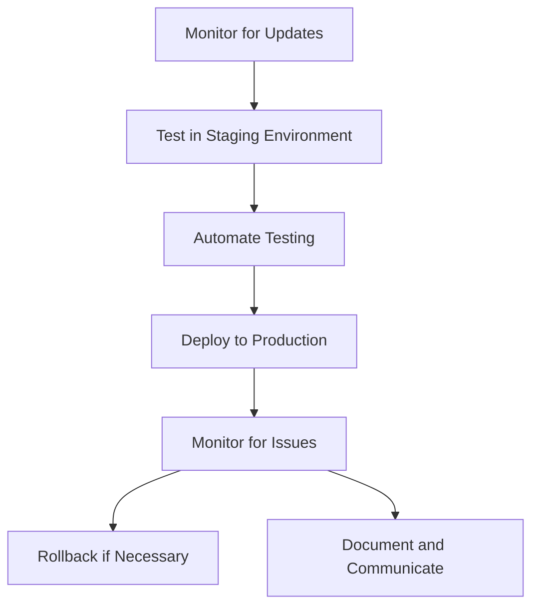

## 12.7.2 Keeping Software Up to Date

In the rapidly evolving landscape of software development, maintaining up-to-date software is not just a best practice but a necessity. This is especially true for systems like Apache Kafka, which serve as the backbone for real-time data processing and event-driven architectures. Keeping Kafka and its dependencies current is crucial for mitigating security vulnerabilities, enhancing performance, and ensuring compatibility with other components in your technology stack.

### The Risks of Outdated Software

Outdated software can pose significant risks to your systems, including:

- **Security Vulnerabilities**: Older versions of software often contain known vulnerabilities that can be exploited by malicious actors. Keeping software up to date helps protect against these threats by incorporating the latest security patches.
- **Performance Degradation**: Newer versions of software typically include performance improvements and optimizations. Running outdated software can lead to inefficiencies and increased resource consumption.
- **Compatibility Issues**: As other components in your system are updated, outdated software can lead to compatibility issues, causing system failures or degraded functionality.
- **Lack of Support**: Vendors and open-source communities may discontinue support for older versions, leaving you without access to critical updates or assistance.

### Monitoring for Updates and Patches

To effectively keep your Kafka environment up to date, implement a robust monitoring strategy for updates and patches:

1. **Subscribe to Release Announcements**: Follow the Apache Kafka mailing lists, GitHub repositories, and official blogs to stay informed about new releases and patches.
2. **Use Automated Tools**: Leverage tools like Dependabot or Renovate to automatically monitor and notify you of updates to Kafka and its dependencies.
3. **Regularly Review Security Bulletins**: Keep an eye on security bulletins from Apache and other relevant sources to identify critical vulnerabilities and patches.

### Best Practices for Testing and Deploying Updates

Updating software in a production environment requires careful planning and execution to minimize disruptions:

- **Establish a Testing Environment**: Set up a staging environment that mirrors your production setup to test updates before deployment. This helps identify potential issues and ensures compatibility.
- **Automate Testing**: Use automated testing frameworks to run regression tests and validate that updates do not introduce new bugs or break existing functionality.
- **Implement a Rollback Plan**: Prepare a rollback strategy in case an update causes unforeseen issues. This ensures you can quickly revert to a stable state if necessary.
- **Schedule Updates During Low-Traffic Periods**: Plan updates during periods of low activity to minimize the impact on users and business operations.
- **Document Changes and Communicate**: Maintain detailed documentation of updates and communicate changes to relevant stakeholders to ensure everyone is informed and prepared.

### Dependency Management Considerations

Managing dependencies is a critical aspect of keeping software up to date:

- **Use Dependency Management Tools**: Tools like Maven, Gradle, or SBT can help manage and automate the process of updating dependencies in Java-based projects.
- **Monitor Transitive Dependencies**: Pay attention to transitive dependencies, as they can introduce vulnerabilities even if your direct dependencies are up to date.
- **Regularly Audit Dependencies**: Conduct regular audits of your dependencies to identify outdated or vulnerable components. Tools like OWASP Dependency-Check can assist in this process.
- **Adopt a Versioning Strategy**: Implement a versioning strategy that aligns with your release cycle and ensures compatibility across different components of your system.

### Practical Applications and Real-World Scenarios

Consider the following scenarios where keeping software up to date is crucial:

- **Event-Driven Microservices**: In a microservices architecture, services often rely on Kafka for communication. Outdated Kafka versions can lead to security vulnerabilities and performance bottlenecks, affecting the entire system.
- **Real-Time Data Pipelines**: For organizations leveraging Kafka for real-time data processing, staying current with updates ensures optimal performance and the ability to handle increasing data volumes.
- **Big Data Integration**: As discussed in [1.4.4 Big Data Integration]( "Big Data Integration"), integrating Kafka with big data platforms requires compatibility with the latest versions to leverage new features and improvements.

### Code Examples

To illustrate the process of updating Kafka and its dependencies, consider the following code examples in Java, Scala, Kotlin, and Clojure:

#### Java

```java
// Example of updating Kafka dependencies in a Maven project
<dependency>
    <groupId>org.apache.kafka</groupId>
    <artifactId>kafka-clients</artifactId>
    <version>3.0.0</version> <!-- Update to the latest version -->
</dependency>
```

#### Scala

```scala
// Example of updating Kafka dependencies in a SBT project
libraryDependencies += "org.apache.kafka" %% "kafka" % "3.0.0" // Update to the latest version
```

#### Kotlin

```kotlin
// Example of updating Kafka dependencies in a Gradle project
dependencies {
    implementation("org.apache.kafka:kafka-clients:3.0.0") // Update to the latest version
}
```

#### Clojure

```clojure
;; Example of updating Kafka dependencies in a Leiningen project
:dependencies [[org.apache.kafka/kafka-clients "3.0.0"]] ;; Update to the latest version
```

### Visualizing the Update Process

To better understand the process of keeping software up to date, consider the following diagram illustrating the update workflow:



**Diagram Description**: This flowchart represents the process of monitoring for updates, testing in a staging environment, automating testing, deploying to production, monitoring for issues, and rolling back if necessary.

### References and Links

- [Apache Kafka Documentation](https://kafka.apache.org/documentation/)
- [Confluent Documentation](https://docs.confluent.io/)
- [Dependabot](https://dependabot.com/)
- [OWASP Dependency-Check](https://owasp.org/www-project-dependency-check/)

### Knowledge Check

To reinforce your understanding of the importance of keeping software up to date, consider the following questions and challenges:

1. What are the potential risks of running outdated software in a production environment?
2. How can automated tools assist in monitoring for software updates?
3. Describe the steps involved in testing and deploying updates to a production environment.
4. Why is it important to manage transitive dependencies in your projects?
5. How can you ensure compatibility when updating Kafka in a microservices architecture?

### Embrace the Journey

Keeping software up to date is a continuous process that requires diligence and attention to detail. By following best practices and leveraging automated tools, you can ensure that your Kafka environment remains secure, performant, and compatible with the latest technologies. Encourage your team to prioritize updates and foster a culture of continuous improvement and learning.

### Quiz

## Test Your Knowledge: Keeping Apache Kafka Software Up to Date



### What is a primary risk of running outdated software?

- [x] Security vulnerabilities
- [ ] Increased compatibility
- [ ] Improved performance
- [ ] Reduced resource consumption

> **Explanation:** Outdated software often contains known vulnerabilities that can be exploited by malicious actors, posing significant security risks.

### Which tool can automatically monitor and notify you of updates to Kafka dependencies?

- [x] Dependabot
- [ ] Jenkins
- [ ] Docker
- [ ] Kubernetes

> **Explanation:** Dependabot is a tool that can automatically monitor and notify you of updates to your dependencies, including Kafka.

### What is a key benefit of establishing a staging environment for updates?

- [x] Identifying potential issues before deployment
- [ ] Reducing the need for documentation
- [ ] Eliminating the need for rollback plans
- [ ] Increasing production traffic

> **Explanation:** A staging environment allows you to test updates in a setup that mirrors production, helping to identify potential issues before deployment.

### Why is it important to monitor transitive dependencies?

- [x] They can introduce vulnerabilities even if direct dependencies are up to date.
- [ ] They are always secure and require no monitoring.
- [ ] They do not affect the security of your application.
- [ ] They are automatically updated with direct dependencies.

> **Explanation:** Transitive dependencies can introduce vulnerabilities, so it's important to monitor them even if your direct dependencies are up to date.

### What should be included in a rollback plan?

- [x] Steps to revert to a stable state
- [ ] Instructions to increase production traffic
- [x] Communication protocols for stakeholders
- [ ] Methods to eliminate testing environments

> **Explanation:** A rollback plan should include steps to revert to a stable state and communication protocols to ensure stakeholders are informed.

### What is the role of automated testing in the update process?

- [x] Validating that updates do not introduce new bugs
- [ ] Eliminating the need for staging environments
- [ ] Increasing the complexity of the update process
- [ ] Reducing the need for documentation

> **Explanation:** Automated testing helps validate that updates do not introduce new bugs or break existing functionality.

### How can you ensure compatibility when updating Kafka in a microservices architecture?

- [x] Implement a versioning strategy
- [ ] Ignore transitive dependencies
- [x] Test updates in a staging environment
- [ ] Deploy updates directly to production

> **Explanation:** Implementing a versioning strategy and testing updates in a staging environment help ensure compatibility in a microservices architecture.

### What is a benefit of scheduling updates during low-traffic periods?

- [x] Minimizing the impact on users and business operations
- [ ] Increasing production traffic
- [ ] Reducing the need for rollback plans
- [ ] Eliminating the need for testing environments

> **Explanation:** Scheduling updates during low-traffic periods minimizes the impact on users and business operations.

### Which tool can assist in auditing dependencies for vulnerabilities?

- [x] OWASP Dependency-Check
- [ ] Docker
- [ ] Kubernetes
- [ ] Jenkins

> **Explanation:** OWASP Dependency-Check is a tool that can assist in auditing dependencies for vulnerabilities.

### True or False: Keeping software up to date is a one-time process.

- [ ] True
- [x] False

> **Explanation:** Keeping software up to date is a continuous process that requires ongoing diligence and attention to detail.


