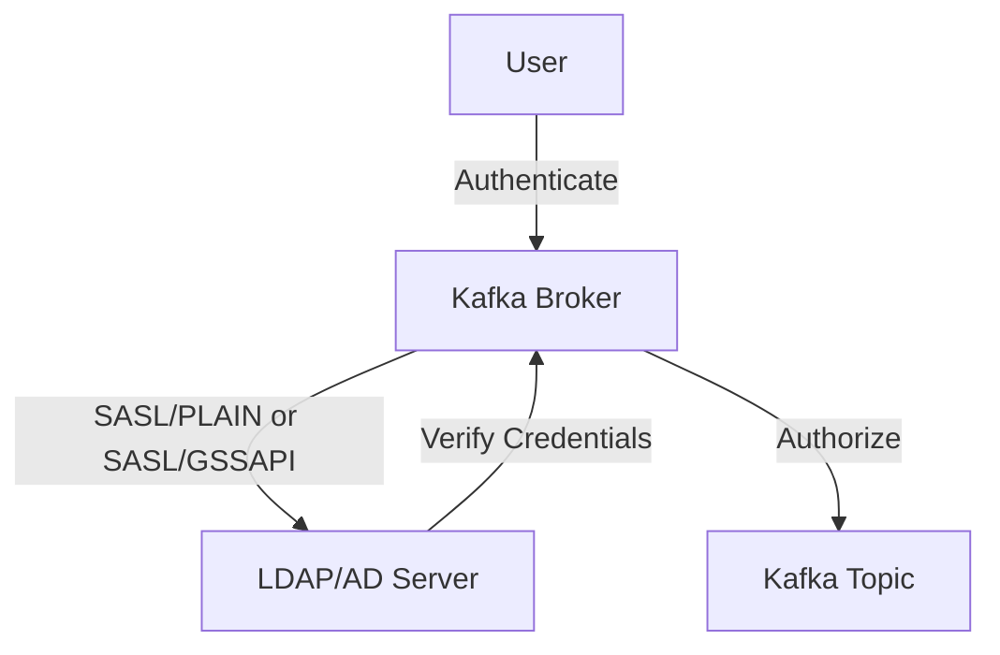

## 12.8.1 LDAP and Active Directory Integration

Integrating Apache Kafka with LDAP (Lightweight Directory Access Protocol) or Active Directory (AD) is a critical step for organizations seeking centralized user management and streamlined authentication and authorization processes. This integration ensures that Kafka can leverage existing enterprise security infrastructures, providing a cohesive and secure environment for managing access to Kafka resources.

### Understanding LDAP and Active Directory

LDAP is a protocol used to access and manage directory information over an IP network. Active Directory, a directory service developed by Microsoft, uses LDAP as its primary protocol. Both LDAP and AD are widely used for storing user credentials and managing access control in enterprise environments.

### SASL Authentication with LDAP/AD

SASL (Simple Authentication and Security Layer) is a framework for authentication and data security in internet protocols. Kafka supports SASL for authentication, allowing it to integrate with LDAP/AD for user verification. The most common SASL mechanisms used with LDAP/AD are:

- **SASL/PLAIN**: Transmits credentials in plain text, typically used with SSL/TLS to encrypt the connection.
- **SASL/GSSAPI (Kerberos)**: Provides a secure authentication mechanism using Kerberos tickets.

#### Configuring SASL/PLAIN with LDAP/AD

To configure Kafka to authenticate using SASL/PLAIN with LDAP/AD, follow these steps:

1. **Enable SASL in Kafka Broker Configuration**:

   Edit the `server.properties` file to include SASL/PLAIN as a supported mechanism:

   ```properties
   security.inter.broker.protocol=SASL_PLAINTEXT
   sasl.mechanism.inter.broker.protocol=PLAIN
   sasl.enabled.mechanisms=PLAIN
   ```

2. **Configure JAAS (Java Authentication and Authorization Service)**:

   Create a JAAS configuration file (`kafka_server_jaas.conf`) for the Kafka broker:

   ```plaintext
   KafkaServer {
       org.apache.kafka.common.security.plain.PlainLoginModule required
       username="kafka"
       password="kafka-secret"
       user_kafka="kafka-secret"
       user_admin="admin-secret";
   };
   ```

3. **Set JAAS Configuration in Kafka**:

   Add the JAAS configuration to the Kafka startup command:

   ```bash
   export KAFKA_OPTS="-Djava.security.auth.login.config=/path/to/kafka_server_jaas.conf"
   ```

4. **Configure LDAP/AD for User Authentication**:

   Use an LDAP server or Active Directory to manage user credentials. Ensure that the LDAP server is accessible from the Kafka broker.

#### Configuring SASL/GSSAPI (Kerberos) with LDAP/AD

For organizations using Kerberos, SASL/GSSAPI provides a secure way to authenticate users against LDAP/AD:

1. **Set Up Kerberos**:

   Ensure that your Kerberos server is configured and that users have valid Kerberos tickets.

2. **Configure Kafka for SASL/GSSAPI**:

   Edit the `server.properties` file to enable SASL/GSSAPI:

   ```properties
   security.inter.broker.protocol=SASL_PLAINTEXT
   sasl.mechanism.inter.broker.protocol=GSSAPI
   sasl.enabled.mechanisms=GSSAPI
   ```

3. **Create JAAS Configuration for Kerberos**:

   Create a JAAS configuration file (`kafka_server_jaas.conf`) for the Kafka broker:

   ```plaintext
   KafkaServer {
       com.sun.security.auth.module.Krb5LoginModule required
       useKeyTab=true
       keyTab="/path/to/kafka.keytab"
       storeKey=true
       useTicketCache=false
       principal="kafka/hostname@YOUR_REALM";
   };
   ```

4. **Configure Kerberos Client**:

   Ensure that the Kerberos client is configured on the Kafka broker machine. This includes setting up the `krb5.conf` file with the correct realm and KDC information.

### Mapping LDAP Groups to Kafka Roles

Mapping LDAP groups to Kafka roles is essential for managing access control. This process involves defining roles in Kafka and associating them with LDAP groups. Here's how you can achieve this:

1. **Define Kafka Roles**:

   Identify the roles required for your Kafka deployment, such as `admin`, `producer`, and `consumer`.

2. **Map LDAP Groups to Kafka Roles**:

   Use an authorization tool or script to map LDAP groups to Kafka roles. This can be done using Kafka's ACLs (Access Control Lists) or an external authorization service.

3. **Configure Kafka ACLs**:

   Use Kafka's command-line tools to set ACLs based on the mapped roles. For example:

   ```bash
   kafka-acls --authorizer-properties zookeeper.connect=localhost:2181 --add --allow-principal User:admin --operation All --topic my-topic
   ```

### Best Practices for Maintaining Synchronization

Maintaining synchronization between LDAP/AD and Kafka is crucial for ensuring that access control remains up-to-date. Here are some best practices:

- **Regularly Sync User Data**: Schedule regular synchronization of user data between LDAP/AD and Kafka to ensure that changes in user roles or group memberships are reflected in Kafka.

- **Monitor Authentication Logs**: Regularly review authentication logs to identify and address any discrepancies or unauthorized access attempts.

- **Implement Redundancy**: Use redundant LDAP/AD servers to ensure high availability and reliability of authentication services.

- **Automate Role Mapping**: Use automation tools to manage role mapping and ACL configuration, reducing the risk of human error.

### Practical Applications and Real-World Scenarios

Integrating Kafka with LDAP/AD is particularly beneficial in large enterprises where centralized user management is essential. Here are some scenarios where this integration is advantageous:

- **Enterprise Data Hubs**: Centralized management of user access to Kafka topics across multiple departments.

- **Regulatory Compliance**: Ensuring that access control policies meet industry regulations by leveraging existing LDAP/AD infrastructure.

- **Scalable Microservices**: Managing authentication and authorization for microservices architectures that rely on Kafka for event-driven communication.

### Code Examples

Below are code examples demonstrating how to configure Kafka for LDAP/AD integration using SASL/PLAIN and SASL/GSSAPI in multiple languages.

#### Java Example

```java
import org.apache.kafka.clients.producer.KafkaProducer;
import org.apache.kafka.clients.producer.ProducerConfig;
import org.apache.kafka.clients.producer.ProducerRecord;
import org.apache.kafka.common.serialization.StringSerializer;

import java.util.Properties;

public class LdapKafkaProducer {
    public static void main(String[] args) {
        Properties props = new Properties();
        props.put(ProducerConfig.BOOTSTRAP_SERVERS_CONFIG, "localhost:9092");
        props.put(ProducerConfig.KEY_SERIALIZER_CLASS_CONFIG, StringSerializer.class.getName());
        props.put(ProducerConfig.VALUE_SERIALIZER_CLASS_CONFIG, StringSerializer.class.getName());
        props.put("security.protocol", "SASL_PLAINTEXT");
        props.put("sasl.mechanism", "PLAIN");
        props.put("sasl.jaas.config", "org.apache.kafka.common.security.plain.PlainLoginModule required username=\"user\" password=\"password\";");

        KafkaProducer<String, String> producer = new KafkaProducer<>(props);
        producer.send(new ProducerRecord<>("my-topic", "key", "value"));
        producer.close();
    }
}
```

#### Scala Example

```scala
import org.apache.kafka.clients.producer.{KafkaProducer, ProducerConfig, ProducerRecord}
import org.apache.kafka.common.serialization.StringSerializer

import java.util.Properties

object LdapKafkaProducer {
  def main(args: Array[String]): Unit = {
    val props = new Properties()
    props.put(ProducerConfig.BOOTSTRAP_SERVERS_CONFIG, "localhost:9092")
    props.put(ProducerConfig.KEY_SERIALIZER_CLASS_CONFIG, classOf[StringSerializer].getName)
    props.put(ProducerConfig.VALUE_SERIALIZER_CLASS_CONFIG, classOf[StringSerializer].getName)
    props.put("security.protocol", "SASL_PLAINTEXT")
    props.put("sasl.mechanism", "PLAIN")
    props.put("sasl.jaas.config", "org.apache.kafka.common.security.plain.PlainLoginModule required username=\"user\" password=\"password\";")

    val producer = new KafkaProducer[String, String](props)
    producer.send(new ProducerRecord[String, String]("my-topic", "key", "value"))
    producer.close()
  }
}
```

#### Kotlin Example

```kotlin
import org.apache.kafka.clients.producer.KafkaProducer
import org.apache.kafka.clients.producer.ProducerConfig
import org.apache.kafka.clients.producer.ProducerRecord
import org.apache.kafka.common.serialization.StringSerializer
import java.util.Properties

fun main() {
    val props = Properties().apply {
        put(ProducerConfig.BOOTSTRAP_SERVERS_CONFIG, "localhost:9092")
        put(ProducerConfig.KEY_SERIALIZER_CLASS_CONFIG, StringSerializer::class.java.name)
        put(ProducerConfig.VALUE_SERIALIZER_CLASS_CONFIG, StringSerializer::class.java.name)
        put("security.protocol", "SASL_PLAINTEXT")
        put("sasl.mechanism", "PLAIN")
        put("sasl.jaas.config", "org.apache.kafka.common.security.plain.PlainLoginModule required username=\"user\" password=\"password\";")
    }

    KafkaProducer<String, String>(props).use { producer ->
        producer.send(ProducerRecord("my-topic", "key", "value"))
    }
}
```

#### Clojure Example

```clojure
(ns ldap-kafka-producer
  (:import (org.apache.kafka.clients.producer KafkaProducer ProducerConfig ProducerRecord)
           (org.apache.kafka.common.serialization StringSerializer))
  (:require [clojure.java.io :as io]))

(defn create-producer []
  (let [props (doto (java.util.Properties.)
                (.put ProducerConfig/BOOTSTRAP_SERVERS_CONFIG "localhost:9092")
                (.put ProducerConfig/KEY_SERIALIZER_CLASS_CONFIG StringSerializer)
                (.put ProducerConfig/VALUE_SERIALIZER_CLASS_CONFIG StringSerializer)
                (.put "security.protocol" "SASL_PLAINTEXT")
                (.put "sasl.mechanism" "PLAIN")
                (.put "sasl.jaas.config" "org.apache.kafka.common.security.plain.PlainLoginModule required username=\"user\" password=\"password\";"))]
    (KafkaProducer. props)))

(defn -main []
  (with-open [producer (create-producer)]
    (.send producer (ProducerRecord. "my-topic" "key" "value"))))
```

### Visualizing the Integration

To better understand the integration process, consider the following diagram illustrating the flow of authentication and authorization in a Kafka environment integrated with LDAP/AD.



**Diagram Description**: This diagram shows the authentication flow where a user authenticates with the Kafka broker using SASL/PLAIN or SASL/GSSAPI. The broker communicates with the LDAP/AD server to verify credentials, and upon successful verification, the user is authorized to access Kafka topics.

### References and Further Reading

- [Apache Kafka Documentation](https://kafka.apache.org/documentation/)
- [Confluent Documentation](https://docs.confluent.io/)
- [LDAP: The Protocol](https://ldap.com/)
- [Active Directory Overview](https://docs.microsoft.com/en-us/windows-server/identity/ad-ds/get-started/virtual-dc/active-directory-domain-services-overview)

## Test Your Knowledge: LDAP and Active Directory Integration with Kafka



### What is the primary protocol used by Active Directory for authentication?

- [x] LDAP
- [ ] HTTP
- [ ] FTP
- [ ] SMTP

> **Explanation:** Active Directory primarily uses LDAP (Lightweight Directory Access Protocol) for authentication and directory services.

### Which SASL mechanism is commonly used with Kerberos for secure authentication?

- [x] GSSAPI
- [ ] PLAIN
- [ ] SCRAM
- [ ] DIGEST-MD5

> **Explanation:** SASL/GSSAPI is commonly used with Kerberos for secure authentication in enterprise environments.

### What is the purpose of the JAAS configuration file in Kafka?

- [x] To specify authentication settings for Kafka brokers
- [ ] To configure Kafka topic partitions
- [ ] To manage Kafka consumer offsets
- [ ] To set Kafka broker replication factors

> **Explanation:** The JAAS configuration file is used to specify authentication settings for Kafka brokers, including SASL mechanisms and credentials.

### How can LDAP groups be mapped to Kafka roles?

- [x] By using Kafka's ACLs and external authorization tools
- [ ] By configuring Kafka brokers directly
- [ ] By modifying Kafka's server.properties file
- [ ] By using Kafka's consumer groups

> **Explanation:** LDAP groups can be mapped to Kafka roles using Kafka's ACLs (Access Control Lists) and external authorization tools to manage access control.

### What is a best practice for maintaining synchronization between LDAP/AD and Kafka?

- [x] Regularly sync user data
- [ ] Use a single LDAP server
- [ ] Disable logging
- [ ] Avoid using SSL/TLS

> **Explanation:** Regularly syncing user data between LDAP/AD and Kafka ensures that changes in user roles or group memberships are reflected in Kafka.

### Which of the following is a benefit of integrating Kafka with LDAP/AD?

- [x] Centralized user management
- [ ] Increased network latency
- [ ] Reduced security
- [ ] Simplified topic configuration

> **Explanation:** Integrating Kafka with LDAP/AD provides centralized user management, streamlining authentication and authorization processes.

### What is the role of the `krb5.conf` file in Kerberos authentication?

- [x] To configure the Kerberos client with realm and KDC information
- [ ] To set Kafka broker configurations
- [ ] To manage Kafka topic metadata
- [ ] To configure Kafka consumer groups

> **Explanation:** The `krb5.conf` file is used to configure the Kerberos client with the correct realm and KDC (Key Distribution Center) information.

### Which security protocol should be used with SASL/PLAIN to encrypt the connection?

- [x] SSL/TLS
- [ ] HTTP
- [ ] FTP
- [ ] SMTP

> **Explanation:** SSL/TLS should be used with SASL/PLAIN to encrypt the connection and protect credentials transmitted in plain text.

### What is the function of Kafka's ACLs?

- [x] To manage access control for Kafka resources
- [ ] To configure Kafka broker replication
- [ ] To set Kafka topic retention policies
- [ ] To manage Kafka consumer offsets

> **Explanation:** Kafka's ACLs (Access Control Lists) are used to manage access control for Kafka resources, such as topics and consumer groups.

### True or False: LDAP is a directory service developed by Microsoft.

- [ ] True
- [x] False

> **Explanation:** False. LDAP is a protocol used to access and manage directory information, while Active Directory is a directory service developed by Microsoft that uses LDAP.



By following these guidelines and examples, you can effectively integrate Apache Kafka with LDAP and Active Directory, enhancing your system's security and user management capabilities.
