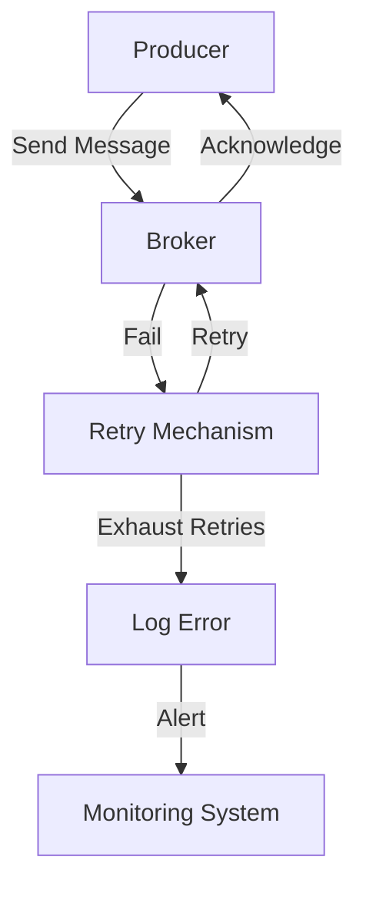

## 13.1 Handling Producer Failures

In the realm of distributed systems, ensuring reliable message delivery is paramount. Apache Kafka, a cornerstone of modern data architectures, offers robust mechanisms to handle producer failures, ensuring data consistency and reliability. This section explores the intricacies of managing producer failures in Kafka, focusing on configuration options, retry mechanisms, idempotence, and best practices for monitoring and mitigation.

### Common Causes of Producer Failures

Understanding the root causes of producer failures is the first step in designing resilient Kafka applications. Common issues include:

- **Network Partitions**: Temporary network failures can disrupt communication between producers and brokers.
- **Broker Unavailability**: Brokers may become unavailable due to maintenance, crashes, or resource exhaustion.
- **Configuration Errors**: Misconfigured producers can lead to message loss or duplication.
- **Resource Constraints**: Insufficient memory or CPU resources can cause producer applications to fail.
- **Serialization Errors**: Incorrect serialization logic can prevent messages from being successfully sent.

### Configuration Options for Enhanced Producer Reliability

Kafka provides several configuration options to enhance producer reliability. Key configurations include:

- **`acks` (Acknowledgments)**: Determines the number of acknowledgments the producer requires before considering a request complete. Options include:
  - `acks=0`: No acknowledgment is required. This is the fastest option but offers the least reliability.
  - `acks=1`: The leader broker acknowledges the message. This provides a balance between speed and reliability.
  - `acks=all`: All in-sync replicas must acknowledge the message, ensuring maximum reliability.

- **`retries`**: Specifies the number of retry attempts for failed sends. Increasing this value can improve reliability but may also increase latency.

- **`retry.backoff.ms`**: Sets the time to wait before retrying a failed send. This helps in managing load during transient failures.

- **`linger.ms`**: Introduces a delay before sending messages to allow batching, which can improve throughput and reliability.

- **`max.in.flight.requests.per.connection`**: Limits the number of unacknowledged requests per connection. Lowering this value can prevent message reordering.

### Retry Mechanisms and Their Impact on Message Delivery

Retry mechanisms are crucial for handling transient failures. However, they must be carefully configured to avoid unintended consequences such as message duplication or reordering.

- **Exponential Backoff**: Implementing exponential backoff for retries can prevent overwhelming the broker during recovery periods.

- **Idempotence**: Enabling idempotence ensures that retries do not result in duplicate messages. This is achieved by assigning a unique sequence number to each message.

- **Exactly-Once Semantics**: Kafka's exactly-once semantics guarantee that each message is processed exactly once, even in the presence of retries. This requires enabling idempotence and transactions.

### Idempotence and Ensuring Exactly-Once Semantics

Idempotence is a key feature for ensuring reliable message delivery. When enabled, Kafka producers can safely retry sending messages without the risk of duplication. This is particularly important in scenarios where exactly-once semantics are required.

- **Enabling Idempotence**: Set `enable.idempotence=true` in the producer configuration. This automatically enables retries and sets `acks=all`.

- **Transactions**: Use transactions to achieve exactly-once semantics across multiple topics or partitions. This involves starting a transaction, sending messages, and committing the transaction.

### Code Examples: Handling Producer Failures

Below are code examples demonstrating how to configure Kafka producers for reliability and handle failures effectively.

#### Java Example

```java
import org.apache.kafka.clients.producer.KafkaProducer;
import org.apache.kafka.clients.producer.ProducerConfig;
import org.apache.kafka.clients.producer.ProducerRecord;
import org.apache.kafka.clients.producer.RecordMetadata;
import org.apache.kafka.common.serialization.StringSerializer;

import java.util.Properties;
import java.util.concurrent.ExecutionException;

public class ReliableKafkaProducer {

    public static void main(String[] args) {
        Properties props = new Properties();
        props.put(ProducerConfig.BOOTSTRAP_SERVERS_CONFIG, "localhost:9092");
        props.put(ProducerConfig.KEY_SERIALIZER_CLASS_CONFIG, StringSerializer.class.getName());
        props.put(ProducerConfig.VALUE_SERIALIZER_CLASS_CONFIG, StringSerializer.class.getName());
        props.put(ProducerConfig.ACKS_CONFIG, "all");
        props.put(ProducerConfig.RETRIES_CONFIG, 3);
        props.put(ProducerConfig.ENABLE_IDEMPOTENCE_CONFIG, true);

        KafkaProducer<String, String> producer = new KafkaProducer<>(props);

        ProducerRecord<String, String> record = new ProducerRecord<>("my-topic", "key", "value");

        try {
            RecordMetadata metadata = producer.send(record).get();
            System.out.printf("Sent message to topic %s partition %d with offset %d%n",
                    metadata.topic(), metadata.partition(), metadata.offset());
        } catch (ExecutionException | InterruptedException e) {
            e.printStackTrace();
        } finally {
            producer.close();
        }
    }
}
```

#### Scala Example

```scala
import org.apache.kafka.clients.producer.{KafkaProducer, ProducerConfig, ProducerRecord}
import org.apache.kafka.common.serialization.StringSerializer

import java.util.Properties

object ReliableKafkaProducer extends App {

  val props = new Properties()
  props.put(ProducerConfig.BOOTSTRAP_SERVERS_CONFIG, "localhost:9092")
  props.put(ProducerConfig.KEY_SERIALIZER_CLASS_CONFIG, classOf[StringSerializer].getName)
  props.put(ProducerConfig.VALUE_SERIALIZER_CLASS_CONFIG, classOf[StringSerializer].getName)
  props.put(ProducerConfig.ACKS_CONFIG, "all")
  props.put(ProducerConfig.RETRIES_CONFIG, "3")
  props.put(ProducerConfig.ENABLE_IDEMPOTENCE_CONFIG, "true")

  val producer = new KafkaProducer[String, String](props)

  val record = new ProducerRecord[String, String]("my-topic", "key", "value")

  try {
    val metadata = producer.send(record).get()
    println(s"Sent message to topic ${metadata.topic()} partition ${metadata.partition()} with offset ${metadata.offset()}")
  } catch {
    case e: Exception => e.printStackTrace()
  } finally {
    producer.close()
  }
}
```

#### Kotlin Example

```kotlin
import org.apache.kafka.clients.producer.KafkaProducer
import org.apache.kafka.clients.producer.ProducerConfig
import org.apache.kafka.clients.producer.ProducerRecord
import org.apache.kafka.common.serialization.StringSerializer
import java.util.Properties

fun main() {
    val props = Properties().apply {
        put(ProducerConfig.BOOTSTRAP_SERVERS_CONFIG, "localhost:9092")
        put(ProducerConfig.KEY_SERIALIZER_CLASS_CONFIG, StringSerializer::class.java.name)
        put(ProducerConfig.VALUE_SERIALIZER_CLASS_CONFIG, StringSerializer::class.java.name)
        put(ProducerConfig.ACKS_CONFIG, "all")
        put(ProducerConfig.RETRIES_CONFIG, 3)
        put(ProducerConfig.ENABLE_IDEMPOTENCE_CONFIG, true)
    }

    val producer = KafkaProducer<String, String>(props)

    val record = ProducerRecord("my-topic", "key", "value")

    try {
        val metadata = producer.send(record).get()
        println("Sent message to topic ${metadata.topic()} partition ${metadata.partition()} with offset ${metadata.offset()}")
    } catch (e: Exception) {
        e.printStackTrace()
    } finally {
        producer.close()
    }
}
```

#### Clojure Example

```clojure
(ns reliable-kafka-producer
  (:import (org.apache.kafka.clients.producer KafkaProducer ProducerConfig ProducerRecord)
           (org.apache.kafka.common.serialization StringSerializer))
  (:require [clojure.java.io :as io]))

(defn create-producer []
  (let [props (doto (java.util.Properties.)
                (.put ProducerConfig/BOOTSTRAP_SERVERS_CONFIG "localhost:9092")
                (.put ProducerConfig/KEY_SERIALIZER_CLASS_CONFIG StringSerializer)
                (.put ProducerConfig/VALUE_SERIALIZER_CLASS_CONFIG StringSerializer)
                (.put ProducerConfig/ACKS_CONFIG "all")
                (.put ProducerConfig/RETRIES_CONFIG "3")
                (.put ProducerConfig/ENABLE_IDEMPOTENCE_CONFIG "true"))]
    (KafkaProducer. props)))

(defn send-message [producer topic key value]
  (let [record (ProducerRecord. topic key value)]
    (try
      (let [metadata (.get (.send producer record))]
        (println (format "Sent message to topic %s partition %d with offset %d"
                         (.topic metadata) (.partition metadata) (.offset metadata))))
      (catch Exception e
        (.printStackTrace e))
      (finally
        (.close producer)))))

(defn -main []
  (let [producer (create-producer)]
    (send-message producer "my-topic" "key" "value")))
```

### Best Practices for Monitoring and Mitigating Producer Failures

To effectively handle producer failures, consider the following best practices:

- **Monitor Key Metrics**: Track metrics such as `record-send-rate`, `record-error-rate`, and `record-retry-rate` to identify potential issues early.

- **Implement Alerts**: Set up alerts for critical metrics to ensure timely response to failures.

- **Use Circuit Breakers**: Implement circuit breakers to prevent cascading failures in the event of persistent issues.

- **Regularly Test Failover Scenarios**: Conduct regular failover tests to ensure that your system can handle producer failures gracefully.

- **Leverage Kafka's Built-in Tools**: Use Kafka's built-in tools for monitoring and managing producers, such as Kafka Manager or Confluent Control Center.

### Visualizing Producer Failure Handling

To better understand the flow of handling producer failures, consider the following diagram:



**Diagram Caption**: This flowchart illustrates the process of handling producer failures in Kafka. The producer sends a message to the broker, which either acknowledges it or triggers a retry mechanism in case of failure. If retries are exhausted, an error is logged and an alert is sent to the monitoring system.

### Knowledge Check

To reinforce your understanding of handling producer failures in Kafka, consider the following questions:

## Test Your Knowledge: Handling Producer Failures in Apache Kafka



### What is the primary purpose of setting `acks=all` in Kafka producer configuration?

- [x] To ensure maximum reliability by requiring all in-sync replicas to acknowledge the message.
- [ ] To improve throughput by reducing the number of acknowledgments.
- [ ] To decrease latency by sending messages without waiting for acknowledgments.
- [ ] To enable idempotence in message delivery.

> **Explanation:** Setting `acks=all` ensures that all in-sync replicas acknowledge the message, providing the highest level of reliability.

### Which configuration option is crucial for preventing message duplication during retries?

- [x] `enable.idempotence=true`
- [ ] `acks=0`
- [ ] `linger.ms=0`
- [ ] `max.in.flight.requests.per.connection=5`

> **Explanation:** Enabling idempotence ensures that retries do not result in duplicate messages by assigning unique sequence numbers to each message.

### How does exponential backoff help in handling producer failures?

- [x] It prevents overwhelming the broker by gradually increasing the retry interval.
- [ ] It reduces the number of retries by increasing the retry interval.
- [ ] It improves throughput by batching messages.
- [ ] It decreases latency by sending messages immediately.

> **Explanation:** Exponential backoff helps manage load during recovery periods by gradually increasing the retry interval, preventing the broker from being overwhelmed.

### What is the role of transactions in achieving exactly-once semantics in Kafka?

- [x] They ensure that a group of messages is processed atomically across multiple topics or partitions.
- [ ] They reduce the number of retries by batching messages.
- [ ] They improve throughput by sending messages without waiting for acknowledgments.
- [ ] They decrease latency by sending messages immediately.

> **Explanation:** Transactions ensure that a group of messages is processed atomically, which is essential for achieving exactly-once semantics across multiple topics or partitions.

### Which of the following is a best practice for monitoring Kafka producers?

- [x] Tracking metrics such as `record-send-rate` and `record-error-rate`.
- [ ] Increasing the number of retries to handle failures.
- [ ] Reducing the `linger.ms` value to zero.
- [ ] Disabling idempotence to improve throughput.

> **Explanation:** Monitoring key metrics like `record-send-rate` and `record-error-rate` helps identify potential issues early and is a best practice for managing Kafka producers.

### What is the impact of setting `max.in.flight.requests.per.connection` to a low value?

- [x] It prevents message reordering by limiting unacknowledged requests.
- [ ] It increases throughput by allowing more concurrent requests.
- [ ] It decreases latency by sending messages immediately.
- [ ] It enables idempotence in message delivery.

> **Explanation:** Setting `max.in.flight.requests.per.connection` to a low value prevents message reordering by limiting the number of unacknowledged requests per connection.

### Why is it important to conduct regular failover tests for Kafka producers?

- [x] To ensure the system can handle producer failures gracefully.
- [ ] To increase the number of retries during failures.
- [ ] To improve throughput by reducing the number of acknowledgments.
- [ ] To decrease latency by sending messages immediately.

> **Explanation:** Regular failover tests help ensure that the system can handle producer failures gracefully, maintaining reliability and consistency.

### How can circuit breakers help in managing producer failures?

- [x] They prevent cascading failures by temporarily halting message sending during persistent issues.
- [ ] They increase throughput by allowing more concurrent requests.
- [ ] They decrease latency by sending messages immediately.
- [ ] They enable idempotence in message delivery.

> **Explanation:** Circuit breakers prevent cascading failures by temporarily halting message sending during persistent issues, allowing the system to recover.

### What is the benefit of using Kafka's built-in tools for monitoring producers?

- [x] They provide real-time insights into producer performance and potential issues.
- [ ] They increase throughput by reducing the number of acknowledgments.
- [ ] They decrease latency by sending messages immediately.
- [ ] They enable idempotence in message delivery.

> **Explanation:** Kafka's built-in tools provide real-time insights into producer performance and potential issues, aiding in effective monitoring and management.

### True or False: Enabling idempotence in Kafka producers automatically sets `acks=all`.

- [x] True
- [ ] False

> **Explanation:** Enabling idempotence in Kafka producers automatically sets `acks=all` to ensure maximum reliability and prevent message duplication.



By understanding and implementing these strategies, you can effectively manage producer failures in Kafka, ensuring reliable message delivery and maintaining data consistency even in the face of unexpected events.
