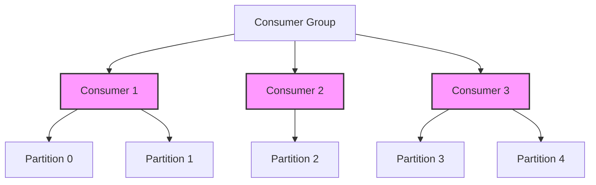

## 13.2.1 Rebalancing and Partition Ownership

### Introduction

In Apache Kafka, consumer group rebalancing and partition ownership are critical concepts that ensure efficient and reliable message processing in distributed systems. Understanding how rebalancing works, what triggers it, and how partition ownership is managed is essential for building robust Kafka applications. This section delves into the mechanics of consumer group rebalancing, the strategies for partition assignment, and best practices for minimizing disruption during rebalances.

### Understanding Consumer Group Rebalancing

#### What Triggers a Rebalance?

A rebalance in Kafka is triggered by several events:

1. **Consumer Join or Leave**: When a new consumer joins a group or an existing consumer leaves, Kafka initiates a rebalance to redistribute partitions among the available consumers.

2. **Partition Changes**: Changes in the number of partitions for a topic, such as adding or removing partitions, also trigger a rebalance.

3. **Consumer Failure**: If a consumer fails or becomes unresponsive, Kafka detects this through heartbeats and triggers a rebalance to reassign the partitions owned by the failed consumer.

4. **Coordinator Changes**: Changes in the consumer group coordinator, which manages the group membership and partition assignments, can also lead to a rebalance.

#### How Partition Ownership is Reassigned

During a rebalance, Kafka reassigns partition ownership among the consumers in a group. The process involves:

1. **Partition Assignment Strategies**: Kafka uses partition assignment strategies to determine how partitions are distributed among consumers. The default strategy is the `RangeAssignor`, but others like `RoundRobinAssignor` and `StickyAssignor` can be used based on specific needs.

2. **Leader Election**: One consumer is elected as the leader to perform the partition assignment. This leader uses the chosen assignment strategy to distribute partitions.

3. **Reassignment Notification**: Once the leader completes the assignment, it notifies all consumers in the group of their new partition assignments.

4. **State Transition**: Consumers transition from their current state to the new state, where they start consuming from their newly assigned partitions.

#### Partition Assignment Strategies

Kafka provides several partition assignment strategies, each with its own characteristics:

- **RangeAssignor**: Assigns partitions in contiguous ranges to consumers. This strategy is simple but can lead to uneven distribution if the number of partitions is not divisible by the number of consumers.

- **RoundRobinAssignor**: Distributes partitions evenly across consumers in a round-robin fashion. This strategy ensures a more balanced distribution but may lead to increased rebalance times.

- **StickyAssignor**: Aims to minimize partition movement during rebalances by sticking to previous assignments as much as possible. This strategy reduces the impact of rebalances on message processing.

### Handling Rebalances in Consumer Applications

Rebalances can disrupt message processing, leading to increased latency and potential message duplication. To handle rebalances effectively:

1. **Implement Idempotent Consumers**: Ensure that your consumers are idempotent, meaning they can process the same message multiple times without adverse effects. This is crucial for maintaining data integrity during rebalances.

2. **Use Offset Management**: Properly manage offsets to ensure that messages are not lost or processed multiple times. Kafka provides automatic offset management, but manual management can offer more control.

3. **Monitor Consumer Lag**: Use monitoring tools to track consumer lag, which indicates how far behind a consumer is in processing messages. High lag can signal issues during rebalances.

4. **Optimize Rebalance Frequency**: Minimize the frequency of rebalances by tuning consumer configurations, such as session timeouts and heartbeat intervals.

5. **Graceful Shutdowns**: Implement graceful shutdowns for consumers to allow them to commit offsets and leave the group cleanly, reducing the impact on rebalances.

### Best Practices for Minimizing Disruption During Rebalances

1. **Choose the Right Assignment Strategy**: Select a partition assignment strategy that aligns with your application's needs. For example, use `StickyAssignor` to minimize partition movement.

2. **Tune Consumer Configurations**: Adjust configurations like `session.timeout.ms` and `heartbeat.interval.ms` to balance between responsiveness and stability.

3. **Leverage Kafka's Exactly-Once Semantics**: Use Kafka's exactly-once semantics to ensure that messages are processed exactly once, even during rebalances.

4. **Implement Retry Logic**: Incorporate retry logic in your consumers to handle transient errors that may occur during rebalances.

5. **Use Monitoring and Alerting**: Set up monitoring and alerting to detect and respond to issues during rebalances quickly.

### Code Examples

To illustrate these concepts, let's explore code examples in Java, Scala, Kotlin, and Clojure.

#### Java Example

```java
import org.apache.kafka.clients.consumer.ConsumerConfig;
import org.apache.kafka.clients.consumer.KafkaConsumer;
import org.apache.kafka.clients.consumer.ConsumerRecords;
import org.apache.kafka.clients.consumer.ConsumerRecord;
import org.apache.kafka.common.serialization.StringDeserializer;

import java.util.Collections;
import java.util.Properties;

public class KafkaConsumerExample {
    public static void main(String[] args) {
        Properties props = new Properties();
        props.put(ConsumerConfig.BOOTSTRAP_SERVERS_CONFIG, "localhost:9092");
        props.put(ConsumerConfig.GROUP_ID_CONFIG, "example-group");
        props.put(ConsumerConfig.KEY_DESERIALIZER_CLASS_CONFIG, StringDeserializer.class.getName());
        props.put(ConsumerConfig.VALUE_DESERIALIZER_CLASS_CONFIG, StringDeserializer.class.getName());
        props.put(ConsumerConfig.AUTO_OFFSET_RESET_CONFIG, "earliest");

        KafkaConsumer<String, String> consumer = new KafkaConsumer<>(props);
        consumer.subscribe(Collections.singletonList("example-topic"));

        try {
            while (true) {
                ConsumerRecords<String, String> records = consumer.poll(100);
                for (ConsumerRecord<String, String> record : records) {
                    // Process each record
                    System.out.printf("Consumed record with key %s and value %s%n", record.key(), record.value());
                }
            }
        } finally {
            consumer.close();
        }
    }
}
```

#### Scala Example

```scala
import org.apache.kafka.clients.consumer.{ConsumerConfig, KafkaConsumer}
import org.apache.kafka.common.serialization.StringDeserializer

import java.util.Properties
import scala.collection.JavaConverters._

object KafkaConsumerExample extends App {
  val props = new Properties()
  props.put(ConsumerConfig.BOOTSTRAP_SERVERS_CONFIG, "localhost:9092")
  props.put(ConsumerConfig.GROUP_ID_CONFIG, "example-group")
  props.put(ConsumerConfig.KEY_DESERIALIZER_CLASS_CONFIG, classOf[StringDeserializer].getName)
  props.put(ConsumerConfig.VALUE_DESERIALIZER_CLASS_CONFIG, classOf[StringDeserializer].getName)
  props.put(ConsumerConfig.AUTO_OFFSET_RESET_CONFIG, "earliest")

  val consumer = new KafkaConsumer[String, String](props)
  consumer.subscribe(List("example-topic").asJava)

  try {
    while (true) {
      val records = consumer.poll(100).asScala
      for (record <- records) {
        // Process each record
        println(s"Consumed record with key ${record.key()} and value ${record.value()}")
      }
    }
  } finally {
    consumer.close()
  }
}
```

#### Kotlin Example

```kotlin
import org.apache.kafka.clients.consumer.ConsumerConfig
import org.apache.kafka.clients.consumer.KafkaConsumer
import org.apache.kafka.common.serialization.StringDeserializer
import java.time.Duration
import java.util.*

fun main() {
    val props = Properties().apply {
        put(ConsumerConfig.BOOTSTRAP_SERVERS_CONFIG, "localhost:9092")
        put(ConsumerConfig.GROUP_ID_CONFIG, "example-group")
        put(ConsumerConfig.KEY_DESERIALIZER_CLASS_CONFIG, StringDeserializer::class.java.name)
        put(ConsumerConfig.VALUE_DESERIALIZER_CLASS_CONFIG, StringDeserializer::class.java.name)
        put(ConsumerConfig.AUTO_OFFSET_RESET_CONFIG, "earliest")
    }

    val consumer = KafkaConsumer<String, String>(props)
    consumer.subscribe(listOf("example-topic"))

    try {
        while (true) {
            val records = consumer.poll(Duration.ofMillis(100))
            for (record in records) {
                // Process each record
                println("Consumed record with key ${record.key()} and value ${record.value()}")
            }
        }
    } finally {
        consumer.close()
    }
}
```

#### Clojure Example

```clojure
(import '[org.apache.kafka.clients.consumer KafkaConsumer ConsumerConfig]
        '[org.apache.kafka.common.serialization StringDeserializer])

(defn create-consumer []
  (let [props (doto (java.util.Properties.)
                (.put ConsumerConfig/BOOTSTRAP_SERVERS_CONFIG "localhost:9092")
                (.put ConsumerConfig/GROUP_ID_CONFIG "example-group")
                (.put ConsumerConfig/KEY_DESERIALIZER_CLASS_CONFIG StringDeserializer)
                (.put ConsumerConfig/VALUE_DESERIALIZER_CLASS_CONFIG StringDeserializer)
                (.put ConsumerConfig/AUTO_OFFSET_RESET_CONFIG "earliest"))]
    (KafkaConsumer. props)))

(defn consume-messages []
  (let [consumer (create-consumer)]
    (.subscribe consumer ["example-topic"])
    (try
      (while true
        (let [records (.poll consumer 100)]
          (doseq [record records]
            ;; Process each record
            (println (str "Consumed record with key " (.key record) " and value " (.value record)))))
      (finally
        (.close consumer)))))

(consume-messages)
```

### Visualizing Rebalancing and Partition Ownership

To better understand the process of rebalancing and partition ownership, let's visualize it using a diagram.



**Diagram Explanation**: This diagram illustrates a consumer group with three consumers, each owning specific partitions. During a rebalance, these assignments may change, leading to a new distribution of partitions among the consumers.

### Conclusion

Consumer group rebalancing and partition ownership are fundamental to maintaining the reliability and efficiency of Kafka-based systems. By understanding the triggers for rebalancing, the strategies for partition assignment, and best practices for handling rebalances, you can build resilient applications that minimize disruption and ensure consistent message processing.

### References and Further Reading

- [Apache Kafka Documentation](https://kafka.apache.org/documentation/)
- [Confluent Documentation](https://docs.confluent.io/)
- [Kafka Consumer Group Rebalancing](https://kafka.apache.org/documentation/#consumerconfigs_rebalance)

## Test Your Knowledge: Kafka Consumer Group Rebalancing Quiz



### What triggers a rebalance in a Kafka consumer group?

- [x] A consumer joins or leaves the group.
- [ ] A producer sends a message.
- [ ] A topic is deleted.
- [ ] A broker is restarted.

> **Explanation:** A rebalance is triggered when a consumer joins or leaves the group, among other events.

### Which partition assignment strategy minimizes partition movement during rebalances?

- [ ] RangeAssignor
- [ ] RoundRobinAssignor
- [x] StickyAssignor
- [ ] RandomAssignor

> **Explanation:** The StickyAssignor minimizes partition movement by sticking to previous assignments as much as possible.

### How can you ensure data integrity during rebalances?

- [x] Implement idempotent consumers.
- [ ] Increase the number of partitions.
- [ ] Use a single consumer.
- [ ] Disable rebalances.

> **Explanation:** Idempotent consumers can process the same message multiple times without adverse effects, ensuring data integrity.

### What is the role of the consumer group coordinator?

- [x] Manages group membership and partition assignments.
- [ ] Sends messages to consumers.
- [ ] Deletes topics.
- [ ] Manages producer configurations.

> **Explanation:** The consumer group coordinator manages group membership and partition assignments.

### Which configuration can help minimize rebalance frequency?

- [x] Tuning session timeouts and heartbeat intervals.
- [ ] Increasing the number of brokers.
- [ ] Decreasing the number of consumers.
- [ ] Disabling offset management.

> **Explanation:** Tuning session timeouts and heartbeat intervals can help balance between responsiveness and stability, minimizing rebalance frequency.

### What is a potential drawback of the RoundRobinAssignor?

- [ ] It minimizes partition movement.
- [x] It may lead to increased rebalance times.
- [ ] It only works with a single consumer.
- [ ] It requires manual partition assignment.

> **Explanation:** The RoundRobinAssignor may lead to increased rebalance times due to its even distribution approach.

### Why is monitoring consumer lag important during rebalances?

- [x] It indicates how far behind a consumer is in processing messages.
- [ ] It shows the number of producers.
- [ ] It measures network latency.
- [ ] It tracks broker performance.

> **Explanation:** Monitoring consumer lag helps identify how far behind a consumer is in processing messages, which is crucial during rebalances.

### What is the benefit of using Kafka's exactly-once semantics?

- [x] Ensures messages are processed exactly once, even during rebalances.
- [ ] Increases the number of partitions.
- [ ] Decreases consumer lag.
- [ ] Simplifies producer configurations.

> **Explanation:** Kafka's exactly-once semantics ensure that messages are processed exactly once, even during rebalances.

### Which strategy should you use for a balanced distribution of partitions?

- [ ] StickyAssignor
- [x] RoundRobinAssignor
- [ ] RangeAssignor
- [ ] RandomAssignor

> **Explanation:** The RoundRobinAssignor distributes partitions evenly across consumers, ensuring a balanced distribution.

### True or False: A consumer group rebalance can be triggered by a change in the number of partitions.

- [x] True
- [ ] False

> **Explanation:** A change in the number of partitions for a topic can trigger a rebalance to redistribute partitions among consumers.


