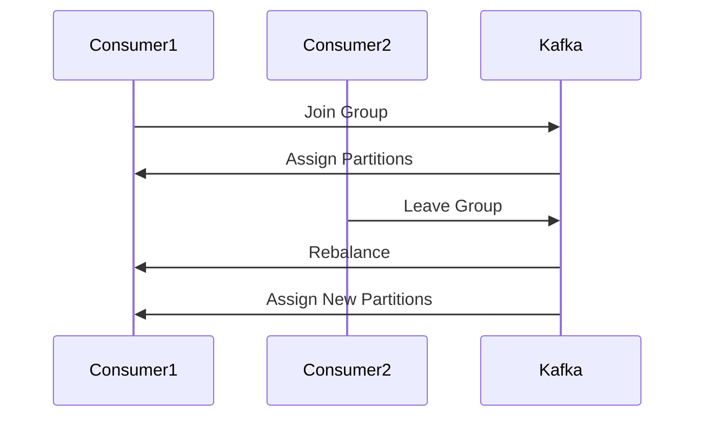

## 13.2 Dealing with Consumer Failures

In the realm of distributed systems, ensuring the reliability and fault tolerance of message consumers is paramount. Apache Kafka, a cornerstone of modern data architectures, provides robust mechanisms to handle consumer failures, ensuring that message processing continues smoothly even in the face of consumer crashes, network issues, or rebalances. This section delves into the intricacies of dealing with consumer failures, offering expert guidance on strategies, configurations, and best practices.

### Understanding Consumer Failure Scenarios

Consumer failures in Kafka can arise from various scenarios, each requiring specific handling strategies:

1. **Consumer Crashes**: Unexpected application crashes can lead to unprocessed messages and potential data loss.
2. **Network Partitions**: Network issues can cause consumers to lose connectivity with the Kafka cluster, leading to processing delays.
3. **Rebalances**: Changes in the consumer group, such as adding or removing consumers, trigger rebalances that can disrupt message processing.
4. **Resource Exhaustion**: Insufficient memory or CPU resources can cause consumers to slow down or fail.

### Kafka's Consumer Group Rebalancing

Consumer group rebalancing is a critical mechanism in Kafka that ensures load distribution and fault tolerance. When a rebalance occurs, Kafka redistributes partitions among the available consumers in a group. This process is essential for maintaining high availability and scalability.

#### How Rebalancing Works

When a consumer joins or leaves a group, Kafka triggers a rebalance. During this process, the following steps occur:

- **Partition Assignment**: Kafka reassigns partitions to consumers based on the configured partition assignment strategy (e.g., range, round-robin).
- **Offset Management**: Consumers commit their offsets to Kafka, ensuring that processing resumes from the last committed point after a rebalance.
- **State Synchronization**: Consumers synchronize their state with the new partition assignments, ensuring continuity in message processing.



*Diagram: Consumer group rebalancing process in Kafka.*

### Failover Strategies and Consumer Configuration

To enhance consumer resilience, consider the following failover strategies and configuration options:

#### 1. **Consumer Configuration Options**

- **`enable.auto.commit`**: Set to `false` to manually control offset commits, providing greater control over message processing.
- **`auto.offset.reset`**: Configure to `earliest` or `latest` to determine where to start consuming messages when no offset is available.
- **`session.timeout.ms`**: Adjust to control the time a consumer can be inactive before being considered dead.

#### 2. **Failover Strategies**

- **Idempotent Processing**: Ensure that your consumer logic is idempotent, meaning that processing the same message multiple times does not produce different results.
- **Retry Mechanisms**: Implement retry logic for transient errors, with exponential backoff to avoid overwhelming the system.
- **Dead Letter Queues (DLQs)**: Use DLQs to handle messages that cannot be processed after several retries, allowing for manual intervention.

### Maintaining Processing State and Offsets

Maintaining the processing state and offsets is crucial for ensuring data consistency and reliability in Kafka consumers.

#### Offset Management

Offsets represent the position of a consumer in a partition. Proper offset management ensures that consumers can resume processing from the correct point after a failure.

- **Manual Offset Commit**: Use `commitSync()` or `commitAsync()` methods to manually commit offsets, providing control over when offsets are updated.
- **Offset Storage**: Store offsets in an external system (e.g., a database) for additional reliability and recovery options.

#### State Management

For stateful processing, maintain the state in a durable store, such as a database or a state store, to recover from failures without data loss.

### Code Examples for Handling Exceptions and Ensuring Idempotency

Implementing robust exception handling and ensuring idempotency are key to dealing with consumer failures effectively.

#### Java Example

```java
import org.apache.kafka.clients.consumer.ConsumerRecord;
import org.apache.kafka.clients.consumer.KafkaConsumer;
import org.apache.kafka.clients.consumer.ConsumerRecords;
import java.util.Collections;
import java.util.Properties;

public class ReliableConsumer {
    public static void main(String[] args) {
        Properties props = new Properties();
        props.put("bootstrap.servers", "localhost:9092");
        props.put("group.id", "test-group");
        props.put("enable.auto.commit", "false");
        props.put("key.deserializer", "org.apache.kafka.common.serialization.StringDeserializer");
        props.put("value.deserializer", "org.apache.kafka.common.serialization.StringDeserializer");

        KafkaConsumer<String, String> consumer = new KafkaConsumer<>(props);
        consumer.subscribe(Collections.singletonList("test-topic"));

        try {
            while (true) {
                ConsumerRecords<String, String> records = consumer.poll(100);
                for (ConsumerRecord<String, String> record : records) {
                    try {
                        // Process record
                        processRecord(record);
                        // Manually commit offset after successful processing
                        consumer.commitSync();
                    } catch (Exception e) {
                        // Handle processing exception
                        handleException(e, record);
                    }
                }
            }
        } finally {
            consumer.close();
        }
    }

    private static void processRecord(ConsumerRecord<String, String> record) {
        // Implement idempotent processing logic here
    }

    private static void handleException(Exception e, ConsumerRecord<String, String> record) {
        // Log and handle the exception, possibly sending to a DLQ
    }
}
```

#### Scala Example

```scala
import org.apache.kafka.clients.consumer.{ConsumerConfig, KafkaConsumer}
import java.util.Properties
import scala.collection.JavaConverters._

object ReliableConsumer {
  def main(args: Array[String]): Unit = {
    val props = new Properties()
    props.put(ConsumerConfig.BOOTSTRAP_SERVERS_CONFIG, "localhost:9092")
    props.put(ConsumerConfig.GROUP_ID_CONFIG, "test-group")
    props.put(ConsumerConfig.ENABLE_AUTO_COMMIT_CONFIG, "false")
    props.put(ConsumerConfig.KEY_DESERIALIZER_CLASS_CONFIG, "org.apache.kafka.common.serialization.StringDeserializer")
    props.put(ConsumerConfig.VALUE_DESERIALIZER_CLASS_CONFIG, "org.apache.kafka.common.serialization.StringDeserializer")

    val consumer = new KafkaConsumer[String, String](props)
    consumer.subscribe(List("test-topic").asJava)

    try {
      while (true) {
        val records = consumer.poll(100).asScala
        for (record <- records) {
          try {
            // Process record
            processRecord(record)
            // Manually commit offset after successful processing
            consumer.commitSync()
          } catch {
            case e: Exception =>
              // Handle processing exception
              handleException(e, record)
          }
        }
      }
    } finally {
      consumer.close()
    }
  }

  def processRecord(record: ConsumerRecord[String, String]): Unit = {
    // Implement idempotent processing logic here
  }

  def handleException(e: Exception, record: ConsumerRecord[String, String]): Unit = {
    // Log and handle the exception, possibly sending to a DLQ
  }
}
```

#### Kotlin Example

```kotlin
import org.apache.kafka.clients.consumer.ConsumerConfig
import org.apache.kafka.clients.consumer.ConsumerRecord
import org.apache.kafka.clients.consumer.KafkaConsumer
import java.util.*

fun main() {
    val props = Properties().apply {
        put(ConsumerConfig.BOOTSTRAP_SERVERS_CONFIG, "localhost:9092")
        put(ConsumerConfig.GROUP_ID_CONFIG, "test-group")
        put(ConsumerConfig.ENABLE_AUTO_COMMIT_CONFIG, "false")
        put(ConsumerConfig.KEY_DESERIALIZER_CLASS_CONFIG, "org.apache.kafka.common.serialization.StringDeserializer")
        put(ConsumerConfig.VALUE_DESERIALIZER_CLASS_CONFIG, "org.apache.kafka.common.serialization.StringDeserializer")
    }

    val consumer = KafkaConsumer<String, String>(props)
    consumer.subscribe(listOf("test-topic"))

    try {
        while (true) {
            val records = consumer.poll(100)
            for (record in records) {
                try {
                    // Process record
                    processRecord(record)
                    // Manually commit offset after successful processing
                    consumer.commitSync()
                } catch (e: Exception) {
                    // Handle processing exception
                    handleException(e, record)
                }
            }
        }
    } finally {
        consumer.close()
    }
}

fun processRecord(record: ConsumerRecord<String, String>) {
    // Implement idempotent processing logic here
}

fun handleException(e: Exception, record: ConsumerRecord<String, String>) {
    // Log and handle the exception, possibly sending to a DLQ
}
```

#### Clojure Example

```clojure
(ns reliable-consumer
  (:import [org.apache.kafka.clients.consumer KafkaConsumer ConsumerConfig ConsumerRecord]
           [java.util Properties]))

(defn process-record [^ConsumerRecord record]
  ;; Implement idempotent processing logic here
  )

(defn handle-exception [^Exception e ^ConsumerRecord record]
  ;; Log and handle the exception, possibly sending to a DLQ
  )

(defn -main [& args]
  (let [props (doto (Properties.)
                (.put ConsumerConfig/BOOTSTRAP_SERVERS_CONFIG "localhost:9092")
                (.put ConsumerConfig/GROUP_ID_CONFIG "test-group")
                (.put ConsumerConfig/ENABLE_AUTO_COMMIT_CONFIG "false")
                (.put ConsumerConfig/KEY_DESERIALIZER_CLASS_CONFIG "org.apache.kafka.common.serialization.StringDeserializer")
                (.put ConsumerConfig/VALUE_DESERIALIZER_CLASS_CONFIG "org.apache.kafka.common.serialization.StringDeserializer"))
        consumer (KafkaConsumer. props)]
    (.subscribe consumer ["test-topic"])
    (try
      (while true
        (let [records (.poll consumer 100)]
          (doseq [record records]
            (try
              (process-record record)
              ;; Manually commit offset after successful processing
              (.commitSync consumer)
              (catch Exception e
                (handle-exception e record))))))
      (finally
        (.close consumer)))))
```

### Monitoring Consumer Health

Monitoring is essential for detecting and responding to consumer failures promptly. Implement the following techniques to ensure consumer health:

- **Metrics Collection**: Use tools like Prometheus and Grafana to collect and visualize consumer metrics, such as lag, throughput, and error rates.
- **Alerting**: Set up alerts for critical metrics, such as consumer lag exceeding a threshold, to trigger immediate investigation.
- **Logging**: Implement comprehensive logging to capture consumer activity and errors, aiding in troubleshooting and root cause analysis.

### Conclusion

Handling consumer failures in Apache Kafka requires a combination of robust configuration, strategic failover mechanisms, and diligent monitoring. By implementing the strategies and best practices outlined in this section, you can ensure that your Kafka consumers remain resilient and reliable, even in the face of unexpected challenges.

### Key Takeaways

- **Understand common failure scenarios** for Kafka consumers and how to address them.
- **Leverage Kafka's consumer group rebalancing** to maintain load distribution and fault tolerance.
- **Implement failover strategies** such as idempotent processing, retry mechanisms, and dead letter queues.
- **Maintain processing state and offsets** to ensure data consistency and reliability.
- **Monitor consumer health** using metrics, alerting, and logging.

## Test Your Knowledge: Advanced Kafka Consumer Failure Strategies Quiz



### What is the primary purpose of Kafka's consumer group rebalancing?

- [x] To redistribute partitions among consumers for load balancing.
- [ ] To increase the number of partitions in a topic.
- [ ] To automatically commit offsets.
- [ ] To change the consumer group ID.

> **Explanation:** Kafka's consumer group rebalancing redistributes partitions among consumers to ensure load balancing and fault tolerance.

### Which configuration option should be set to `false` to manually control offset commits?

- [x] `enable.auto.commit`
- [ ] `auto.offset.reset`
- [ ] `session.timeout.ms`
- [ ] `fetch.min.bytes`

> **Explanation:** Setting `enable.auto.commit` to `false` allows manual control over when offsets are committed.

### What is a Dead Letter Queue (DLQ) used for in Kafka?

- [x] To handle messages that cannot be processed after several retries.
- [ ] To store committed offsets.
- [ ] To increase consumer throughput.
- [ ] To manage consumer group rebalancing.

> **Explanation:** A DLQ is used to handle messages that cannot be processed after several retries, allowing for manual intervention.

### How can idempotency be ensured in Kafka consumer processing?

- [x] By designing the consumer logic to produce the same result when processing the same message multiple times.
- [ ] By increasing the number of partitions.
- [ ] By setting `auto.offset.reset` to `latest`.
- [ ] By enabling automatic offset commits.

> **Explanation:** Idempotency ensures that processing the same message multiple times does not produce different results, which is crucial for reliable message processing.

### What tool can be used to visualize consumer metrics in Kafka?

- [x] Grafana
- [ ] Apache Zookeeper
- [ ] Kafka Connect
- [ ] Apache Flink

> **Explanation:** Grafana is a popular tool for visualizing metrics, including those collected from Kafka consumers.

### Which of the following is a common cause of consumer failures?

- [x] Network partitions
- [ ] Increased partition count
- [ ] Automatic offset commits
- [ ] Consumer group ID changes

> **Explanation:** Network partitions can cause consumers to lose connectivity with the Kafka cluster, leading to processing delays.

### What is the benefit of storing offsets in an external system?

- [x] It provides additional reliability and recovery options.
- [ ] It increases consumer throughput.
- [ ] It reduces network latency.
- [ ] It simplifies consumer configuration.

> **Explanation:** Storing offsets in an external system provides additional reliability and recovery options, ensuring data consistency.

### What is the role of `session.timeout.ms` in Kafka consumer configuration?

- [x] To control the time a consumer can be inactive before being considered dead.
- [ ] To set the maximum size of a message batch.
- [ ] To determine the starting point for consuming messages.
- [ ] To configure the consumer group ID.

> **Explanation:** `session.timeout.ms` controls the time a consumer can be inactive before being considered dead, affecting consumer group rebalancing.

### Which method is used for manual offset commits in Kafka?

- [x] `commitSync()`
- [ ] `poll()`
- [ ] `subscribe()`
- [ ] `close()`

> **Explanation:** The `commitSync()` method is used for manual offset commits, providing control over when offsets are updated.

### True or False: Kafka consumers can automatically recover from failures without any additional configuration.

- [ ] True
- [x] False

> **Explanation:** While Kafka provides mechanisms for fault tolerance, additional configuration and strategies are required to ensure consumers can recover from failures effectively.


