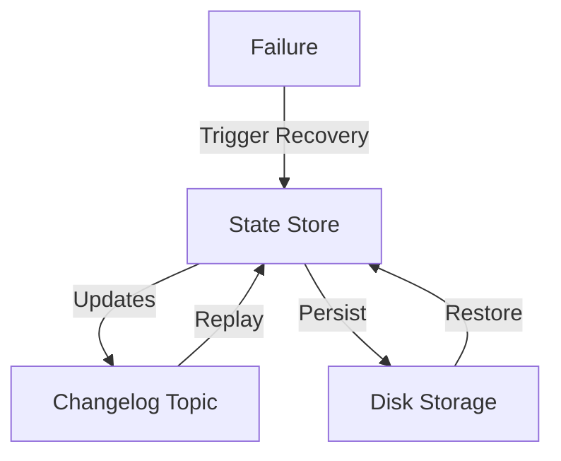

## 13.3.1 State Store Recovery

State store recovery is a critical aspect of ensuring fault tolerance and reliability in Kafka Streams applications. This section delves into the mechanisms that allow stateful processing to resume seamlessly after failures, focusing on the persistence and recovery of state stores. We will explore how state stores are backed up using changelog topics, the configuration of state store retention and recovery settings, and best practices for minimizing recovery time.

### Understanding State Stores in Kafka Streams

State stores in Kafka Streams are used to maintain the state of stream processing applications. They are essential for operations that require stateful processing, such as aggregations, joins, and windowed computations. State stores can be in-memory or persistent, with persistent stores being backed by disk storage to ensure durability.

#### Persistence and Backup of State Stores

State stores are persisted to disk to provide durability and fault tolerance. Kafka Streams uses RocksDB as the default storage engine for persistent state stores, which allows for efficient storage and retrieval of state data. The persistence mechanism ensures that state can be recovered in the event of a failure.

- **In-Memory vs. Persistent State Stores**: In-memory state stores offer faster access times but are volatile, meaning they lose data on failure. Persistent state stores, backed by disk storage, provide durability at the cost of slightly higher access times.

- **RocksDB**: This is the default storage engine for persistent state stores in Kafka Streams. It is a high-performance embedded database that provides efficient storage and retrieval of key-value pairs.

### Changelog Topics for State Recovery

Changelog topics play a crucial role in the recovery of state stores. They are Kafka topics that store the changes made to state stores, allowing for the reconstruction of state after a failure.

- **Changelog Topic Configuration**: Each state store has an associated changelog topic that captures all updates to the store. These topics are automatically created and managed by Kafka Streams.

- **Recovery Process**: In the event of a failure, Kafka Streams can reconstruct the state store by replaying the changelog topic. This ensures that stateful processing can resume without data loss.

#### Configuring State Store Retention and Recovery

Proper configuration of state store retention and recovery settings is essential for optimizing performance and minimizing recovery time.

- **Retention Settings**: Configure the retention period for changelog topics to balance between storage costs and recovery time. A longer retention period allows for more comprehensive recovery but requires more storage.

- **Recovery Settings**: Adjust recovery settings to optimize the speed and efficiency of state store recovery. This includes tuning parameters such as the number of threads used for recovery and the batch size for replaying changelog topics.

### Disk Storage and Performance Considerations

Disk storage plays a significant role in the performance of persistent state stores. Efficient management of disk resources is crucial for maintaining high performance and minimizing recovery time.

- **Disk I/O Optimization**: Optimize disk I/O operations to improve the performance of state store operations. This includes using SSDs for faster access times and configuring disk caching settings.

- **Storage Capacity Planning**: Plan for adequate storage capacity to accommodate the data stored in state stores and changelog topics. This includes considering the growth of data over time and the impact of retention settings.

### Best Practices for Minimizing Recovery Time

Minimizing recovery time is essential for maintaining the availability and reliability of Kafka Streams applications. Here are some best practices to achieve this:

- **Efficient Changelog Management**: Regularly monitor and manage changelog topics to ensure they are not growing excessively large, which can slow down recovery.

- **Parallel Recovery**: Utilize parallel recovery techniques to speed up the reconstruction of state stores. This involves configuring Kafka Streams to use multiple threads for replaying changelog topics.

- **Monitoring and Alerting**: Implement monitoring and alerting mechanisms to detect and respond to state store failures promptly. This includes setting up alerts for disk space usage and changelog topic growth.

### Code Examples

To illustrate the concepts discussed, let's look at some code examples in Java, Scala, Kotlin, and Clojure.

#### Java Example

```java
import org.apache.kafka.streams.KafkaStreams;
import org.apache.kafka.streams.StreamsBuilder;
import org.apache.kafka.streams.state.Stores;
import org.apache.kafka.streams.state.KeyValueStore;

public class StateStoreExample {
    public static void main(String[] args) {
        StreamsBuilder builder = new StreamsBuilder();

        // Create a persistent state store
        builder.addStateStore(Stores.keyValueStoreBuilder(
            Stores.persistentKeyValueStore("my-state-store"),
            Serdes.String(),
            Serdes.String()
        ));

        KafkaStreams streams = new KafkaStreams(builder.build(), getStreamsConfig());
        streams.start();
    }

    private static Properties getStreamsConfig() {
        Properties props = new Properties();
        props.put(StreamsConfig.APPLICATION_ID_CONFIG, "state-store-app");
        props.put(StreamsConfig.BOOTSTRAP_SERVERS_CONFIG, "localhost:9092");
        return props;
    }
}
```

#### Scala Example

```scala
import org.apache.kafka.streams.{KafkaStreams, StreamsBuilder}
import org.apache.kafka.streams.state.Stores
import org.apache.kafka.streams.scala.Serdes

object StateStoreExample extends App {
  val builder = new StreamsBuilder()

  // Create a persistent state store
  builder.addStateStore(Stores.keyValueStoreBuilder(
    Stores.persistentKeyValueStore("my-state-store"),
    Serdes.String,
    Serdes.String
  ))

  val streams = new KafkaStreams(builder.build(), getStreamsConfig)
  streams.start()

  def getStreamsConfig: Properties = {
    val props = new Properties()
    props.put(StreamsConfig.APPLICATION_ID_CONFIG, "state-store-app")
    props.put(StreamsConfig.BOOTSTRAP_SERVERS_CONFIG, "localhost:9092")
    props
  }
}
```

#### Kotlin Example

```kotlin
import org.apache.kafka.streams.KafkaStreams
import org.apache.kafka.streams.StreamsBuilder
import org.apache.kafka.streams.state.Stores
import org.apache.kafka.streams.state.KeyValueStore

fun main() {
    val builder = StreamsBuilder()

    // Create a persistent state store
    builder.addStateStore(
        Stores.keyValueStoreBuilder(
            Stores.persistentKeyValueStore("my-state-store"),
            Serdes.String(),
            Serdes.String()
        )
    )

    val streams = KafkaStreams(builder.build(), getStreamsConfig())
    streams.start()
}

fun getStreamsConfig(): Properties {
    val props = Properties()
    props[StreamsConfig.APPLICATION_ID_CONFIG] = "state-store-app"
    props[StreamsConfig.BOOTSTRAP_SERVERS_CONFIG] = "localhost:9092"
    return props
}
```

#### Clojure Example

```clojure
(ns state-store-example
  (:import [org.apache.kafka.streams KafkaStreams StreamsBuilder]
           [org.apache.kafka.streams.state Stores]
           [org.apache.kafka.streams.scala Serdes]))

(defn -main []
  (let [builder (StreamsBuilder.)]

    ;; Create a persistent state store
    (.addStateStore builder
      (Stores/keyValueStoreBuilder
        (Stores/persistentKeyValueStore "my-state-store")
        (Serdes/String)
        (Serdes/String)))

    (let [streams (KafkaStreams. (.build builder) (get-streams-config))]
      (.start streams))))

(defn get-streams-config []
  (doto (Properties.)
    (.put StreamsConfig/APPLICATION_ID_CONFIG "state-store-app")
    (.put StreamsConfig/BOOTSTRAP_SERVERS_CONFIG "localhost:9092")))
```

### Visualizing State Store Recovery

To better understand the state store recovery process, consider the following diagram illustrating the flow of data and recovery mechanisms in Kafka Streams:



**Diagram Explanation**: This diagram shows how updates to the state store are captured in the changelog topic. In the event of a failure, the changelog topic is replayed to restore the state store, ensuring continuity of stateful processing.

### Knowledge Check

To reinforce your understanding of state store recovery in Kafka Streams, consider the following questions:

1. What is the primary role of changelog topics in state store recovery?
2. How does RocksDB contribute to the persistence of state stores?
3. What are the key considerations for configuring state store retention settings?
4. How can disk I/O optimization improve the performance of state store operations?
5. What are some best practices for minimizing state store recovery time?

### Conclusion

State store recovery is a vital component of ensuring the fault tolerance and reliability of Kafka Streams applications. By understanding the mechanisms of persistence, changelog topics, and recovery configurations, you can optimize your applications for seamless stateful processing. Implementing best practices for disk storage and performance will further enhance the resilience of your Kafka Streams deployments.

For more information on related topics, refer to [13.3 Kafka Streams Fault Tolerance]( "Kafka Streams Fault Tolerance") and [5.3 Developing with Kafka Streams API]( "Developing with Kafka Streams API").

## Test Your Knowledge: State Store Recovery in Kafka Streams



### What is the primary function of changelog topics in Kafka Streams?

- [x] To store updates to state stores for recovery purposes.
- [ ] To manage consumer offsets.
- [ ] To handle producer acknowledgments.
- [ ] To balance load across brokers.

> **Explanation:** Changelog topics capture all updates to state stores, allowing for state recovery in case of failures.

### Which storage engine is used by default for persistent state stores in Kafka Streams?

- [x] RocksDB
- [ ] LevelDB
- [ ] HBase
- [ ] Cassandra

> **Explanation:** RocksDB is the default storage engine for persistent state stores in Kafka Streams, providing efficient storage and retrieval.

### How can you minimize recovery time for state stores?

- [x] By using parallel recovery techniques.
- [ ] By increasing the retention period of changelog topics.
- [ ] By reducing the number of state stores.
- [ ] By disabling changelog topics.

> **Explanation:** Parallel recovery techniques allow for faster reconstruction of state stores by utilizing multiple threads.

### What is a key consideration when configuring state store retention settings?

- [x] Balancing storage costs with recovery time.
- [ ] Ensuring all data is stored indefinitely.
- [ ] Using the smallest possible retention period.
- [ ] Disabling retention settings.

> **Explanation:** Retention settings should balance between storage costs and the ability to recover state efficiently.

### Which of the following is a best practice for managing disk storage for state stores?

- [x] Using SSDs for faster access times.
- [ ] Using HDDs to save costs.
- [ ] Disabling disk caching.
- [ ] Storing data in-memory only.

> **Explanation:** SSDs provide faster access times, improving the performance of state store operations.

### What role does RocksDB play in Kafka Streams?

- [x] It serves as the storage engine for persistent state stores.
- [ ] It manages consumer group offsets.
- [ ] It handles broker replication.
- [ ] It provides a GUI for monitoring.

> **Explanation:** RocksDB is the storage engine used for persistent state stores, ensuring durability and efficient data retrieval.

### How does Kafka Streams ensure state recovery after a failure?

- [x] By replaying changelog topics.
- [ ] By storing state in Zookeeper.
- [ ] By using a backup broker.
- [ ] By resetting all state stores.

> **Explanation:** Kafka Streams replays changelog topics to reconstruct state stores after a failure.

### What is the benefit of using persistent state stores over in-memory state stores?

- [x] They provide durability and data recovery after failures.
- [ ] They offer faster access times.
- [ ] They require less disk space.
- [ ] They eliminate the need for changelog topics.

> **Explanation:** Persistent state stores ensure data durability and recovery, unlike in-memory stores which lose data on failure.

### Which configuration setting is crucial for optimizing state store recovery?

- [x] The number of recovery threads.
- [ ] The size of the Kafka cluster.
- [ ] The number of consumer groups.
- [ ] The producer batch size.

> **Explanation:** Configuring the number of recovery threads can significantly impact the speed of state store recovery.

### True or False: Changelog topics are optional for state store recovery in Kafka Streams.

- [ ] True
- [x] False

> **Explanation:** Changelog topics are essential for state store recovery, as they store the updates needed to reconstruct state after a failure.


