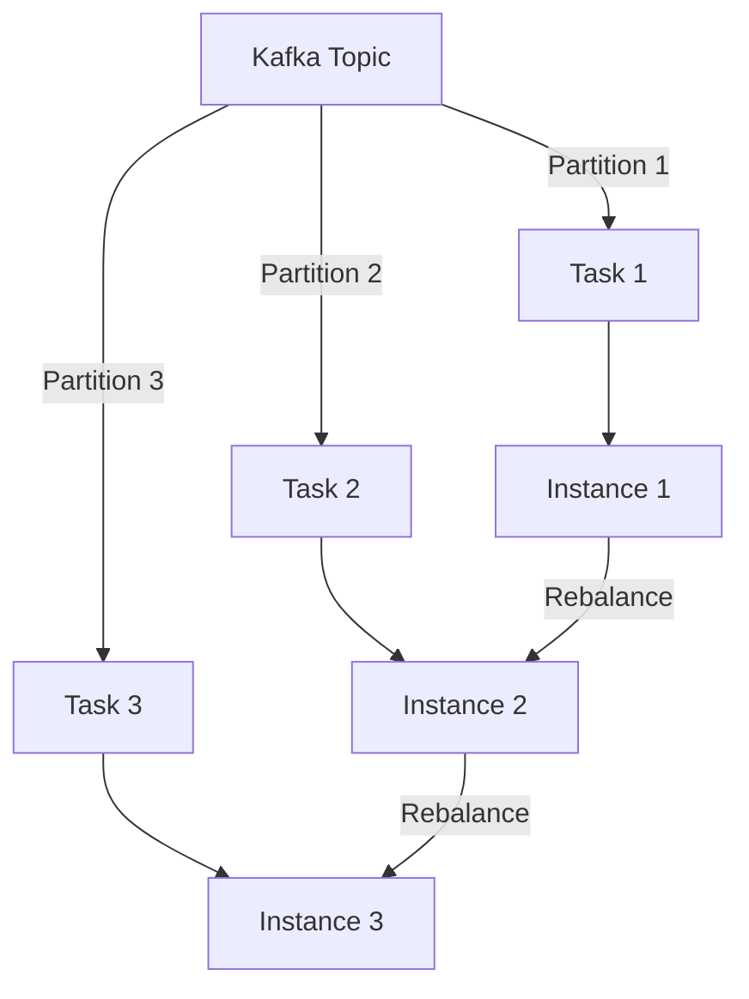

## 13.3.2 Scaling and Resilience

Scaling and resilience are critical aspects of building robust Kafka Streams applications. As data volumes grow and processing demands increase, it becomes essential to scale applications horizontally while ensuring they remain resilient to failures. This section delves into the intricacies of scaling Kafka Streams, focusing on task partitioning, state management, and deployment strategies in containerized environments.

### Understanding Kafka Streams Task Partitioning

Kafka Streams applications are inherently distributed and leverage Kafka's partitioning capabilities to parallelize processing. Each Kafka topic is divided into partitions, and Kafka Streams assigns a processing task to each partition. This task-based model allows for efficient scaling and fault tolerance.

#### Task Assignment and Rebalancing

- **Task Assignment**: Kafka Streams assigns tasks to instances based on the number of partitions. Each task processes data from a single partition, ensuring that the workload is evenly distributed across instances.
- **Rebalancing**: When instances are added or removed, Kafka Streams automatically rebalances tasks to maintain an even distribution. This process involves redistributing tasks among the available instances, which can impact state management and processing continuity.

#### Strategies for Horizontal Scaling

Scaling Kafka Streams applications involves adding or removing instances to handle varying workloads. Here are some strategies for effective scaling:

- **Scale Up**: Increase the number of instances to handle higher data volumes or processing demands. This involves deploying additional instances and allowing Kafka Streams to rebalance tasks.
- **Scale Down**: Reduce the number of instances during periods of low demand. Kafka Streams will rebalance tasks to ensure that the remaining instances handle the workload efficiently.

### Managing State During Scaling Events

State management is a crucial aspect of Kafka Streams applications, especially during scaling events. Kafka Streams uses state stores to maintain local state, which can be challenging to manage during task rebalancing.

#### State Store Management

- **State Store Types**: Kafka Streams supports in-memory and persistent state stores. Persistent state stores, such as RocksDB, provide durability and fault tolerance.
- **State Transfer**: During rebalancing, state stores may need to be transferred between instances. Kafka Streams uses changelogs to replicate state across instances, ensuring consistency and availability.

#### Handling State Transfers

- **Changelog Topics**: Kafka Streams writes state changes to changelog topics, which are used to restore state on new instances. This mechanism ensures that state is preserved during scaling events.
- **State Restoration**: When a task is reassigned to a new instance, Kafka Streams restores the state from the changelog topic. This process can be resource-intensive and may impact performance.

### Deploying Kafka Streams in Containerized Environments

Containerization offers a flexible and scalable deployment model for Kafka Streams applications. By using containers, you can easily manage and scale instances across different environments.

#### Containerization Best Practices

- **Use Docker**: Docker provides a lightweight and portable way to package Kafka Streams applications. Create Docker images with all necessary dependencies and configurations.
- **Orchestrate with Kubernetes**: Kubernetes automates the deployment, scaling, and management of containerized applications. Use Kubernetes to manage Kafka Streams instances and ensure high availability.

#### Load Balancing and Resource Utilization

- **Load Balancing**: Use Kubernetes services or ingress controllers to distribute traffic evenly across Kafka Streams instances. This ensures that no single instance becomes a bottleneck.
- **Resource Utilization**: Monitor resource usage and adjust instance configurations to optimize performance. Use Kubernetes resource limits and requests to manage CPU and memory allocation.

### Practical Applications and Real-World Scenarios

Scaling and resilience are essential for real-time data processing applications. Here are some practical scenarios where these concepts are applied:

- **Event-Driven Microservices**: Kafka Streams can be used to build event-driven microservices that scale dynamically based on demand. This approach ensures that services remain responsive and resilient.
- **Real-Time Analytics**: For applications that require real-time analytics, such as fraud detection or monitoring, scaling Kafka Streams ensures that data is processed quickly and accurately.

### Code Examples

To illustrate these concepts, let's explore code examples in Java, Scala, Kotlin, and Clojure.

#### Java Example

```java
import org.apache.kafka.streams.KafkaStreams;
import org.apache.kafka.streams.StreamsBuilder;
import org.apache.kafka.streams.StreamsConfig;
import org.apache.kafka.streams.kstream.KStream;

import java.util.Properties;

public class KafkaStreamsApp {
    public static void main(String[] args) {
        Properties props = new Properties();
        props.put(StreamsConfig.APPLICATION_ID_CONFIG, "streams-app");
        props.put(StreamsConfig.BOOTSTRAP_SERVERS_CONFIG, "localhost:9092");

        StreamsBuilder builder = new StreamsBuilder();
        KStream<String, String> stream = builder.stream("input-topic");
        stream.to("output-topic");

        KafkaStreams streams = new KafkaStreams(builder.build(), props);
        streams.start();

        Runtime.getRuntime().addShutdownHook(new Thread(streams::close));
    }
}
```

#### Scala Example

```scala
import org.apache.kafka.streams.{KafkaStreams, StreamsBuilder, StreamsConfig}
import org.apache.kafka.streams.kstream.KStream

import java.util.Properties

object KafkaStreamsApp extends App {
  val props = new Properties()
  props.put(StreamsConfig.APPLICATION_ID_CONFIG, "streams-app")
  props.put(StreamsConfig.BOOTSTRAP_SERVERS_CONFIG, "localhost:9092")

  val builder = new StreamsBuilder()
  val stream: KStream[String, String] = builder.stream("input-topic")
  stream.to("output-topic")

  val streams = new KafkaStreams(builder.build(), props)
  streams.start()

  sys.ShutdownHookThread {
    streams.close()
  }
}
```

#### Kotlin Example

```kotlin
import org.apache.kafka.streams.KafkaStreams
import org.apache.kafka.streams.StreamsBuilder
import org.apache.kafka.streams.StreamsConfig
import org.apache.kafka.streams.kstream.KStream

fun main() {
    val props = Properties()
    props[StreamsConfig.APPLICATION_ID_CONFIG] = "streams-app"
    props[StreamsConfig.BOOTSTRAP_SERVERS_CONFIG] = "localhost:9092"

    val builder = StreamsBuilder()
    val stream: KStream<String, String> = builder.stream("input-topic")
    stream.to("output-topic")

    val streams = KafkaStreams(builder.build(), props)
    streams.start()

    Runtime.getRuntime().addShutdownHook(Thread { streams.close() })
}
```

#### Clojure Example

```clojure
(ns kafka-streams-app
  (:import [org.apache.kafka.streams KafkaStreams StreamsBuilder StreamsConfig]
           [org.apache.kafka.streams.kstream KStream]))

(defn -main []
  (let [props (doto (java.util.Properties.)
                (.put StreamsConfig/APPLICATION_ID_CONFIG "streams-app")
                (.put StreamsConfig/BOOTSTRAP_SERVERS_CONFIG "localhost:9092"))
        builder (StreamsBuilder.)
        stream (.stream builder "input-topic")]
    (.to stream "output-topic")
    (let [streams (KafkaStreams. (.build builder) props)]
      (.start streams)
      (.addShutdownHook (Runtime/getRuntime) (Thread. #(.close streams))))))
```

### Visualizing Kafka Streams Scaling

To better understand the scaling process, let's visualize the task assignment and rebalancing in Kafka Streams.



**Diagram Caption**: This diagram illustrates the task assignment and rebalancing process in Kafka Streams. Each partition is assigned to a task, which is then distributed across instances. During rebalancing, tasks are reassigned to ensure even distribution.

### Key Considerations for Scaling and Resilience

- **Monitor Performance**: Use monitoring tools to track the performance of Kafka Streams applications. Identify bottlenecks and optimize resource allocation.
- **Plan for Failures**: Design applications to handle failures gracefully. Use state stores and changelogs to ensure data consistency and availability.
- **Optimize Resource Utilization**: Adjust instance configurations based on workload demands. Use container orchestration tools to automate scaling and resource management.

### Knowledge Check

To reinforce your understanding of scaling and resilience in Kafka Streams, consider the following questions:

- How does Kafka Streams assign tasks to instances?
- What strategies can be used to scale Kafka Streams applications?
- How are state stores managed during task rebalancing?
- What are the benefits of deploying Kafka Streams in containerized environments?

### Conclusion

Scaling and resilience are vital components of successful Kafka Streams applications. By understanding task partitioning, state management, and deployment strategies, you can build applications that scale efficiently and remain resilient to failures. As you continue to explore Kafka Streams, consider how these concepts can be applied to your own projects and use cases.

## Test Your Knowledge: Scaling and Resilience in Kafka Streams



### How does Kafka Streams assign tasks to instances?

- [x] Based on the number of partitions
- [ ] Randomly
- [ ] Based on instance capacity
- [ ] Based on data size

> **Explanation:** Kafka Streams assigns tasks to instances based on the number of partitions, ensuring an even distribution of workload.

### What is the primary benefit of using changelog topics in Kafka Streams?

- [x] To replicate state across instances
- [ ] To improve processing speed
- [ ] To reduce network traffic
- [ ] To enhance security

> **Explanation:** Changelog topics are used to replicate state across instances, ensuring consistency and availability during scaling events.

### Which tool is recommended for orchestrating Kafka Streams in containerized environments?

- [x] Kubernetes
- [ ] Docker Compose
- [ ] Ansible
- [ ] Terraform

> **Explanation:** Kubernetes is recommended for orchestrating Kafka Streams in containerized environments due to its automation capabilities.

### What is a key consideration when scaling down Kafka Streams applications?

- [x] Ensuring tasks are evenly distributed
- [ ] Increasing the number of partitions
- [ ] Reducing state store size
- [ ] Disabling monitoring

> **Explanation:** When scaling down, it's important to ensure tasks are evenly distributed among the remaining instances.

### How can resource utilization be optimized in Kafka Streams applications?

- [x] By adjusting instance configurations
- [ ] By increasing partition count
- [ ] By disabling state stores
- [ ] By reducing task count

> **Explanation:** Adjusting instance configurations based on workload demands helps optimize resource utilization.

### What is the role of state stores in Kafka Streams?

- [x] To maintain local state
- [ ] To increase processing speed
- [ ] To manage network traffic
- [ ] To enhance security

> **Explanation:** State stores maintain local state, which is crucial for processing tasks that require stateful operations.

### How does Kafka Streams handle task rebalancing?

- [x] By redistributing tasks among instances
- [ ] By increasing partition count
- [ ] By reducing state store size
- [ ] By disabling monitoring

> **Explanation:** Kafka Streams handles task rebalancing by redistributing tasks among instances to maintain an even workload distribution.

### What is a benefit of deploying Kafka Streams in containerized environments?

- [x] Flexibility and scalability
- [ ] Increased processing speed
- [ ] Reduced network traffic
- [ ] Enhanced security

> **Explanation:** Containerized environments offer flexibility and scalability, making it easier to manage and scale Kafka Streams applications.

### What is the purpose of using Docker for Kafka Streams deployment?

- [x] To package applications with dependencies
- [ ] To increase processing speed
- [ ] To reduce network traffic
- [ ] To enhance security

> **Explanation:** Docker provides a lightweight and portable way to package Kafka Streams applications with all necessary dependencies.

### True or False: Kafka Streams automatically handles state restoration during scaling events.

- [x] True
- [ ] False

> **Explanation:** Kafka Streams automatically handles state restoration during scaling events using changelog topics to ensure consistency.



---
