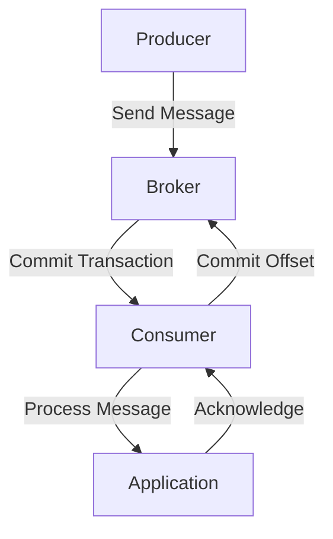

## 13.4 Ensuring Message Delivery Guarantees

In the realm of distributed systems, ensuring reliable message delivery is paramount. Apache Kafka, a cornerstone of modern data architectures, offers robust mechanisms to achieve exactly-once semantics, ensuring that messages are neither lost nor duplicated. This section delves into the intricacies of achieving end-to-end exactly-once processing in Kafka, focusing on the challenges, solutions, and best practices for implementing reliable message delivery.

### Challenges of Achieving Exactly-Once Semantics

Achieving exactly-once semantics in distributed systems is inherently challenging due to the complexities of network failures, system crashes, and message duplication. In Kafka, the primary challenges include:

- **Network Partitions**: Temporary network failures can lead to message duplication or loss.
- **Producer Failures**: A producer might fail after sending a message but before receiving an acknowledgment, leading to potential duplication.
- **Consumer Failures**: Consumers may process a message but fail before committing the offset, resulting in reprocessing.
- **System Crashes**: Unexpected system crashes can disrupt the message flow, leading to inconsistencies.

### Kafka's Transactional APIs

Kafka's transactional APIs are designed to address these challenges by providing a framework for exactly-once processing. These APIs allow producers to send messages to multiple topics and partitions atomically, ensuring that either all messages are committed or none are.

#### Key Concepts

- **Producer Transactions**: Enable atomic writes across multiple partitions and topics.
- **Idempotent Producers**: Ensure that retries do not result in duplicate messages.
- **Transactional Consumers**: Work in tandem with producers to ensure that messages are processed exactly once.

#### Implementing Transactions

To leverage Kafka's transactional capabilities, both producers and consumers must be configured appropriately.

##### Configuring Producers for Transactions

Producers must be configured to support transactions by setting the `transactional.id` property. This identifier is used to track the transaction state across sessions.

- **Java Example**:

    ```java
    Properties props = new Properties();
    props.put("bootstrap.servers", "localhost:9092");
    props.put("key.serializer", "org.apache.kafka.common.serialization.StringSerializer");
    props.put("value.serializer", "org.apache.kafka.common.serialization.StringSerializer");
    props.put("transactional.id", "my-transactional-id");

    KafkaProducer<String, String> producer = new KafkaProducer<>(props);
    producer.initTransactions();

    try {
        producer.beginTransaction();
        producer.send(new ProducerRecord<>("my-topic", "key", "value"));
        producer.commitTransaction();
    } catch (ProducerFencedException | OutOfOrderSequenceException | AuthorizationException e) {
        // Fatal errors, cannot recover
        producer.close();
    } catch (KafkaException e) {
        // Abort transaction and retry
        producer.abortTransaction();
    }
    ```

- **Scala Example**:

    ```scala
    import org.apache.kafka.clients.producer.{KafkaProducer, ProducerRecord}
    import java.util.Properties

    val props = new Properties()
    props.put("bootstrap.servers", "localhost:9092")
    props.put("key.serializer", "org.apache.kafka.common.serialization.StringSerializer")
    props.put("value.serializer", "org.apache.kafka.common.serialization.StringSerializer")
    props.put("transactional.id", "my-transactional-id")

    val producer = new KafkaProducer[String, String](props)
    producer.initTransactions()

    try {
      producer.beginTransaction()
      producer.send(new ProducerRecord[String, String]("my-topic", "key", "value"))
      producer.commitTransaction()
    } catch {
      case e: Exception =>
        producer.abortTransaction()
    }
    ```

- **Kotlin Example**:

    ```kotlin
    import org.apache.kafka.clients.producer.KafkaProducer
    import org.apache.kafka.clients.producer.ProducerRecord
    import java.util.Properties

    val props = Properties().apply {
        put("bootstrap.servers", "localhost:9092")
        put("key.serializer", "org.apache.kafka.common.serialization.StringSerializer")
        put("value.serializer", "org.apache.kafka.common.serialization.StringSerializer")
        put("transactional.id", "my-transactional-id")
    }

    val producer = KafkaProducer<String, String>(props)
    producer.initTransactions()

    try {
        producer.beginTransaction()
        producer.send(ProducerRecord("my-topic", "key", "value"))
        producer.commitTransaction()
    } catch (e: Exception) {
        producer.abortTransaction()
    }
    ```

- **Clojure Example**:

    ```clojure
    (import '[org.apache.kafka.clients.producer KafkaProducer ProducerRecord]
            '[java.util Properties])

    (def props (doto (Properties.)
                 (.put "bootstrap.servers" "localhost:9092")
                 (.put "key.serializer" "org.apache.kafka.common.serialization.StringSerializer")
                 (.put "value.serializer" "org.apache.kafka.common.serialization.StringSerializer")
                 (.put "transactional.id" "my-transactional-id")))

    (def producer (KafkaProducer. props))
    (.initTransactions producer)

    (try
      (.beginTransaction producer)
      (.send producer (ProducerRecord. "my-topic" "key" "value"))
      (.commitTransaction producer)
      (catch Exception e
        (.abortTransaction producer)))
    ```

##### Configuring Consumers for Transactions

Transactional consumers must be configured to read committed messages only. This ensures that consumers do not process messages from aborted transactions.

- **Java Example**:

    ```java
    Properties props = new Properties();
    props.put("bootstrap.servers", "localhost:9092");
    props.put("group.id", "my-group");
    props.put("enable.auto.commit", "false");
    props.put("isolation.level", "read_committed");

    KafkaConsumer<String, String> consumer = new KafkaConsumer<>(props);
    consumer.subscribe(Collections.singletonList("my-topic"));

    while (true) {
        ConsumerRecords<String, String> records = consumer.poll(Duration.ofMillis(100));
        for (ConsumerRecord<String, String> record : records) {
            // Process record
        }
        consumer.commitSync();
    }
    ```

- **Scala Example**:

    ```scala
    import org.apache.kafka.clients.consumer.{KafkaConsumer, ConsumerRecords}
    import java.util.{Collections, Properties}
    import scala.collection.JavaConverters._

    val props = new Properties()
    props.put("bootstrap.servers", "localhost:9092")
    props.put("group.id", "my-group")
    props.put("enable.auto.commit", "false")
    props.put("isolation.level", "read_committed")

    val consumer = new KafkaConsumer[String, String](props)
    consumer.subscribe(Collections.singletonList("my-topic"))

    while (true) {
      val records: ConsumerRecords[String, String] = consumer.poll(java.time.Duration.ofMillis(100))
      for (record <- records.asScala) {
        // Process record
      }
      consumer.commitSync()
    }
    ```

- **Kotlin Example**:

    ```kotlin
    import org.apache.kafka.clients.consumer.KafkaConsumer
    import org.apache.kafka.clients.consumer.ConsumerRecords
    import java.util.Properties
    import java.time.Duration

    val props = Properties().apply {
        put("bootstrap.servers", "localhost:9092")
        put("group.id", "my-group")
        put("enable.auto.commit", "false")
        put("isolation.level", "read_committed")
    }

    val consumer = KafkaConsumer<String, String>(props)
    consumer.subscribe(listOf("my-topic"))

    while (true) {
        val records: ConsumerRecords<String, String> = consumer.poll(Duration.ofMillis(100))
        for (record in records) {
            // Process record
        }
        consumer.commitSync()
    }
    ```

- **Clojure Example**:

    ```clojure
    (import '[org.apache.kafka.clients.consumer KafkaConsumer ConsumerRecords]
            '[java.util Properties Collections])

    (def props (doto (Properties.)
                 (.put "bootstrap.servers" "localhost:9092")
                 (.put "group.id" "my-group")
                 (.put "enable.auto.commit" "false")
                 (.put "isolation.level" "read_committed")))

    (def consumer (KafkaConsumer. props))
    (.subscribe consumer (Collections/singletonList "my-topic"))

    (while true
      (let [records (.poll consumer (java.time.Duration/ofMillis 100))]
        (doseq [record records]
          ;; Process record
          ))
      (.commitSync consumer))
    ```

### Idempotent Handling of Messages

Idempotency is crucial for ensuring that message processing is consistent and reliable. An idempotent operation is one that can be applied multiple times without changing the result beyond the initial application. In Kafka, idempotency can be achieved through:

- **Idempotent Producers**: Kafka's idempotent producer ensures that messages are not duplicated even if retries occur. This is achieved by setting the `enable.idempotence` property to `true`.

- **Idempotent Consumers**: Consumers should be designed to handle duplicate messages gracefully. This can be achieved by maintaining a state or using unique identifiers to track processed messages.

### Best Practices for End-to-End Reliability

To ensure end-to-end reliability in Kafka, consider the following best practices:

1. **Use Transactions**: Leverage Kafka's transactional APIs to ensure atomic writes and reads.
2. **Enable Idempotence**: Configure producers to be idempotent to prevent message duplication.
3. **Read Committed Messages**: Configure consumers to read only committed messages to avoid processing uncommitted or aborted transactions.
4. **Monitor and Alert**: Implement monitoring and alerting to detect and respond to failures promptly.
5. **Test for Failures**: Regularly test your system for failure scenarios to ensure resilience and reliability.
6. **Implement Retries**: Use retries with backoff strategies to handle transient failures gracefully.

### Visualizing Kafka's Exactly-Once Processing

To better understand Kafka's exactly-once processing, consider the following diagram illustrating the flow of messages through producers, brokers, and consumers:



**Diagram Description**: This diagram illustrates the flow of messages in Kafka's exactly-once processing. The producer sends a message to the broker, which commits the transaction. The consumer then processes the message and acknowledges it, committing the offset back to the broker.

### Real-World Scenarios

In real-world applications, exactly-once processing is crucial for scenarios such as:

- **Financial Transactions**: Ensuring that each transaction is processed exactly once to prevent duplicate charges or missed payments.
- **Order Processing**: Guaranteeing that each order is processed once to avoid duplicate shipments or missed orders.
- **Data Synchronization**: Ensuring that data is synchronized across systems without duplication or loss.

### Related Patterns

- **[13.1 Handling Producer Failures]( "Handling Producer Failures")**: Discusses techniques for handling producer failures to ensure message reliability.
- **[13.2 Dealing with Consumer Failures]( "Dealing with Consumer Failures")**: Explores strategies for managing consumer failures to maintain message consistency.
- **[13.3 Kafka Streams Fault Tolerance]( "Kafka Streams Fault Tolerance")**: Examines fault tolerance mechanisms in Kafka Streams for reliable stream processing.

### Knowledge Check

To reinforce your understanding of ensuring message delivery guarantees in Kafka, consider the following questions and exercises.

## Test Your Knowledge: Ensuring Message Delivery Guarantees in Kafka



### What is the primary challenge of achieving exactly-once semantics in distributed systems?

- [x] Network partitions and system crashes
- [ ] High latency
- [ ] Limited storage capacity
- [ ] Lack of monitoring tools

> **Explanation:** Network partitions and system crashes are significant challenges in achieving exactly-once semantics, as they can lead to message duplication or loss.

### Which Kafka feature allows atomic writes across multiple partitions and topics?

- [x] Producer Transactions
- [ ] Consumer Groups
- [ ] Log Compaction
- [ ] Schema Registry

> **Explanation:** Producer Transactions in Kafka enable atomic writes across multiple partitions and topics, ensuring exactly-once processing.

### How can consumers ensure they only process committed messages?

- [x] By setting the isolation level to "read_committed"
- [ ] By enabling auto-commit
- [ ] By using a single consumer group
- [ ] By increasing the poll interval

> **Explanation:** Setting the isolation level to "read_committed" ensures that consumers only process messages from committed transactions.

### What property should be set to enable idempotent producers in Kafka?

- [x] enable.idempotence
- [ ] transactional.id
- [ ] auto.commit.interval.ms
- [ ] fetch.min.bytes

> **Explanation:** The `enable.idempotence` property ensures that producers are idempotent, preventing message duplication.

### Which of the following is a best practice for ensuring end-to-end reliability in Kafka?

- [x] Use transactions and enable idempotence
- [ ] Increase the number of partitions
- [x] Monitor and alert on failures
- [ ] Disable retries

> **Explanation:** Using transactions, enabling idempotence, and monitoring failures are best practices for ensuring end-to-end reliability in Kafka.

### What is the role of a transactional consumer in Kafka?

- [x] To read only committed messages
- [ ] To increase throughput
- [ ] To manage consumer groups
- [ ] To handle schema evolution

> **Explanation:** Transactional consumers are configured to read only committed messages, ensuring exactly-once processing.

### Which scenario is an example of exactly-once processing in real-world applications?

- [x] Financial transactions
- [ ] Log aggregation
- [x] Order processing
- [ ] Data archiving

> **Explanation:** Exactly-once processing is crucial for financial transactions and order processing to prevent duplicates and ensure consistency.

### What is the purpose of the `transactional.id` property in Kafka producers?

- [x] To track the transaction state across sessions
- [ ] To enable auto-commit
- [ ] To increase message throughput
- [ ] To configure the consumer group

> **Explanation:** The `transactional.id` property is used to track the transaction state across sessions, enabling transactional processing.

### How can consumers handle duplicate messages gracefully?

- [x] By maintaining a state or using unique identifiers
- [ ] By increasing the poll interval
- [ ] By using multiple consumer groups
- [ ] By enabling auto-commit

> **Explanation:** Consumers can handle duplicate messages by maintaining a state or using unique identifiers to track processed messages.

### True or False: Kafka's exactly-once processing guarantees that messages are never lost or duplicated.

- [x] True
- [ ] False

> **Explanation:** Kafka's exactly-once processing ensures that messages are neither lost nor duplicated, providing reliable message delivery.



By understanding and implementing these techniques, you can ensure reliable message delivery in your Kafka-based systems, enhancing the consistency and reliability of your distributed applications.
