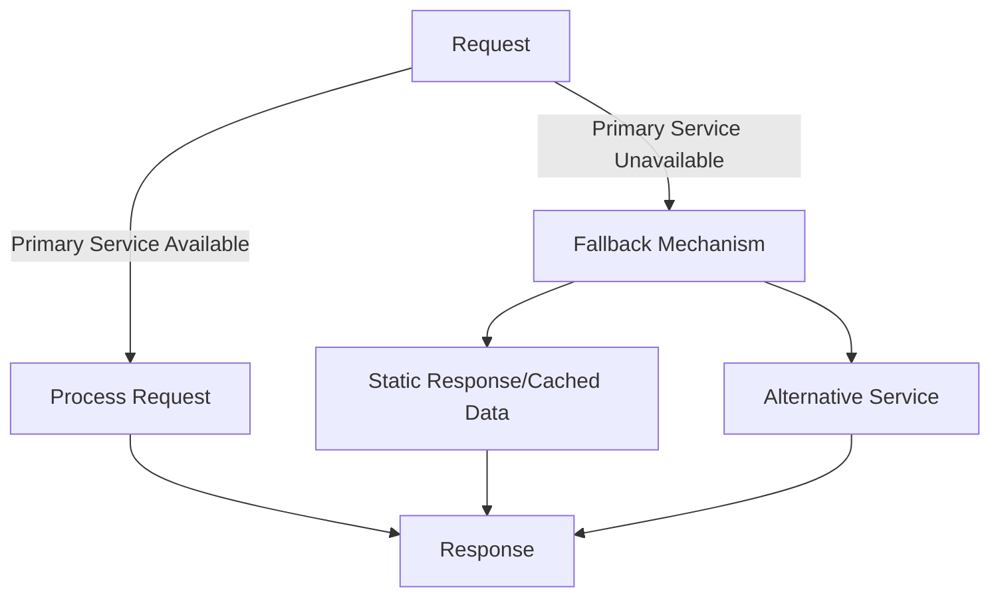

## 13.5.2 Fallback and Recovery Mechanisms

In the realm of distributed systems and real-time data processing, ensuring that applications can gracefully handle failures is paramount. Fallback and recovery mechanisms are critical components of a robust fault-tolerant architecture. This section delves into the strategies for implementing effective fallback mechanisms in Apache Kafka, ensuring that applications can continue to operate in a degraded mode rather than failing completely.

### Understanding Fallback Mechanisms

Fallback mechanisms are strategies employed to maintain system functionality when a component fails. They allow applications to provide alternative responses or actions, ensuring continuity of service. In Apache Kafka, fallback mechanisms can be crucial for maintaining data flow and processing integrity.

#### Types of Fallbacks

1. **Static Responses**: These are predefined responses returned when a failure is detected. They are useful when the system can operate with default or placeholder data.

2. **Cached Data**: Utilizing previously cached data can be an effective fallback strategy, especially when real-time data is temporarily unavailable.

3. **Graceful Degradation**: This involves reducing the functionality of the application while maintaining core operations, allowing users to continue using the system with limited features.

4. **Alternative Service Invocation**: Redirecting requests to an alternative service or backup system can ensure continuity when the primary service is unavailable.

### Detecting Failures and Triggering Fallbacks

To implement effective fallback mechanisms, it is essential to detect failures promptly and trigger appropriate fallbacks. This involves monitoring system health and performance metrics, and employing techniques such as:

- **Circuit Breaker Patterns**: These patterns help in detecting failures and preventing the system from making repeated requests to a failing service. When a failure is detected, the circuit breaker trips, and fallback logic is executed.

- **Health Checks and Heartbeats**: Regular health checks and heartbeat signals can help in identifying component failures and triggering fallbacks.

- **Timeouts and Retries**: Implementing timeouts and retries can help in detecting unresponsive components and initiating fallback mechanisms.

### Implementing Fallback Mechanisms in Apache Kafka

Let's explore how to implement fallback mechanisms in Apache Kafka using code examples in Java, Scala, Kotlin, and Clojure.

#### Java Example

```java
import org.apache.kafka.clients.consumer.ConsumerRecord;
import org.apache.kafka.clients.consumer.KafkaConsumer;
import org.apache.kafka.clients.producer.KafkaProducer;
import org.apache.kafka.clients.producer.ProducerRecord;

import java.util.Collections;
import java.util.Properties;

public class FallbackExample {

    private static final String TOPIC = "example-topic";
    private static final String FALLBACK_TOPIC = "fallback-topic";

    public static void main(String[] args) {
        Properties consumerProps = new Properties();
        consumerProps.put("bootstrap.servers", "localhost:9092");
        consumerProps.put("group.id", "example-group");
        consumerProps.put("key.deserializer", "org.apache.kafka.common.serialization.StringDeserializer");
        consumerProps.put("value.deserializer", "org.apache.kafka.common.serialization.StringDeserializer");

        KafkaConsumer<String, String> consumer = new KafkaConsumer<>(consumerProps);
        consumer.subscribe(Collections.singletonList(TOPIC));

        Properties producerProps = new Properties();
        producerProps.put("bootstrap.servers", "localhost:9092");
        producerProps.put("key.serializer", "org.apache.kafka.common.serialization.StringSerializer");
        producerProps.put("value.serializer", "org.apache.kafka.common.serialization.StringSerializer");

        KafkaProducer<String, String> producer = new KafkaProducer<>(producerProps);

        while (true) {
            for (ConsumerRecord<String, String> record : consumer.poll(100)) {
                try {
                    // Process the record
                    processRecord(record);
                } catch (Exception e) {
                    // Fallback to alternative topic
                    producer.send(new ProducerRecord<>(FALLBACK_TOPIC, record.key(), record.value()));
                }
            }
        }
    }

    private static void processRecord(ConsumerRecord<String, String> record) throws Exception {
        // Simulate processing logic
        if (record.value().contains("fail")) {
            throw new Exception("Processing failed");
        }
        System.out.println("Processed record: " + record.value());
    }
}
```

#### Scala Example

```scala
import org.apache.kafka.clients.consumer.{ConsumerRecord, KafkaConsumer}
import org.apache.kafka.clients.producer.{KafkaProducer, ProducerRecord}

import java.util.Properties
import scala.collection.JavaConverters._

object FallbackExample {

  val TOPIC = "example-topic"
  val FALLBACK_TOPIC = "fallback-topic"

  def main(args: Array[String]): Unit = {
    val consumerProps = new Properties()
    consumerProps.put("bootstrap.servers", "localhost:9092")
    consumerProps.put("group.id", "example-group")
    consumerProps.put("key.deserializer", "org.apache.kafka.common.serialization.StringDeserializer")
    consumerProps.put("value.deserializer", "org.apache.kafka.common.serialization.StringDeserializer")

    val consumer = new KafkaConsumer[String, String](consumerProps)
    consumer.subscribe(java.util.Collections.singletonList(TOPIC))

    val producerProps = new Properties()
    producerProps.put("bootstrap.servers", "localhost:9092")
    producerProps.put("key.serializer", "org.apache.kafka.common.serialization.StringSerializer")
    producerProps.put("value.serializer", "org.apache.kafka.common.serialization.StringSerializer")

    val producer = new KafkaProducer[String, String](producerProps)

    while (true) {
      val records = consumer.poll(100).asScala
      for (record <- records) {
        try {
          processRecord(record)
        } catch {
          case e: Exception =>
            producer.send(new ProducerRecord[String, String](FALLBACK_TOPIC, record.key(), record.value()))
        }
      }
    }
  }

  def processRecord(record: ConsumerRecord[String, String]): Unit = {
    if (record.value().contains("fail")) {
      throw new Exception("Processing failed")
    }
    println(s"Processed record: ${record.value()}")
  }
}
```

#### Kotlin Example

```kotlin
import org.apache.kafka.clients.consumer.ConsumerRecord
import org.apache.kafka.clients.consumer.KafkaConsumer
import org.apache.kafka.clients.producer.KafkaProducer
import org.apache.kafka.clients.producer.ProducerRecord
import java.util.*

fun main() {
    val TOPIC = "example-topic"
    val FALLBACK_TOPIC = "fallback-topic"

    val consumerProps = Properties().apply {
        put("bootstrap.servers", "localhost:9092")
        put("group.id", "example-group")
        put("key.deserializer", "org.apache.kafka.common.serialization.StringDeserializer")
        put("value.deserializer", "org.apache.kafka.common.serialization.StringDeserializer")
    }

    val consumer = KafkaConsumer<String, String>(consumerProps)
    consumer.subscribe(listOf(TOPIC))

    val producerProps = Properties().apply {
        put("bootstrap.servers", "localhost:9092")
        put("key.serializer", "org.apache.kafka.common.serialization.StringSerializer")
        put("value.serializer", "org.apache.kafka.common.serialization.StringSerializer")
    }

    val producer = KafkaProducer<String, String>(producerProps)

    while (true) {
        val records = consumer.poll(100)
        for (record in records) {
            try {
                processRecord(record)
            } catch (e: Exception) {
                producer.send(ProducerRecord(FALLBACK_TOPIC, record.key(), record.value()))
            }
        }
    }
}

fun processRecord(record: ConsumerRecord<String, String>) {
    if (record.value().contains("fail")) {
        throw Exception("Processing failed")
    }
    println("Processed record: ${record.value()}")
}
```

#### Clojure Example

```clojure
(ns kafka-fallback-example
  (:import [org.apache.kafka.clients.consumer KafkaConsumer ConsumerRecord]
           [org.apache.kafka.clients.producer KafkaProducer ProducerRecord]
           [java.util Properties Collections]))

(defn process-record [record]
  (if (.contains (.value record) "fail")
    (throw (Exception. "Processing failed"))
    (println "Processed record:" (.value record))))

(defn -main []
  (let [topic "example-topic"
        fallback-topic "fallback-topic"
        consumer-props (doto (Properties.)
                         (.put "bootstrap.servers" "localhost:9092")
                         (.put "group.id" "example-group")
                         (.put "key.deserializer" "org.apache.kafka.common.serialization.StringDeserializer")
                         (.put "value.deserializer" "org.apache.kafka.common.serialization.StringDeserializer"))
        consumer (KafkaConsumer. consumer-props)
        _ (.subscribe consumer (Collections/singletonList topic))
        producer-props (doto (Properties.)
                         (.put "bootstrap.servers" "localhost:9092")
                         (.put "key.serializer" "org.apache.kafka.common.serialization.StringSerializer")
                         (.put "value.serializer" "org.apache.kafka.common.serialization.StringSerializer"))
        producer (KafkaProducer. producer-props)]
    (while true
      (doseq [record (.poll consumer 100)]
        (try
          (process-record record)
          (catch Exception e
            (.send producer (ProducerRecord. fallback-topic (.key record) (.value record)))))))))
```

### Implications for Data Consistency and User Experience

Implementing fallback mechanisms can have significant implications for data consistency and user experience. While fallbacks ensure continuity of service, they may lead to temporary inconsistencies or degraded user experiences. It is crucial to:

- **Balance Consistency and Availability**: Determine the acceptable trade-offs between data consistency and system availability. In some cases, eventual consistency may be acceptable to maintain high availability.

- **Communicate with Users**: Inform users about the degraded state of the system and any limitations in functionality. Clear communication can help manage user expectations and maintain trust.

- **Monitor and Recover**: Continuously monitor the system to detect when the primary service is restored, and switch back from fallback mechanisms to normal operations.

### Visualizing Fallback and Recovery Mechanisms

To better understand the flow of fallback and recovery mechanisms, consider the following diagram:



**Caption**: This diagram illustrates the decision flow for handling requests with fallback mechanisms. When the primary service is unavailable, the system triggers fallback mechanisms, such as static responses, cached data, or alternative services, to ensure continuity.

### Best Practices for Implementing Fallback Mechanisms

1. **Design for Failure**: Assume that failures will occur and design your system to handle them gracefully.

2. **Test Fallback Scenarios**: Regularly test fallback mechanisms to ensure they function correctly and provide the desired level of service.

3. **Monitor System Health**: Implement comprehensive monitoring to detect failures promptly and trigger fallbacks when necessary.

4. **Optimize for Performance**: Ensure that fallback mechanisms do not introduce significant latency or overhead, which could degrade user experience.

5. **Review and Iterate**: Continuously review and improve fallback strategies based on system performance and user feedback.

### Conclusion

Fallback and recovery mechanisms are essential for building resilient and fault-tolerant systems with Apache Kafka. By implementing effective fallback strategies, you can ensure that your applications continue to operate even in the face of failures, maintaining service continuity and user satisfaction.

---

## Test Your Knowledge: Advanced Fallback and Recovery Mechanisms in Apache Kafka



### What is a primary benefit of implementing fallback mechanisms in distributed systems?

- [x] Ensures continuity of service during failures
- [ ] Increases system complexity
- [ ] Reduces system performance
- [ ] Eliminates the need for monitoring

> **Explanation:** Fallback mechanisms ensure continuity of service by providing alternative responses or actions when a component fails.

### Which of the following is NOT a type of fallback mechanism?

- [x] Data Encryption
- [ ] Static Responses
- [ ] Cached Data
- [ ] Alternative Service Invocation

> **Explanation:** Data encryption is a security measure, not a fallback mechanism.

### How do circuit breaker patterns contribute to fallback mechanisms?

- [x] They detect failures and prevent repeated requests to failing services
- [ ] They encrypt data in transit
- [ ] They increase system latency
- [ ] They eliminate the need for retries

> **Explanation:** Circuit breaker patterns detect failures and prevent the system from making repeated requests to a failing service, triggering fallback logic instead.

### What is a potential drawback of using cached data as a fallback mechanism?

- [x] It may lead to temporary data inconsistencies
- [ ] It increases system complexity
- [ ] It requires additional hardware
- [ ] It eliminates the need for monitoring

> **Explanation:** Cached data may lead to temporary data inconsistencies if the cached information is outdated.

### Which programming language is NOT used in the provided code examples?

- [x] Python
- [ ] Java
- [ ] Scala
- [ ] Kotlin

> **Explanation:** The provided code examples include Java, Scala, Kotlin, and Clojure, but not Python.

### What should be communicated to users when fallback mechanisms are triggered?

- [x] The degraded state of the system and any limitations in functionality
- [ ] The internal architecture of the system
- [ ] The source code of the application
- [ ] The personal data of other users

> **Explanation:** Users should be informed about the degraded state of the system and any limitations in functionality to manage expectations and maintain trust.

### What is the role of health checks in fallback mechanisms?

- [x] They help identify component failures and trigger fallbacks
- [ ] They encrypt data at rest
- [ ] They increase system latency
- [ ] They eliminate the need for retries

> **Explanation:** Health checks help identify component failures and trigger fallback mechanisms when necessary.

### What is a key consideration when implementing fallback mechanisms?

- [x] Balancing data consistency and system availability
- [ ] Increasing system complexity
- [ ] Reducing system performance
- [ ] Eliminating the need for monitoring

> **Explanation:** Balancing data consistency and system availability is crucial when implementing fallback mechanisms to ensure service continuity without compromising data integrity.

### Which of the following is a best practice for implementing fallback mechanisms?

- [x] Regularly test fallback scenarios
- [ ] Increase system complexity
- [ ] Reduce monitoring efforts
- [ ] Eliminate retries

> **Explanation:** Regularly testing fallback scenarios ensures they function correctly and provide the desired level of service.

### True or False: Fallback mechanisms can completely eliminate the need for monitoring in distributed systems.

- [ ] True
- [x] False

> **Explanation:** Fallback mechanisms do not eliminate the need for monitoring; comprehensive monitoring is essential to detect failures and trigger fallbacks effectively.



---

By implementing these strategies and understanding the implications of fallback mechanisms, you can enhance the resilience and reliability of your Apache Kafka applications.
