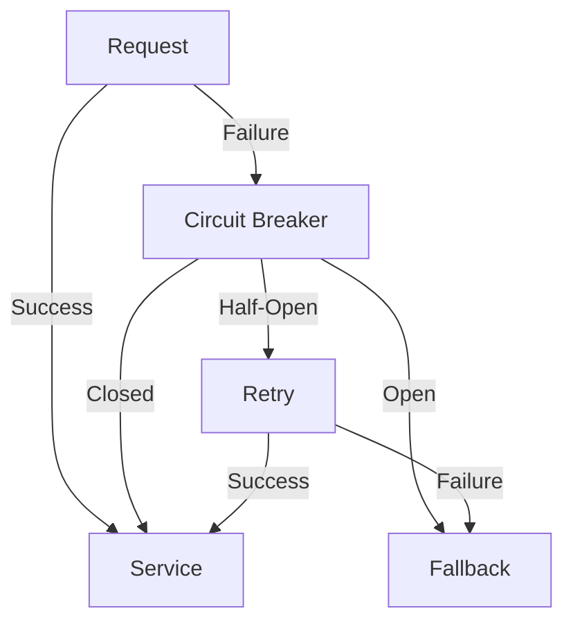

## 13.5 Implementing Circuit Breaker Patterns

### Introduction

In the realm of distributed systems, ensuring fault tolerance and reliability is paramount. The circuit breaker pattern is a critical design pattern that helps protect services from overload and cascading failures, thereby enhancing system robustness. This section delves into the concept of circuit breakers, their implementation in Kafka applications, and strategies for effective monitoring and adjustment.

### Understanding Circuit Breakers

#### Intent

The circuit breaker pattern is designed to prevent a system from repeatedly attempting an operation that is likely to fail. It acts as a safety valve, allowing systems to fail gracefully and recover without causing further damage.

#### Motivation

In a distributed system, services often depend on each other. If one service fails, it can lead to a chain reaction of failures. Circuit breakers help mitigate this risk by temporarily halting requests to a failing service, allowing it time to recover.

#### Applicability

Circuit breakers are applicable in scenarios where:

- Services are prone to transient failures.
- There is a risk of cascading failures.
- Systems require high availability and resilience.

### Structure

#### Diagram



**Caption**: The circuit breaker pattern transitions between closed, open, and half-open states to manage service requests.

### Participants

- **Request**: The initial call to a service.
- **Service**: The target service that processes requests.
- **Circuit Breaker**: Monitors the success and failure of requests.
- **Fallback**: An alternative action taken when the circuit breaker is open.

### Collaborations

- **Request to Service**: In a closed state, requests are sent directly to the service.
- **Circuit Breaker to Fallback**: In an open state, requests are redirected to a fallback mechanism.
- **Retry Mechanism**: In a half-open state, the circuit breaker tests the service with a limited number of requests.

### Consequences

- **Benefits**: Prevents system overload, allows for graceful degradation, and improves resilience.
- **Drawbacks**: May introduce latency during state transitions and requires careful configuration of thresholds.

### Implementation

#### Implementing Circuit Breakers in Kafka

Circuit breakers can be integrated into Kafka applications at the producer and consumer levels. Libraries like Resilience4j and Netflix Hystrix provide robust implementations of the circuit breaker pattern.

#### Sample Code Snippets

##### Java with Resilience4j

```java
import io.github.resilience4j.circuitbreaker.CircuitBreaker;
import io.github.resilience4j.circuitbreaker.CircuitBreakerConfig;
import io.github.resilience4j.circuitbreaker.CircuitBreakerRegistry;
import org.apache.kafka.clients.producer.KafkaProducer;
import org.apache.kafka.clients.producer.ProducerRecord;

import java.time.Duration;

public class KafkaProducerWithCircuitBreaker {
    public static void main(String[] args) {
        CircuitBreakerConfig config = CircuitBreakerConfig.custom()
                .failureRateThreshold(50)
                .waitDurationInOpenState(Duration.ofSeconds(30))
                .build();

        CircuitBreakerRegistry registry = CircuitBreakerRegistry.of(config);
        CircuitBreaker circuitBreaker = registry.circuitBreaker("kafkaProducer");

        KafkaProducer<String, String> producer = new KafkaProducer<>(/* producer configs */);

        ProducerRecord<String, String> record = new ProducerRecord<>("topic", "key", "value");

        circuitBreaker.executeRunnable(() -> producer.send(record, (metadata, exception) -> {
            if (exception != null) {
                // Handle failure
            } else {
                // Handle success
            }
        }));
    }
}
```

**Explanation**: This Java example uses Resilience4j to wrap a Kafka producer send operation with a circuit breaker. The circuit breaker configuration includes a failure rate threshold and a wait duration in the open state.

##### Scala with Akka

```scala
import akka.actor.ActorSystem
import akka.pattern.CircuitBreaker
import org.apache.kafka.clients.producer.{KafkaProducer, ProducerRecord}

import scala.concurrent.duration._

object KafkaProducerWithCircuitBreaker extends App {
  implicit val system: ActorSystem = ActorSystem("KafkaSystem")
  import system.dispatcher

  val breaker = new CircuitBreaker(
    system.scheduler,
    maxFailures = 5,
    callTimeout = 10.seconds,
    resetTimeout = 1.minute
  )

  val producer = new KafkaProducer[String, String](/* producer configs */)
  val record = new ProducerRecord[String, String]("topic", "key", "value")

  breaker.withCircuitBreaker {
    producer.send(record, (metadata, exception) => {
      if (exception != null) {
        // Handle failure
      } else {
        // Handle success
      }
    })
  }
}
```

**Explanation**: This Scala example uses Akka's CircuitBreaker to manage Kafka producer operations, specifying maximum failures, call timeout, and reset timeout.

##### Kotlin with Resilience4j

```kotlin
import io.github.resilience4j.circuitbreaker.CircuitBreaker
import io.github.resilience4j.circuitbreaker.CircuitBreakerConfig
import io.github.resilience4j.circuitbreaker.CircuitBreakerRegistry
import org.apache.kafka.clients.producer.KafkaProducer
import org.apache.kafka.clients.producer.ProducerRecord
import java.time.Duration

fun main() {
    val config = CircuitBreakerConfig.custom()
        .failureRateThreshold(50f)
        .waitDurationInOpenState(Duration.ofSeconds(30))
        .build()

    val registry = CircuitBreakerRegistry.of(config)
    val circuitBreaker = registry.circuitBreaker("kafkaProducer")

    val producer = KafkaProducer<String, String>(/* producer configs */)
    val record = ProducerRecord("topic", "key", "value")

    circuitBreaker.executeRunnable {
        producer.send(record) { metadata, exception ->
            if (exception != null) {
                // Handle failure
            } else {
                // Handle success
            }
        }
    }
}
```

**Explanation**: This Kotlin example demonstrates the use of Resilience4j to implement a circuit breaker for Kafka producer operations.

##### Clojure with Netflix Hystrix

```clojure
(ns kafka-producer-with-circuit-breaker
  (:import [com.netflix.hystrix HystrixCommand HystrixCommand$Setter]
           [org.apache.kafka.clients.producer KafkaProducer ProducerRecord]))

(defn send-record [producer record]
  (let [command (proxy [HystrixCommand] [(HystrixCommand$Setter/withGroupKey
                                           (HystrixCommand$GroupKey/asKey "KafkaProducer"))]
                 (run []
                   (.send producer record)))]
    (.execute command)))

(def producer (KafkaProducer. /* producer configs */))
(def record (ProducerRecord. "topic" "key" "value"))

(send-record producer record)
```

**Explanation**: This Clojure example uses Netflix Hystrix to wrap Kafka producer operations in a circuit breaker.

### Sample Use Cases

- **Microservices Communication**: Circuit breakers can be used to manage communication between microservices, preventing cascading failures.
- **Database Access**: Protect database access operations from overwhelming the database during high load periods.
- **External API Calls**: Use circuit breakers to handle failures in external API calls gracefully.

### Related Patterns

- **[13.1 Handling Producer Failures]( "Handling Producer Failures")**: Circuit breakers complement strategies for handling producer failures by providing a mechanism to prevent repeated failures.
- **[13.2 Dealing with Consumer Failures]( "Dealing with Consumer Failures")**: Circuit breakers can also be applied to consumer operations to manage failures effectively.

### Monitoring and Adjusting Thresholds

Effective implementation of circuit breakers requires careful monitoring and adjustment of thresholds. Consider the following strategies:

- **Monitor Failure Rates**: Continuously monitor the failure rates to ensure the circuit breaker is triggering appropriately.
- **Adjust Thresholds**: Fine-tune the failure rate threshold and open state duration based on system performance and requirements.
- **Use Alerts**: Set up alerts to notify when the circuit breaker transitions to an open state, indicating potential issues.

### Conclusion

Implementing circuit breaker patterns in Kafka applications enhances fault tolerance and system resilience. By preventing overload and cascading failures, circuit breakers allow systems to degrade gracefully and recover efficiently. Leveraging libraries like Resilience4j and Netflix Hystrix simplifies the integration of circuit breakers into Kafka producers and consumers, providing robust solutions for managing failures.

## Test Your Knowledge: Circuit Breaker Patterns in Kafka Quiz



### What is the primary purpose of a circuit breaker pattern in distributed systems?

- [x] To prevent repeated failures and allow systems to recover gracefully.
- [ ] To increase the speed of data processing.
- [ ] To enhance data encryption.
- [ ] To reduce network latency.

> **Explanation:** The circuit breaker pattern is designed to prevent a system from repeatedly attempting an operation that is likely to fail, allowing it to recover gracefully.

### Which library is commonly used for implementing circuit breakers in Java applications?

- [x] Resilience4j
- [ ] Apache Commons
- [ ] Spring Boot
- [ ] Log4j

> **Explanation:** Resilience4j is a popular library for implementing circuit breakers in Java applications.

### In the circuit breaker pattern, what does the "open" state signify?

- [x] The circuit breaker is preventing requests from reaching the service.
- [ ] The circuit breaker is allowing all requests to pass through.
- [ ] The circuit breaker is in a testing phase.
- [ ] The circuit breaker is resetting its state.

> **Explanation:** In the "open" state, the circuit breaker prevents requests from reaching the service to allow it time to recover.

### What is a key benefit of using circuit breakers in Kafka applications?

- [x] They prevent system overload and cascading failures.
- [ ] They increase the number of partitions in Kafka topics.
- [ ] They enhance the serialization of data.
- [ ] They improve the consumer group rebalancing process.

> **Explanation:** Circuit breakers prevent system overload and cascading failures, enhancing the resilience of Kafka applications.

### Which of the following is a strategy for monitoring circuit breakers?

- [x] Monitoring failure rates
- [ ] Increasing the number of Kafka brokers
- [ ] Reducing the number of consumer groups
- [ ] Disabling logging

> **Explanation:** Monitoring failure rates is a key strategy for ensuring circuit breakers are functioning correctly.

### What is the role of a fallback mechanism in the circuit breaker pattern?

- [x] To provide an alternative action when the circuit breaker is open.
- [ ] To increase the throughput of Kafka producers.
- [ ] To enhance the security of Kafka topics.
- [ ] To reduce the latency of Kafka consumers.

> **Explanation:** A fallback mechanism provides an alternative action when the circuit breaker is open, allowing the system to degrade gracefully.

### Which state in the circuit breaker pattern allows limited requests to test the service?

- [x] Half-Open
- [ ] Open
- [ ] Closed
- [ ] Reset

> **Explanation:** In the "half-open" state, the circuit breaker allows limited requests to test if the service has recovered.

### How can circuit breakers be integrated into Kafka applications?

- [x] By wrapping producer and consumer operations with circuit breaker logic.
- [ ] By increasing the number of Kafka partitions.
- [ ] By reducing the number of Kafka topics.
- [ ] By disabling consumer group rebalancing.

> **Explanation:** Circuit breakers can be integrated into Kafka applications by wrapping producer and consumer operations with circuit breaker logic.

### What is a potential drawback of using circuit breakers?

- [x] They may introduce latency during state transitions.
- [ ] They increase the number of Kafka brokers required.
- [ ] They reduce the number of available Kafka topics.
- [ ] They enhance the serialization process.

> **Explanation:** Circuit breakers may introduce latency during state transitions, which is a potential drawback.

### True or False: Circuit breakers can only be used with Kafka producers.

- [x] False
- [ ] True

> **Explanation:** Circuit breakers can be used with both Kafka producers and consumers to manage failures effectively.


