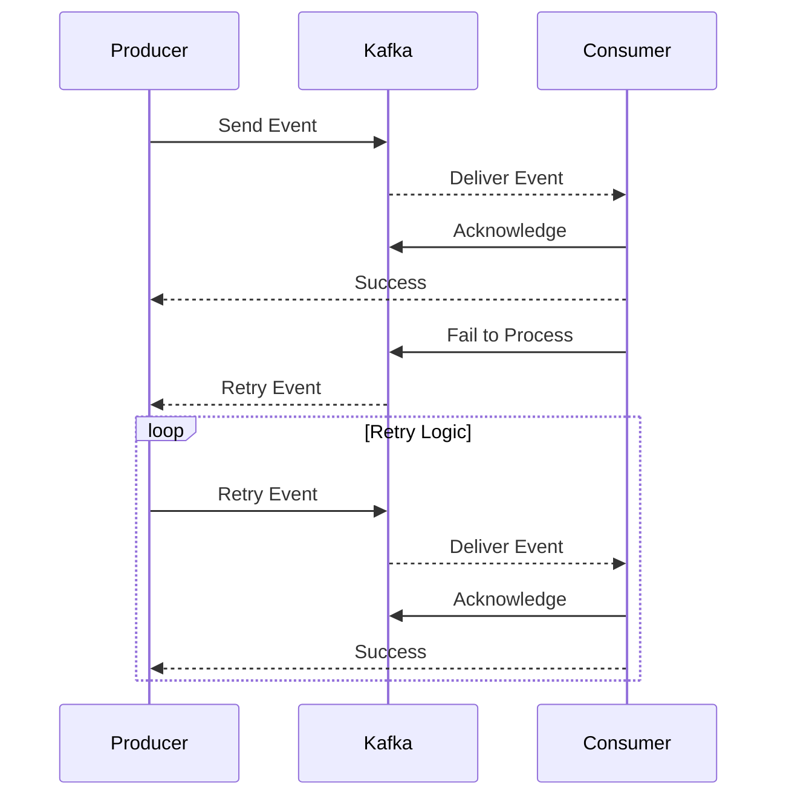

## 13.6.1 Event Retry Mechanisms

In the realm of distributed systems and real-time data processing, ensuring the reliability and resilience of event-driven architectures is paramount. Apache Kafka, a cornerstone of modern data architectures, provides robust mechanisms to handle transient failures through event retry mechanisms. This section delves into the intricacies of implementing retry logic for failed events, ensuring that temporary errors do not lead to permanent data loss. We will explore various retry policies, provide code examples, and discuss considerations for idempotency and ordering.

### Understanding Event Retry Mechanisms

Event retry mechanisms are essential for handling transient failures in distributed systems. These mechanisms ensure that events are not lost due to temporary issues such as network glitches, service unavailability, or processing errors. By implementing effective retry strategies, systems can achieve higher reliability and fault tolerance.

#### Key Concepts

- **Transient Failures**: Temporary issues that can be resolved by retrying the operation.
- **Idempotency**: The property of an operation to produce the same result even if executed multiple times.
- **Ordering**: Maintaining the sequence of events as they are processed.

### Retry Policies

Retry policies define how and when retries should be attempted. Choosing the right policy is crucial for balancing system performance and reliability.

#### Immediate Retry

- **Description**: Attempts to retry the operation immediately after a failure.
- **Use Case**: Suitable for scenarios where failures are expected to be resolved quickly.
- **Drawback**: Can lead to high resource consumption if failures persist.

#### Delayed Retry

- **Description**: Introduces a fixed delay between retry attempts.
- **Use Case**: Useful for scenarios where failures might resolve after a short period.
- **Drawback**: May increase the time to recover from failures.

#### Exponential Backoff

- **Description**: Increases the delay between retries exponentially.
- **Use Case**: Effective for reducing load on the system and avoiding cascading failures.
- **Drawback**: May lead to longer recovery times in some cases.

#### Jitter

- **Description**: Adds randomness to the delay to prevent synchronized retries across multiple clients.
- **Use Case**: Helps in avoiding thundering herd problems.
- **Drawback**: Complexity in implementation.

### Implementing Retry Mechanisms

Let's explore how to implement these retry mechanisms in various programming languages commonly used with Kafka.

#### Java Example

```java
import org.apache.kafka.clients.producer.KafkaProducer;
import org.apache.kafka.clients.producer.ProducerRecord;
import org.apache.kafka.clients.producer.RecordMetadata;
import org.apache.kafka.clients.producer.Callback;

import java.util.Properties;
import java.util.concurrent.TimeUnit;

public class KafkaRetryProducer {

    private static final int MAX_RETRIES = 5;
    private static final long INITIAL_DELAY_MS = 100;
    private static final double BACKOFF_MULTIPLIER = 2.0;

    public static void main(String[] args) {
        Properties props = new Properties();
        props.put("bootstrap.servers", "localhost:9092");
        props.put("key.serializer", "org.apache.kafka.common.serialization.StringSerializer");
        props.put("value.serializer", "org.apache.kafka.common.serialization.StringSerializer");

        KafkaProducer<String, String> producer = new KafkaProducer<>(props);

        String topic = "retry-topic";
        String key = "key1";
        String value = "value1";

        ProducerRecord<String, String> record = new ProducerRecord<>(topic, key, value);

        sendWithRetry(producer, record, 0);

        producer.close();
    }

    private static void sendWithRetry(KafkaProducer<String, String> producer, ProducerRecord<String, String> record, int attempt) {
        producer.send(record, new Callback() {
            @Override
            public void onCompletion(RecordMetadata metadata, Exception exception) {
                if (exception != null) {
                    if (attempt < MAX_RETRIES) {
                        long delay = (long) (INITIAL_DELAY_MS * Math.pow(BACKOFF_MULTIPLIER, attempt));
                        System.out.println("Retrying in " + delay + " ms");
                        try {
                            TimeUnit.MILLISECONDS.sleep(delay);
                        } catch (InterruptedException e) {
                            Thread.currentThread().interrupt();
                        }
                        sendWithRetry(producer, record, attempt + 1);
                    } else {
                        System.err.println("Max retries reached. Failed to send record: " + record);
                    }
                } else {
                    System.out.println("Record sent successfully: " + record);
                }
            }
        });
    }
}
```

#### Scala Example

```scala
import org.apache.kafka.clients.producer.{KafkaProducer, ProducerRecord, Callback, RecordMetadata}
import java.util.Properties
import scala.concurrent.duration._

object KafkaRetryProducer {

  val MaxRetries = 5
  val InitialDelayMs = 100
  val BackoffMultiplier = 2.0

  def main(args: Array[String]): Unit = {
    val props = new Properties()
    props.put("bootstrap.servers", "localhost:9092")
    props.put("key.serializer", "org.apache.kafka.common.serialization.StringSerializer")
    props.put("value.serializer", "org.apache.kafka.common.serialization.StringSerializer")

    val producer = new KafkaProducer[String, String](props)

    val topic = "retry-topic"
    val key = "key1"
    val value = "value1"

    val record = new ProducerRecord[String, String](topic, key, value)

    sendWithRetry(producer, record, 0)

    producer.close()
  }

  def sendWithRetry(producer: KafkaProducer[String, String], record: ProducerRecord[String, String], attempt: Int): Unit = {
    producer.send(record, new Callback {
      override def onCompletion(metadata: RecordMetadata, exception: Exception): Unit = {
        if (exception != null) {
          if (attempt < MaxRetries) {
            val delay = (InitialDelayMs * Math.pow(BackoffMultiplier, attempt)).toLong
            println(s"Retrying in $delay ms")
            Thread.sleep(delay)
            sendWithRetry(producer, record, attempt + 1)
          } else {
            println(s"Max retries reached. Failed to send record: $record")
          }
        } else {
          println(s"Record sent successfully: $record")
        }
      }
    })
  }
}
```

#### Kotlin Example

```kotlin
import org.apache.kafka.clients.producer.KafkaProducer
import org.apache.kafka.clients.producer.ProducerRecord
import org.apache.kafka.clients.producer.Callback
import org.apache.kafka.clients.producer.RecordMetadata
import java.util.Properties
import java.util.concurrent.TimeUnit

fun main() {
    val props = Properties().apply {
        put("bootstrap.servers", "localhost:9092")
        put("key.serializer", "org.apache.kafka.common.serialization.StringSerializer")
        put("value.serializer", "org.apache.kafka.common.serialization.StringSerializer")
    }

    val producer = KafkaProducer<String, String>(props)

    val topic = "retry-topic"
    val key = "key1"
    val value = "value1"

    val record = ProducerRecord(topic, key, value)

    sendWithRetry(producer, record, 0)

    producer.close()
}

fun sendWithRetry(producer: KafkaProducer<String, String>, record: ProducerRecord<String, String>, attempt: Int) {
    producer.send(record, Callback { metadata, exception ->
        if (exception != null) {
            if (attempt < MAX_RETRIES) {
                val delay = (INITIAL_DELAY_MS * Math.pow(BACKOFF_MULTIPLIER, attempt.toDouble())).toLong()
                println("Retrying in $delay ms")
                TimeUnit.MILLISECONDS.sleep(delay)
                sendWithRetry(producer, record, attempt + 1)
            } else {
                println("Max retries reached. Failed to send record: $record")
            }
        } else {
            println("Record sent successfully: $record")
        }
    })
}

const val MAX_RETRIES = 5
const val INITIAL_DELAY_MS = 100L
const val BACKOFF_MULTIPLIER = 2.0
```

#### Clojure Example

```clojure
(ns kafka-retry-producer
  (:import (org.apache.kafka.clients.producer KafkaProducer ProducerRecord Callback RecordMetadata)
           (java.util Properties)
           (java.util.concurrent TimeUnit)))

(def max-retries 5)
(def initial-delay-ms 100)
(def backoff-multiplier 2.0)

(defn send-with-retry [producer record attempt]
  (.send producer record
         (reify Callback
           (onCompletion [_ metadata exception]
             (if exception
               (if (< attempt max-retries)
                 (let [delay (* initial-delay-ms (Math/pow backoff-multiplier attempt))]
                   (println (str "Retrying in " delay " ms"))
                   (Thread/sleep delay)
                   (send-with-retry producer record (inc attempt)))
                 (println (str "Max retries reached. Failed to send record: " record)))
               (println (str "Record sent successfully: " record)))))))

(defn -main []
  (let [props (doto (Properties.)
                (.put "bootstrap.servers" "localhost:9092")
                (.put "key.serializer" "org.apache.kafka.common.serialization.StringSerializer")
                (.put "value.serializer" "org.apache.kafka.common.serialization.StringSerializer"))
        producer (KafkaProducer. props)
        topic "retry-topic"
        key "key1"
        value "value1"
        record (ProducerRecord. topic key value)]
    (send-with-retry producer record 0)
    (.close producer)))
```

### Avoiding Infinite Retry Loops

Infinite retry loops can lead to resource exhaustion and system instability. To prevent this, consider the following strategies:

- **Limit Retry Attempts**: Set a maximum number of retries to avoid endless loops.
- **Circuit Breaker Pattern**: Temporarily halt retries if a certain threshold of failures is reached.
- **Dead Letter Queue (DLQ)**: Route failed messages to a DLQ for further analysis and manual intervention.

### Considerations for Idempotency and Ordering

When implementing retry mechanisms, it's crucial to ensure that operations are idempotent and that event ordering is preserved.

#### Idempotency

- **Definition**: An operation is idempotent if performing it multiple times has the same effect as performing it once.
- **Implementation**: Use unique identifiers for events and check for duplicates before processing.

#### Ordering

- **Definition**: Maintaining the sequence of events as they are processed.
- **Implementation**: Use Kafka's partitioning and consumer group features to ensure ordered processing.

### Practical Applications and Real-World Scenarios

Event retry mechanisms are widely used in various industries to enhance the reliability of data processing systems. Here are some practical applications:

- **Financial Services**: Ensuring reliable transaction processing and preventing data loss during network outages.
- **E-commerce**: Handling order processing failures and ensuring consistent inventory updates.
- **IoT Applications**: Managing sensor data ingestion and processing in real-time.

### Visualizing Retry Mechanisms

To better understand the flow of retry mechanisms, consider the following diagram:



**Diagram Description**: This sequence diagram illustrates the flow of events between a producer, Kafka, and a consumer, highlighting the retry logic when a consumer fails to process an event.

### References and Links

- [Apache Kafka Documentation](https://kafka.apache.org/documentation/)
- [Confluent Documentation](https://docs.confluent.io/)
- [Retry Pattern in Distributed Systems](https://martinfowler.com/articles/patterns-of-distributed-systems/retry.html)

### Knowledge Check

To reinforce your understanding of event retry mechanisms, consider the following questions and exercises.

## Test Your Knowledge: Advanced Event Retry Mechanisms Quiz



### What is the primary purpose of implementing event retry mechanisms in Kafka?

- [x] To handle transient failures and ensure data reliability.
- [ ] To increase the speed of data processing.
- [ ] To reduce the cost of data storage.
- [ ] To simplify the architecture of the system.

> **Explanation:** Event retry mechanisms are designed to handle transient failures, ensuring that temporary issues do not lead to permanent data loss.

### Which retry policy introduces randomness to prevent synchronized retries?

- [ ] Immediate Retry
- [ ] Delayed Retry
- [x] Jitter
- [ ] Exponential Backoff

> **Explanation:** Jitter adds randomness to the delay between retries, helping to prevent synchronized retries across multiple clients.

### What is a key consideration when implementing retry mechanisms to avoid infinite loops?

- [ ] Increasing the number of retries.
- [x] Limiting the number of retry attempts.
- [ ] Reducing the delay between retries.
- [ ] Using larger message sizes.

> **Explanation:** Limiting the number of retry attempts is crucial to prevent infinite loops and resource exhaustion.

### How can idempotency be ensured in event processing?

- [x] By using unique identifiers for events and checking for duplicates.
- [ ] By increasing the number of retries.
- [ ] By reducing the delay between retries.
- [ ] By using larger message sizes.

> **Explanation:** Ensuring idempotency involves using unique identifiers for events and checking for duplicates before processing.

### What is the benefit of using exponential backoff in retry mechanisms?

- [ ] It reduces the complexity of the system.
- [x] It helps in reducing load on the system and avoiding cascading failures.
- [ ] It increases the speed of data processing.
- [ ] It simplifies the architecture of the system.

> **Explanation:** Exponential backoff increases the delay between retries exponentially, helping to reduce load on the system and avoid cascading failures.

### Which pattern can be used to temporarily halt retries if a certain threshold of failures is reached?

- [ ] Retry Pattern
- [ ] Idempotency Pattern
- [x] Circuit Breaker Pattern
- [ ] Dead Letter Queue Pattern

> **Explanation:** The Circuit Breaker Pattern can be used to temporarily halt retries if a certain threshold of failures is reached, preventing further strain on the system.

### What is the role of a Dead Letter Queue (DLQ) in retry mechanisms?

- [ ] To increase the speed of data processing.
- [ ] To reduce the cost of data storage.
- [x] To route failed messages for further analysis and manual intervention.
- [ ] To simplify the architecture of the system.

> **Explanation:** A Dead Letter Queue (DLQ) is used to route failed messages for further analysis and manual intervention, ensuring that they are not lost.

### How can event ordering be maintained in Kafka?

- [ ] By increasing the number of retries.
- [ ] By reducing the delay between retries.
- [x] By using Kafka's partitioning and consumer group features.
- [ ] By using larger message sizes.

> **Explanation:** Kafka's partitioning and consumer group features can be used to ensure ordered processing of events.

### What is a common use case for event retry mechanisms in financial services?

- [ ] Increasing the speed of data processing.
- [ ] Reducing the cost of data storage.
- [x] Ensuring reliable transaction processing and preventing data loss during network outages.
- [ ] Simplifying the architecture of the system.

> **Explanation:** In financial services, event retry mechanisms are commonly used to ensure reliable transaction processing and prevent data loss during network outages.

### True or False: Exponential backoff always leads to faster recovery from failures.

- [ ] True
- [x] False

> **Explanation:** Exponential backoff may lead to longer recovery times in some cases, as it increases the delay between retries exponentially.



By mastering event retry mechanisms, you can significantly enhance the resilience and reliability of your Kafka-based systems, ensuring that they can gracefully handle transient failures and maintain data integrity.
