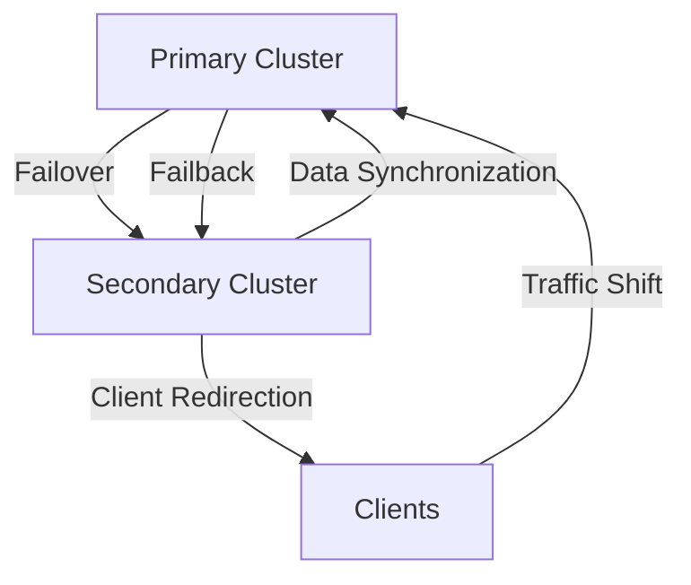

## 13.7.3 Failover and Failback Procedures

In the realm of distributed systems, ensuring high availability and fault tolerance is paramount. Apache Kafka, a cornerstone of modern data architectures, provides robust mechanisms for disaster recovery through failover and failback procedures. This section delves into the intricacies of these processes, offering expert guidance on maintaining seamless operations during failures and restoring systems efficiently.

### Understanding Failover and Failback

**Failover** refers to the process of switching operations from a primary system to a secondary, standby system when a failure occurs. This ensures continuity of service with minimal disruption. **Failback**, on the other hand, involves returning operations to the primary system once it is restored and stable. Both processes are critical for maintaining data integrity and minimizing downtime.

### Steps Involved in Failover to a Secondary Cluster

#### 1. **Preparation and Planning**

Before implementing failover, it is crucial to have a well-documented disaster recovery plan. This includes identifying critical components, defining Recovery Time Objectives (RTO) and Recovery Point Objectives (RPO), and setting up a secondary Kafka cluster that mirrors the primary setup.

#### 2. **Monitoring and Detection**

Implement robust monitoring tools to detect failures promptly. Utilize Kafka's built-in metrics and external monitoring solutions like Prometheus and Grafana to track cluster health and performance.

#### 3. **Automated Failover Mechanisms**

Automate the failover process to reduce human intervention and response time. Use tools like Kafka MirrorMaker 2.0 for replicating data across clusters and configure it to switch traffic to the secondary cluster upon detecting a failure.

#### 4. **Client Redirection and DNS Updates**

Ensure that clients can seamlessly connect to the secondary cluster. This involves updating DNS records to point to the new cluster endpoints. Consider using a load balancer or a service discovery tool to manage client redirection dynamically.

#### 5. **Data Consistency and Synchronization**

During failover, ensure that data is consistent across clusters. Use Kafka's replication features to maintain data integrity and consider implementing a consensus protocol like Raft for leader election and data synchronization.

### Managing Client Redirection and DNS Updates

Client redirection is a critical aspect of failover. Here are some strategies to manage this effectively:

- **Dynamic DNS Updates**: Use DNS services that support low TTL (Time to Live) values to quickly propagate changes in cluster endpoints.
- **Service Discovery Tools**: Implement tools like Consul or Eureka to automate service registration and discovery, allowing clients to connect to the appropriate cluster without manual intervention.
- **Load Balancers**: Deploy load balancers to distribute client requests across available brokers in the secondary cluster, ensuring even load distribution and high availability.

### Synchronizing Data During Failback

Failback requires careful synchronization of data to ensure consistency and integrity. Follow these steps to achieve seamless failback:

#### 1. **Assess the Primary Cluster**

Before initiating failback, thoroughly assess the primary cluster to ensure it is stable and ready to resume operations. This includes verifying hardware health, network connectivity, and software configurations.

#### 2. **Data Reconciliation**

Use Kafka's MirrorMaker or other replication tools to synchronize data between the secondary and primary clusters. Ensure that all messages are replicated and that there are no data discrepancies.

#### 3. **Gradual Traffic Shift**

Gradually redirect traffic back to the primary cluster to avoid overwhelming it. This can be achieved by incrementally updating DNS records or adjusting load balancer configurations.

#### 4. **Validation and Testing**

Conduct thorough testing to validate that the primary cluster is functioning correctly. This includes running integration tests, verifying data integrity, and ensuring that all services are operational.

### Considerations for Minimizing Downtime and Data Loss

To minimize downtime and data loss during failover and failback, consider the following best practices:

- **Regular Backups**: Implement regular backups of Kafka data and configurations to ensure quick recovery in case of data loss.
- **Redundant Infrastructure**: Deploy redundant hardware and network components to prevent single points of failure.
- **Proactive Maintenance**: Regularly update and maintain Kafka clusters to prevent failures due to outdated software or hardware issues.
- **Comprehensive Testing**: Regularly test failover and failback procedures to identify potential issues and ensure readiness.

### Practical Applications and Real-World Scenarios

Failover and failback procedures are essential in various real-world scenarios, such as:

- **Financial Services**: Ensuring uninterrupted transaction processing and data integrity during system failures.
- **E-commerce Platforms**: Maintaining high availability and seamless user experience during peak traffic periods or infrastructure failures.
- **IoT Systems**: Continuously processing sensor data and maintaining data consistency across distributed systems.

### Code Examples

To illustrate these concepts, let's explore code examples in Java, Scala, Kotlin, and Clojure for setting up a basic failover mechanism using Kafka's MirrorMaker.

#### Java Example

```java
import org.apache.kafka.clients.consumer.KafkaConsumer;
import org.apache.kafka.clients.producer.KafkaProducer;
import org.apache.kafka.common.serialization.StringDeserializer;
import org.apache.kafka.common.serialization.StringSerializer;

import java.util.Properties;

public class KafkaFailoverExample {
    public static void main(String[] args) {
        Properties consumerProps = new Properties();
        consumerProps.put("bootstrap.servers", "secondary-cluster:9092");
        consumerProps.put("group.id", "failover-group");
        consumerProps.put("key.deserializer", StringDeserializer.class.getName());
        consumerProps.put("value.deserializer", StringDeserializer.class.getName());

        KafkaConsumer<String, String> consumer = new KafkaConsumer<>(consumerProps);

        Properties producerProps = new Properties();
        producerProps.put("bootstrap.servers", "secondary-cluster:9092");
        producerProps.put("key.serializer", StringSerializer.class.getName());
        producerProps.put("value.serializer", StringSerializer.class.getName());

        KafkaProducer<String, String> producer = new KafkaProducer<>(producerProps);

        // Implement failover logic here
    }
}
```

#### Scala Example

```scala
import org.apache.kafka.clients.consumer.KafkaConsumer
import org.apache.kafka.clients.producer.KafkaProducer
import org.apache.kafka.common.serialization.StringDeserializer
import org.apache.kafka.common.serialization.StringSerializer

import java.util.Properties

object KafkaFailoverExample extends App {
  val consumerProps = new Properties()
  consumerProps.put("bootstrap.servers", "secondary-cluster:9092")
  consumerProps.put("group.id", "failover-group")
  consumerProps.put("key.deserializer", classOf[StringDeserializer].getName)
  consumerProps.put("value.deserializer", classOf[StringDeserializer].getName)

  val consumer = new KafkaConsumer[String, String](consumerProps)

  val producerProps = new Properties()
  producerProps.put("bootstrap.servers", "secondary-cluster:9092")
  producerProps.put("key.serializer", classOf[StringSerializer].getName)
  producerProps.put("value.serializer", classOf[StringSerializer].getName)

  val producer = new KafkaProducer[String, String](producerProps)

  // Implement failover logic here
}
```

#### Kotlin Example

```kotlin
import org.apache.kafka.clients.consumer.KafkaConsumer
import org.apache.kafka.clients.producer.KafkaProducer
import org.apache.kafka.common.serialization.StringDeserializer
import org.apache.kafka.common.serialization.StringSerializer
import java.util.Properties

fun main() {
    val consumerProps = Properties().apply {
        put("bootstrap.servers", "secondary-cluster:9092")
        put("group.id", "failover-group")
        put("key.deserializer", StringDeserializer::class.java.name)
        put("value.deserializer", StringDeserializer::class.java.name)
    }

    val consumer = KafkaConsumer<String, String>(consumerProps)

    val producerProps = Properties().apply {
        put("bootstrap.servers", "secondary-cluster:9092")
        put("key.serializer", StringSerializer::class.java.name)
        put("value.serializer", StringSerializer::class.java.name)
    }

    val producer = KafkaProducer<String, String>(producerProps)

    // Implement failover logic here
}
```

#### Clojure Example

```clojure
(ns kafka-failover-example
  (:import (org.apache.kafka.clients.consumer KafkaConsumer)
           (org.apache.kafka.clients.producer KafkaProducer)
           (org.apache.kafka.common.serialization StringDeserializer StringSerializer))
  (:require [clojure.java.io :as io]))

(defn create-consumer []
  (let [props (doto (java.util.Properties.)
                (.put "bootstrap.servers" "secondary-cluster:9092")
                (.put "group.id" "failover-group")
                (.put "key.deserializer" (.getName StringDeserializer))
                (.put "value.deserializer" (.getName StringDeserializer)))]
    (KafkaConsumer. props)))

(defn create-producer []
  (let [props (doto (java.util.Properties.)
                (.put "bootstrap.servers" "secondary-cluster:9092")
                (.put "key.serializer" (.getName StringSerializer))
                (.put "value.serializer" (.getName StringSerializer)))]
    (KafkaProducer. props)))

(defn -main []
  (let [consumer (create-consumer)
        producer (create-producer)]
    ;; Implement failover logic here
    ))
```

### Visualizing Failover and Failback

To better understand the failover and failback processes, consider the following diagram illustrating the flow of operations:



**Diagram Explanation**: This diagram depicts the transition of operations from the primary cluster to the secondary cluster during failover, followed by data synchronization and eventual failback to the primary cluster.

### Key Takeaways

- **Failover and failback are essential for maintaining high availability and data integrity in distributed systems.**
- **Automate failover processes to minimize downtime and reduce human error.**
- **Ensure seamless client redirection through DNS updates and service discovery tools.**
- **Synchronize data meticulously during failback to prevent data loss and ensure consistency.**
- **Regularly test and update disaster recovery plans to adapt to evolving system requirements.**

## Test Your Knowledge: Advanced Kafka Failover and Failback Quiz



### What is the primary goal of failover in a Kafka cluster?

- [x] To switch operations to a secondary cluster during a failure
- [ ] To permanently move operations to a new cluster
- [ ] To update client configurations
- [ ] To perform routine maintenance

> **Explanation:** Failover aims to ensure continuity of service by switching operations to a standby cluster during a failure.

### Which tool can be used to automate data replication across Kafka clusters?

- [x] Kafka MirrorMaker
- [ ] Kafka Streams
- [ ] Zookeeper
- [ ] Apache Flink

> **Explanation:** Kafka MirrorMaker is designed for replicating data across Kafka clusters, facilitating automated failover.

### What is a critical step in the failback process?

- [x] Data synchronization between clusters
- [ ] Increasing the number of partitions
- [ ] Deleting old topics
- [ ] Changing the replication factor

> **Explanation:** Data synchronization ensures consistency and integrity when transitioning back to the primary cluster.

### How can client redirection be managed during failover?

- [x] Using DNS updates and service discovery tools
- [ ] By manually updating each client
- [ ] By restarting the Kafka brokers
- [ ] By changing the partition strategy

> **Explanation:** DNS updates and service discovery tools automate client redirection, ensuring seamless connectivity.

### What is the role of a load balancer in failover?

- [x] To distribute client requests across available brokers
- [ ] To increase the number of partitions
- [ ] To manage topic configurations
- [ ] To update consumer offsets

> **Explanation:** Load balancers help distribute client requests evenly, maintaining high availability during failover.

### Which of the following is a best practice for minimizing downtime during failover?

- [x] Automating failover processes
- [ ] Manually updating configurations
- [ ] Increasing the number of brokers
- [ ] Reducing the number of topics

> **Explanation:** Automation reduces response time and human error, minimizing downtime during failover.

### What is the purpose of setting a low TTL value in DNS configurations?

- [x] To quickly propagate changes in cluster endpoints
- [ ] To increase data retention
- [ ] To reduce network latency
- [ ] To enhance data security

> **Explanation:** A low TTL value ensures that DNS changes are quickly propagated, facilitating rapid client redirection.

### Why is it important to conduct regular testing of failover and failback procedures?

- [x] To identify potential issues and ensure readiness
- [ ] To increase the number of partitions
- [ ] To reduce the number of brokers
- [ ] To change the replication factor

> **Explanation:** Regular testing helps identify and resolve potential issues, ensuring the system is prepared for actual failures.

### Which of the following tools can be used for monitoring Kafka cluster health?

- [x] Prometheus and Grafana
- [ ] Apache Beam
- [ ] Apache Camel
- [ ] Apache NiFi

> **Explanation:** Prometheus and Grafana are popular tools for monitoring and visualizing Kafka cluster health and performance.

### True or False: Failback should be performed immediately after the primary cluster is restored.

- [ ] True
- [x] False

> **Explanation:** Failback should only be performed after thorough validation and testing to ensure the primary cluster is stable and ready.



By mastering failover and failback procedures, you can ensure that your Kafka-based systems remain resilient, reliable, and ready to handle unexpected disruptions.
