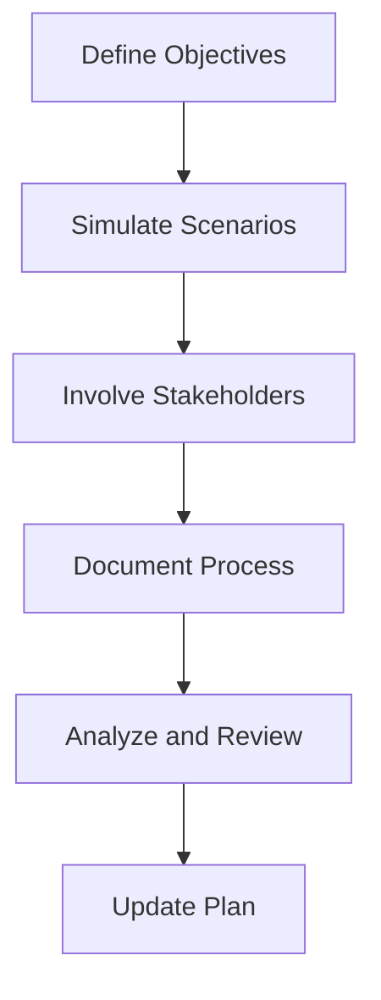

## 13.7.4 Testing Disaster Recovery Plans

In the realm of distributed systems and real-time data processing, ensuring the reliability and resilience of your Apache Kafka deployment is paramount. Disaster recovery (DR) plans are a critical component of this reliability, providing a structured approach to restoring services after a failure. However, having a DR plan is not enough; it must be rigorously tested to ensure its effectiveness and the readiness of your team. This section delves into strategies for conducting disaster recovery drills, metrics for evaluating recovery effectiveness, best practices for documentation, and common issues encountered during testing.

### Importance of Testing Disaster Recovery Plans

Testing disaster recovery plans is essential for several reasons:

1. **Validation of Procedures**: Ensure that the documented procedures are practical and effective.
2. **Team Preparedness**: Train team members to respond quickly and efficiently in a real disaster scenario.
3. **Identification of Gaps**: Discover weaknesses or missing elements in the plan.
4. **System Resilience**: Confirm that the system can be restored to a functional state within the required timeframe.

### Strategies for Conducting Disaster Recovery Drills

Conducting effective disaster recovery drills involves several key strategies:

#### 1. Define Clear Objectives

- **Set Specific Goals**: Determine what you aim to achieve with the drill, such as testing specific components or the entire recovery process.
- **Align with Business Needs**: Ensure that the objectives align with business continuity requirements.

#### 2. Simulate Realistic Scenarios

- **Create Realistic Failures**: Simulate scenarios that could realistically occur, such as data center outages, network failures, or hardware malfunctions.
- **Vary Scenarios**: Regularly change the scenarios to cover different types of failures.

#### 3. Involve All Stakeholders

- **Cross-Functional Participation**: Involve IT, operations, business units, and other relevant stakeholders.
- **Communication Plans**: Ensure clear communication channels are established and tested during the drill.

#### 4. Document the Process

- **Detailed Documentation**: Record each step of the drill, including actions taken, decisions made, and any deviations from the plan.
- **Use Checklists**: Utilize checklists to ensure all critical steps are covered.

#### 5. Analyze and Review

- **Post-Drill Analysis**: Conduct a thorough review of the drill, identifying successes and areas for improvement.
- **Feedback Loop**: Incorporate feedback from participants to refine the plan.

### Metrics for Evaluating Recovery Effectiveness

Evaluating the effectiveness of your disaster recovery plan involves measuring specific metrics:

#### 1. Recovery Time Objective (RTO)

- **Definition**: The maximum acceptable length of time that a system can be down after a failure.
- **Measurement**: Track the actual time taken to restore services and compare it to the RTO.

#### 2. Recovery Point Objective (RPO)

- **Definition**: The maximum acceptable amount of data loss measured in time.
- **Measurement**: Determine the point to which data can be restored and compare it to the RPO.

#### 3. Success Rate of Recovery Procedures

- **Definition**: The percentage of recovery attempts that successfully restore services.
- **Measurement**: Calculate the ratio of successful recoveries to total attempts.

#### 4. Team Response Time

- **Definition**: The time taken for the team to respond to the disaster and initiate recovery procedures.
- **Measurement**: Track the time from disaster notification to the start of recovery actions.

### Best Practices for Documenting and Updating Plans

Effective documentation and regular updates are crucial for maintaining a robust disaster recovery plan:

#### 1. Maintain Comprehensive Documentation

- **Detailed Procedures**: Document each step of the recovery process in detail.
- **Role Assignments**: Clearly define roles and responsibilities for each team member.

#### 2. Regular Updates

- **Periodic Reviews**: Schedule regular reviews of the DR plan to ensure it remains current.
- **Incorporate Changes**: Update the plan to reflect changes in the system architecture, technology, or business processes.

#### 3. Version Control

- **Track Changes**: Use version control to track changes to the DR plan.
- **Historical Records**: Maintain records of previous versions for reference.

#### 4. Accessibility

- **Easy Access**: Ensure the plan is easily accessible to all stakeholders, both digitally and in hard copy.
- **Secure Storage**: Store the plan in a secure location to prevent unauthorized access.

### Common Issues Found During Testing and How to Address Them

Testing disaster recovery plans often reveals common issues that need to be addressed:

#### 1. Incomplete or Outdated Documentation

- **Solution**: Regularly review and update the documentation to ensure it is complete and current.

#### 2. Lack of Team Training

- **Solution**: Conduct regular training sessions and drills to ensure all team members are familiar with the procedures.

#### 3. Communication Breakdowns

- **Solution**: Establish clear communication protocols and test them during drills.

#### 4. Insufficient Resources

- **Solution**: Ensure that adequate resources, such as backup systems and personnel, are available for recovery efforts.

#### 5. Unforeseen Dependencies

- **Solution**: Identify and document all dependencies in the system, and test their impact during drills.

### Code Examples for Automating Disaster Recovery Testing

Automating parts of your disaster recovery testing can improve efficiency and consistency. Below are code examples in Java, Scala, Kotlin, and Clojure for automating Kafka cluster failover testing.

#### Java Example

```java
import org.apache.kafka.clients.admin.AdminClient;
import org.apache.kafka.clients.admin.AdminClientConfig;
import java.util.Properties;

public class KafkaFailoverTest {
    public static void main(String[] args) {
        Properties props = new Properties();
        props.put(AdminClientConfig.BOOTSTRAP_SERVERS_CONFIG, "localhost:9092");
        try (AdminClient adminClient = AdminClient.create(props)) {
            // Simulate broker failure
            System.out.println("Simulating broker failure...");
            // Code to simulate broker failure goes here

            // Check cluster status
            System.out.println("Checking cluster status...");
            // Code to check cluster status goes here
        } catch (Exception e) {
            e.printStackTrace();
        }
    }
}
```

#### Scala Example

```scala
import org.apache.kafka.clients.admin.{AdminClient, AdminClientConfig}
import java.util.Properties

object KafkaFailoverTest extends App {
  val props = new Properties()
  props.put(AdminClientConfig.BOOTSTRAP_SERVERS_CONFIG, "localhost:9092")
  val adminClient = AdminClient.create(props)

  try {
    // Simulate broker failure
    println("Simulating broker failure...")
    // Code to simulate broker failure goes here

    // Check cluster status
    println("Checking cluster status...")
    // Code to check cluster status goes here
  } finally {
    adminClient.close()
  }
}
```

#### Kotlin Example

```kotlin
import org.apache.kafka.clients.admin.AdminClient
import org.apache.kafka.clients.admin.AdminClientConfig
import java.util.Properties

fun main() {
    val props = Properties()
    props[AdminClientConfig.BOOTSTRAP_SERVERS_CONFIG] = "localhost:9092"
    AdminClient.create(props).use { adminClient ->
        // Simulate broker failure
        println("Simulating broker failure...")
        // Code to simulate broker failure goes here

        // Check cluster status
        println("Checking cluster status...")
        // Code to check cluster status goes here
    }
}
```

#### Clojure Example

```clojure
(ns kafka-failover-test
  (:import [org.apache.kafka.clients.admin AdminClient AdminClientConfig]
           [java.util Properties]))

(defn -main []
  (let [props (doto (Properties.)
                (.put AdminClientConfig/BOOTSTRAP_SERVERS_CONFIG "localhost:9092"))
        admin-client (AdminClient/create props)]
    (try
      ;; Simulate broker failure
      (println "Simulating broker failure...")
      ;; Code to simulate broker failure goes here

      ;; Check cluster status
      (println "Checking cluster status...")
      ;; Code to check cluster status goes here
      (finally
        (.close admin-client)))))
```

### Visualizing Disaster Recovery Testing

To better understand the process of disaster recovery testing, consider the following flowchart that outlines the key steps involved:



**Caption**: This flowchart illustrates the key steps in conducting a disaster recovery drill, from defining objectives to updating the plan based on findings.

### References and Further Reading

- [Apache Kafka Documentation](https://kafka.apache.org/documentation/)
- [Confluent Documentation](https://docs.confluent.io/)
- [Disaster Recovery Planning for IT Professionals](https://www.itgovernance.co.uk/disaster-recovery)
- [NIST Special Publication 800-34: Contingency Planning Guide for Federal Information Systems](https://nvlpubs.nist.gov/nistpubs/Legacy/SP/nistspecialpublication800-34r1.pdf)

### Knowledge Check

To reinforce your understanding of testing disaster recovery plans, consider the following questions and exercises.

## Test Your Knowledge: Disaster Recovery Testing for Apache Kafka



### What is the primary goal of conducting disaster recovery drills?

- [x] To ensure the effectiveness of recovery procedures and team readiness.
- [ ] To identify new business opportunities.
- [ ] To reduce operational costs.
- [ ] To increase system performance.

> **Explanation:** The primary goal of disaster recovery drills is to validate the effectiveness of recovery procedures and ensure that the team is prepared to execute them in a real disaster scenario.

### Which metric measures the maximum acceptable length of time a system can be down after a failure?

- [x] Recovery Time Objective (RTO)
- [ ] Recovery Point Objective (RPO)
- [ ] Success Rate
- [ ] Team Response Time

> **Explanation:** The Recovery Time Objective (RTO) measures the maximum acceptable length of time that a system can be down after a failure.

### What is a common issue found during disaster recovery testing?

- [x] Incomplete or outdated documentation
- [ ] Increased system performance
- [ ] Reduced team size
- [ ] Enhanced security protocols

> **Explanation:** Incomplete or outdated documentation is a common issue found during disaster recovery testing, which can hinder the effectiveness of recovery efforts.

### How often should disaster recovery plans be updated?

- [x] Regularly, to reflect changes in system architecture and business processes.
- [ ] Only when a disaster occurs.
- [ ] Once every five years.
- [ ] Never, if the plan is initially well-designed.

> **Explanation:** Disaster recovery plans should be updated regularly to reflect changes in system architecture, technology, and business processes.

### Which of the following is a best practice for documenting disaster recovery plans?

- [x] Use detailed procedures and role assignments.
- [ ] Keep the plan secret from most team members.
- [ ] Document only the most critical steps.
- [ ] Store the plan in a single location.

> **Explanation:** Best practices for documenting disaster recovery plans include using detailed procedures and clearly defining roles and responsibilities for each team member.

### What is the purpose of using version control for disaster recovery plans?

- [x] To track changes and maintain historical records.
- [ ] To increase system performance.
- [ ] To reduce the number of team members needed.
- [ ] To enhance security protocols.

> **Explanation:** Version control is used to track changes to the disaster recovery plan and maintain historical records for reference.

### Which tool can be used to automate parts of disaster recovery testing in Kafka?

- [x] AdminClient in Java
- [ ] KafkaProducer in Scala
- [ ] KafkaConsumer in Kotlin
- [ ] Zookeeper in Clojure

> **Explanation:** The AdminClient in Java can be used to automate parts of disaster recovery testing in Kafka, such as simulating broker failures and checking cluster status.

### What is the benefit of involving all stakeholders in disaster recovery drills?

- [x] Ensures cross-functional participation and effective communication.
- [ ] Reduces the cost of the drill.
- [ ] Increases system performance.
- [ ] Limits the number of people involved.

> **Explanation:** Involving all stakeholders in disaster recovery drills ensures cross-functional participation and effective communication, which are crucial for successful recovery efforts.

### What should be done after conducting a disaster recovery drill?

- [x] Analyze and review the drill to identify successes and areas for improvement.
- [ ] Immediately conduct another drill.
- [ ] Discard the results if the drill was unsuccessful.
- [ ] Reduce the frequency of future drills.

> **Explanation:** After conducting a disaster recovery drill, it is important to analyze and review the drill to identify successes and areas for improvement.

### True or False: The Recovery Point Objective (RPO) measures the time taken to restore services.

- [ ] True
- [x] False

> **Explanation:** The Recovery Point Objective (RPO) measures the maximum acceptable amount of data loss measured in time, not the time taken to restore services.



By following these guidelines and regularly testing your disaster recovery plans, you can ensure that your Apache Kafka deployment remains resilient and that your team is prepared to handle unexpected failures effectively.
