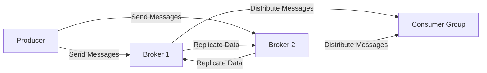

## 13.8.1 Testing System Resilience

In the realm of distributed systems, resilience is a critical attribute that ensures systems can withstand and recover from failures. Apache Kafka, as a distributed streaming platform, is no exception. Testing system resilience involves deliberately introducing faults to observe how the system responds and recovers. This practice, often referred to as chaos engineering, helps identify weaknesses and improve the robustness of Kafka deployments.

### Goals of Resilience Testing

The primary goal of resilience testing is to ensure that Kafka systems can maintain their operational capabilities in the face of unexpected disruptions. This involves:

- **Identifying Weak Points**: Discovering vulnerabilities in the system that could lead to failures.
- **Improving Fault Tolerance**: Enhancing the system's ability to handle faults without significant degradation in performance.
- **Validating Recovery Mechanisms**: Ensuring that the system can recover quickly and efficiently after a failure.
- **Building Confidence**: Providing assurance that the system can handle real-world disruptions.

### Selecting Components and Failure Modes

When testing system resilience, it is crucial to select the right components and failure modes. This involves:

- **Identifying Critical Components**: Focus on components that are essential for the system's operation, such as brokers, producers, consumers, and ZooKeeper (or KRaft in newer architectures).
- **Choosing Failure Modes**: Consider various types of failures, including network partitions, broker crashes, disk failures, and data corruption.
- **Prioritizing Scenarios**: Start with the most likely and impactful failure scenarios to maximize the effectiveness of testing.

### Measuring System Responses and Recovery Times

To effectively test resilience, it is important to measure how the system responds to faults and how quickly it recovers. Key metrics include:

- **Mean Time to Recovery (MTTR)**: The average time taken for the system to recover from a failure.
- **Mean Time Between Failures (MTBF)**: The average time between successive failures.
- **Error Rates**: The frequency of errors occurring during and after a fault.
- **Throughput and Latency**: Changes in data processing rates and response times during failures.

### Implementing Chaos Engineering in Kafka

Chaos engineering involves systematically introducing faults into the system to test its resilience. Here are some steps to implement chaos engineering in Kafka:

#### Step 1: Define the Scope

Determine which components and failure modes to test. This could include:

- **Broker Failures**: Simulate broker crashes and observe how the system handles leader election and data replication.
- **Network Partitions**: Introduce network delays or partitions to test the system's ability to handle communication disruptions.
- **Consumer Group Failures**: Simulate consumer failures to test rebalancing and message processing.

#### Step 2: Design Experiments

Design experiments that introduce controlled faults into the system. Use tools like Chaos Monkey, Gremlin, or custom scripts to automate fault injection.

#### Step 3: Execute Experiments

Run the experiments in a controlled environment, such as a staging or test cluster, to minimize the impact on production systems.

#### Step 4: Monitor and Analyze

Monitor the system's behavior during the experiments, focusing on key metrics such as MTTR, error rates, and throughput. Analyze the results to identify weaknesses and areas for improvement.

#### Step 5: Iterate and Improve

Use the insights gained from the experiments to improve the system's resilience. This may involve tuning configurations, enhancing fault tolerance mechanisms, or redesigning components.

### Code Examples

Below are code examples in Java, Scala, Kotlin, and Clojure that demonstrate how to simulate broker failures and measure system resilience.

#### Java Example

```java
import org.apache.kafka.clients.producer.KafkaProducer;
import org.apache.kafka.clients.producer.ProducerConfig;
import org.apache.kafka.clients.producer.ProducerRecord;
import org.apache.kafka.common.serialization.StringSerializer;

import java.util.Properties;

public class ResilienceTest {
    public static void main(String[] args) {
        Properties props = new Properties();
        props.put(ProducerConfig.BOOTSTRAP_SERVERS_CONFIG, "localhost:9092");
        props.put(ProducerConfig.KEY_SERIALIZER_CLASS_CONFIG, StringSerializer.class.getName());
        props.put(ProducerConfig.VALUE_SERIALIZER_CLASS_CONFIG, StringSerializer.class.getName());

        KafkaProducer<String, String> producer = new KafkaProducer<>(props);

        try {
            for (int i = 0; i < 100; i++) {
                producer.send(new ProducerRecord<>("test-topic", Integer.toString(i), "message-" + i));
                // Simulate broker failure
                if (i == 50) {
                    System.out.println("Simulating broker failure...");
                    // Code to simulate broker failure
                }
            }
        } finally {
            producer.close();
        }
    }
}
```

#### Scala Example

```scala
import org.apache.kafka.clients.producer.{KafkaProducer, ProducerConfig, ProducerRecord}
import org.apache.kafka.common.serialization.StringSerializer

import java.util.Properties

object ResilienceTest extends App {
  val props = new Properties()
  props.put(ProducerConfig.BOOTSTRAP_SERVERS_CONFIG, "localhost:9092")
  props.put(ProducerConfig.KEY_SERIALIZER_CLASS_CONFIG, classOf[StringSerializer].getName)
  props.put(ProducerConfig.VALUE_SERIALIZER_CLASS_CONFIG, classOf[StringSerializer].getName)

  val producer = new KafkaProducer[String, String](props)

  try {
    for (i <- 0 until 100) {
      producer.send(new ProducerRecord[String, String]("test-topic", i.toString, s"message-$i"))
      // Simulate broker failure
      if (i == 50) {
        println("Simulating broker failure...")
        // Code to simulate broker failure
      }
    }
  } finally {
    producer.close()
  }
}
```

#### Kotlin Example

```kotlin
import org.apache.kafka.clients.producer.KafkaProducer
import org.apache.kafka.clients.producer.ProducerConfig
import org.apache.kafka.clients.producer.ProducerRecord
import org.apache.kafka.common.serialization.StringSerializer
import java.util.Properties

fun main() {
    val props = Properties().apply {
        put(ProducerConfig.BOOTSTRAP_SERVERS_CONFIG, "localhost:9092")
        put(ProducerConfig.KEY_SERIALIZER_CLASS_CONFIG, StringSerializer::class.java.name)
        put(ProducerConfig.VALUE_SERIALIZER_CLASS_CONFIG, StringSerializer::class.java.name)
    }

    val producer = KafkaProducer<String, String>(props)

    try {
        for (i in 0 until 100) {
            producer.send(ProducerRecord("test-topic", i.toString(), "message-$i"))
            // Simulate broker failure
            if (i == 50) {
                println("Simulating broker failure...")
                // Code to simulate broker failure
            }
        }
    } finally {
        producer.close()
    }
}
```

#### Clojure Example

```clojure
(ns resilience-test
  (:import (org.apache.kafka.clients.producer KafkaProducer ProducerConfig ProducerRecord)
           (org.apache.kafka.common.serialization StringSerializer))
  (:require [clojure.java.io :as io]))

(defn create-producer []
  (let [props (doto (java.util.Properties.)
                (.put ProducerConfig/BOOTSTRAP_SERVERS_CONFIG "localhost:9092")
                (.put ProducerConfig/KEY_SERIALIZER_CLASS_CONFIG StringSerializer)
                (.put ProducerConfig/VALUE_SERIALIZER_CLASS_CONFIG StringSerializer))]
    (KafkaProducer. props)))

(defn send-messages [producer]
  (dotimes [i 100]
    (.send producer (ProducerRecord. "test-topic" (str i) (str "message-" i)))
    ;; Simulate broker failure
    (when (= i 50)
      (println "Simulating broker failure...")
      ;; Code to simulate broker failure
      )))

(defn -main []
  (let [producer (create-producer)]
    (try
      (send-messages producer)
      (finally
        (.close producer)))))
```

### Visualizing System Resilience

To better understand the resilience of Kafka systems, it is helpful to visualize the architecture and data flow. Below is a diagram illustrating a typical Kafka setup with brokers, producers, and consumers.



**Caption**: This diagram shows a Kafka setup with two brokers and a consumer group. Producers send messages to brokers, which replicate data and distribute messages to consumers.

### Practical Applications and Real-World Scenarios

In real-world scenarios, resilience testing can uncover critical issues that may not be apparent during normal operations. For example:

- **Network Partitions**: Testing how Kafka handles network partitions can reveal issues with message delivery and data consistency.
- **Broker Failures**: Simulating broker failures can help ensure that leader election and data replication mechanisms are functioning correctly.
- **Consumer Failures**: Testing consumer failures can validate the effectiveness of rebalancing and message processing strategies.

### References and Links

- [Apache Kafka Documentation](https://kafka.apache.org/documentation/)
- [Confluent Documentation](https://docs.confluent.io/)
- [Chaos Engineering Principles](https://principlesofchaos.org/)
- [Gremlin Chaos Engineering](https://www.gremlin.com/)

### Knowledge Check

To reinforce your understanding of testing system resilience in Kafka, consider the following questions:

## Test Your Knowledge: Advanced Kafka Resilience Testing Quiz



### What is the primary goal of resilience testing in Kafka systems?

- [x] To ensure the system can maintain operational capabilities during disruptions.
- [ ] To increase the throughput of Kafka brokers.
- [ ] To reduce the cost of Kafka deployments.
- [ ] To simplify the configuration of Kafka clusters.

> **Explanation:** The primary goal of resilience testing is to ensure that Kafka systems can maintain their operational capabilities in the face of unexpected disruptions.

### Which metric is used to measure the average time taken for a system to recover from a failure?

- [x] Mean Time to Recovery (MTTR)
- [ ] Mean Time Between Failures (MTBF)
- [ ] Error Rate
- [ ] Throughput

> **Explanation:** Mean Time to Recovery (MTTR) is the metric used to measure the average time taken for a system to recover from a failure.

### What is the purpose of chaos engineering in the context of Kafka?

- [x] To systematically introduce faults to test system resilience.
- [ ] To optimize Kafka's performance.
- [ ] To simplify Kafka's configuration.
- [ ] To reduce Kafka's operational costs.

> **Explanation:** Chaos engineering involves systematically introducing faults into the system to test its resilience and identify weaknesses.

### Which tool can be used to automate fault injection in Kafka systems?

- [x] Gremlin
- [ ] Apache Zookeeper
- [ ] Kafka Connect
- [ ] Confluent Control Center

> **Explanation:** Gremlin is a tool that can be used to automate fault injection in Kafka systems for chaos engineering.

### What is the significance of measuring error rates during resilience testing?

- [x] To assess the frequency of errors occurring during and after a fault.
- [ ] To determine the cost of Kafka operations.
- [ ] To optimize Kafka's throughput.
- [ ] To simplify Kafka's configuration.

> **Explanation:** Measuring error rates helps assess the frequency of errors occurring during and after a fault, providing insights into the system's resilience.

### Which component is critical to test for resilience in a Kafka system?

- [x] Brokers
- [ ] Producers
- [ ] Consumers
- [ ] All of the above

> **Explanation:** All components, including brokers, producers, and consumers, are critical to test for resilience in a Kafka system.

### What is the role of network partitions in resilience testing?

- [x] To test the system's ability to handle communication disruptions.
- [ ] To increase Kafka's throughput.
- [ ] To reduce Kafka's operational costs.
- [ ] To simplify Kafka's configuration.

> **Explanation:** Network partitions are used in resilience testing to test the system's ability to handle communication disruptions.

### How can the insights gained from resilience testing be used?

- [x] To improve the system's resilience and fault tolerance.
- [ ] To reduce Kafka's operational costs.
- [ ] To simplify Kafka's configuration.
- [ ] To increase Kafka's throughput.

> **Explanation:** Insights gained from resilience testing can be used to improve the system's resilience and fault tolerance.

### Which of the following is a common failure mode to test in Kafka systems?

- [x] Broker crashes
- [ ] Increased throughput
- [ ] Reduced latency
- [ ] Simplified configuration

> **Explanation:** Broker crashes are a common failure mode to test in Kafka systems to ensure resilience.

### True or False: Resilience testing should only be conducted in production environments.

- [ ] True
- [x] False

> **Explanation:** Resilience testing should be conducted in controlled environments, such as staging or test clusters, to minimize the impact on production systems.



By following these guidelines and implementing chaos engineering practices, you can enhance the resilience of your Kafka systems, ensuring they remain robust and reliable in the face of unexpected challenges.
