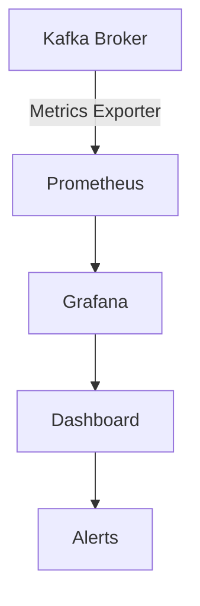
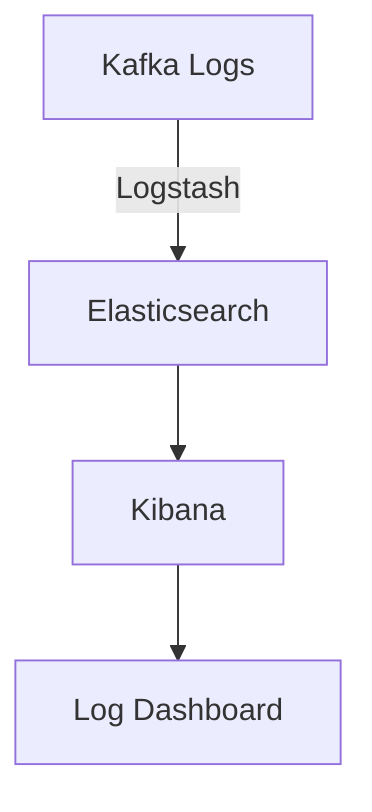

## 13.8.2 Observing System Behavior

In the realm of distributed systems, particularly with Apache Kafka, observing system behavior is crucial for maintaining reliability and performance. This section delves into the advanced techniques for monitoring and analyzing Kafka systems, especially during chaos engineering experiments. By capturing and interpreting system metrics and logs, you can identify anomalies, understand system dynamics, and implement improvements to enhance fault tolerance.

### Importance of Observing System Behavior

Observing system behavior is essential for several reasons:

- **Identifying Anomalies**: Detect unexpected behaviors or performance issues that could indicate underlying problems.
- **Understanding System Dynamics**: Gain insights into how different components interact and affect overall system performance.
- **Enhancing Reliability**: Use observations to make informed decisions about system improvements and fault tolerance strategies.
- **Validating Chaos Experiments**: Ensure that chaos engineering experiments yield meaningful data that can be used to improve system resilience.

### Tools and Techniques for Capturing System Metrics and Logs

To effectively observe system behavior, you need to capture a wide range of metrics and logs. Here are some tools and techniques to consider:

#### 1. Prometheus and Grafana

**Prometheus** is a powerful open-source monitoring and alerting toolkit that is widely used for capturing and querying metrics. **Grafana** complements Prometheus by providing a rich visualization platform for creating dashboards and alerts.

- **Setup**: Deploy Prometheus to collect metrics from Kafka brokers, producers, and consumers. Use Grafana to visualize these metrics in real-time.
- **Key Metrics**: Monitor metrics such as request latency, throughput, consumer lag, and broker health.

*Diagram: Prometheus and Grafana setup for monitoring Kafka metrics.*

#### 2. Apache Kafka's JMX Metrics

Kafka exposes a variety of metrics through Java Management Extensions (JMX). These metrics provide insights into broker performance, topic throughput, and consumer lag.

- **Configuration**: Enable JMX on Kafka brokers and configure a JMX exporter to scrape metrics.
- **Analysis**: Use these metrics to analyze broker load, partition distribution, and consumer group performance.

#### 3. ELK Stack (Elasticsearch, Logstash, Kibana)

The ELK Stack is a popular solution for log aggregation and analysis. It allows you to collect, parse, and visualize logs from Kafka components.

- **Log Collection**: Use Logstash to collect logs from Kafka brokers, producers, and consumers.
- **Visualization**: Use Kibana to create dashboards that visualize log data and identify patterns or anomalies.

*Diagram: ELK Stack setup for Kafka log analysis.*

#### 4. Distributed Tracing with OpenTelemetry

Distributed tracing provides a way to track requests as they flow through a distributed system. **OpenTelemetry** is an open-source observability framework that supports distributed tracing.

- **Instrumentation**: Instrument Kafka clients and brokers with OpenTelemetry to capture trace data.
- **Trace Analysis**: Use trace data to understand request flows, identify bottlenecks, and correlate events with system behavior.

### Analyzing Collected Data

Once you have captured metrics and logs, the next step is to analyze the data to gain insights into system behavior. Here are some techniques for effective analysis:

#### 1. Anomaly Detection

Anomaly detection involves identifying patterns in data that do not conform to expected behavior. Use machine learning algorithms or statistical methods to detect anomalies in Kafka metrics and logs.

- **Techniques**: Implement techniques such as clustering, time-series analysis, or supervised learning to identify anomalies.
- **Tools**: Use tools like Apache Spark MLlib or Python's Scikit-learn for anomaly detection.

#### 2. Correlating Events with System Behavior

Correlating events with system behavior involves linking specific events or changes in the system to observed metrics or logs.

- **Event Correlation**: Use tools like Grafana's alerting system or custom scripts to correlate events with changes in metrics.
- **Root Cause Analysis**: Perform root cause analysis to determine the underlying cause of anomalies or performance issues.

#### 3. Pattern Recognition

Pattern recognition involves identifying recurring patterns or trends in metrics and logs. This can help you understand normal system behavior and detect deviations.

- **Trend Analysis**: Use time-series analysis to identify trends in metrics such as throughput, latency, or error rates.
- **Visualization**: Use Grafana or Kibana to visualize patterns and trends in metrics and logs.

### Examples of Anomalies and Patterns to Look For

When observing system behavior, there are several anomalies and patterns to look for:

- **Increased Latency**: Sudden increases in request latency may indicate network issues or overloaded brokers.
- **Consumer Lag**: High consumer lag can indicate slow consumers or issues with partition distribution.
- **Broker Failures**: Frequent broker failures may indicate hardware issues or configuration problems.
- **Partition Imbalance**: Uneven partition distribution can lead to performance bottlenecks and increased latency.

### Strategies for Correlating Events with System Behavior

To effectively correlate events with system behavior, consider the following strategies:

#### 1. Use Tags and Labels

Use tags and labels to annotate metrics and logs with contextual information. This can help you correlate events with specific components or configurations.

- **Example**: Tag metrics with the Kafka cluster name, broker ID, or topic name to facilitate correlation.

#### 2. Implement Alerting and Notifications

Set up alerting and notifications to automatically detect and respond to anomalies or performance issues.

- **Tools**: Use Grafana's alerting system or Prometheus Alertmanager to configure alerts based on predefined thresholds.

#### 3. Perform Regular Audits

Conduct regular audits of system metrics and logs to identify potential issues before they impact system performance.

- **Audit Frequency**: Perform audits on a regular basis, such as weekly or monthly, to ensure system health.

### Conclusion

Observing system behavior is a critical component of maintaining reliable and performant Kafka systems. By capturing and analyzing system metrics and logs, you can identify anomalies, understand system dynamics, and implement improvements to enhance fault tolerance. Use the tools and techniques discussed in this section to effectively monitor and analyze your Kafka systems, and ensure that your chaos engineering experiments yield meaningful data that can be used to improve system resilience.

## Test Your Knowledge: Advanced Kafka System Monitoring Quiz



### What is the primary purpose of observing system behavior in Kafka?

- [x] To identify anomalies and enhance reliability
- [ ] To increase system complexity
- [ ] To reduce system performance
- [ ] To eliminate the need for monitoring

> **Explanation:** Observing system behavior helps identify anomalies and enhance reliability by providing insights into system dynamics and performance issues.

### Which tool is commonly used for capturing and visualizing Kafka metrics?

- [x] Prometheus and Grafana
- [ ] Apache Hadoop
- [ ] Docker
- [ ] Kubernetes

> **Explanation:** Prometheus is used for capturing metrics, and Grafana is used for visualizing them, making them a common choice for monitoring Kafka systems.

### What is the role of JMX in Kafka monitoring?

- [x] To expose metrics for broker performance and topic throughput
- [ ] To manage Kafka consumer groups
- [ ] To configure Kafka topics
- [ ] To deploy Kafka clusters

> **Explanation:** JMX exposes various metrics related to broker performance, topic throughput, and consumer lag, which are crucial for monitoring Kafka systems.

### How can distributed tracing be implemented in Kafka?

- [x] By using OpenTelemetry for capturing trace data
- [ ] By using Docker containers
- [ ] By configuring Kafka brokers
- [ ] By deploying additional Kafka topics

> **Explanation:** OpenTelemetry is an open-source observability framework that supports distributed tracing, allowing you to capture trace data in Kafka systems.

### What is anomaly detection used for in Kafka monitoring?

- [x] To identify patterns in data that do not conform to expected behavior
- [ ] To increase system latency
- [ ] To reduce system throughput
- [ ] To eliminate the need for logs

> **Explanation:** Anomaly detection is used to identify patterns in data that do not conform to expected behavior, helping to detect potential issues in Kafka systems.

### Which tool is part of the ELK Stack for log aggregation?

- [x] Logstash
- [ ] Prometheus
- [ ] Grafana
- [ ] Kubernetes

> **Explanation:** Logstash is part of the ELK Stack and is used for log aggregation and analysis in Kafka systems.

### What is the benefit of using tags and labels in Kafka monitoring?

- [x] To annotate metrics and logs with contextual information
- [ ] To increase system complexity
- [ ] To reduce system performance
- [ ] To eliminate the need for monitoring

> **Explanation:** Tags and labels help annotate metrics and logs with contextual information, facilitating the correlation of events with specific components or configurations.

### What is the purpose of setting up alerting and notifications in Kafka monitoring?

- [x] To automatically detect and respond to anomalies or performance issues
- [ ] To increase system complexity
- [ ] To reduce system performance
- [ ] To eliminate the need for monitoring

> **Explanation:** Alerting and notifications help automatically detect and respond to anomalies or performance issues, ensuring timely intervention and resolution.

### What is a common anomaly to look for in Kafka systems?

- [x] Increased latency
- [ ] Decreased throughput
- [ ] Reduced complexity
- [ ] Eliminated logs

> **Explanation:** Increased latency is a common anomaly that can indicate network issues or overloaded brokers in Kafka systems.

### True or False: Observing system behavior is only necessary during chaos engineering experiments.

- [x] False
- [ ] True

> **Explanation:** Observing system behavior is necessary at all times, not just during chaos engineering experiments, to ensure system reliability and performance.


