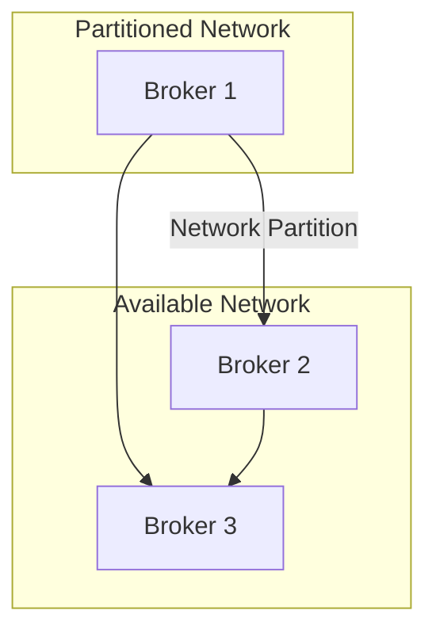

## 13.8.3 Simulating Network Partitions

### Introduction

Network partitions, often referred to as "split-brain" scenarios, are a common failure mode in distributed systems like Apache Kafka. They occur when network failures isolate parts of a system, leading to potential inconsistencies and challenges in maintaining data integrity and availability. Understanding how Kafka behaves under such conditions is crucial for building resilient, fault-tolerant systems. This section delves into the impact of network partitions on Kafka clusters, methods to simulate these partitions, and strategies to interpret results and enhance configurations.

### Impact of Network Partitions on Kafka Clusters

Network partitions can significantly affect Kafka's operation, impacting both data consistency and availability. Here are some key effects:

- **Leader Election Delays**: Partitions can delay leader elections, causing temporary unavailability of certain partitions.
- **Data Consistency Issues**: If a partition leader is isolated, writes may be lost or delayed, leading to potential data inconsistency.
- **Consumer Lag**: Consumers may experience lag as they wait for partition leaders to become available again.
- **Increased Latency**: Network partitions can increase message latency due to retries and reconnections.

Understanding these impacts is essential for diagnosing issues and optimizing Kafka's performance under network isolation conditions.

### Methods for Simulating Network Partitions

Simulating network partitions allows you to test Kafka's resilience and behavior under failure conditions. Here are some common methods:

#### 1. Using Firewall Rules

Firewall rules can be configured to block traffic between Kafka brokers, simulating a network partition. This method is straightforward and can be implemented on most operating systems.

- **Linux (iptables)**: Use `iptables` to block traffic between specific IP addresses or ports.
  
  ```bash
  # Block traffic between two Kafka brokers
  sudo iptables -A INPUT -s <broker_ip> -j DROP
  sudo iptables -A OUTPUT -d <broker_ip> -j DROP
  ```

- **Windows (netsh)**: Use `netsh` to configure firewall rules on Windows systems.

  ```bash
  netsh advfirewall firewall add rule name="Block Kafka Broker" dir=in action=block remoteip=<broker_ip>
  ```

#### 2. Network Emulators

Network emulators like `tc` (Traffic Control) on Linux can simulate network conditions such as latency, packet loss, and partitions.

- **Linux (tc)**: Use `tc` to introduce delays or drop packets between brokers.

  ```bash
  # Add latency to simulate network partition
  sudo tc qdisc add dev eth0 root netem delay 100ms
  ```

- **NetEm**: A powerful tool for simulating various network conditions, including partitions.

#### 3. Chaos Engineering Tools

Tools like Chaos Monkey for Kafka or Gremlin can automate the process of simulating network partitions and other failure scenarios.

- **Chaos Monkey for Kafka**: Specifically designed for Kafka, it can simulate broker failures and network partitions.
- **Gremlin**: A more general-purpose tool that can simulate a wide range of network conditions.

### Expected Behaviors and Potential Issues

When simulating network partitions, you should expect certain behaviors from your Kafka cluster:

- **Leader Re-election**: Kafka should attempt to re-elect leaders for partitions whose leaders are isolated.
- **Data Loss or Duplication**: Depending on your replication and acknowledgment settings, data loss or duplication may occur.
- **Increased Latency**: Expect increased latency as clients retry connections and brokers attempt to re-establish communication.

Potential issues include:

- **Split-Brain Scenarios**: Isolated brokers may continue to accept writes, leading to data divergence.
- **Inconsistent State**: Consumers may read stale or inconsistent data until partitions are resolved.
- **Resource Exhaustion**: Prolonged partitions can lead to resource exhaustion as brokers and clients retry operations.

### Interpreting Results and Improving Configurations

After simulating network partitions, it's crucial to analyze the results and adjust configurations to improve resilience:

#### 1. Analyze Logs and Metrics

- **Broker Logs**: Check broker logs for errors or warnings related to leader elections and network issues.
- **Consumer Lag**: Monitor consumer lag to identify delays in message processing.
- **Metrics**: Use tools like Prometheus and Grafana to visualize Kafka metrics and identify bottlenecks.

#### 2. Adjust Configuration Settings

- **Replication Factor**: Increase the replication factor to improve data availability during partitions.
- **Min In-Sync Replicas**: Adjust the `min.insync.replicas` setting to ensure data consistency.
- **Acks Setting**: Configure producer acknowledgment settings to balance between latency and data durability.

#### 3. Implement Best Practices

- **Regular Testing**: Regularly simulate network partitions as part of your testing strategy.
- **Chaos Engineering**: Incorporate chaos engineering practices to continuously test and improve system resilience.
- **Documentation**: Maintain thorough documentation of your Kafka architecture and failure scenarios.

### Code Examples

Below are code examples in Java, Scala, Kotlin, and Clojure to demonstrate handling network partitions in Kafka applications.

#### Java Example

```java
import org.apache.kafka.clients.producer.KafkaProducer;
import org.apache.kafka.clients.producer.ProducerConfig;
import org.apache.kafka.clients.producer.ProducerRecord;
import org.apache.kafka.common.serialization.StringSerializer;

import java.util.Properties;

public class KafkaProducerExample {
    public static void main(String[] args) {
        Properties props = new Properties();
        props.put(ProducerConfig.BOOTSTRAP_SERVERS_CONFIG, "localhost:9092");
        props.put(ProducerConfig.KEY_SERIALIZER_CLASS_CONFIG, StringSerializer.class.getName());
        props.put(ProducerConfig.VALUE_SERIALIZER_CLASS_CONFIG, StringSerializer.class.getName());
        props.put(ProducerConfig.ACKS_CONFIG, "all");

        KafkaProducer<String, String> producer = new KafkaProducer<>(props);
        try {
            for (int i = 0; i < 10; i++) {
                producer.send(new ProducerRecord<>("test-topic", Integer.toString(i), "message-" + i));
            }
        } finally {
            producer.close();
        }
    }
}
```

#### Scala Example

```scala
import org.apache.kafka.clients.producer.{KafkaProducer, ProducerConfig, ProducerRecord}
import org.apache.kafka.common.serialization.StringSerializer

import java.util.Properties

object KafkaProducerExample extends App {
  val props = new Properties()
  props.put(ProducerConfig.BOOTSTRAP_SERVERS_CONFIG, "localhost:9092")
  props.put(ProducerConfig.KEY_SERIALIZER_CLASS_CONFIG, classOf[StringSerializer].getName)
  props.put(ProducerConfig.VALUE_SERIALIZER_CLASS_CONFIG, classOf[StringSerializer].getName)
  props.put(ProducerConfig.ACKS_CONFIG, "all")

  val producer = new KafkaProducer[String, String](props)

  try {
    for (i <- 0 until 10) {
      producer.send(new ProducerRecord[String, String]("test-topic", i.toString, s"message-$i"))
    }
  } finally {
    producer.close()
  }
}
```

#### Kotlin Example

```kotlin
import org.apache.kafka.clients.producer.KafkaProducer
import org.apache.kafka.clients.producer.ProducerConfig
import org.apache.kafka.clients.producer.ProducerRecord
import org.apache.kafka.common.serialization.StringSerializer
import java.util.Properties

fun main() {
    val props = Properties().apply {
        put(ProducerConfig.BOOTSTRAP_SERVERS_CONFIG, "localhost:9092")
        put(ProducerConfig.KEY_SERIALIZER_CLASS_CONFIG, StringSerializer::class.java.name)
        put(ProducerConfig.VALUE_SERIALIZER_CLASS_CONFIG, StringSerializer::class.java.name)
        put(ProducerConfig.ACKS_CONFIG, "all")
    }

    val producer = KafkaProducer<String, String>(props)

    try {
        for (i in 0 until 10) {
            producer.send(ProducerRecord("test-topic", i.toString(), "message-$i"))
        }
    } finally {
        producer.close()
    }
}
```

#### Clojure Example

```clojure
(require '[clojure.java.io :as io])
(import '[org.apache.kafka.clients.producer KafkaProducer ProducerConfig ProducerRecord]
        '[org.apache.kafka.common.serialization StringSerializer])

(defn create-producer []
  (let [props (doto (java.util.Properties.)
                (.put ProducerConfig/BOOTSTRAP_SERVERS_CONFIG "localhost:9092")
                (.put ProducerConfig/KEY_SERIALIZER_CLASS_CONFIG StringSerializer)
                (.put ProducerConfig/VALUE_SERIALIZER_CLASS_CONFIG StringSerializer)
                (.put ProducerConfig/ACKS_CONFIG "all"))]
    (KafkaProducer. props)))

(defn send-messages [producer]
  (doseq [i (range 10)]
    (.send producer (ProducerRecord. "test-topic" (str i) (str "message-" i)))))

(defn -main []
  (let [producer (create-producer)]
    (try
      (send-messages producer)
      (finally
        (.close producer)))))
```

### Visualizing Network Partitions

To better understand the impact of network partitions, consider the following diagram illustrating a Kafka cluster under partition:



**Caption**: This diagram shows a Kafka cluster with three brokers, where Broker 1 is isolated due to a network partition.

### Conclusion

Simulating network partitions is a critical aspect of chaos engineering and testing the resilience of Apache Kafka clusters. By understanding the impact of partitions, using tools to simulate them, and analyzing the results, you can improve the fault tolerance and reliability of your Kafka deployments. Regular testing and configuration adjustments are essential to maintaining a robust and resilient Kafka infrastructure.

## Test Your Knowledge: Simulating Network Partitions in Kafka



### What is a common impact of network partitions on Kafka clusters?

- [x] Leader election delays
- [ ] Increased throughput
- [ ] Reduced disk usage
- [ ] Improved latency

> **Explanation:** Network partitions can delay leader elections, causing temporary unavailability of certain partitions.

### Which tool can be used to simulate network conditions like latency and packet loss on Linux?

- [x] tc (Traffic Control)
- [ ] iptables
- [ ] netsh
- [ ] Chaos Monkey

> **Explanation:** `tc` (Traffic Control) is a Linux tool that can simulate network conditions such as latency and packet loss.

### What is the purpose of simulating network partitions in Kafka?

- [x] To test Kafka's resilience and behavior under failure conditions
- [ ] To increase Kafka's throughput
- [ ] To reduce Kafka's storage requirements
- [ ] To improve Kafka's user interface

> **Explanation:** Simulating network partitions helps test Kafka's resilience and behavior under failure conditions.

### Which configuration setting can be adjusted to improve data availability during network partitions?

- [x] Replication Factor
- [ ] Batch Size
- [ ] Compression Type
- [ ] Buffer Size

> **Explanation:** Increasing the replication factor can improve data availability during network partitions.

### What is a potential issue caused by network partitions in Kafka?

- [x] Split-brain scenarios
- [ ] Reduced consumer lag
- [ ] Increased data consistency
- [ ] Improved network speed

> **Explanation:** Network partitions can lead to split-brain scenarios where isolated brokers may continue to accept writes, leading to data divergence.

### Which tool is specifically designed for simulating broker failures and network partitions in Kafka?

- [x] Chaos Monkey for Kafka
- [ ] Prometheus
- [ ] Grafana
- [ ] NetEm

> **Explanation:** Chaos Monkey for Kafka is specifically designed for simulating broker failures and network partitions.

### What should be monitored to identify delays in message processing during network partitions?

- [x] Consumer Lag
- [ ] Disk Usage
- [ ] CPU Load
- [ ] Memory Usage

> **Explanation:** Monitoring consumer lag helps identify delays in message processing during network partitions.

### How can firewall rules be used in simulating network partitions?

- [x] By blocking traffic between specific IP addresses or ports
- [ ] By increasing bandwidth
- [ ] By reducing latency
- [ ] By compressing data

> **Explanation:** Firewall rules can block traffic between specific IP addresses or ports, simulating network partitions.

### What is the role of `min.insync.replicas` in Kafka?

- [x] To ensure data consistency
- [ ] To increase throughput
- [ ] To reduce latency
- [ ] To improve user interface

> **Explanation:** The `min.insync.replicas` setting ensures data consistency by requiring a minimum number of replicas to acknowledge a write.

### True or False: Network partitions always improve Kafka's performance.

- [ ] True
- [x] False

> **Explanation:** Network partitions can negatively impact Kafka's performance by causing delays, data inconsistency, and increased latency.



---
