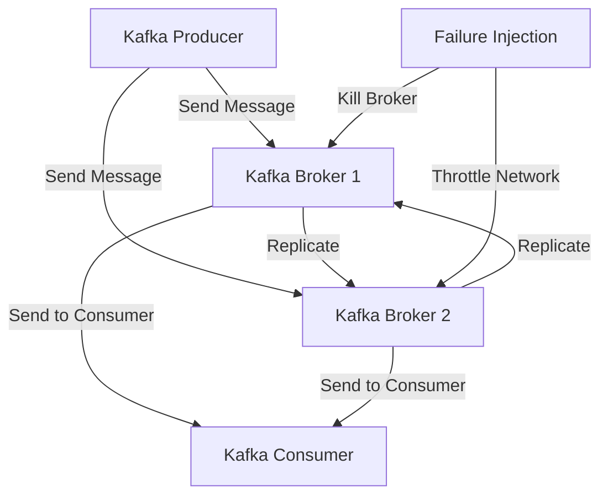

## 13.8.4 Failure Injection Techniques

In the realm of distributed systems, ensuring resilience and fault tolerance is paramount. Apache Kafka, as a distributed streaming platform, is no exception. Failure injection techniques are a cornerstone of chaos engineering, allowing teams to proactively test the robustness of their Kafka deployments. This section delves into various methods for injecting failures into Kafka systems, the tools available for such tasks, and the strategies to mitigate associated risks.

### Introduction to Failure Injection

Failure injection involves deliberately introducing faults into a system to observe its behavior under stress. This practice helps identify weaknesses and improve system resilience. In the context of Kafka, failure injection can simulate scenarios such as broker failures, network partitions, and data corruption.

### Common Failure Injection Methods

#### 1. Killing Brokers

One of the most straightforward failure injection techniques is to kill Kafka brokers. This simulates scenarios where brokers crash unexpectedly, allowing you to test the system's ability to handle such failures.

- **Implementation**: Use scripts or tools to stop Kafka broker processes on specific nodes.
- **Objective**: Assess the impact on data availability and consumer lag.

#### 2. Throttling Resources

Resource throttling involves limiting the CPU, memory, or network bandwidth available to Kafka components. This technique helps evaluate how resource constraints affect performance and stability.

- **Implementation**: Use Linux tools like `tc` for network throttling or `cgroups` for CPU and memory limits.
- **Objective**: Determine the system's behavior under constrained resources.

#### 3. Network Partitions

Simulating network partitions, or "split-brain" scenarios, can reveal how Kafka handles communication breakdowns between brokers or between brokers and clients.

- **Implementation**: Use network tools to block or delay traffic between specific nodes.
- **Objective**: Test Kafka's partition tolerance and data consistency.

#### 4. Data Corruption

Injecting data corruption involves altering messages in transit or at rest to test Kafka's data integrity mechanisms.

- **Implementation**: Use scripts to modify data in Kafka topics or intercept and alter messages.
- **Objective**: Evaluate the system's ability to detect and recover from data corruption.

#### 5. Inducing Latency

Introducing artificial latency into Kafka's data flow can help assess the impact on real-time processing and consumer lag.

- **Implementation**: Use network tools to delay packets or introduce processing delays in Kafka components.
- **Objective**: Understand the effects of latency on data throughput and processing accuracy.

### Tools for Failure Injection

Several tools are available to facilitate failure injection in Kafka systems. These tools provide controlled environments for testing and often include features for monitoring and analysis.

#### Chaos Monkey

Chaos Monkey, part of the Netflix Simian Army, is a tool designed to randomly terminate instances in production environments. While originally developed for AWS, it can be adapted for use with Kafka.

- **Features**: Random instance termination, configurable schedules.
- **Use Case**: Test the resilience of Kafka clusters by randomly killing broker instances.

#### Gremlin

Gremlin is a comprehensive chaos engineering platform that offers a wide range of failure injection scenarios, including CPU throttling, network latency, and process termination.

- **Features**: User-friendly interface, extensive failure scenarios, real-time monitoring.
- **Use Case**: Conduct controlled chaos experiments on Kafka clusters to identify weaknesses.

#### Chaos Toolkit

Chaos Toolkit is an open-source tool that provides a framework for running chaos experiments. It supports various extensions and integrations, making it versatile for Kafka environments.

- **Features**: Extensible architecture, support for multiple platforms.
- **Use Case**: Automate chaos experiments in Kafka environments with customizable scenarios.

### Risks and Mitigation Strategies

While failure injection is a powerful technique for improving system resilience, it comes with inherent risks. It's crucial to conduct these experiments in a controlled and reversible manner to avoid unintended consequences.

#### Risks

- **Data Loss**: Uncontrolled experiments can lead to data loss or corruption.
- **Service Disruption**: Failure injection can cause temporary service outages.
- **Resource Overload**: Excessive resource throttling may lead to system instability.

#### Mitigation Strategies

- **Controlled Environment**: Conduct experiments in a staging environment or during low-traffic periods.
- **Reversibility**: Ensure that all experiments can be rolled back quickly to restore normal operations.
- **Monitoring and Alerts**: Implement robust monitoring and alerting to detect and respond to issues promptly.

### Importance of Controlled and Reversible Experiments

Controlled and reversible experiments are essential to minimize the risks associated with failure injection. By carefully planning and executing these experiments, teams can gain valuable insights into system behavior without compromising production stability.

- **Controlled Experiments**: Define clear objectives and scope for each experiment. Use tools that allow precise control over failure scenarios.
- **Reversibility**: Implement mechanisms to quickly revert changes and restore system state. This includes automated scripts for restarting services or restoring data.

### Practical Applications and Real-World Scenarios

Failure injection techniques are not just theoretical exercises; they have practical applications in real-world scenarios. By simulating failures, organizations can:

- **Identify Weak Points**: Discover vulnerabilities in Kafka configurations and infrastructure.
- **Improve Incident Response**: Train teams to respond effectively to unexpected failures.
- **Enhance System Design**: Use insights from experiments to inform architectural decisions and improve system design.

### Code Examples

To illustrate failure injection techniques, let's explore code examples in Java, Scala, Kotlin, and Clojure for simulating broker failures and network partitions.

#### Java Example: Simulating Broker Failure

```java
import java.io.IOException;

public class BrokerFailureSimulator {

    public static void main(String[] args) {
        String brokerHost = "localhost";
        int brokerPort = 9092;

        try {
            // Simulate broker failure by shutting down the broker process
            Runtime.getRuntime().exec("ssh " + brokerHost + " 'sudo systemctl stop kafka'");
            System.out.println("Broker at " + brokerHost + ":" + brokerPort + " stopped.");
        } catch (IOException e) {
            e.printStackTrace();
        }
    }
}
```

#### Scala Example: Inducing Network Partition

```scala
import sys.process._

object NetworkPartitionSimulator extends App {
  val brokerHost = "localhost"
  val partitionCommand = s"iptables -A INPUT -s $brokerHost -j DROP"

  // Induce network partition by blocking traffic to the broker
  partitionCommand.!
  println(s"Network partition induced for broker at $brokerHost.")
}
```

#### Kotlin Example: Throttling CPU Resources

```kotlin
import java.io.IOException

fun main() {
    val brokerHost = "localhost"
    val throttleCommand = "ssh $brokerHost 'cpulimit -l 50 -p $(pgrep -f kafka)'"

    try {
        // Throttle CPU resources for the Kafka broker
        Runtime.getRuntime().exec(throttleCommand)
        println("CPU resources throttled for broker at $brokerHost.")
    } catch (e: IOException) {
        e.printStackTrace()
    }
}
```

#### Clojure Example: Injecting Latency

```clojure
(ns latency-injector
  (:require [clojure.java.shell :refer [sh]]))

(defn inject-latency [broker-host]
  (let [latency-command (str "ssh " broker-host " 'tc qdisc add dev eth0 root netem delay 100ms'")]
    (sh "bash" "-c" latency-command)
    (println (str "Latency injected for broker at " broker-host))))

(inject-latency "localhost")
```

### Visualizing Failure Injection

To better understand the impact of failure injection on Kafka systems, consider the following diagram illustrating a typical failure injection scenario.



**Diagram Description**: This diagram shows a Kafka producer sending messages to two brokers. Failure injection is applied to simulate broker failure and network throttling, affecting message delivery to consumers.

### Conclusion

Failure injection techniques are invaluable for testing the resilience and fault tolerance of Apache Kafka systems. By simulating various failure scenarios, teams can identify weaknesses, improve system design, and enhance incident response capabilities. However, it's crucial to conduct these experiments in a controlled and reversible manner to mitigate risks and ensure production stability.

## Test Your Knowledge: Advanced Failure Injection Techniques in Kafka



### What is the primary goal of failure injection in Kafka systems?

- [x] To identify weaknesses and improve system resilience.
- [ ] To increase system performance.
- [ ] To reduce operational costs.
- [ ] To enhance data security.

> **Explanation:** Failure injection aims to identify weaknesses and improve system resilience by simulating various failure scenarios.

### Which tool is part of the Netflix Simian Army and is used for failure injection?

- [x] Chaos Monkey
- [ ] Gremlin
- [ ] Chaos Toolkit
- [ ] Fault Injection Simulator

> **Explanation:** Chaos Monkey is part of the Netflix Simian Army and is used for failure injection by randomly terminating instances.

### What is a key risk associated with failure injection?

- [x] Data loss
- [ ] Increased performance
- [ ] Reduced latency
- [ ] Enhanced security

> **Explanation:** A key risk of failure injection is data loss, which can occur if experiments are not controlled and reversible.

### What is the purpose of throttling resources in failure injection?

- [x] To evaluate how resource constraints affect performance and stability.
- [ ] To increase system throughput.
- [ ] To enhance data encryption.
- [ ] To improve user experience.

> **Explanation:** Throttling resources helps evaluate how resource constraints affect performance and stability.

### Which command can be used to simulate a network partition in a Linux environment?

- [x] iptables
- [ ] cpulimit
- [ ] tc
- [ ] netem

> **Explanation:** The `iptables` command can be used to simulate a network partition by blocking traffic.

### What is the benefit of conducting controlled and reversible experiments?

- [x] Minimize risks and avoid unintended consequences.
- [ ] Increase system complexity.
- [ ] Reduce system redundancy.
- [ ] Enhance data privacy.

> **Explanation:** Controlled and reversible experiments minimize risks and avoid unintended consequences.

### Which programming language is used in the example for simulating broker failure?

- [x] Java
- [ ] Scala
- [ ] Kotlin
- [ ] Clojure

> **Explanation:** The Java example demonstrates simulating broker failure by stopping the broker process.

### What is the role of monitoring and alerts in failure injection?

- [x] To detect and respond to issues promptly.
- [ ] To increase system load.
- [ ] To reduce system latency.
- [ ] To enhance data encryption.

> **Explanation:** Monitoring and alerts help detect and respond to issues promptly during failure injection.

### Which tool offers a user-friendly interface and extensive failure scenarios for chaos engineering?

- [x] Gremlin
- [ ] Chaos Monkey
- [ ] Chaos Toolkit
- [ ] Fault Injection Simulator

> **Explanation:** Gremlin offers a user-friendly interface and extensive failure scenarios for chaos engineering.

### True or False: Failure injection should only be conducted in production environments.

- [ ] True
- [x] False

> **Explanation:** Failure injection should be conducted in controlled environments, such as staging, to avoid unintended consequences in production.


