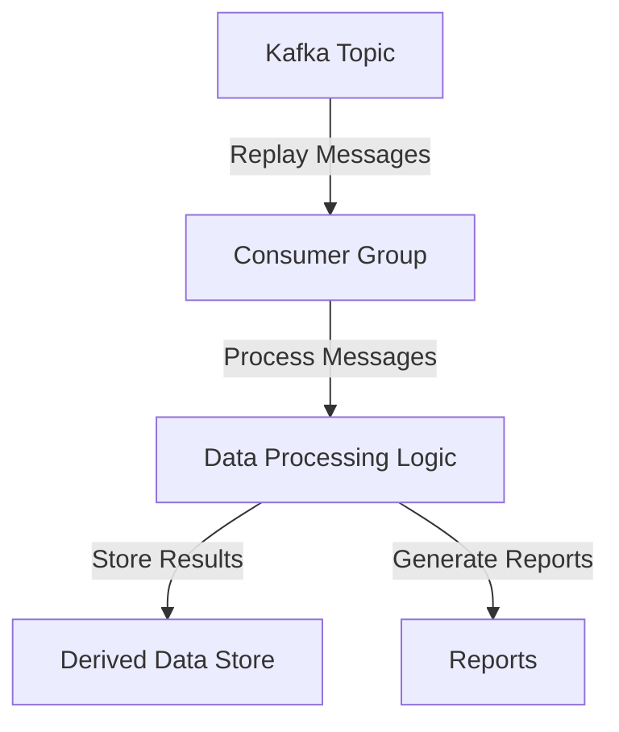

## 13.9.1 Use Cases for Reprocessing

Reprocessing in Apache Kafka is a powerful mechanism that allows systems to replay and reprocess messages from the past. This capability is crucial for maintaining data integrity, correcting errors, and adapting to changes in business logic or algorithms. In this section, we will explore various use cases where reprocessing is necessary or beneficial, discuss the value gained from reprocessing, and examine the potential impact on system resources.

### Introduction to Reprocessing

Reprocessing involves replaying messages from a Kafka topic to re-execute processing logic. This can be necessary for several reasons, including correcting data errors, updating derived data stores, or implementing new business logic. Reprocessing is a critical component of fault-tolerant and reliable systems, as it allows for the correction of past mistakes and the adaptation to new requirements.

### Common Use Cases for Reprocessing

#### 1. Correcting Data Errors

One of the most common use cases for reprocessing is correcting data errors. Data errors can occur due to various reasons, such as bugs in data processing logic, incorrect data inputs, or external system failures. Reprocessing allows you to correct these errors by replaying the affected messages and applying the corrected logic.

**Example Scenario**: Suppose a bug in a data processing application caused incorrect calculations in a financial report. By reprocessing the affected messages with the corrected logic, you can regenerate the report with accurate data.

#### 2. Algorithm Changes

As business requirements evolve, algorithms used in data processing may need to be updated. Reprocessing allows you to apply new algorithms to historical data, ensuring that derived data stores and reports reflect the latest business logic.

**Example Scenario**: A recommendation engine's algorithm is updated to include new factors for personalization. By reprocessing historical user interaction data, the system can generate updated recommendations that incorporate the new algorithm.

#### 3. Schema Evolution

In a dynamic data environment, schemas may evolve over time. Reprocessing can be used to apply new schemas to historical data, ensuring consistency and compatibility across data stores.

**Example Scenario**: A new field is added to a customer profile schema. By reprocessing past customer data, the system can populate the new field with default or derived values, maintaining schema consistency.

#### 4. Data Enrichment

Reprocessing can be used to enrich historical data with new information. This is particularly useful when new data sources become available or when additional context is needed for analysis.

**Example Scenario**: A new data source providing weather information is integrated into a logistics system. By reprocessing historical shipment data, the system can enrich it with weather conditions at the time of shipment, providing valuable insights for route optimization.

#### 5. Compliance and Auditing

Regulatory requirements may necessitate reprocessing to ensure compliance with data standards or to generate audit trails. Reprocessing allows you to apply new compliance rules to historical data.

**Example Scenario**: A new regulation requires additional data masking for sensitive information. By reprocessing historical data, the system can apply the new masking rules, ensuring compliance with the regulation.

#### 6. Performance Optimization

Reprocessing can be used to optimize performance by recalculating derived data with more efficient algorithms or data structures. This can lead to improved query performance and reduced storage costs.

**Example Scenario**: A data warehouse is optimized by recalculating aggregate tables with a more efficient algorithm. By reprocessing historical data, the system can regenerate the aggregates, improving query performance.

#### 7. Disaster Recovery

In the event of a system failure or data loss, reprocessing can be used to recover lost data by replaying messages from a backup or replica.

**Example Scenario**: A database failure results in the loss of transaction data. By reprocessing messages from a Kafka topic, the system can recover the lost transactions and restore the database to its previous state.

### Value Gained from Reprocessing

Reprocessing provides several benefits, including:

- **Data Integrity**: Ensures that data is accurate and consistent across systems.
- **Adaptability**: Allows systems to adapt to changes in business logic, algorithms, or schemas.
- **Compliance**: Ensures compliance with regulatory requirements by applying new rules to historical data.
- **Performance**: Optimizes performance by recalculating derived data with more efficient algorithms.
- **Resilience**: Enhances system resilience by enabling recovery from errors or failures.

### Impact on System Resources

While reprocessing offers significant benefits, it can also impact system resources. Reprocessing involves replaying messages, which can increase load on Kafka brokers, consumers, and downstream systems. It is important to consider the following factors when planning reprocessing:

- **Resource Utilization**: Reprocessing can consume significant CPU, memory, and network resources. It is important to monitor resource utilization and adjust processing capacity as needed.
- **Throughput and Latency**: Reprocessing can affect throughput and latency, especially if large volumes of data are being replayed. It is important to balance reprocessing with regular processing to minimize impact on system performance.
- **Storage Requirements**: Reprocessing may require additional storage for intermediate results or backup data. It is important to ensure that sufficient storage is available to support reprocessing.
- **Coordination and Scheduling**: Reprocessing may need to be coordinated with other system activities to avoid conflicts or resource contention. It is important to schedule reprocessing during periods of low system load to minimize impact on regular operations.

### Implementation Considerations

When implementing reprocessing, consider the following best practices:

- **Use Kafka's Offset Management**: Leverage Kafka's offset management capabilities to track progress and ensure that messages are replayed in the correct order.
- **Implement Idempotent Processing**: Ensure that processing logic is idempotent, meaning that reprocessing the same message multiple times produces the same result. This prevents duplicate processing and ensures data consistency.
- **Monitor and Optimize Resource Usage**: Monitor resource usage during reprocessing and optimize processing logic to minimize impact on system performance.
- **Test Reprocessing Logic**: Thoroughly test reprocessing logic to ensure that it produces the desired results and does not introduce new errors.

### Code Examples

Below are code examples demonstrating reprocessing in Java, Scala, Kotlin, and Clojure.

#### Java Example

```java
import org.apache.kafka.clients.consumer.ConsumerConfig;
import org.apache.kafka.clients.consumer.KafkaConsumer;
import org.apache.kafka.clients.consumer.ConsumerRecords;
import org.apache.kafka.clients.consumer.ConsumerRecord;
import java.util.Properties;
import java.util.Collections;

public class ReprocessingExample {
    public static void main(String[] args) {
        Properties props = new Properties();
        props.put(ConsumerConfig.BOOTSTRAP_SERVERS_CONFIG, "localhost:9092");
        props.put(ConsumerConfig.GROUP_ID_CONFIG, "reprocessing-group");
        props.put(ConsumerConfig.KEY_DESERIALIZER_CLASS_CONFIG, "org.apache.kafka.common.serialization.StringDeserializer");
        props.put(ConsumerConfig.VALUE_DESERIALIZER_CLASS_CONFIG, "org.apache.kafka.common.serialization.StringDeserializer");
        props.put(ConsumerConfig.AUTO_OFFSET_RESET_CONFIG, "earliest"); // Start from the beginning

        KafkaConsumer<String, String> consumer = new KafkaConsumer<>(props);
        consumer.subscribe(Collections.singletonList("my-topic"));

        while (true) {
            ConsumerRecords<String, String> records = consumer.poll(100);
            for (ConsumerRecord<String, String> record : records) {
                // Process each record
                System.out.printf("Reprocessing record with key %s and value %s%n", record.key(), record.value());
            }
        }
    }
}
```

#### Scala Example

```scala
import org.apache.kafka.clients.consumer.{ConsumerConfig, KafkaConsumer}
import java.util.Properties
import scala.collection.JavaConverters._

object ReprocessingExample extends App {
  val props = new Properties()
  props.put(ConsumerConfig.BOOTSTRAP_SERVERS_CONFIG, "localhost:9092")
  props.put(ConsumerConfig.GROUP_ID_CONFIG, "reprocessing-group")
  props.put(ConsumerConfig.KEY_DESERIALIZER_CLASS_CONFIG, "org.apache.kafka.common.serialization.StringDeserializer")
  props.put(ConsumerConfig.VALUE_DESERIALIZER_CLASS_CONFIG, "org.apache.kafka.common.serialization.StringDeserializer")
  props.put(ConsumerConfig.AUTO_OFFSET_RESET_CONFIG, "earliest") // Start from the beginning

  val consumer = new KafkaConsumer[String, String](props)
  consumer.subscribe(List("my-topic").asJava)

  while (true) {
    val records = consumer.poll(100).asScala
    for (record <- records) {
      // Process each record
      println(s"Reprocessing record with key ${record.key()} and value ${record.value()}")
    }
  }
}
```

#### Kotlin Example

```kotlin
import org.apache.kafka.clients.consumer.ConsumerConfig
import org.apache.kafka.clients.consumer.KafkaConsumer
import org.apache.kafka.clients.consumer.ConsumerRecords
import org.apache.kafka.clients.consumer.ConsumerRecord
import java.util.Properties

fun main() {
    val props = Properties().apply {
        put(ConsumerConfig.BOOTSTRAP_SERVERS_CONFIG, "localhost:9092")
        put(ConsumerConfig.GROUP_ID_CONFIG, "reprocessing-group")
        put(ConsumerConfig.KEY_DESERIALIZER_CLASS_CONFIG, "org.apache.kafka.common.serialization.StringDeserializer")
        put(ConsumerConfig.VALUE_DESERIALIZER_CLASS_CONFIG, "org.apache.kafka.common.serialization.StringDeserializer")
        put(ConsumerConfig.AUTO_OFFSET_RESET_CONFIG, "earliest") // Start from the beginning
    }

    val consumer = KafkaConsumer<String, String>(props)
    consumer.subscribe(listOf("my-topic"))

    while (true) {
        val records: ConsumerRecords<String, String> = consumer.poll(100)
        for (record: ConsumerRecord<String, String> in records) {
            // Process each record
            println("Reprocessing record with key ${record.key()} and value ${record.value()}")
        }
    }
}
```

#### Clojure Example

```clojure
(import '[org.apache.kafka.clients.consumer KafkaConsumer ConsumerConfig]
        '[java.util Properties Collections])

(defn reprocessing-example []
  (let [props (doto (Properties.)
                (.put ConsumerConfig/BOOTSTRAP_SERVERS_CONFIG "localhost:9092")
                (.put ConsumerConfig/GROUP_ID_CONFIG "reprocessing-group")
                (.put ConsumerConfig/KEY_DESERIALIZER_CLASS_CONFIG "org.apache.kafka.common.serialization.StringDeserializer")
                (.put ConsumerConfig/VALUE_DESERIALIZER_CLASS_CONFIG "org.apache.kafka.common.serialization.StringDeserializer")
                (.put ConsumerConfig/AUTO_OFFSET_RESET_CONFIG "earliest")) ; Start from the beginning
        consumer (KafkaConsumer. props)]
    (.subscribe consumer (Collections/singletonList "my-topic"))
    (while true
      (let [records (.poll consumer 100)]
        (doseq [record records]
          ;; Process each record
          (println (format "Reprocessing record with key %s and value %s" (.key record) (.value record))))))))

(reprocessing-example)
```

### Visualizing Reprocessing

To better understand the reprocessing workflow, consider the following diagram that illustrates the flow of messages during reprocessing:



**Caption**: This diagram illustrates the reprocessing workflow, where messages are replayed from a Kafka topic, processed by a consumer group, and stored in a derived data store or used to generate reports.

### Conclusion

Reprocessing is a powerful tool in Apache Kafka that enables systems to correct data errors, adapt to changes, and ensure compliance. By understanding the use cases and implementation considerations for reprocessing, you can leverage this capability to enhance the reliability and adaptability of your data processing systems. However, it is important to carefully manage the impact on system resources and ensure that reprocessing logic is thoroughly tested and optimized.

## Test Your Knowledge: Reprocessing Use Cases in Apache Kafka



### What is a common use case for reprocessing in Apache Kafka?

- [x] Correcting data errors
- [ ] Increasing message throughput
- [ ] Reducing storage costs
- [ ] Enhancing security

> **Explanation:** Reprocessing is commonly used to correct data errors by replaying messages and applying corrected logic.

### How does reprocessing help with algorithm changes?

- [x] By applying new algorithms to historical data
- [ ] By reducing the need for schema evolution
- [ ] By increasing data throughput
- [ ] By enhancing security protocols

> **Explanation:** Reprocessing allows new algorithms to be applied to historical data, ensuring that derived data reflects the latest business logic.

### What is the impact of reprocessing on system resources?

- [x] It can increase CPU, memory, and network usage
- [ ] It reduces storage requirements
- [ ] It decreases network latency
- [ ] It enhances security measures

> **Explanation:** Reprocessing can increase resource utilization, including CPU, memory, and network usage, due to the replay of messages.

### Why is idempotent processing important in reprocessing?

- [x] To ensure that reprocessing the same message multiple times produces the same result
- [ ] To increase message throughput
- [ ] To reduce storage costs
- [ ] To enhance security protocols

> **Explanation:** Idempotent processing ensures that reprocessing the same message multiple times produces the same result, preventing duplicate processing.

### What is a benefit of reprocessing for compliance?

- [x] Ensures compliance with new regulatory requirements
- [ ] Increases message throughput
- [ ] Reduces storage costs
- [ ] Enhances security protocols

> **Explanation:** Reprocessing ensures compliance by applying new regulatory requirements to historical data.

### How can reprocessing be used in disaster recovery?

- [x] By replaying messages from a backup to recover lost data
- [ ] By increasing message throughput
- [ ] By reducing storage costs
- [ ] By enhancing security protocols

> **Explanation:** Reprocessing can be used to recover lost data by replaying messages from a backup or replica.

### What is a potential drawback of reprocessing?

- [x] Increased load on Kafka brokers and consumers
- [ ] Reduced data integrity
- [ ] Decreased message throughput
- [ ] Enhanced security risks

> **Explanation:** Reprocessing can increase the load on Kafka brokers and consumers, affecting system performance.

### How can reprocessing optimize performance?

- [x] By recalculating derived data with more efficient algorithms
- [ ] By increasing message throughput
- [ ] By reducing storage costs
- [ ] By enhancing security protocols

> **Explanation:** Reprocessing can optimize performance by recalculating derived data with more efficient algorithms, improving query performance.

### What is a key consideration when implementing reprocessing?

- [x] Ensuring that processing logic is idempotent
- [ ] Increasing message throughput
- [ ] Reducing storage costs
- [ ] Enhancing security protocols

> **Explanation:** Ensuring that processing logic is idempotent is crucial to prevent duplicate processing and ensure data consistency.

### True or False: Reprocessing can be used to enrich historical data with new information.

- [x] True
- [ ] False

> **Explanation:** True. Reprocessing can be used to enrich historical data with new information, such as additional context or data from new sources.


