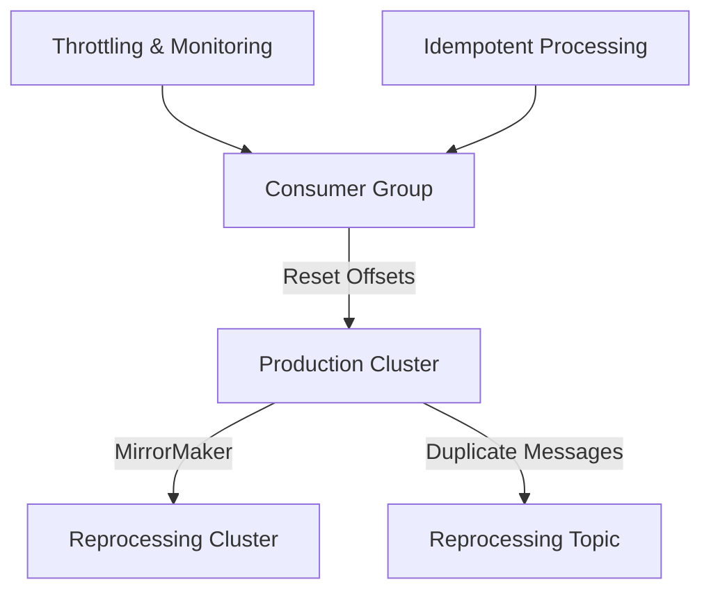

## 13.9.2 Strategies for Replaying Messages Safely

In the realm of distributed systems and real-time data processing, the ability to replay messages safely is crucial for maintaining data integrity and ensuring fault tolerance. Apache Kafka, with its robust architecture, provides several mechanisms to facilitate message replay. However, replaying messages can lead to challenges such as duplicate processing, system overload, and data inconsistency. This section delves into advanced strategies for replaying messages safely in Kafka, focusing on resetting consumer offsets, using separate reprocessing clusters or topics, throttling, monitoring, and ensuring idempotent processing.

### Resetting Consumer Offsets

Resetting consumer offsets is a fundamental technique for replaying messages in Kafka. This process involves adjusting the position from which a consumer reads messages in a topic, allowing for the reprocessing of messages from a specific point in time.

#### Understanding Consumer Offsets

Consumer offsets are markers that indicate the last successfully processed message by a consumer in a Kafka topic. These offsets are stored in a special Kafka topic called `__consumer_offsets`. By manipulating these offsets, you can control the starting point for message consumption.

#### Steps to Reset Consumer Offsets

1. **Identify the Consumer Group**: Determine the consumer group whose offsets need to be reset. This is crucial as offsets are tracked per consumer group.

2. **Choose the Reset Strategy**: Kafka provides several strategies for resetting offsets:
   - **Earliest**: Start consuming from the earliest available message.
   - **Latest**: Start consuming from the latest message.
   - **Timestamp**: Start consuming from messages after a specific timestamp.
   - **Specific Offset**: Start consuming from a specific offset.

3. **Use the Kafka Consumer Group Command**: Utilize the `kafka-consumer-groups.sh` script to reset offsets. For example, to reset offsets to the earliest position, use the following command:

    ```bash
    kafka-consumer-groups.sh --bootstrap-server <broker-list> --group <consumer-group> --reset-offsets --to-earliest --execute --topic <topic-name>
    ```

4. **Verify the Offset Reset**: After resetting, verify that the offsets have been adjusted correctly by describing the consumer group:

    ```bash
    kafka-consumer-groups.sh --bootstrap-server <broker-list> --group <consumer-group> --describe
    ```

#### Considerations for Offset Reset

- **Data Loss**: Resetting offsets to an earlier position can lead to duplicate processing. Ensure that your application logic can handle duplicates or implement idempotency.
- **System Load**: Replaying a large volume of messages can overwhelm the system. Consider using throttling to manage the load.

### Using Separate Reprocessing Clusters or Topics

To mitigate the impact of message replay on production systems, consider using separate reprocessing clusters or topics. This approach isolates the reprocessing workload, ensuring that it does not interfere with real-time processing.

#### Reprocessing Clusters

A reprocessing cluster is a dedicated Kafka cluster used exclusively for replaying messages. This setup allows you to replay messages without affecting the performance of the main production cluster.

- **Advantages**:
  - **Isolation**: Reprocessing activities do not impact the production cluster.
  - **Scalability**: The reprocessing cluster can be scaled independently based on the replay workload.

- **Implementation Steps**:
  1. **Set Up a Separate Cluster**: Deploy a Kafka cluster dedicated to reprocessing.
  2. **Mirror Topics**: Use tools like Kafka MirrorMaker to replicate topics from the production cluster to the reprocessing cluster.
  3. **Replay Messages**: Consume and process messages in the reprocessing cluster.

#### Reprocessing Topics

Alternatively, you can use separate topics within the same cluster for reprocessing. This involves duplicating messages into a reprocessing topic at the time of initial processing.

- **Advantages**:
  - **Simplicity**: No need to manage multiple clusters.
  - **Flexibility**: Allows selective replay of specific messages.

- **Implementation Steps**:
  1. **Create Reprocessing Topics**: Set up additional topics for reprocessing.
  2. **Duplicate Messages**: Use Kafka Streams or Kafka Connect to duplicate messages into reprocessing topics.
  3. **Replay Messages**: Consume and process messages from the reprocessing topics.

### Throttling and Monitoring During Replay

Throttling and monitoring are essential to ensure that message replay does not overwhelm the system or lead to performance degradation.

#### Throttling Techniques

Throttling controls the rate at which messages are replayed, preventing system overload.

- **Rate Limiting**: Implement rate limiting in your consumer application to control the message consumption rate.
- **Pause and Resume**: Use Kafka's pause and resume functionality to temporarily halt consumption when system resources are constrained.

#### Monitoring Strategies

Monitoring provides visibility into the replay process, allowing you to detect and address issues promptly.

- **Metrics Collection**: Collect and analyze metrics such as consumer lag, message throughput, and system resource utilization.
- **Alerting**: Set up alerts for anomalies such as high consumer lag or resource exhaustion.

### Ensuring Idempotent Processing

Idempotency is the property of an operation to produce the same result even if executed multiple times. Ensuring idempotent processing is crucial when replaying messages to prevent duplicate effects.

#### Techniques for Idempotent Processing

- **Idempotent Producers**: Use Kafka's idempotent producer feature to ensure that duplicate messages are not produced.
- **Deduplication Logic**: Implement deduplication logic in your consumer application to filter out duplicate messages.
- **Transactional Processing**: Use Kafka transactions to ensure that a series of operations are executed atomically.

#### Best Practices for Idempotency

- **Unique Identifiers**: Use unique identifiers for messages to facilitate deduplication.
- **State Management**: Maintain state information to track processed messages and avoid reprocessing.

### Code Examples

Let's explore code examples in Java, Scala, Kotlin, and Clojure to illustrate these concepts.

#### Java Example: Resetting Consumer Offsets

```java
import org.apache.kafka.clients.consumer.KafkaConsumer;
import org.apache.kafka.clients.consumer.ConsumerConfig;
import org.apache.kafka.clients.consumer.ConsumerRecords;
import org.apache.kafka.clients.consumer.ConsumerRecord;
import org.apache.kafka.common.TopicPartition;

import java.util.Collections;
import java.util.Properties;

public class OffsetResetExample {
    public static void main(String[] args) {
        Properties props = new Properties();
        props.put(ConsumerConfig.BOOTSTRAP_SERVERS_CONFIG, "localhost:9092");
        props.put(ConsumerConfig.GROUP_ID_CONFIG, "example-group");
        props.put(ConsumerConfig.KEY_DESERIALIZER_CLASS_CONFIG, "org.apache.kafka.common.serialization.StringDeserializer");
        props.put(ConsumerConfig.VALUE_DESERIALIZER_CLASS_CONFIG, "org.apache.kafka.common.serialization.StringDeserializer");

        KafkaConsumer<String, String> consumer = new KafkaConsumer<>(props);
        TopicPartition partition = new TopicPartition("example-topic", 0);
        consumer.assign(Collections.singletonList(partition));

        // Reset offset to the beginning
        consumer.seekToBeginning(Collections.singletonList(partition));

        while (true) {
            ConsumerRecords<String, String> records = consumer.poll(100);
            for (ConsumerRecord<String, String> record : records) {
                System.out.printf("offset = %d, key = %s, value = %s%n", record.offset(), record.key(), record.value());
            }
        }
    }
}
```

#### Scala Example: Throttling Consumer

```scala
import org.apache.kafka.clients.consumer.{KafkaConsumer, ConsumerConfig}
import java.util.Properties
import scala.collection.JavaConverters._

object ThrottledConsumerExample {
  def main(args: Array[String]): Unit = {
    val props = new Properties()
    props.put(ConsumerConfig.BOOTSTRAP_SERVERS_CONFIG, "localhost:9092")
    props.put(ConsumerConfig.GROUP_ID_CONFIG, "example-group")
    props.put(ConsumerConfig.KEY_DESERIALIZER_CLASS_CONFIG, "org.apache.kafka.common.serialization.StringDeserializer")
    props.put(ConsumerConfig.VALUE_DESERIALIZER_CLASS_CONFIG, "org.apache.kafka.common.serialization.StringDeserializer")

    val consumer = new KafkaConsumer[String, String](props)
    consumer.subscribe(List("example-topic").asJava)

    while (true) {
      val records = consumer.poll(100)
      records.asScala.foreach { record =>
        println(s"offset = ${record.offset()}, key = ${record.key()}, value = ${record.value()}")
        // Throttle by sleeping
        Thread.sleep(1000)
      }
    }
  }
}
```

#### Kotlin Example: Idempotent Processing

```kotlin
import org.apache.kafka.clients.consumer.KafkaConsumer
import org.apache.kafka.clients.consumer.ConsumerConfig
import org.apache.kafka.clients.consumer.ConsumerRecords
import org.apache.kafka.clients.consumer.ConsumerRecord
import java.util.Properties

fun main() {
    val props = Properties().apply {
        put(ConsumerConfig.BOOTSTRAP_SERVERS_CONFIG, "localhost:9092")
        put(ConsumerConfig.GROUP_ID_CONFIG, "example-group")
        put(ConsumerConfig.KEY_DESERIALIZER_CLASS_CONFIG, "org.apache.kafka.common.serialization.StringDeserializer")
        put(ConsumerConfig.VALUE_DESERIALIZER_CLASS_CONFIG, "org.apache.kafka.common.serialization.StringDeserializer")
    }

    val consumer = KafkaConsumer<String, String>(props)
    consumer.subscribe(listOf("example-topic"))

    val processedOffsets = mutableSetOf<Long>()

    while (true) {
        val records: ConsumerRecords<String, String> = consumer.poll(100)
        for (record: ConsumerRecord<String, String> in records) {
            if (processedOffsets.add(record.offset())) {
                println("Processing offset = ${record.offset()}, key = ${record.key()}, value = ${record.value()}")
            } else {
                println("Skipping duplicate offset = ${record.offset()}")
            }
        }
    }
}
```

#### Clojure Example: Monitoring Consumer Lag

```clojure
(ns kafka-consumer-example
  (:import [org.apache.kafka.clients.consumer KafkaConsumer ConsumerConfig]
           [java.util Properties]))

(defn create-consumer []
  (let [props (doto (Properties.)
                (.put ConsumerConfig/BOOTSTRAP_SERVERS_CONFIG "localhost:9092")
                (.put ConsumerConfig/GROUP_ID_CONFIG "example-group")
                (.put ConsumerConfig/KEY_DESERIALIZER_CLASS_CONFIG "org.apache.kafka.common.serialization.StringDeserializer")
                (.put ConsumerConfig/VALUE_DESERIALIZER_CLASS_CONFIG "org.apache.kafka.common.serialization.StringDeserializer"))]
    (KafkaConsumer. props)))

(defn monitor-consumer-lag [consumer]
  (while true
    (let [records (.poll consumer 100)]
      (doseq [record records]
        (println (str "offset = " (.offset record) ", key = " (.key record) ", value = " (.value record))))
      ;; Simulate monitoring by printing consumer lag
      (println "Consumer lag: " (calculate-consumer-lag consumer))
      (Thread/sleep 1000))))

(defn -main []
  (let [consumer (create-consumer)]
    (.subscribe consumer ["example-topic"])
    (monitor-consumer-lag consumer)))
```

### Visualizing Kafka Replay Strategies

To better understand the strategies for replaying messages safely, let's visualize the architecture and data flow using Mermaid.js diagrams.

#### Diagram: Kafka Replay Architecture



**Caption**: This diagram illustrates the architecture for replaying messages safely in Kafka, highlighting the use of separate clusters, reprocessing topics, and key strategies such as offset resetting, throttling, and idempotent processing.

### Best Practices for Safe Message Replay

1. **Plan and Test**: Before executing a replay, plan the process thoroughly and test it in a non-production environment.
2. **Implement Idempotency**: Ensure that your processing logic is idempotent to handle duplicate messages gracefully.
3. **Monitor System Load**: Continuously monitor system load and consumer lag during replay to prevent performance degradation.
4. **Use Separate Resources**: Consider using separate clusters or topics for reprocessing to isolate the workload.
5. **Throttling**: Implement throttling to control the rate of message replay and avoid overwhelming the system.

### Knowledge Check

To reinforce your understanding of safe message replay strategies in Kafka, test your knowledge with the following quiz.

## Test Your Knowledge: Safe Message Replay Strategies in Apache Kafka



### What is the primary purpose of resetting consumer offsets in Kafka?

- [x] To replay messages from a specific point in time.
- [ ] To delete messages from a topic.
- [ ] To change the partition key of messages.
- [ ] To increase message throughput.

> **Explanation:** Resetting consumer offsets allows you to replay messages from a specific point in time, enabling reprocessing of past messages.

### Which of the following is an advantage of using a separate reprocessing cluster?

- [x] Isolation of reprocessing workload from the production cluster.
- [ ] Increased message retention in the production cluster.
- [ ] Reduced network latency.
- [ ] Simplified consumer group management.

> **Explanation:** A separate reprocessing cluster isolates the reprocessing workload, ensuring it does not impact the production cluster's performance.

### How can throttling help during message replay?

- [x] By controlling the rate of message consumption to prevent system overload.
- [ ] By increasing the speed of message processing.
- [ ] By reducing the number of partitions in a topic.
- [ ] By changing the message format.

> **Explanation:** Throttling controls the rate of message consumption, preventing system overload and ensuring stable performance during replay.

### What is the role of idempotency in message replay?

- [x] To ensure that duplicate messages do not cause unintended effects.
- [ ] To increase the speed of message processing.
- [ ] To change the message format.
- [ ] To reduce the number of partitions in a topic.

> **Explanation:** Idempotency ensures that duplicate messages do not cause unintended effects, maintaining data integrity during replay.

### Which tool can be used to mirror topics to a reprocessing cluster?

- [x] Kafka MirrorMaker
- [ ] Kafka Streams
- [ ] Kafka Connect
- [ ] Kafka Producer

> **Explanation:** Kafka MirrorMaker is used to replicate topics from one Kafka cluster to another, facilitating reprocessing in a separate cluster.

### What is a potential risk of resetting consumer offsets to an earlier position?

- [x] Duplicate message processing.
- [ ] Increased message retention.
- [ ] Reduced network latency.
- [ ] Simplified consumer group management.

> **Explanation:** Resetting consumer offsets to an earlier position can lead to duplicate message processing, which must be handled appropriately.

### How can you verify that consumer offsets have been reset correctly?

- [x] By describing the consumer group using `kafka-consumer-groups.sh`.
- [ ] By deleting the topic.
- [ ] By changing the partition key.
- [ ] By increasing message throughput.

> **Explanation:** You can verify that consumer offsets have been reset correctly by describing the consumer group using `kafka-consumer-groups.sh`.

### What is the benefit of using separate reprocessing topics?

- [x] Allows selective replay of specific messages.
- [ ] Increases message retention in the production cluster.
- [ ] Reduces network latency.
- [ ] Simplifies consumer group management.

> **Explanation:** Separate reprocessing topics allow selective replay of specific messages, providing flexibility in message replay.

### Which of the following is a best practice for safe message replay?

- [x] Implement idempotency in processing logic.
- [ ] Increase the number of partitions in a topic.
- [ ] Change the message format.
- [ ] Reduce message retention.

> **Explanation:** Implementing idempotency in processing logic is a best practice for safe message replay, ensuring duplicate messages do not cause unintended effects.

### True or False: Throttling can help prevent system overload during message replay.

- [x] True
- [ ] False

> **Explanation:** Throttling can help prevent system overload during message replay by controlling the rate of message consumption.



By mastering these strategies for replaying messages safely in Apache Kafka, you can enhance the reliability and fault tolerance of your data processing systems. Implement these techniques to ensure that your systems can handle message reprocessing without compromising performance or data integrity.
