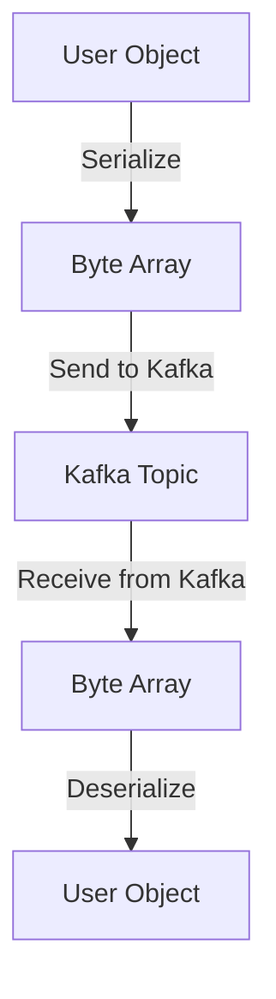

## 14.1.2 Testing Serialization Logic

Serialization and deserialization are critical components of any data processing system, especially in distributed systems like Apache Kafka. Ensuring that data is correctly serialized and deserialized is essential for maintaining data integrity and compatibility across different components of your system. This section delves into the strategies and best practices for testing serialization logic in Apache Kafka applications.

### Common Issues with Serialization

Before diving into testing strategies, it's important to understand the common issues that can arise with serialization:

- **Data Loss**: Incorrect serialization can lead to loss of data fields, especially when schema evolution is not handled properly.
- **Incompatibility**: Changes in data structure can lead to incompatibility between producers and consumers if not managed correctly.
- **Performance Overheads**: Inefficient serialization logic can introduce significant performance bottlenecks.
- **Error Handling**: Poorly handled serialization errors can lead to application crashes or data corruption.

### Testing Custom Serializers and Deserializers

Custom serializers and deserializers are often used in Kafka applications to handle specific data formats or to optimize performance. Testing these components is crucial to ensure they work as expected.

#### Java Example

Let's consider a simple example of a custom serializer and deserializer in Java for a `User` object.

**User.java**

```java
public class User {
    private String name;
    private int age;

    // Getters and setters
    public String getName() { return name; }
    public void setName(String name) { this.name = name; }
    public int getAge() { return age; }
    public void setAge(int age) { this.age = age; }
}
```

**UserSerializer.java**

```java
import org.apache.kafka.common.serialization.Serializer;
import java.nio.ByteBuffer;
import java.util.Map;

public class UserSerializer implements Serializer<User> {

    @Override
    public void configure(Map<String, ?> configs, boolean isKey) {
        // Configuration logic if needed
    }

    @Override
    public byte[] serialize(String topic, User data) {
        if (data == null) return null;
        byte[] nameBytes = data.getName().getBytes();
        ByteBuffer buffer = ByteBuffer.allocate(4 + nameBytes.length + 4);
        buffer.putInt(nameBytes.length);
        buffer.put(nameBytes);
        buffer.putInt(data.getAge());
        return buffer.array();
    }

    @Override
    public void close() {
        // Cleanup logic if needed
    }
}
```

**UserDeserializer.java**

```java
import org.apache.kafka.common.serialization.Deserializer;
import java.nio.ByteBuffer;
import java.util.Map;

public class UserDeserializer implements Deserializer<User> {

    @Override
    public void configure(Map<String, ?> configs, boolean isKey) {
        // Configuration logic if needed
    }

    @Override
    public User deserialize(String topic, byte[] data) {
        if (data == null) return null;
        ByteBuffer buffer = ByteBuffer.wrap(data);
        int nameLength = buffer.getInt();
        byte[] nameBytes = new byte[nameLength];
        buffer.get(nameBytes);
        String name = new String(nameBytes);
        int age = buffer.getInt();
        User user = new User();
        user.setName(name);
        user.setAge(age);
        return user;
    }

    @Override
    public void close() {
        // Cleanup logic if needed
    }
}
```

#### Testing the Serializer and Deserializer

To test the above serializer and deserializer, we can write unit tests using a testing framework like JUnit.

**UserSerializerTest.java**

```java
import org.junit.jupiter.api.Test;
import static org.junit.jupiter.api.Assertions.*;

public class UserSerializerTest {

    @Test
    public void testSerialize() {
        User user = new User();
        user.setName("Alice");
        user.setAge(30);

        UserSerializer serializer = new UserSerializer();
        byte[] serializedData = serializer.serialize("test-topic", user);

        assertNotNull(serializedData);
        assertEquals(4 + "Alice".length() + 4, serializedData.length);
    }

    @Test
    public void testDeserialize() {
        User user = new User();
        user.setName("Alice");
        user.setAge(30);

        UserSerializer serializer = new UserSerializer();
        byte[] serializedData = serializer.serialize("test-topic", user);

        UserDeserializer deserializer = new UserDeserializer();
        User deserializedUser = deserializer.deserialize("test-topic", serializedData);

        assertNotNull(deserializedUser);
        assertEquals(user.getName(), deserializedUser.getName());
        assertEquals(user.getAge(), deserializedUser.getAge());
    }
}
```

### Schema Validation and Compatibility Checks

When working with data serialization, especially in systems like Kafka where data is exchanged between different services, schema validation and compatibility checks are crucial.

#### Avro Schema Validation

Apache Avro is a popular serialization framework that provides robust schema evolution capabilities. It allows you to define schemas for your data and ensures that data written with one schema can be read with another, compatible schema.

**Example Avro Schema**

```json
{
  "type": "record",
  "name": "User",
  "fields": [
    {"name": "name", "type": "string"},
    {"name": "age", "type": "int"}
  ]
}
```

#### Testing Avro Serialization

To test Avro serialization, you can use the Avro library to serialize and deserialize data and check for schema compatibility.

**AvroSerializationTest.java**

```java
import org.apache.avro.Schema;
import org.apache.avro.generic.GenericData;
import org.apache.avro.generic.GenericRecord;
import org.apache.avro.io.DatumReader;
import org.apache.avro.io.DatumWriter;
import org.apache.avro.io.DecoderFactory;
import org.apache.avro.io.EncoderFactory;
import org.apache.avro.specific.SpecificDatumReader;
import org.apache.avro.specific.SpecificDatumWriter;
import org.junit.jupiter.api.Test;

import java.io.ByteArrayInputStream;
import java.io.ByteArrayOutputStream;

import static org.junit.jupiter.api.Assertions.*;

public class AvroSerializationTest {

    private static final String USER_SCHEMA = "{"
            + "\"type\":\"record\","
            + "\"name\":\"User\","
            + "\"fields\":["
            + "{\"name\":\"name\",\"type\":\"string\"},"
            + "{\"name\":\"age\",\"type\":\"int\"}"
            + "]}";

    @Test
    public void testAvroSerialization() throws Exception {
        Schema schema = new Schema.Parser().parse(USER_SCHEMA);
        GenericRecord user = new GenericData.Record(schema);
        user.put("name", "Alice");
        user.put("age", 30);

        ByteArrayOutputStream outputStream = new ByteArrayOutputStream();
        DatumWriter<GenericRecord> datumWriter = new SpecificDatumWriter<>(schema);
        EncoderFactory.get().binaryEncoder(outputStream, null).write(datumWriter, user);

        ByteArrayInputStream inputStream = new ByteArrayInputStream(outputStream.toByteArray());
        DatumReader<GenericRecord> datumReader = new SpecificDatumReader<>(schema);
        GenericRecord result = datumReader.read(null, DecoderFactory.get().binaryDecoder(inputStream, null));

        assertEquals(user, result);
    }
}
```

### Techniques for Testing Edge Cases and Error Handling

Testing serialization logic should also cover edge cases and error handling to ensure robustness.

#### Edge Cases

- **Null Values**: Ensure that your serializers and deserializers can handle null values gracefully.
- **Empty Strings**: Test how empty strings are serialized and deserialized.
- **Boundary Values**: Test with boundary values for numeric fields to ensure they are handled correctly.

#### Error Handling

- **Invalid Data**: Test how your deserializer handles invalid data formats.
- **Schema Mismatch**: Simulate scenarios where the data schema does not match the expected schema and ensure proper error handling.

#### Scala Example

Here's how you might test some of these edge cases in Scala.

**UserSerializerTest.scala**

```scala
import org.scalatest.funsuite.AnyFunSuite
import org.scalatest.matchers.should.Matchers

class UserSerializerTest extends AnyFunSuite with Matchers {

  test("serialize and deserialize null user") {
    val serializer = new UserSerializer
    val deserializer = new UserDeserializer

    val serializedData = serializer.serialize("test-topic", null)
    serializedData shouldBe null

    val deserializedUser = deserializer.deserialize("test-topic", serializedData)
    deserializedUser shouldBe null
  }

  test("handle empty name") {
    val user = new User("", 25)
    val serializer = new UserSerializer
    val deserializer = new UserDeserializer

    val serializedData = serializer.serialize("test-topic", user)
    val deserializedUser = deserializer.deserialize("test-topic", serializedData)

    deserializedUser.getName shouldBe ""
    deserializedUser.getAge shouldBe 25
  }
}
```

### Visualizing Serialization Logic

To better understand the serialization process, let's visualize how data flows through serialization and deserialization.



**Caption**: This diagram illustrates the flow of data from a `User` object through serialization into a byte array, transmission via Kafka, and deserialization back into a `User` object.

### Best Practices for Serialization Testing

- **Automate Tests**: Use automated testing frameworks to regularly test serialization logic.
- **Use Realistic Data**: Test with data that closely resembles real-world scenarios to catch potential issues.
- **Schema Evolution Testing**: Regularly test schema evolution scenarios to ensure backward and forward compatibility.
- **Performance Testing**: Measure the performance of serialization and deserialization to identify bottlenecks.

### Knowledge Check

To reinforce your understanding of serialization testing, consider the following questions:

1. What are the common issues associated with serialization in distributed systems?
2. How can you test custom serializers and deserializers in Java?
3. Why is schema validation important in serialization?
4. What techniques can be used to test edge cases in serialization logic?
5. How can you visualize the serialization and deserialization process?

### Conclusion

Testing serialization logic is a critical aspect of ensuring data integrity and compatibility in Apache Kafka applications. By understanding common issues, employing robust testing strategies, and leveraging tools like Avro for schema validation, you can build reliable and efficient data processing systems. Remember to automate your tests, use realistic data, and continuously test for schema evolution to maintain a resilient system.

## Test Your Knowledge: Advanced Serialization Testing in Apache Kafka



### What is a common issue with serialization in distributed systems?

- [x] Data loss
- [ ] Increased network latency
- [ ] Reduced data throughput
- [ ] Enhanced data security

> **Explanation:** Data loss can occur if serialization is not handled properly, especially when schema evolution is involved.

### How can you test custom serializers in Java?

- [x] By writing unit tests using frameworks like JUnit
- [ ] By manually checking serialized data
- [ ] By using a debugger
- [ ] By inspecting Kafka logs

> **Explanation:** Unit tests provide a systematic way to verify that custom serializers work as expected.

### Why is schema validation important in serialization?

- [x] To ensure data compatibility between producers and consumers
- [ ] To improve serialization speed
- [ ] To reduce data size
- [ ] To enhance data encryption

> **Explanation:** Schema validation ensures that data written with one schema can be read with another compatible schema, maintaining compatibility.

### What is an edge case to consider in serialization testing?

- [x] Null values
- [ ] High data volume
- [ ] Network latency
- [ ] Data encryption

> **Explanation:** Null values are a common edge case that can cause issues if not handled properly in serialization logic.

### How can you visualize the serialization process?

- [x] Using diagrams like flowcharts
- [ ] By reading Kafka documentation
- [ ] By analyzing network packets
- [ ] By inspecting byte arrays manually

> **Explanation:** Diagrams can help visualize the flow of data through serialization and deserialization processes.

### What is a best practice for serialization testing?

- [x] Automate tests
- [ ] Test manually
- [ ] Use only synthetic data
- [ ] Avoid schema evolution testing

> **Explanation:** Automating tests ensures that serialization logic is regularly verified and helps catch issues early.

### What tool can be used for schema validation in Kafka?

- [x] Apache Avro
- [ ] Apache Spark
- [ ] Apache Flink
- [ ] Apache Hadoop

> **Explanation:** Apache Avro is a popular tool for schema validation and provides robust schema evolution capabilities.

### What should you do to test schema evolution?

- [x] Regularly test backward and forward compatibility
- [ ] Only test with the latest schema
- [ ] Ignore older schemas
- [ ] Focus on performance testing

> **Explanation:** Regular testing of schema evolution ensures that changes in data structure do not break compatibility.

### What is a benefit of using realistic data in serialization tests?

- [x] It helps catch potential issues that might occur in production
- [ ] It reduces test execution time
- [ ] It simplifies test setup
- [ ] It eliminates the need for schema validation

> **Explanation:** Realistic data helps identify issues that are likely to occur in real-world scenarios.

### True or False: Serialization logic only needs to be tested once during development.

- [ ] True
- [x] False

> **Explanation:** Serialization logic should be tested continuously, especially when schemas evolve or when new data formats are introduced.


