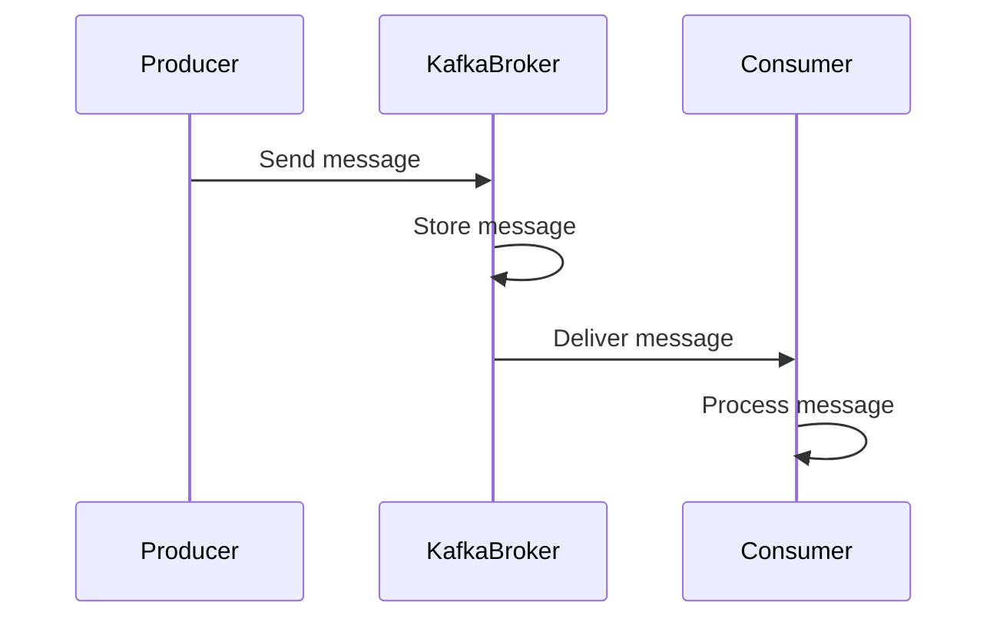

## 14.2.2 Testing End-to-End Flows

In the realm of distributed systems, ensuring the reliability and correctness of data flows is paramount. Apache Kafka, a cornerstone of modern data architectures, demands rigorous testing to validate its end-to-end processes. This section delves into the intricacies of testing Kafka's data pipelines, from message production to consumption, highlighting best practices, challenges, and solutions.

### Understanding End-to-End Testing in Kafka

End-to-end testing in Kafka involves verifying the entire data flow from producers to consumers. This process ensures that messages are correctly produced, transmitted, and consumed, maintaining data integrity and system reliability. Unlike unit tests, which focus on individual components, end-to-end tests validate the interactions and integrations across the entire system.

#### Key Objectives of End-to-End Testing

- **Data Integrity**: Ensure that messages are not lost, duplicated, or corrupted during transmission.
- **System Reliability**: Validate that the system behaves as expected under various conditions, including failures.
- **Performance**: Assess the system's ability to handle expected loads and identify bottlenecks.
- **Correctness**: Verify that business logic and data transformations are applied correctly.

### Setting Up Embedded Kafka for Testing

Embedded Kafka is a lightweight, in-memory Kafka broker that facilitates testing without the overhead of a full Kafka cluster. It allows developers to simulate Kafka environments within their test suites, providing a controlled and isolated setting for integration tests.

#### Benefits of Using Embedded Kafka

- **Isolation**: Tests run independently of external Kafka clusters, reducing dependencies and potential interference.
- **Speed**: In-memory operations are faster, enabling rapid test execution.
- **Control**: Developers can configure and manipulate the Kafka environment to simulate various scenarios.

#### Setting Up Embedded Kafka in Java

To set up Embedded Kafka in Java, you can use libraries like `spring-kafka-test` or `kafka-junit`. Here's a basic example using `spring-kafka-test`:

```java
import org.apache.kafka.clients.producer.ProducerRecord;
import org.apache.kafka.clients.consumer.ConsumerRecord;
import org.apache.kafka.clients.consumer.Consumer;
import org.apache.kafka.clients.consumer.KafkaConsumer;
import org.apache.kafka.clients.producer.KafkaProducer;
import org.apache.kafka.clients.producer.ProducerConfig;
import org.apache.kafka.clients.producer.Producer;
import org.apache.kafka.clients.producer.ProducerRecord;
import org.apache.kafka.common.serialization.StringDeserializer;
import org.apache.kafka.common.serialization.StringSerializer;
import org.springframework.kafka.test.EmbeddedKafkaBroker;
import org.springframework.kafka.test.context.EmbeddedKafka;
import org.springframework.kafka.test.utils.KafkaTestUtils;

import java.util.Collections;
import java.util.Properties;

@EmbeddedKafka(partitions = 1, topics = { "test-topic" })
public class KafkaIntegrationTest {

    private EmbeddedKafkaBroker embeddedKafka;

    @BeforeEach
    public void setUp() {
        embeddedKafka = new EmbeddedKafkaBroker(1, true, "test-topic");
        embeddedKafka.afterPropertiesSet();
    }

    @Test
    public void testKafkaProducerAndConsumer() {
        // Producer configuration
        Properties producerProps = new Properties();
        producerProps.put(ProducerConfig.BOOTSTRAP_SERVERS_CONFIG, embeddedKafka.getBrokersAsString());
        producerProps.put(ProducerConfig.KEY_SERIALIZER_CLASS_CONFIG, StringSerializer.class);
        producerProps.put(ProducerConfig.VALUE_SERIALIZER_CLASS_CONFIG, StringSerializer.class);

        Producer<String, String> producer = new KafkaProducer<>(producerProps);
        producer.send(new ProducerRecord<>("test-topic", "key", "value"));

        // Consumer configuration
        Properties consumerProps = new Properties();
        consumerProps.put("bootstrap.servers", embeddedKafka.getBrokersAsString());
        consumerProps.put("group.id", "test-group");
        consumerProps.put("key.deserializer", StringDeserializer.class);
        consumerProps.put("value.deserializer", StringDeserializer.class);

        Consumer<String, String> consumer = new KafkaConsumer<>(consumerProps);
        consumer.subscribe(Collections.singletonList("test-topic"));

        ConsumerRecord<String, String> record = KafkaTestUtils.getSingleRecord(consumer, "test-topic");
        assertEquals("value", record.value());
    }
}
```

### Synchronization and Timing Issues

In distributed systems, synchronization and timing are critical challenges. Kafka's asynchronous nature can lead to race conditions and timing issues in tests. Here are strategies to address these challenges:

#### Strategies for Handling Synchronization

- **Awaitility**: Use libraries like Awaitility to wait for conditions to be met before proceeding with assertions.
- **Polling**: Implement polling mechanisms to repeatedly check for expected outcomes within a timeout period.
- **Offsets and Commit Strategies**: Manage consumer offsets carefully to ensure messages are processed in the correct order.

#### Example: Using Awaitility in Java

```java
import org.awaitility.Awaitility;
import java.util.concurrent.TimeUnit;

Awaitility.await().atMost(10, TimeUnit.SECONDS).until(() -> {
    ConsumerRecord<String, String> record = KafkaTestUtils.getSingleRecord(consumer, "test-topic");
    return "value".equals(record.value());
});
```

### Simulating Failures and Retries

Testing the robustness of Kafka applications requires simulating failures and verifying retry mechanisms. This ensures that the system can recover gracefully from errors.

#### Techniques for Simulating Failures

- **Network Partitions**: Simulate network failures to test the system's resilience and recovery strategies.
- **Broker Failures**: Shut down brokers to observe how producers and consumers handle unavailable partitions.
- **Message Corruption**: Introduce message corruption to test data validation and error handling mechanisms.

#### Implementing Retries

- **Idempotent Producers**: Ensure producers are idempotent to handle retries without duplicating messages.
- **Retry Policies**: Configure retry policies for producers and consumers to manage transient errors.

### Assertions on Data Integrity

Data integrity is a cornerstone of reliable Kafka applications. End-to-end tests must include assertions to verify that data is transmitted accurately and transformations are applied correctly.

#### Key Assertions for Data Integrity

- **Message Content**: Verify that the message content matches expectations at each stage of the pipeline.
- **Order of Messages**: Ensure that messages are consumed in the correct order, especially in scenarios with multiple partitions.
- **Data Transformations**: Validate that data transformations and business logic are applied correctly.

### Code Examples in Multiple Languages

#### Scala Example

```scala
import org.apache.kafka.clients.producer.{KafkaProducer, ProducerConfig, ProducerRecord}
import org.apache.kafka.clients.consumer.{ConsumerConfig, KafkaConsumer}
import org.apache.kafka.common.serialization.{StringDeserializer, StringSerializer}
import org.scalatest.flatspec.AnyFlatSpec
import org.scalatest.matchers.should.Matchers

import java.util.Properties
import scala.jdk.CollectionConverters._

class KafkaIntegrationTest extends AnyFlatSpec with Matchers {

  "Kafka Producer and Consumer" should "send and receive messages" in {
    val producerProps = new Properties()
    producerProps.put(ProducerConfig.BOOTSTRAP_SERVERS_CONFIG, "localhost:9092")
    producerProps.put(ProducerConfig.KEY_SERIALIZER_CLASS_CONFIG, classOf[StringSerializer])
    producerProps.put(ProducerConfig.VALUE_SERIALIZER_CLASS_CONFIG, classOf[StringSerializer])

    val producer = new KafkaProducer[String, String](producerProps)
    producer.send(new ProducerRecord[String, String]("test-topic", "key", "value"))

    val consumerProps = new Properties()
    consumerProps.put(ConsumerConfig.BOOTSTRAP_SERVERS_CONFIG, "localhost:9092")
    consumerProps.put(ConsumerConfig.GROUP_ID_CONFIG, "test-group")
    consumerProps.put(ConsumerConfig.KEY_DESERIALIZER_CLASS_CONFIG, classOf[StringDeserializer])
    consumerProps.put(ConsumerConfig.VALUE_DESERIALIZER_CLASS_CONFIG, classOf[StringDeserializer])

    val consumer = new KafkaConsumer[String, String](consumerProps)
    consumer.subscribe(List("test-topic").asJava)

    val records = consumer.poll(java.time.Duration.ofSeconds(10))
    records.iterator().asScala.foreach { record =>
      record.value() shouldEqual "value"
    }
  }
}
```

#### Kotlin Example

```kotlin
import org.apache.kafka.clients.consumer.ConsumerConfig
import org.apache.kafka.clients.consumer.KafkaConsumer
import org.apache.kafka.clients.producer.KafkaProducer
import org.apache.kafka.clients.producer.ProducerConfig
import org.apache.kafka.clients.producer.ProducerRecord
import org.apache.kafka.common.serialization.StringDeserializer
import org.apache.kafka.common.serialization.StringSerializer
import org.junit.jupiter.api.Assertions.assertEquals
import org.junit.jupiter.api.Test
import java.time.Duration
import java.util.*

class KafkaIntegrationTest {

    @Test
    fun `test Kafka producer and consumer`() {
        val producerProps = Properties().apply {
            put(ProducerConfig.BOOTSTRAP_SERVERS_CONFIG, "localhost:9092")
            put(ProducerConfig.KEY_SERIALIZER_CLASS_CONFIG, StringSerializer::class.java)
            put(ProducerConfig.VALUE_SERIALIZER_CLASS_CONFIG, StringSerializer::class.java)
        }

        val producer = KafkaProducer<String, String>(producerProps)
        producer.send(ProducerRecord("test-topic", "key", "value"))

        val consumerProps = Properties().apply {
            put(ConsumerConfig.BOOTSTRAP_SERVERS_CONFIG, "localhost:9092")
            put(ConsumerConfig.GROUP_ID_CONFIG, "test-group")
            put(ConsumerConfig.KEY_DESERIALIZER_CLASS_CONFIG, StringDeserializer::class.java)
            put(ConsumerConfig.VALUE_DESERIALIZER_CLASS_CONFIG, StringDeserializer::class.java)
        }

        val consumer = KafkaConsumer<String, String>(consumerProps)
        consumer.subscribe(listOf("test-topic"))

        val records = consumer.poll(Duration.ofSeconds(10))
        records.forEach { record ->
            assertEquals("value", record.value())
        }
    }
}
```

#### Clojure Example

```clojure
(ns kafka-integration-test
  (:require [clojure.test :refer :all]
            [clojure.java.io :as io])
  (:import (org.apache.kafka.clients.producer KafkaProducer ProducerRecord)
           (org.apache.kafka.clients.consumer KafkaConsumer ConsumerConfig)
           (org.apache.kafka.common.serialization StringSerializer StringDeserializer)))

(defn create-producer []
  (let [props (doto (java.util.Properties.)
                (.put "bootstrap.servers" "localhost:9092")
                (.put "key.serializer" StringSerializer)
                (.put "value.serializer" StringSerializer))]
    (KafkaProducer. props)))

(defn create-consumer []
  (let [props (doto (java.util.Properties.)
                (.put ConsumerConfig/BOOTSTRAP_SERVERS_CONFIG "localhost:9092")
                (.put ConsumerConfig/GROUP_ID_CONFIG "test-group")
                (.put ConsumerConfig/KEY_DESERIALIZER_CLASS_CONFIG StringDeserializer)
                (.put ConsumerConfig/VALUE_DESERIALIZER_CLASS_CONFIG StringDeserializer))]
    (KafkaConsumer. props)))

(deftest test-kafka-producer-and-consumer
  (let [producer (create-producer)
        consumer (create-consumer)]
    (.send producer (ProducerRecord. "test-topic" "key" "value"))
    (.subscribe consumer ["test-topic"])
    (let [records (.poll consumer 10000)]
      (doseq [record records]
        (is (= "value" (.value record))))))
  (.close producer)
  (.close consumer))
```

### Visualizing Kafka End-to-End Flow

To better understand the flow of data in a Kafka pipeline, consider the following sequence diagram illustrating the interaction between producers, Kafka brokers, and consumers:



**Diagram Explanation**: This sequence diagram depicts the end-to-end flow of a message in a Kafka system. The producer sends a message to the Kafka broker, which stores it and subsequently delivers it to the consumer for processing.

### Best Practices for End-to-End Testing

- **Isolation**: Ensure tests are isolated from external dependencies to avoid flaky tests.
- **Data Cleanup**: Implement data cleanup mechanisms to reset the state between tests.
- **Comprehensive Coverage**: Cover all possible scenarios, including edge cases and failure modes.
- **Continuous Integration**: Integrate tests into CI/CD pipelines for automated execution and feedback.

### Conclusion

Testing end-to-end flows in Apache Kafka is crucial for ensuring the reliability and correctness of data pipelines. By leveraging tools like Embedded Kafka, developers can create robust integration tests that validate the entire data flow from producers to consumers. Through careful synchronization, failure simulation, and data integrity assertions, these tests provide confidence in the system's ability to handle real-world scenarios.

## Test Your Knowledge: End-to-End Testing in Apache Kafka



### What is the primary goal of end-to-end testing in Kafka?

- [x] To verify the entire data flow from producers to consumers.
- [ ] To test individual components in isolation.
- [ ] To measure system performance under load.
- [ ] To ensure compliance with data regulations.

> **Explanation:** End-to-end testing in Kafka focuses on validating the entire data flow from producers to consumers, ensuring data integrity and system reliability.

### Which library can be used to set up Embedded Kafka in Java?

- [x] spring-kafka-test
- [ ] kafka-streams
- [ ] kafka-connect
- [ ] kafka-logger

> **Explanation:** The `spring-kafka-test` library provides utilities for setting up Embedded Kafka for testing purposes in Java.

### What is a common strategy for handling synchronization issues in Kafka tests?

- [x] Using Awaitility to wait for conditions.
- [ ] Increasing the number of partitions.
- [ ] Reducing the number of consumers.
- [ ] Disabling message compression.

> **Explanation:** Awaitility is a library that helps manage synchronization issues by waiting for specific conditions to be met before proceeding with assertions.

### How can you simulate a network partition in Kafka tests?

- [x] By shutting down brokers.
- [ ] By increasing the replication factor.
- [ ] By reducing the number of partitions.
- [ ] By disabling consumer offsets.

> **Explanation:** Simulating network partitions can be achieved by shutting down brokers, which tests the system's resilience and recovery strategies.

### What is the purpose of assertions in end-to-end tests?

- [x] To verify data integrity and correctness.
- [ ] To increase test execution speed.
- [ ] To reduce test complexity.
- [ ] To ensure compliance with industry standards.

> **Explanation:** Assertions in end-to-end tests are used to verify data integrity and correctness, ensuring that the system behaves as expected.

### Which of the following is a benefit of using Embedded Kafka for testing?

- [x] Isolation from external dependencies.
- [ ] Increased production throughput.
- [ ] Reduced message latency.
- [ ] Enhanced data encryption.

> **Explanation:** Embedded Kafka provides isolation from external dependencies, allowing tests to run independently and reducing potential interference.

### What is a key assertion to include in Kafka end-to-end tests?

- [x] Message content verification.
- [ ] Broker configuration validation.
- [ ] Consumer group rebalancing.
- [ ] Producer partitioning strategy.

> **Explanation:** Verifying message content is a key assertion in Kafka end-to-end tests to ensure data integrity.

### How can you ensure that messages are consumed in the correct order?

- [x] By managing consumer offsets carefully.
- [ ] By increasing the number of consumers.
- [ ] By reducing the replication factor.
- [ ] By disabling message compression.

> **Explanation:** Managing consumer offsets carefully ensures that messages are consumed in the correct order, especially in scenarios with multiple partitions.

### What is the role of idempotent producers in Kafka?

- [x] To handle retries without duplicating messages.
- [ ] To increase message throughput.
- [ ] To reduce message latency.
- [ ] To enhance data encryption.

> **Explanation:** Idempotent producers ensure that retries do not result in duplicated messages, maintaining data integrity.

### True or False: End-to-end testing in Kafka is only necessary for production environments.

- [ ] True
- [x] False

> **Explanation:** End-to-end testing is essential in all environments, including development and staging, to ensure system reliability and correctness before production deployment.



By mastering end-to-end testing in Apache Kafka, you can ensure that your data pipelines are robust, reliable, and ready to handle the demands of real-time data processing.
