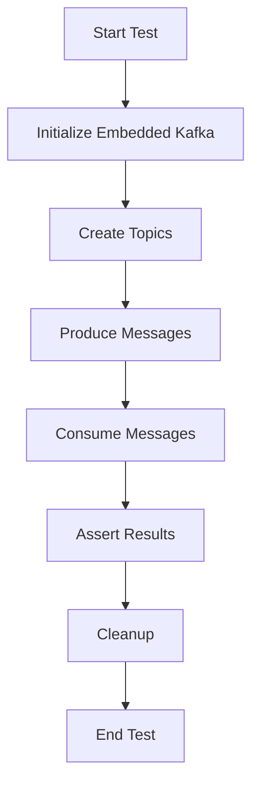

## 14.2 Integration Testing with Embedded Kafka

Integration testing is a crucial step in the software development lifecycle, especially for systems built on distributed architectures like Apache Kafka. Embedded Kafka provides a lightweight and efficient way to perform integration testing by simulating a Kafka environment within your test suite. This approach allows developers to test Kafka applications end-to-end without the overhead of managing an external Kafka cluster.

### Benefits of Using Embedded Kafka

Embedded Kafka offers several advantages for integration testing:

- **Isolation**: Tests run in a controlled environment, minimizing interference from external systems.
- **Speed**: Embedded Kafka is lightweight, reducing the time required to start and stop Kafka instances.
- **Simplicity**: No need to configure and manage a separate Kafka cluster for testing purposes.
- **Consistency**: Ensures consistent test results by providing a predictable Kafka environment.

### Setting Up Embedded Kafka

To set up Embedded Kafka, you can use libraries such as `kafka-junit` or `EmbeddedKafka` from the `spring-kafka-test` package. These libraries provide utilities to start and stop Kafka brokers within your test suite.

#### Java Example

Here's how you can set up Embedded Kafka in a Java test using `spring-kafka-test`:

```java
import org.apache.kafka.clients.consumer.ConsumerRecord;
import org.apache.kafka.clients.producer.ProducerRecord;
import org.junit.jupiter.api.Test;
import org.springframework.kafka.core.DefaultKafkaProducerFactory;
import org.springframework.kafka.core.KafkaTemplate;
import org.springframework.kafka.test.context.EmbeddedKafka;
import org.springframework.kafka.test.utils.KafkaTestUtils;

import java.util.Map;

import static org.assertj.core.api.Assertions.assertThat;

@EmbeddedKafka(partitions = 1, topics = { "test-topic" })
public class EmbeddedKafkaTest {

    @Test
    public void testKafkaProducerAndConsumer() {
        Map<String, Object> producerProps = KafkaTestUtils.producerProps(embeddedKafka);
        DefaultKafkaProducerFactory<Integer, String> producerFactory = new DefaultKafkaProducerFactory<>(producerProps);
        KafkaTemplate<Integer, String> template = new KafkaTemplate<>(producerFactory);

        template.send(new ProducerRecord<>("test-topic", 1, "test-message"));

        ConsumerRecord<Integer, String> record = KafkaTestUtils.getSingleRecord(consumer, "test-topic");
        assertThat(record.value()).isEqualTo("test-message");
    }
}
```

#### Scala Example

Using Scala and `kafka-junit`, you can set up Embedded Kafka as follows:

```scala
import net.manub.embeddedkafka.{EmbeddedKafka, EmbeddedKafkaConfig}
import org.scalatest.flatspec.AnyFlatSpec
import org.scalatest.matchers.should.Matchers

class EmbeddedKafkaSpec extends AnyFlatSpec with Matchers with EmbeddedKafka {

  "A Kafka producer" should "send messages to a topic" in {
    implicit val config = EmbeddedKafkaConfig(kafkaPort = 6001, zooKeeperPort = 6000)

    withRunningKafka {
      val message = "test-message"
      val topic = "test-topic"

      publishToKafka(topic, message)

      consumeFirstStringMessageFrom(topic) should be(message)
    }
  }
}
```

#### Kotlin Example

For Kotlin, you can use `spring-kafka-test` similarly to Java:

```kotlin
import org.apache.kafka.clients.consumer.ConsumerRecord
import org.apache.kafka.clients.producer.ProducerRecord
import org.junit.jupiter.api.Test
import org.springframework.kafka.core.DefaultKafkaProducerFactory
import org.springframework.kafka.core.KafkaTemplate
import org.springframework.kafka.test.context.EmbeddedKafka
import org.springframework.kafka.test.utils.KafkaTestUtils
import kotlin.test.assertEquals

@EmbeddedKafka(partitions = 1, topics = ["test-topic"])
class EmbeddedKafkaTest {

    @Test
    fun `test Kafka producer and consumer`() {
        val producerProps = KafkaTestUtils.producerProps(embeddedKafka)
        val producerFactory = DefaultKafkaProducerFactory<Int, String>(producerProps)
        val template = KafkaTemplate(producerFactory)

        template.send(ProducerRecord("test-topic", 1, "test-message"))

        val record: ConsumerRecord<Int, String> = KafkaTestUtils.getSingleRecord(consumer, "test-topic")
        assertEquals("test-message", record.value())
    }
}
```

#### Clojure Example

In Clojure, you can use `clj-kafka` for embedded testing:

```clojure
(ns embedded-kafka-test
  (:require [clj-kafka.test-utils :as test-utils]
            [clj-kafka.producer :as producer]
            [clj-kafka.consumer :as consumer]
            [clojure.test :refer :all]))

(deftest test-kafka-producer-and-consumer
  (test-utils/with-embedded-kafka
    (let [topic "test-topic"
          message "test-message"]
      (producer/send-message {:topic topic :value message})
      (let [record (consumer/consume-message {:topic topic})]
        (is (= message (:value record))))))
```

### Managing Topics and Data Within the Test Lifecycle

When using Embedded Kafka, it's essential to manage topics and data effectively to ensure tests are isolated and repeatable. Here are some best practices:

- **Topic Creation**: Create topics dynamically within the test setup to avoid conflicts with other tests.
- **Data Management**: Clear data after each test to prevent state leakage. Use utilities provided by the testing library to reset topics.
- **Test Isolation**: Use unique topic names per test or test suite to ensure isolation.

### Best Practices for Cleaning Up and Avoiding State Leakage

To maintain a clean test environment, follow these best practices:

- **Tear Down**: Ensure that the Kafka broker is stopped after each test to release resources.
- **Data Cleanup**: Delete or reset topics after tests to prevent data from affecting subsequent tests.
- **Resource Management**: Use try-finally blocks or equivalent constructs to guarantee cleanup even if tests fail.

### Visualizing Embedded Kafka Setup

To better understand the setup and flow of an Embedded Kafka test, consider the following diagram:



**Diagram Description**: This flowchart illustrates the lifecycle of an Embedded Kafka test, from initialization to cleanup.

### References and Further Reading

- [Apache Kafka Documentation](https://kafka.apache.org/documentation/)
- [Spring Kafka Documentation](https://docs.spring.io/spring-kafka/docs/current/reference/html/)
- [Kafka JUnit](https://github.com/salesforce/kafka-junit)
- [Embedded Kafka for Scala](https://github.com/manub/scalatest-embedded-kafka)

### Knowledge Check

To reinforce your understanding of Embedded Kafka for integration testing, consider the following questions:

## Test Your Knowledge: Embedded Kafka Integration Testing



### What is a primary benefit of using Embedded Kafka for testing?

- [x] It provides a lightweight and isolated environment for testing.
- [ ] It requires less configuration than a production Kafka cluster.
- [ ] It automatically scales with the number of tests.
- [ ] It integrates with all cloud providers.

> **Explanation:** Embedded Kafka offers a lightweight and isolated environment, making it ideal for testing without the overhead of a full Kafka cluster.

### How can you ensure test isolation when using Embedded Kafka?

- [x] Use unique topic names for each test.
- [ ] Use the same topic for all tests to simplify configuration.
- [ ] Share the Kafka broker across multiple test suites.
- [ ] Avoid cleaning up data between tests.

> **Explanation:** Using unique topic names ensures that tests do not interfere with each other, maintaining isolation.

### Which library can be used for Embedded Kafka testing in Java?

- [x] spring-kafka-test
- [ ] kafka-streams
- [ ] kafka-connect
- [ ] kafka-producer

> **Explanation:** The `spring-kafka-test` library provides utilities for setting up Embedded Kafka in Java tests.

### What is a best practice for cleaning up after tests using Embedded Kafka?

- [x] Stop the Kafka broker and delete topics after each test.
- [ ] Leave the broker running for faster test execution.
- [ ] Retain data for analysis after tests.
- [ ] Use a single broker for all tests.

> **Explanation:** Stopping the broker and deleting topics ensures a clean state for subsequent tests.

### Which of the following is a benefit of using Embedded Kafka?

- [x] Faster test execution compared to using an external Kafka cluster.
- [ ] Automatic scaling of brokers.
- [ ] Built-in support for cloud deployments.
- [ ] Real-time monitoring of test execution.

> **Explanation:** Embedded Kafka is lightweight, leading to faster test execution compared to an external cluster.

### What should you do to manage topics within the test lifecycle?

- [x] Create and delete topics dynamically within tests.
- [ ] Use a fixed set of topics for all tests.
- [ ] Share topics across test suites.
- [ ] Avoid creating topics to reduce test complexity.

> **Explanation:** Creating and deleting topics dynamically ensures that tests are isolated and repeatable.

### Which language is NOT mentioned in the examples for setting up Embedded Kafka?

- [ ] Java
- [ ] Scala
- [ ] Kotlin
- [x] Python

> **Explanation:** The examples provided are in Java, Scala, Kotlin, and Clojure, but not Python.

### What is the role of `KafkaTestUtils` in Java tests?

- [x] It provides utilities for configuring and interacting with Kafka in tests.
- [ ] It is used for monitoring Kafka clusters.
- [ ] It manages Kafka broker lifecycle.
- [ ] It provides Kafka security configurations.

> **Explanation:** `KafkaTestUtils` offers utilities for configuring and interacting with Kafka during tests.

### True or False: Embedded Kafka can be used for performance testing.

- [ ] True
- [x] False

> **Explanation:** Embedded Kafka is primarily used for integration testing, not performance testing, due to its lightweight nature.

### Which of the following is a key consideration when using Embedded Kafka?

- [x] Ensuring proper cleanup to avoid state leakage.
- [ ] Using the same broker for all tests to save resources.
- [ ] Avoiding topic creation to reduce test time.
- [ ] Using Embedded Kafka only for unit tests.

> **Explanation:** Proper cleanup is crucial to prevent state leakage and ensure test reliability.



By following these guidelines and examples, you can effectively use Embedded Kafka for integration testing, ensuring that your Kafka applications are robust and reliable.
