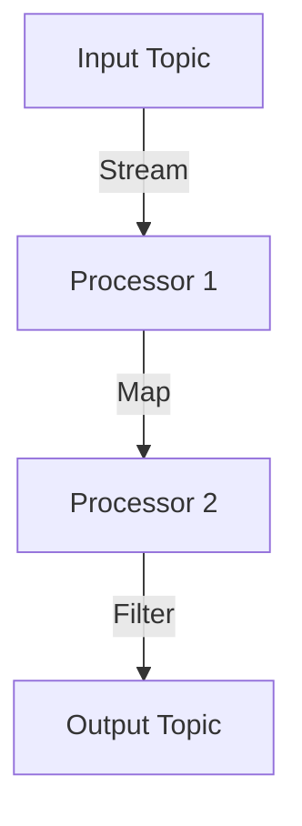

## 14.3 Testing Streams Applications

Testing Kafka Streams applications is a critical aspect of ensuring the reliability and correctness of stream processing logic. Given the complexity and real-time nature of stream processing, testing these applications poses unique challenges. This section delves into the methodologies, tools, and best practices for effectively testing Kafka Streams applications, focusing on both unit and integration testing.

### Challenges of Testing Stream Processing Applications

Stream processing applications operate on continuous data flows, which introduces several challenges:

- **State Management**: Streams applications often maintain state, which must be correctly initialized, updated, and persisted.
- **Asynchronous Processing**: The non-blocking nature of stream processing requires careful handling of timing and concurrency issues.
- **Complex Topologies**: Applications can involve intricate topologies with multiple processors and state stores, making it difficult to isolate and test individual components.
- **Data Dependencies**: Stream processing logic often depends on the order and timing of data, requiring precise control over test inputs.

### Kafka Streams Testing Tools

Kafka Streams provides several tools to facilitate testing:

- **TopologyTestDriver**: A utility for unit testing Kafka Streams topologies by simulating the processing of records through the topology.
- **Test Input and Output Topics**: Used in conjunction with TopologyTestDriver to provide input data and capture output results.
- **MockProcessorContext**: Allows testing of individual processors by simulating the processing context.

### Unit Testing with TopologyTestDriver

The `TopologyTestDriver` is a powerful tool for unit testing Kafka Streams applications. It allows developers to simulate the processing of records through a topology without the need for a running Kafka cluster.

#### Setting Up TopologyTestDriver

To use `TopologyTestDriver`, you need to configure your stream topology and provide it with input and output topics. Here's a basic setup in Java:

```java
import org.apache.kafka.streams.TopologyTestDriver;
import org.apache.kafka.streams.StreamsBuilder;
import org.apache.kafka.streams.StreamsConfig;
import org.apache.kafka.streams.test.ConsumerRecordFactory;
import org.apache.kafka.streams.test.OutputVerifier;
import org.apache.kafka.clients.consumer.ConsumerRecord;
import org.apache.kafka.clients.producer.ProducerRecord;

import java.util.Properties;

public class StreamTest {
    private TopologyTestDriver testDriver;
    private ConsumerRecordFactory<String, String> recordFactory;

    public void setup() {
        Properties config = new Properties();
        config.put(StreamsConfig.APPLICATION_ID_CONFIG, "test-app");
        config.put(StreamsConfig.BOOTSTRAP_SERVERS_CONFIG, "dummy:1234");

        StreamsBuilder builder = new StreamsBuilder();
        // Define your topology here
        // builder.stream("input-topic").mapValues(value -> value.toUpperCase()).to("output-topic");

        testDriver = new TopologyTestDriver(builder.build(), config);
        recordFactory = new ConsumerRecordFactory<>("input-topic", new StringSerializer(), new StringSerializer());
    }

    public void tearDown() {
        testDriver.close();
    }
}
```

#### Testing Stateless Operations

Stateless operations, such as `map`, `filter`, and `flatMap`, do not maintain any state between records. Testing these operations involves verifying that the transformation logic is applied correctly.

**Example: Testing a Map Operation**

```java
public void testMapOperation() {
    setup();

    // Create a record to process
    ConsumerRecord<byte[], byte[]> inputRecord = recordFactory.create("input-topic", "key", "value");

    // Pipe the record through the topology
    testDriver.pipeInput(inputRecord);

    // Verify the output
    ProducerRecord<String, String> outputRecord = testDriver.readOutput("output-topic", new StringDeserializer(), new StringDeserializer());
    OutputVerifier.compareKeyValue(outputRecord, "key", "VALUE");

    tearDown();
}
```

#### Testing Stateful Operations

Stateful operations, such as `aggregate`, `reduce`, and `join`, require managing state across multiple records. Testing these operations involves verifying that the state is correctly updated and persisted.

**Example: Testing an Aggregate Operation**

```java
public void testAggregateOperation() {
    setup();

    // Create input records
    ConsumerRecord<byte[], byte[]> record1 = recordFactory.create("input-topic", "key", "value1");
    ConsumerRecord<byte[], byte[]> record2 = recordFactory.create("input-topic", "key", "value2");

    // Pipe records through the topology
    testDriver.pipeInput(record1);
    testDriver.pipeInput(record2);

    // Verify the output
    ProducerRecord<String, String> outputRecord = testDriver.readOutput("output-topic", new StringDeserializer(), new StringDeserializer());
    OutputVerifier.compareKeyValue(outputRecord, "key", "value1value2");

    tearDown();
}
```

### Integration Testing of Stream Topologies

Integration testing involves testing the entire stream topology in a more realistic environment, often using embedded Kafka clusters. This approach verifies the interactions between different components and ensures the end-to-end functionality of the application.

#### Setting Up Embedded Kafka

Embedded Kafka allows you to run a Kafka broker within your test environment, enabling more comprehensive integration tests.

**Example: Setting Up Embedded Kafka in Scala**

```scala
import net.manub.embeddedkafka.{EmbeddedKafka, EmbeddedKafkaConfig}
import org.apache.kafka.streams.{KafkaStreams, StreamsConfig}
import org.apache.kafka.streams.scala.StreamsBuilder
import org.scalatest.{BeforeAndAfterAll, FlatSpec, Matchers}

class StreamIntegrationTest extends FlatSpec with Matchers with BeforeAndAfterAll with EmbeddedKafka {

  implicit val config = EmbeddedKafkaConfig(kafkaPort = 7000, zooKeeperPort = 7001)

  override def beforeAll(): Unit = {
    EmbeddedKafka.start()
  }

  override def afterAll(): Unit = {
    EmbeddedKafka.stop()
  }

  "A Kafka Streams application" should "process data correctly" in {
    val builder = new StreamsBuilder()
    // Define your topology here
    // builder.stream[String, String]("input-topic").mapValues(_.toUpperCase).to("output-topic")

    val streamsConfig = new Properties()
    streamsConfig.put(StreamsConfig.APPLICATION_ID_CONFIG, "test-app")
    streamsConfig.put(StreamsConfig.BOOTSTRAP_SERVERS_CONFIG, "localhost:7000")

    val streams = new KafkaStreams(builder.build(), streamsConfig)
    streams.start()

    // Produce and consume messages to/from the embedded Kafka
    publishToKafka("input-topic", "key", "value")
    consumeFirstStringMessageFrom("output-topic") shouldBe "VALUE"

    streams.close()
  }
}
```

### Best Practices for Testing Kafka Streams Applications

- **Isolate Components**: Use unit tests to isolate and test individual components of the topology.
- **Use Realistic Data**: Ensure test data closely resembles real-world scenarios to uncover potential issues.
- **Automate Tests**: Integrate tests into your CI/CD pipeline to catch regressions early.
- **Monitor State Stores**: Verify that state stores are correctly updated and persisted during tests.
- **Test Error Handling**: Simulate failure scenarios to ensure robust error handling and recovery mechanisms.

### Visualizing Stream Processing Topologies

To better understand and verify the structure of your stream processing applications, visualizing the topology can be incredibly helpful. Here's a simple example of a stream processing topology diagram:



**Caption**: This diagram represents a simple Kafka Streams topology with an input topic, two processors performing map and filter operations, and an output topic.

### Conclusion

Testing Kafka Streams applications is essential for ensuring the correctness and reliability of stream processing logic. By leveraging tools like `TopologyTestDriver` and embedded Kafka, developers can effectively test both stateless and stateful operations. Adopting best practices such as isolating components, using realistic data, and automating tests will further enhance the quality and robustness of your Kafka Streams applications.

## Test Your Knowledge: Kafka Streams Testing Best Practices



### What is the primary tool for unit testing Kafka Streams topologies?

- [x] TopologyTestDriver
- [ ] EmbeddedKafka
- [ ] MockProcessorContext
- [ ] StreamsBuilder

> **Explanation:** TopologyTestDriver is specifically designed for unit testing Kafka Streams topologies by simulating the processing of records.

### Which operation requires managing state across multiple records?

- [ ] Map
- [ ] Filter
- [x] Aggregate
- [ ] FlatMap

> **Explanation:** Aggregate operations require maintaining state to accumulate results across multiple records.

### What is a key benefit of using Embedded Kafka for testing?

- [x] It allows for realistic integration testing with a running Kafka broker.
- [ ] It simplifies unit testing of individual processors.
- [ ] It provides a graphical interface for monitoring streams.
- [ ] It automatically generates test data.

> **Explanation:** Embedded Kafka enables integration testing by running a Kafka broker within the test environment, allowing for realistic end-to-end testing.

### Why is it important to use realistic data in tests?

- [x] To uncover potential issues that may not appear with synthetic data.
- [ ] To reduce the complexity of test cases.
- [ ] To speed up test execution.
- [ ] To simplify the test setup.

> **Explanation:** Realistic data helps identify issues that may arise in production scenarios, ensuring the robustness of the application.

### What should be verified when testing stateful operations?

- [x] That state stores are correctly updated and persisted.
- [ ] That input records are processed in order.
- [ ] That output records are serialized correctly.
- [ ] That the topology is correctly configured.

> **Explanation:** Stateful operations rely on state stores, which must be verified to ensure correct updates and persistence.

### Which of the following is a best practice for testing Kafka Streams applications?

- [x] Automate tests and integrate them into the CI/CD pipeline.
- [ ] Use only synthetic data for testing.
- [ ] Avoid testing error handling scenarios.
- [ ] Test only the final output of the topology.

> **Explanation:** Automating tests and integrating them into CI/CD pipelines ensures early detection of regressions and maintains application quality.

### What is the role of MockProcessorContext in testing?

- [x] It simulates the processing context for individual processors.
- [ ] It provides a graphical interface for testing.
- [ ] It generates test data automatically.
- [ ] It runs a Kafka broker for integration testing.

> **Explanation:** MockProcessorContext is used to simulate the processing context for testing individual processors in isolation.

### How can you visualize a Kafka Streams topology?

- [x] By using diagrams to represent the flow of data through processors and topics.
- [ ] By running the topology in a production environment.
- [ ] By using a command-line tool to list processors.
- [ ] By inspecting the Kafka logs.

> **Explanation:** Visualizing a topology with diagrams helps understand the flow of data and the interactions between components.

### What is a common challenge when testing stream processing applications?

- [x] Managing state and ensuring correct updates.
- [ ] Generating test data.
- [ ] Configuring the Kafka broker.
- [ ] Writing serialization logic.

> **Explanation:** Stream processing applications often involve complex state management, which must be correctly tested to ensure application correctness.

### True or False: Stateless operations in Kafka Streams do not maintain any state between records.

- [x] True
- [ ] False

> **Explanation:** Stateless operations, such as map and filter, do not maintain any state between records, making them simpler to test.


