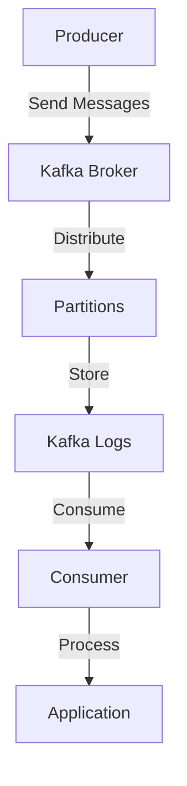

## 14.4.2 Benchmarking Kafka Clusters

### Introduction

Benchmarking Kafka clusters is a critical task for understanding the performance limits and capacity of your Kafka deployment. This process helps in identifying bottlenecks, optimizing configurations, and ensuring that the system can handle the expected load. In this section, we will delve into the importance of benchmarking, the steps to set up benchmarking tests, and how to use Kafka's built-in tools like `kafka-producer-perf-test` and `kafka-consumer-perf-test`. We will also provide guidance on analyzing the results to make informed decisions about your Kafka infrastructure.

### Importance of Benchmarking Kafka Clusters

Benchmarking is essential for several reasons:

- **Capacity Planning**: Determine the maximum throughput your Kafka cluster can handle and plan for future growth.
- **Performance Optimization**: Identify and eliminate bottlenecks in your Kafka setup.
- **Configuration Validation**: Test different configurations to find the optimal settings for your workload.
- **Scalability Assessment**: Ensure that your Kafka cluster can scale horizontally to meet increased demand.
- **Reliability Testing**: Validate the fault tolerance and reliability of your Kafka deployment under stress.

### Setting Up Benchmarking Tests

To effectively benchmark a Kafka cluster, follow these steps:

1. **Define Objectives**: Clearly outline what you want to achieve with the benchmarking tests. This could include measuring throughput, latency, or resource utilization.

2. **Prepare the Environment**: Ensure that your Kafka cluster is set up in a controlled environment where external factors are minimized. This includes having dedicated hardware or cloud resources.

3. **Select Tools**: Choose appropriate tools for benchmarking. Kafka provides built-in tools like `kafka-producer-perf-test` and `kafka-consumer-perf-test` which are specifically designed for this purpose.

4. **Design Test Scenarios**: Create scenarios that mimic real-world usage patterns. This includes varying message sizes, producer and consumer configurations, and network conditions.

5. **Execute Tests**: Run the tests while monitoring the cluster's performance metrics. Ensure that you capture data on throughput, latency, CPU, memory, and disk usage.

6. **Analyze Results**: Evaluate the results to identify any performance issues or bottlenecks. Use this data to make informed decisions about configuration changes or hardware upgrades.

### Using Kafka's Built-in Benchmarking Tools

Kafka provides two primary tools for benchmarking: `kafka-producer-perf-test` and `kafka-consumer-perf-test`. These tools are part of the Kafka distribution and are designed to simulate producer and consumer workloads.

#### Kafka Producer Performance Test

The `kafka-producer-perf-test` tool is used to measure the performance of Kafka producers. It allows you to simulate a high-throughput producer workload and measure the resulting throughput and latency.

**Example Usage**:

```bash
bin/kafka-producer-perf-test.sh --topic test-topic --num-records 1000000 --record-size 100 --throughput 10000 --producer-props bootstrap.servers=localhost:9092
```

- **Parameters**:
  - `--topic`: The Kafka topic to produce messages to.
  - `--num-records`: The total number of records to produce.
  - `--record-size`: The size of each record in bytes.
  - `--throughput`: The target throughput in records per second.
  - `--producer-props`: Additional producer configuration properties.

#### Kafka Consumer Performance Test

The `kafka-consumer-perf-test` tool is used to measure the performance of Kafka consumers. It helps in evaluating the consumer's ability to process messages at a given rate.

**Example Usage**:

```bash
bin/kafka-consumer-perf-test.sh --topic test-topic --messages 1000000 --broker-list localhost:9092 --group test-group
```

- **Parameters**:
  - `--topic`: The Kafka topic to consume messages from.
  - `--messages`: The total number of messages to consume.
  - `--broker-list`: The list of Kafka brokers.
  - `--group`: The consumer group ID.

### Analyzing Benchmark Results

Once you have executed your benchmarking tests, the next step is to analyze the results. Here are some key metrics to focus on:

- **Throughput**: Measure the number of messages processed per second. This helps in understanding the capacity of your Kafka cluster.
- **Latency**: Evaluate the time taken for a message to be produced and consumed. Low latency is crucial for real-time applications.
- **Resource Utilization**: Monitor CPU, memory, and disk usage to identify any resource bottlenecks.
- **Error Rates**: Check for any errors or message loss during the tests. This can indicate issues with configuration or network stability.

### Making Informed Decisions

Based on the analysis of your benchmarking results, you can make informed decisions about:

- **Configuration Tuning**: Adjust Kafka configurations such as batch size, compression, and replication factors to optimize performance.
- **Hardware Upgrades**: Determine if additional hardware resources are needed to meet performance requirements.
- **Scaling Strategies**: Plan for horizontal scaling by adding more brokers to the cluster.
- **Network Optimization**: Ensure that network bandwidth and latency are not limiting factors.

### Practical Applications and Real-World Scenarios

Benchmarking is not just a theoretical exercise; it has practical applications in real-world scenarios:

- **E-commerce Platforms**: Ensure that Kafka can handle peak loads during sales events.
- **Financial Services**: Validate that Kafka can process high-frequency trading data with low latency.
- **IoT Applications**: Test Kafka's ability to ingest and process large volumes of sensor data in real-time.

### Code Examples

Let's explore how to use these tools with code examples in different programming languages.

#### Java Example

```java
import org.apache.kafka.clients.producer.KafkaProducer;
import org.apache.kafka.clients.producer.ProducerRecord;
import java.util.Properties;

public class KafkaProducerExample {
    public static void main(String[] args) {
        Properties props = new Properties();
        props.put("bootstrap.servers", "localhost:9092");
        props.put("key.serializer", "org.apache.kafka.common.serialization.StringSerializer");
        props.put("value.serializer", "org.apache.kafka.common.serialization.StringSerializer");

        KafkaProducer<String, String> producer = new KafkaProducer<>(props);
        for (int i = 0; i < 1000000; i++) {
            producer.send(new ProducerRecord<>("test-topic", Integer.toString(i), "message-" + i));
        }
        producer.close();
    }
}
```

#### Scala Example

```scala
import org.apache.kafka.clients.producer.{KafkaProducer, ProducerRecord}
import java.util.Properties

object KafkaProducerExample extends App {
  val props = new Properties()
  props.put("bootstrap.servers", "localhost:9092")
  props.put("key.serializer", "org.apache.kafka.common.serialization.StringSerializer")
  props.put("value.serializer", "org.apache.kafka.common.serialization.StringSerializer")

  val producer = new KafkaProducer[String, String](props)
  for (i <- 0 until 1000000) {
    producer.send(new ProducerRecord[String, String]("test-topic", i.toString, s"message-$i"))
  }
  producer.close()
}
```

#### Kotlin Example

```kotlin
import org.apache.kafka.clients.producer.KafkaProducer
import org.apache.kafka.clients.producer.ProducerRecord
import java.util.Properties

fun main() {
    val props = Properties()
    props["bootstrap.servers"] = "localhost:9092"
    props["key.serializer"] = "org.apache.kafka.common.serialization.StringSerializer"
    props["value.serializer"] = "org.apache.kafka.common.serialization.StringSerializer"

    val producer = KafkaProducer<String, String>(props)
    for (i in 0 until 1000000) {
        producer.send(ProducerRecord("test-topic", i.toString(), "message-$i"))
    }
    producer.close()
}
```

#### Clojure Example

```clojure
(require '[clojure.java.io :as io])
(import '[org.apache.kafka.clients.producer KafkaProducer ProducerRecord])

(defn create-producer []
  (let [props (doto (java.util.Properties.)
                (.put "bootstrap.servers" "localhost:9092")
                (.put "key.serializer" "org.apache.kafka.common.serialization.StringSerializer")
                (.put "value.serializer" "org.apache.kafka.common.serialization.StringSerializer"))]
    (KafkaProducer. props)))

(defn send-messages [producer]
  (doseq [i (range 1000000)]
    (.send producer (ProducerRecord. "test-topic" (str i) (str "message-" i)))))

(defn -main []
  (let [producer (create-producer)]
    (send-messages producer)
    (.close producer)))
```

### Visualizing Kafka Benchmarking

To better understand the benchmarking process, let's visualize the data flow and interactions within a Kafka cluster during benchmarking.



**Caption**: This diagram illustrates the flow of messages from producers to consumers through Kafka brokers and partitions during benchmarking.

### Knowledge Check

To reinforce your understanding of Kafka benchmarking, consider the following questions:

- What are the key objectives of benchmarking a Kafka cluster?
- How does the `kafka-producer-perf-test` tool help in performance testing?
- What metrics are crucial when analyzing benchmarking results?
- How can benchmarking results inform decisions about scaling and configuration?

### Conclusion

Benchmarking Kafka clusters is a vital practice for ensuring that your Kafka deployment can meet the demands of your applications. By following the steps outlined in this guide and utilizing Kafka's built-in tools, you can gain valuable insights into the performance and capacity of your Kafka infrastructure. Use this information to optimize configurations, plan for growth, and ensure reliable and efficient data processing.

## Test Your Knowledge: Kafka Cluster Benchmarking Quiz



### What is the primary purpose of benchmarking Kafka clusters?

- [x] To assess the capacity and performance limits of the cluster.
- [ ] To configure Kafka brokers.
- [ ] To develop new Kafka features.
- [ ] To monitor network traffic.

> **Explanation:** Benchmarking is used to evaluate the performance and capacity limits of a Kafka cluster, helping to identify bottlenecks and optimize configurations.

### Which tool is used to simulate a high-throughput producer workload in Kafka?

- [x] kafka-producer-perf-test
- [ ] kafka-consumer-perf-test
- [ ] kafka-topics
- [ ] kafka-configs

> **Explanation:** The `kafka-producer-perf-test` tool is specifically designed to simulate producer workloads and measure performance metrics like throughput and latency.

### What is a key metric to monitor during Kafka benchmarking?

- [x] Throughput
- [ ] Number of topics
- [ ] Broker ID
- [ ] Zookeeper version

> **Explanation:** Throughput is a critical metric that indicates the number of messages processed per second, helping to assess the cluster's capacity.

### How can benchmarking results inform Kafka scaling strategies?

- [x] By identifying bottlenecks and determining if additional resources are needed.
- [ ] By changing the Kafka version.
- [ ] By reducing the number of partitions.
- [ ] By disabling replication.

> **Explanation:** Benchmarking results can reveal performance bottlenecks, guiding decisions on whether to add more brokers or optimize configurations to handle increased load.

### What does the `kafka-consumer-perf-test` tool measure?

- [x] Consumer performance and processing rate.
- [ ] Producer throughput.
- [ ] Broker configuration.
- [ ] Topic creation time.

> **Explanation:** The `kafka-consumer-perf-test` tool measures the performance of Kafka consumers, including the rate at which messages are processed.

### Which of the following is NOT a benefit of Kafka benchmarking?

- [ ] Capacity planning
- [ ] Performance optimization
- [ ] Configuration validation
- [x] Topic deletion

> **Explanation:** Kafka benchmarking is focused on evaluating performance and capacity, not on administrative tasks like topic deletion.

### What is a common use case for Kafka benchmarking in e-commerce platforms?

- [x] Ensuring the cluster can handle peak loads during sales events.
- [ ] Developing new payment gateways.
- [ ] Designing user interfaces.
- [ ] Managing customer support tickets.

> **Explanation:** Benchmarking helps e-commerce platforms ensure their Kafka clusters can handle high traffic volumes during peak sales events.

### What should be monitored alongside throughput during Kafka benchmarking?

- [x] Latency
- [ ] Number of brokers
- [ ] Topic names
- [ ] Zookeeper logs

> **Explanation:** Latency, along with throughput, is a crucial metric to monitor as it affects the real-time processing capabilities of the Kafka cluster.

### True or False: Kafka benchmarking can help identify configuration issues.

- [x] True
- [ ] False

> **Explanation:** True. Benchmarking can reveal configuration issues that may be impacting performance, allowing for adjustments to optimize the cluster.

### What is the role of `kafka-producer-perf-test` in Kafka benchmarking?

- [x] To simulate producer workloads and measure performance.
- [ ] To manage Kafka topics.
- [ ] To configure broker settings.
- [ ] To monitor consumer offsets.

> **Explanation:** The `kafka-producer-perf-test` tool is used to simulate producer workloads, helping to measure and analyze Kafka cluster performance.


