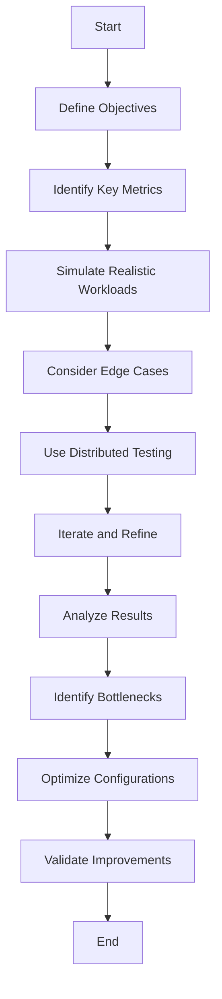

## 14.4 Performance and Load Testing

Performance and load testing are critical components in the lifecycle of Apache Kafka applications. These tests ensure that Kafka-based systems can handle expected and peak workloads while maintaining performance requirements. This section will delve into the goals of performance and load testing, introduce tools like Apache JMeter and Gatling, provide guidance on designing test scenarios, and discuss how to interpret results and identify bottlenecks.

### Goals of Performance and Load Testing

The primary goals of performance and load testing in Kafka applications are:

- **Evaluate System Behavior**: Understand how the system performs under various load conditions, including normal and peak loads.
- **Identify Bottlenecks**: Detect and address performance bottlenecks that could lead to system failures or degraded performance.
- **Ensure Scalability**: Verify that the system can scale to meet increased demand without compromising performance.
- **Validate Configuration**: Confirm that Kafka configurations are optimized for performance and resource utilization.
- **Meet SLAs**: Ensure that the system meets Service Level Agreements (SLAs) regarding response times, throughput, and availability.

### Tools for Performance and Load Testing

Several tools are available for conducting performance and load testing on Kafka applications. Two of the most popular are Apache JMeter and Gatling.

#### Apache JMeter

Apache JMeter is a versatile open-source tool designed for load testing and measuring performance. It supports a wide range of protocols and can be used to test Kafka applications by simulating producer and consumer workloads.

- **Features**:
  - Supports distributed testing.
  - Provides a graphical interface for test plan creation.
  - Allows for scripting using Groovy or BeanShell.
  - Offers extensive reporting and analysis capabilities.

- **Kafka Testing with JMeter**:
  - Use the Kafka Producer and Consumer plugins to simulate message production and consumption.
  - Configure test plans to simulate various load conditions and measure throughput, latency, and error rates.

#### Gatling

Gatling is another powerful open-source tool for performance testing, known for its high performance and scalability. It is particularly well-suited for testing web applications and APIs but can also be used for Kafka testing.

- **Features**:
  - Uses a Scala-based DSL for test scripting.
  - Provides detailed and real-time reporting.
  - Supports high concurrency and scalability.

- **Kafka Testing with Gatling**:
  - Utilize custom scripts to simulate Kafka producer and consumer behavior.
  - Leverage Gatling's reporting capabilities to analyze performance metrics.

### Designing Performance Test Scenarios

Designing effective performance test scenarios is crucial for obtaining meaningful results. Consider the following steps when creating test scenarios for Kafka applications:

1. **Define Objectives**: Clearly outline the goals of the testing, such as measuring throughput, latency, or resource utilization.

2. **Identify Key Metrics**: Determine which metrics are most relevant to your objectives. Common metrics include message throughput, latency, error rates, and resource usage.

3. **Simulate Realistic Workloads**: Design test scenarios that mimic real-world usage patterns. This includes varying message sizes, frequencies, and consumer group configurations.

4. **Consider Edge Cases**: Include scenarios that test the system's behavior under extreme conditions, such as high message rates or network failures.

5. **Use Distributed Testing**: For large-scale systems, distribute the load across multiple machines to simulate realistic conditions.

6. **Iterate and Refine**: Continuously refine test scenarios based on initial results to focus on areas of concern.

### Interpreting Results and Identifying Bottlenecks

Interpreting the results of performance and load tests is essential for identifying bottlenecks and optimizing Kafka applications. Here are some key considerations:

- **Analyze Throughput and Latency**: Compare the measured throughput and latency against expected values and SLAs. Identify any deviations and investigate their causes.

- **Monitor Resource Utilization**: Check CPU, memory, and network usage on Kafka brokers and clients. High resource usage may indicate inefficiencies or misconfigurations.

- **Identify Bottlenecks**: Look for patterns in the data that suggest bottlenecks, such as increased latency during peak loads or high error rates.

- **Optimize Configurations**: Based on the findings, adjust Kafka configurations, such as batch sizes, compression settings, and replication factors, to improve performance.

- **Validate Improvements**: After making changes, rerun tests to ensure that performance has improved and that no new issues have been introduced.

### Practical Applications and Real-World Scenarios

Performance and load testing are not just theoretical exercises; they have practical applications in real-world scenarios. Here are some examples:

- **E-commerce Platforms**: Ensure that Kafka-based systems can handle spikes in traffic during sales events or promotions.

- **Financial Services**: Validate that real-time data processing systems meet stringent latency and throughput requirements for trading applications.

- **IoT Applications**: Test the scalability of Kafka systems that process large volumes of sensor data from IoT devices.

- **Big Data Integration**: Verify that Kafka can efficiently handle data ingestion and processing for big data platforms, as discussed in [1.4.4 Big Data Integration]( "Big Data Integration").

### Code Examples

To illustrate performance testing with Apache JMeter and Gatling, let's explore code examples in Java, Scala, Kotlin, and Clojure.

#### Java Example with Apache JMeter

```java
// Java code to configure a Kafka producer for performance testing
Properties props = new Properties();
props.put("bootstrap.servers", "localhost:9092");
props.put("key.serializer", "org.apache.kafka.common.serialization.StringSerializer");
props.put("value.serializer", "org.apache.kafka.common.serialization.StringSerializer");
props.put("acks", "all");

KafkaProducer<String, String> producer = new KafkaProducer<>(props);

for (int i = 0; i < 1000; i++) {
    producer.send(new ProducerRecord<>("test-topic", Integer.toString(i), "message-" + i));
}

producer.close();
```

#### Scala Example with Gatling

```scala
// Scala code to simulate Kafka producer load using Gatling
import io.gatling.core.Predef._
import io.gatling.http.Predef._
import io.gatling.kafka.Predef._

class KafkaSimulation extends Simulation {
  val kafkaConf = kafka
    .topic("test-topic")
    .properties(Map(
      "bootstrap.servers" -> "localhost:9092",
      "key.serializer" -> "org.apache.kafka.common.serialization.StringSerializer",
      "value.serializer" -> "org.apache.kafka.common.serialization.StringSerializer"
    ))

  val scn = scenario("Kafka Load Test")
    .exec(kafka("request").send[String]("message"))

  setUp(
    scn.inject(atOnceUsers(100))
  ).protocols(kafkaConf)
}
```

#### Kotlin Example

```kotlin
// Kotlin code to configure a Kafka producer for performance testing
val props = Properties().apply {
    put("bootstrap.servers", "localhost:9092")
    put("key.serializer", "org.apache.kafka.common.serialization.StringSerializer")
    put("value.serializer", "org.apache.kafka.common.serialization.StringSerializer")
    put("acks", "all")
}

val producer = KafkaProducer<String, String>(props)

for (i in 0 until 1000) {
    producer.send(ProducerRecord("test-topic", i.toString(), "message-$i"))
}

producer.close()
```

#### Clojure Example

```clojure
;; Clojure code to configure a Kafka producer for performance testing
(def props
  {"bootstrap.servers" "localhost:9092"
   "key.serializer" "org.apache.kafka.common.serialization.StringSerializer"
   "value.serializer" "org.apache.kafka.common.serialization.StringSerializer"
   "acks" "all"})

(def producer (KafkaProducer. props))

(dotimes [i 1000]
  (.send producer (ProducerRecord. "test-topic" (str i) (str "message-" i))))

(.close producer)
```

### Visualizing Performance Testing

To better understand the performance testing process, let's visualize a typical Kafka performance testing setup using a flowchart.



**Caption**: This flowchart illustrates the steps involved in designing and executing performance tests for Kafka applications.

### References and Links

- [Apache Kafka Documentation](https://kafka.apache.org/documentation/)
- [Confluent Documentation](https://docs.confluent.io/)
- [Apache JMeter](https://jmeter.apache.org/)
- [Gatling](https://gatling.io/)

### Knowledge Check

To reinforce your understanding of performance and load testing in Kafka applications, consider the following questions:

## Test Your Knowledge: Performance and Load Testing in Kafka



### What is the primary goal of performance testing in Kafka applications?

- [x] Evaluate system behavior under various load conditions.
- [ ] Increase message throughput.
- [ ] Reduce latency.
- [ ] Improve data serialization.

> **Explanation:** The primary goal of performance testing is to evaluate how the system behaves under different load conditions, ensuring it meets performance requirements.

### Which tool is known for its high performance and scalability in testing web applications and APIs?

- [ ] Apache JMeter
- [x] Gatling
- [ ] Apache Kafka
- [ ] Confluent Platform

> **Explanation:** Gatling is known for its high performance and scalability, making it suitable for testing web applications and APIs.

### What is a key consideration when designing performance test scenarios?

- [x] Simulate realistic workloads.
- [ ] Focus solely on peak loads.
- [ ] Ignore resource utilization.
- [ ] Use a single machine for testing.

> **Explanation:** Simulating realistic workloads ensures that the test scenarios accurately reflect real-world usage patterns.

### What should be done after identifying bottlenecks in Kafka performance testing?

- [x] Optimize configurations.
- [ ] Increase message size.
- [ ] Reduce the number of consumers.
- [ ] Ignore the bottlenecks.

> **Explanation:** After identifying bottlenecks, configurations should be optimized to improve performance.

### Which of the following metrics is commonly measured in performance testing?

- [x] Throughput
- [x] Latency
- [ ] Message size
- [ ] Consumer group ID

> **Explanation:** Throughput and latency are common metrics measured in performance testing to evaluate system performance.

### What is the benefit of using distributed testing in performance scenarios?

- [x] Simulates realistic conditions.
- [ ] Reduces test complexity.
- [ ] Increases test duration.
- [ ] Limits resource usage.

> **Explanation:** Distributed testing allows for simulating realistic conditions by distributing the load across multiple machines.

### How can performance improvements be validated after optimization?

- [x] Rerun tests.
- [ ] Increase message size.
- [ ] Reduce the number of partitions.
- [ ] Ignore previous results.

> **Explanation:** Rerunning tests after optimization ensures that performance improvements are validated and no new issues are introduced.

### What is a common tool used for monitoring resource utilization during performance testing?

- [x] Prometheus
- [ ] Apache Kafka
- [ ] Confluent Platform
- [ ] Gatling

> **Explanation:** Prometheus is commonly used for monitoring resource utilization during performance testing.

### Which language is used for scripting in Gatling?

- [x] Scala
- [ ] Java
- [ ] Python
- [ ] Clojure

> **Explanation:** Gatling uses a Scala-based DSL for scripting performance tests.

### True or False: Performance testing is only necessary for large-scale Kafka deployments.

- [ ] True
- [x] False

> **Explanation:** Performance testing is necessary for all Kafka deployments to ensure they meet performance requirements, regardless of scale.



By following these guidelines and utilizing the tools and techniques discussed, you can effectively conduct performance and load testing on your Kafka applications, ensuring they are robust, scalable, and meet the demands of your business.
