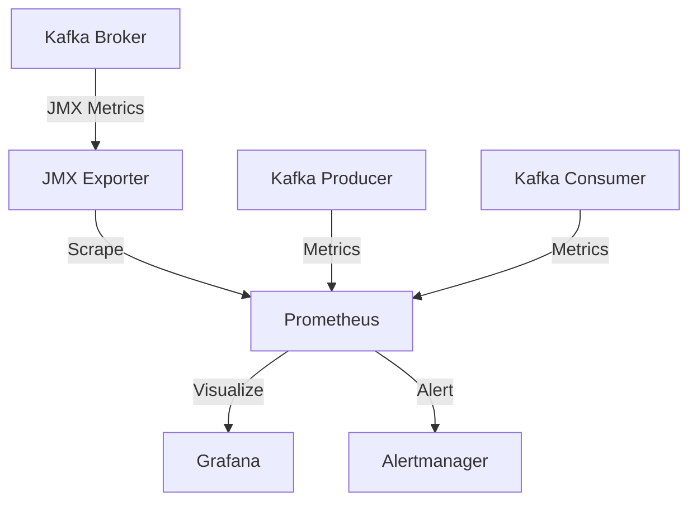

## 14.5.1 Setting Up Test Monitoring

In the realm of software development, especially when dealing with distributed systems like Apache Kafka, monitoring plays a crucial role in ensuring system reliability and performance. Setting up test monitoring is an essential step in the development lifecycle, allowing teams to capture relevant metrics, identify potential issues early, and ensure that the system behaves as expected under various conditions. This section provides a comprehensive guide on establishing monitoring systems tailored to test environments, focusing on capturing essential metrics without overwhelming the monitoring infrastructure.

### Selecting Appropriate Metrics to Monitor

When setting up test monitoring, it's crucial to select metrics that provide meaningful insights into the system's performance and behavior. Monitoring every possible metric can lead to information overload and unnecessary strain on the monitoring infrastructure. Instead, focus on key metrics that align with your testing objectives.

#### Key Metrics for Kafka Test Environments

1. **Throughput**: Measure the rate of messages being produced and consumed. This helps in understanding the system's capacity and identifying bottlenecks.

2. **Latency**: Track the time taken for messages to travel from producers to consumers. Low latency is critical for real-time applications.

3. **Error Rates**: Monitor the number of failed message deliveries or processing errors. This can indicate issues with data integrity or system stability.

4. **Resource Utilization**: Keep an eye on CPU, memory, and disk usage to ensure that your Kafka brokers and clients are not overburdened.

5. **Consumer Lag**: Measure the difference between the latest message offset and the current offset of a consumer group. High lag can indicate that consumers are unable to keep up with the message production rate.

6. **Replication Metrics**: Monitor the replication lag and under-replicated partitions to ensure data redundancy and fault tolerance.

7. **Network Traffic**: Analyze the network bandwidth usage to prevent network saturation, which can lead to increased latency and dropped messages.

### Lightweight Monitoring Tools

For test environments, it's often beneficial to use lightweight monitoring tools that provide essential insights without adding significant overhead. Here are some popular tools that can be used for monitoring Kafka test environments:

#### Prometheus and Grafana

- **Prometheus**: An open-source monitoring system that collects metrics from configured targets at given intervals, evaluates rule expressions, and displays the results. It is well-suited for monitoring Kafka due to its powerful querying capabilities and support for time-series data.

- **Grafana**: A visualization tool that integrates seamlessly with Prometheus, allowing you to create interactive and customizable dashboards. Grafana can be used to visualize Kafka metrics and set up alerts based on specific conditions.

#### JMX Exporter

- **JMX Exporter**: A tool that exposes JMX metrics from Java applications in a format that Prometheus can scrape. Kafka brokers expose a wealth of metrics via JMX, making the JMX Exporter a valuable tool for monitoring Kafka environments.

#### Kafka Manager

- **Kafka Manager**: An open-source tool for managing and monitoring Apache Kafka. It provides a web-based interface to view broker and topic metrics, manage consumer groups, and perform administrative tasks.

#### Datadog

- **Datadog**: A cloud-based monitoring and analytics platform that provides comprehensive support for Kafka. It offers pre-built dashboards and alerts, making it easy to monitor Kafka clusters and gain insights into their performance.

### Configuring Dashboards for Test Environments

Dashboards are a critical component of any monitoring setup, providing a visual representation of the system's performance and health. When configuring dashboards for test environments, consider the following best practices:

#### Best Practices for Dashboard Configuration

1. **Focus on Key Metrics**: Display only the most relevant metrics to avoid clutter and ensure that important information is easily accessible.

2. **Use Visual Cues**: Utilize colors, thresholds, and alerts to highlight critical metrics and draw attention to potential issues.

3. **Organize by Component**: Group metrics by Kafka component (e.g., brokers, producers, consumers) to provide a clear overview of the system's performance.

4. **Include Historical Data**: Display historical trends to help identify patterns and anomalies over time.

5. **Enable Drill-Down Capabilities**: Allow users to drill down into specific metrics for more detailed analysis.

#### Example Dashboard Configuration

Below is an example configuration for a Kafka test environment dashboard using Grafana:

```json
{
  "dashboard": {
    "title": "Kafka Test Environment",
    "panels": [
      {
        "title": "Throughput",
        "type": "graph",
        "targets": [
          {
            "expr": "sum(rate(kafka_server_brokertopicmetrics_messagesin_total[5m]))",
            "legendFormat": "Messages In"
          },
          {
            "expr": "sum(rate(kafka_server_brokertopicmetrics_bytesin_total[5m]))",
            "legendFormat": "Bytes In"
          }
        ]
      },
      {
        "title": "Latency",
        "type": "graph",
        "targets": [
          {
            "expr": "histogram_quantile(0.99, sum(rate(kafka_network_requestmetrics_requestlatency_seconds_bucket[5m])) by (le))",
            "legendFormat": "99th Percentile"
          }
        ]
      },
      {
        "title": "Consumer Lag",
        "type": "graph",
        "targets": [
          {
            "expr": "sum(kafka_consumer_consumerlag)",
            "legendFormat": "Consumer Lag"
          }
        ]
      }
    ]
  }
}
```

### Managing Monitoring Overhead

While monitoring is essential, it's important to manage the overhead it introduces, especially in test environments where resources may be limited. Here are some strategies to minimize monitoring overhead:

#### Strategies for Reducing Monitoring Overhead

1. **Sample Metrics**: Instead of collecting metrics at a high frequency, consider sampling them at longer intervals to reduce the load on the monitoring system.

2. **Aggregate Data**: Use aggregation to reduce the volume of data being stored and processed. For example, aggregate metrics by time period or component.

3. **Limit Retention**: Retain only the most critical metrics for long-term analysis and discard less important data after a short period.

4. **Optimize Queries**: Ensure that monitoring queries are optimized for performance, avoiding complex calculations that can strain the monitoring system.

5. **Use Lightweight Tools**: As discussed earlier, choose monitoring tools that are designed to be lightweight and efficient.

### Code Examples for Monitoring Kafka

To illustrate how to set up monitoring for Kafka, let's look at some code examples in different programming languages.

#### Java Example

```java
import io.prometheus.client.CollectorRegistry;
import io.prometheus.client.exporter.HTTPServer;
import io.prometheus.client.hotspot.DefaultExports;

public class KafkaMonitoring {
    public static void main(String[] args) throws Exception {
        // Initialize Prometheus metrics
        CollectorRegistry registry = new CollectorRegistry();
        DefaultExports.initialize();

        // Start an HTTP server to expose metrics
        HTTPServer server = new HTTPServer(1234);

        // Simulate Kafka metrics collection
        while (true) {
            // Collect and update metrics
            // Example: registry.counter("kafka_messages_in").inc();
            Thread.sleep(5000);
        }
    }
}
```

#### Scala Example

```scala
import io.prometheus.client.CollectorRegistry
import io.prometheus.client.exporter.HTTPServer
import io.prometheus.client.hotspot.DefaultExports

object KafkaMonitoring extends App {
  // Initialize Prometheus metrics
  val registry = new CollectorRegistry()
  DefaultExports.initialize()

  // Start an HTTP server to expose metrics
  val server = new HTTPServer(1234)

  // Simulate Kafka metrics collection
  while (true) {
    // Collect and update metrics
    // Example: registry.counter("kafka_messages_in").inc()
    Thread.sleep(5000)
  }
}
```

#### Kotlin Example

```kotlin
import io.prometheus.client.CollectorRegistry
import io.prometheus.client.exporter.HTTPServer
import io.prometheus.client.hotspot.DefaultExports

fun main() {
    // Initialize Prometheus metrics
    val registry = CollectorRegistry()
    DefaultExports.initialize()

    // Start an HTTP server to expose metrics
    val server = HTTPServer(1234)

    // Simulate Kafka metrics collection
    while (true) {
        // Collect and update metrics
        // Example: registry.counter("kafka_messages_in").inc()
        Thread.sleep(5000)
    }
}
```

#### Clojure Example

```clojure
(ns kafka-monitoring
  (:import [io.prometheus.client CollectorRegistry]
           [io.prometheus.client.exporter HTTPServer]
           [io.prometheus.client.hotspot DefaultExports]))

(defn -main []
  ;; Initialize Prometheus metrics
  (let [registry (CollectorRegistry.)]
    (DefaultExports/initialize)

    ;; Start an HTTP server to expose metrics
    (HTTPServer. 1234)

    ;; Simulate Kafka metrics collection
    (while true
      ;; Collect and update metrics
      ;; Example: (.inc (registry/counter "kafka_messages_in"))
      (Thread/sleep 5000))))
```

### Visualizing Kafka's Monitoring Architecture

To better understand how monitoring fits into the Kafka ecosystem, consider the following architecture diagram:



**Diagram Description**: This diagram illustrates the flow of metrics from Kafka brokers, producers, and consumers to Prometheus via the JMX Exporter. Grafana is used to visualize the metrics, while Alertmanager handles alerts based on predefined conditions.

### Knowledge Check

To reinforce your understanding of setting up test monitoring for Kafka, consider the following questions:

1. What are the key metrics to monitor in a Kafka test environment?
2. How can you reduce the overhead of monitoring in a test environment?
3. What are some lightweight monitoring tools suitable for Kafka?
4. How can dashboards be configured to effectively monitor Kafka test environments?
5. Why is it important to focus on key metrics when setting up monitoring?

### Conclusion

Setting up test monitoring for Apache Kafka is a critical step in ensuring the reliability and performance of your distributed systems. By selecting appropriate metrics, using lightweight monitoring tools, and configuring effective dashboards, you can gain valuable insights into your system's behavior without overwhelming your monitoring infrastructure. Implementing these best practices will help you identify potential issues early and ensure that your Kafka environments perform optimally under various conditions.

## Test Your Knowledge: Advanced Kafka Test Monitoring Quiz



### What is the primary purpose of setting up test monitoring in Kafka environments?

- [x] To capture relevant metrics and identify potential issues early.
- [ ] To increase the load on the monitoring infrastructure.
- [ ] To replace production monitoring systems.
- [ ] To eliminate the need for manual testing.

> **Explanation:** Test monitoring is set up to capture essential metrics and identify potential issues early, ensuring the system behaves as expected under various conditions.

### Which metric is crucial for understanding the system's capacity in Kafka?

- [x] Throughput
- [ ] Error Rates
- [ ] Latency
- [ ] Consumer Lag

> **Explanation:** Throughput measures the rate of messages being produced and consumed, helping to understand the system's capacity and identify bottlenecks.

### What tool is commonly used to visualize Kafka metrics?

- [x] Grafana
- [ ] JMX Exporter
- [ ] Kafka Manager
- [ ] Datadog

> **Explanation:** Grafana is a visualization tool that integrates with Prometheus to create interactive and customizable dashboards for Kafka metrics.

### How can monitoring overhead be reduced in test environments?

- [x] By sampling metrics at longer intervals.
- [ ] By collecting every possible metric.
- [ ] By increasing the frequency of data collection.
- [ ] By using complex monitoring queries.

> **Explanation:** Sampling metrics at longer intervals reduces the load on the monitoring system, minimizing overhead in test environments.

### What is the role of the JMX Exporter in Kafka monitoring?

- [x] To expose JMX metrics from Java applications in a format that Prometheus can scrape.
- [ ] To replace Prometheus as the primary monitoring tool.
- [ ] To visualize Kafka metrics directly.
- [ ] To manage Kafka consumer groups.

> **Explanation:** The JMX Exporter exposes JMX metrics from Java applications, such as Kafka brokers, in a format that Prometheus can scrape for monitoring.

### Which strategy helps in managing monitoring overhead?

- [x] Aggregating data by time period or component.
- [ ] Retaining all metrics indefinitely.
- [ ] Using heavyweight monitoring tools.
- [ ] Increasing the number of monitored metrics.

> **Explanation:** Aggregating data reduces the volume of data being stored and processed, helping to manage monitoring overhead.

### What is a key benefit of using Prometheus for Kafka monitoring?

- [x] Its powerful querying capabilities and support for time-series data.
- [ ] Its ability to replace Kafka brokers.
- [ ] Its integration with Kafka Manager.
- [ ] Its focus on consumer group management.

> **Explanation:** Prometheus is well-suited for monitoring Kafka due to its powerful querying capabilities and support for time-series data.

### Why is it important to include historical data in dashboards?

- [x] To help identify patterns and anomalies over time.
- [ ] To increase the complexity of the dashboard.
- [ ] To replace real-time monitoring.
- [ ] To focus solely on current metrics.

> **Explanation:** Including historical data helps identify patterns and anomalies over time, providing valuable insights into the system's performance.

### What is the function of Alertmanager in the Kafka monitoring architecture?

- [x] To handle alerts based on predefined conditions.
- [ ] To visualize Kafka metrics.
- [ ] To expose JMX metrics.
- [ ] To manage Kafka brokers.

> **Explanation:** Alertmanager handles alerts based on predefined conditions, ensuring that potential issues are addressed promptly.

### True or False: Consumer lag is a metric that measures the difference between the latest message offset and the current offset of a consumer group.

- [x] True
- [ ] False

> **Explanation:** Consumer lag measures the difference between the latest message offset and the current offset of a consumer group, indicating whether consumers are keeping up with the message production rate.


