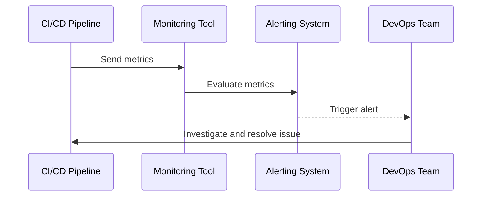

## 14.5.2 Automating Alerts

In modern software development, especially in systems leveraging Apache Kafka, the ability to detect and respond to issues swiftly is crucial. Automated alerts play a pivotal role in achieving this by notifying teams of anomalies or failures in real-time. This section delves into the intricacies of setting up automated alerts within Kafka environments, particularly focusing on their integration with Continuous Integration/Continuous Deployment (CI/CD) pipelines and testing environments.

### The Role of Alerts in Rapid Issue Detection

Automated alerts serve as the first line of defense in identifying and addressing issues in software systems. In the context of Kafka, they are essential for:

- **Real-Time Monitoring**: Alerts provide immediate feedback on the health and performance of Kafka clusters, producers, and consumers.
- **Proactive Issue Resolution**: By notifying teams of potential issues before they escalate, alerts enable proactive troubleshooting and resolution.
- **Continuous Feedback**: In CI/CD pipelines, alerts ensure that any integration or deployment issues are promptly addressed, maintaining the integrity of the software delivery process.

### Integrating Alerts with CI/CD Pipelines

Integrating automated alerts with CI/CD pipelines enhances the robustness of the software development lifecycle. Here's how you can achieve this:

#### 1. **Choosing the Right Monitoring Tools**

Select monitoring tools that seamlessly integrate with Kafka and your CI/CD pipeline. Popular choices include:

- **Prometheus**: An open-source monitoring solution that can be configured to scrape metrics from Kafka and trigger alerts based on predefined conditions.
- **Grafana**: Often used in conjunction with Prometheus, Grafana provides a visual interface for monitoring metrics and setting up alerts.
- **Datadog**: A comprehensive monitoring and analytics platform that supports Kafka and integrates with CI/CD tools like Jenkins and GitLab CI/CD.

#### 2. **Defining Alert Conditions**

Define conditions under which alerts should be triggered. These conditions should be aligned with the critical metrics of your Kafka environment, such as:

- **Consumer Lag**: Alerts can be set up to notify when consumer lag exceeds a certain threshold, indicating potential issues with message processing.
- **Broker Health**: Monitor the health of Kafka brokers and trigger alerts for issues like high CPU usage or disk space exhaustion.
- **Error Rates**: Set alerts for high error rates in producers or consumers, which could indicate issues with message serialization or network connectivity.

#### 3. **Configuring Alert Thresholds**

Alert thresholds should be carefully configured to balance sensitivity and noise. Consider the following:

- **Testing Stages**: Different testing stages (e.g., unit testing, integration testing, staging) may require different alert thresholds. For instance, a lower threshold might be appropriate in a staging environment to catch issues before production.
- **Dynamic Thresholds**: Implement dynamic thresholds that adjust based on historical data and trends, reducing false positives.

#### 4. **Integrating with CI/CD Tools**

Integrate alerts with CI/CD tools to ensure seamless notification and response. This can be achieved through:

- **Webhooks**: Use webhooks to send alert notifications to CI/CD tools, triggering automated responses such as rolling back a deployment or pausing a pipeline.
- **ChatOps**: Integrate alerts with communication platforms like Slack or Microsoft Teams to facilitate real-time collaboration and incident response.

### Configuring Alert Routing and Escalation

Effective alerting goes beyond detection; it involves routing alerts to the right teams and escalating them when necessary. Consider the following strategies:

#### 1. **Alert Routing**

- **Role-Based Routing**: Route alerts based on the role or expertise of team members. For example, alerts related to Kafka broker health might be routed to the infrastructure team, while consumer lag alerts go to the application team.
- **Contextual Information**: Include contextual information in alerts to aid in quick diagnosis and resolution. This might include logs, recent changes, or related metrics.

#### 2. **Escalation Policies**

- **Tiered Escalation**: Implement tiered escalation policies where alerts are escalated to higher levels of management if not acknowledged within a certain timeframe.
- **Automated Escalation**: Use automation to escalate alerts based on severity or impact, ensuring critical issues receive immediate attention.

### Practical Applications and Real-World Scenarios

To illustrate the practical application of automated alerts in Kafka environments, consider the following scenarios:

#### Scenario 1: Consumer Lag Alert in a CI/CD Pipeline

In a CI/CD pipeline, a consumer lag alert is triggered when the lag exceeds a predefined threshold. The alert is routed to the development team, who investigate and identify a misconfiguration in the consumer application. By addressing the issue promptly, they prevent potential data loss and ensure the pipeline continues smoothly.

#### Scenario 2: Broker Health Alert in a Testing Environment

During integration testing, a broker health alert is triggered due to high CPU usage. The alert is routed to the infrastructure team, who identify a resource-intensive process running on the broker. By resolving the issue, they ensure the stability of the testing environment and prevent disruptions in the testing process.

### Code Examples

To demonstrate how to set up automated alerts, let's explore code examples in various languages. We'll use Prometheus and Grafana for monitoring and alerting.

#### Java Example

```java
// Java code to configure Prometheus alerts for Kafka consumer lag

import io.prometheus.client.Gauge;
import io.prometheus.client.exporter.HTTPServer;

public class KafkaAlerting {

    private static final Gauge consumerLag = Gauge.build()
            .name("kafka_consumer_lag")
            .help("Consumer lag for Kafka topics")
            .register();

    public static void main(String[] args) throws Exception {
        // Start Prometheus HTTP server
        HTTPServer server = new HTTPServer(1234);

        // Simulate consumer lag monitoring
        while (true) {
            double lag = getConsumerLag();
            consumerLag.set(lag);

            // Check if lag exceeds threshold
            if (lag > 100) {
                System.out.println("Alert: Consumer lag exceeds threshold!");
            }

            Thread.sleep(5000);
        }
    }

    private static double getConsumerLag() {
        // Simulate fetching consumer lag from Kafka
        return Math.random() * 200;
    }
}
```

#### Scala Example

```scala
// Scala code to configure Prometheus alerts for Kafka broker health

import io.prometheus.client.Gauge
import io.prometheus.client.exporter.HTTPServer

object KafkaAlerting {

  private val brokerHealth = Gauge.build()
    .name("kafka_broker_health")
    .help("Health status of Kafka brokers")
    .register()

  def main(args: Array[String]): Unit = {
    // Start Prometheus HTTP server
    val server = new HTTPServer(1234)

    // Simulate broker health monitoring
    while (true) {
      val health = getBrokerHealth()
      brokerHealth.set(health)

      // Check if health status is critical
      if (health < 0.5) {
        println("Alert: Broker health is critical!")
      }

      Thread.sleep(5000)
    }
  }

  private def getBrokerHealth(): Double = {
    // Simulate fetching broker health status
    Math.random()
  }
}
```

#### Kotlin Example

```kotlin
// Kotlin code to configure Prometheus alerts for Kafka error rates

import io.prometheus.client.Gauge
import io.prometheus.client.exporter.HTTPServer

object KafkaAlerting {

    private val errorRate = Gauge.build()
        .name("kafka_error_rate")
        .help("Error rate for Kafka producers and consumers")
        .register()

    @JvmStatic
    fun main(args: Array<String>) {
        // Start Prometheus HTTP server
        val server = HTTPServer(1234)

        // Simulate error rate monitoring
        while (true) {
            val rate = getErrorRate()
            errorRate.set(rate)

            // Check if error rate exceeds threshold
            if (rate > 0.1) {
                println("Alert: Error rate exceeds threshold!")
            }

            Thread.sleep(5000)
        }
    }

    private fun getErrorRate(): Double {
        // Simulate fetching error rate from Kafka
        return Math.random()
    }
}
```

#### Clojure Example

```clojure
;; Clojure code to configure Prometheus alerts for Kafka disk usage

(ns kafka-alerting
  (:require [io.prometheus.client :as prom]
            [io.prometheus.client.exporter :as exporter]))

(def disk-usage (prom/gauge "kafka_disk_usage" "Disk usage for Kafka brokers"))

(defn -main []
  ;; Start Prometheus HTTP server
  (exporter/start-http-server 1234)

  ;; Simulate disk usage monitoring
  (while true
    (let [usage (rand)]
      (prom/set disk-usage usage)

      ;; Check if disk usage exceeds threshold
      (when (> usage 0.8)
        (println "Alert: Disk usage exceeds threshold!"))

      (Thread/sleep 5000))))
```

### Visualizing Alert Configurations

To better understand the alert configurations, let's visualize the process using a sequence diagram.



**Diagram Description**: This sequence diagram illustrates the flow of metrics from the CI/CD pipeline to the monitoring tool, which evaluates the metrics and triggers alerts to the DevOps team for resolution.

### Considerations for Effective Alerting

When setting up automated alerts, consider the following best practices:

- **Avoid Alert Fatigue**: Ensure alerts are meaningful and actionable to prevent alert fatigue among team members.
- **Regularly Review and Update Alerts**: Periodically review alert configurations to ensure they remain relevant and effective.
- **Leverage Machine Learning**: Consider using machine learning algorithms to analyze historical data and optimize alert thresholds.

### Conclusion

Automating alerts in Kafka environments is a critical component of maintaining system reliability and performance. By integrating alerts with CI/CD pipelines and configuring them appropriately, teams can ensure rapid issue detection and resolution, ultimately enhancing the software development lifecycle.

### Knowledge Check

To reinforce your understanding of automating alerts in Kafka environments, test your knowledge with the following quiz.

## Test Your Knowledge: Automating Alerts in Kafka Environments



### What is the primary role of automated alerts in Kafka environments?

- [x] To provide real-time feedback on system health and performance.
- [ ] To replace manual testing processes.
- [ ] To automate code deployments.
- [ ] To manage Kafka topic configurations.

> **Explanation:** Automated alerts provide real-time feedback on the health and performance of Kafka systems, enabling rapid issue detection and resolution.

### Which tool is commonly used for monitoring Kafka metrics and setting up alerts?

- [x] Prometheus
- [ ] Jenkins
- [ ] Docker
- [ ] Kubernetes

> **Explanation:** Prometheus is a popular open-source monitoring tool used to scrape metrics from Kafka and set up alerts based on predefined conditions.

### What is a key consideration when configuring alert thresholds?

- [x] Balancing sensitivity and noise to avoid false positives.
- [ ] Ensuring all alerts are routed to the same team.
- [ ] Using static thresholds for all environments.
- [ ] Disabling alerts during testing stages.

> **Explanation:** Alert thresholds should be configured to balance sensitivity and noise, reducing false positives and ensuring meaningful alerts.

### How can alerts be integrated with CI/CD tools?

- [x] Using webhooks to send notifications and trigger automated responses.
- [ ] By manually checking logs after each deployment.
- [ ] By disabling alerts during deployments.
- [ ] By using alerts to automatically deploy code.

> **Explanation:** Alerts can be integrated with CI/CD tools using webhooks, which send notifications and trigger automated responses such as rolling back a deployment.

### What is the benefit of role-based alert routing?

- [x] Ensures alerts are directed to the appropriate team members based on expertise.
- [ ] Reduces the number of alerts generated.
- [ ] Eliminates the need for alert escalation.
- [ ] Automatically resolves issues without human intervention.

> **Explanation:** Role-based alert routing ensures that alerts are directed to the appropriate team members based on their expertise, facilitating quick diagnosis and resolution.

### What is a common strategy for alert escalation?

- [x] Implementing tiered escalation policies based on severity.
- [ ] Sending all alerts to the same team.
- [ ] Disabling alerts during off-hours.
- [ ] Using alerts to automatically deploy code.

> **Explanation:** Tiered escalation policies ensure that alerts are escalated to higher levels of management if not acknowledged within a certain timeframe, ensuring critical issues receive immediate attention.

### How can machine learning be leveraged in alerting?

- [x] To analyze historical data and optimize alert thresholds.
- [ ] To replace manual testing processes.
- [ ] To automate code deployments.
- [ ] To manage Kafka topic configurations.

> **Explanation:** Machine learning algorithms can analyze historical data to optimize alert thresholds, reducing false positives and improving alert accuracy.

### What is a potential consequence of alert fatigue?

- [x] Team members may ignore important alerts.
- [ ] Alerts become more effective.
- [ ] System performance improves.
- [ ] Testing processes are automated.

> **Explanation:** Alert fatigue occurs when team members are overwhelmed by too many alerts, leading them to ignore important ones, which can result in unresolved issues.

### What is the purpose of including contextual information in alerts?

- [x] To aid in quick diagnosis and resolution of issues.
- [ ] To increase the number of alerts generated.
- [ ] To automate code deployments.
- [ ] To manage Kafka topic configurations.

> **Explanation:** Including contextual information in alerts helps team members quickly diagnose and resolve issues by providing relevant details such as logs and related metrics.

### True or False: Automated alerts can be used to replace manual testing processes.

- [ ] True
- [x] False

> **Explanation:** Automated alerts are not a replacement for manual testing processes; they complement testing by providing real-time feedback on system health and performance.



By mastering the setup and configuration of automated alerts, you can significantly enhance the reliability and performance of your Kafka environments, ensuring swift detection and resolution of issues.
