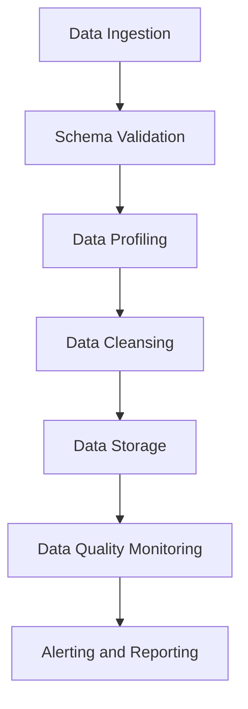

## 14.6.1 Ensuring Data Quality

In the realm of real-time data processing with Apache Kafka, ensuring data quality is paramount. Data quality encompasses various dimensions, including correctness, completeness, and consistency, which are critical for maintaining the integrity and reliability of data-driven applications. This section delves into the methodologies and tools available for verifying data quality in Kafka applications, providing expert insights and practical examples.

### Understanding Data Quality Dimensions

Data quality is a multi-faceted concept that can be broken down into several key dimensions:

- **Correctness**: Ensures that data is accurate and free from errors. This involves validating data against predefined rules and constraints.
- **Completeness**: Verifies that all required data is present and accounted for. Missing data can lead to incorrect analyses and decisions.
- **Consistency**: Ensures that data is uniform across different datasets and systems, maintaining coherence and integrity.
- **Timeliness**: Data should be available when needed, without unnecessary delays.
- **Uniqueness**: Ensures that there are no duplicate records within the dataset.
- **Validity**: Data should conform to the defined formats and standards.

### Data Validation Checks

Data validation is a crucial step in ensuring data quality. It involves a series of checks to verify that data meets the required standards before it is processed or stored. Here are some common data validation checks:

- **Schema Validation**: Ensures that data conforms to a predefined schema, checking for correct data types, required fields, and constraints. Tools like [1.3.3 Schema Registry]( "Schema Registry") can be used to enforce schema validation in Kafka.
- **Range Checks**: Verify that numerical data falls within acceptable ranges.
- **Format Checks**: Ensure that data adheres to specific formats, such as date formats or email addresses.
- **Uniqueness Checks**: Identify and eliminate duplicate records.
- **Referential Integrity Checks**: Ensure that relationships between datasets are maintained, such as foreign key constraints.

### Tools for Data Profiling and Cleansing

Data profiling and cleansing are essential processes for maintaining data quality. Profiling involves analyzing data to understand its structure, content, and quality, while cleansing involves correcting or removing inaccurate data. Here are some tools and techniques:

- **Apache Griffin**: An open-source data quality solution for data profiling, measuring, and monitoring data quality.
- **Great Expectations**: A Python-based tool for validating, documenting, and profiling data to maintain quality.
- **Deequ**: A library built on top of Apache Spark for defining "unit tests for data" to measure data quality.
- **Talend Data Quality**: Provides a suite of tools for profiling, cleansing, and enriching data.

### Integrating Data Quality Checks into Testing Workflows

Integrating data quality checks into your testing workflows ensures that data quality is maintained throughout the data processing lifecycle. Here are some strategies:

- **Automated Testing**: Incorporate data validation checks into automated testing frameworks to ensure continuous data quality.
- **Continuous Integration/Continuous Deployment (CI/CD)**: Integrate data quality checks into CI/CD pipelines to catch issues early in the development process.
- **Data Quality Dashboards**: Use dashboards to monitor data quality metrics in real-time, allowing for quick identification and resolution of issues.
- **Alerting and Notification Systems**: Set up alerts to notify stakeholders of data quality issues as they arise.

### Practical Application and Real-World Scenarios

Ensuring data quality in Kafka applications is not just a theoretical exercise; it has practical implications in real-world scenarios. Consider the following examples:

- **Financial Services**: In financial applications, data quality is critical for accurate reporting and compliance. Implementing rigorous data validation checks can prevent costly errors and regulatory penalties.
- **Healthcare**: In healthcare, data quality can impact patient outcomes. Ensuring data correctness and completeness is vital for accurate diagnoses and treatment plans.
- **E-commerce**: In e-commerce, data quality affects customer experience and operational efficiency. Consistent and accurate data ensures smooth transactions and inventory management.

### Code Examples

To illustrate the concepts discussed, let's explore some code examples in Java, Scala, Kotlin, and Clojure for implementing data validation checks in Kafka applications.

#### Java Example

```java
import org.apache.kafka.clients.consumer.ConsumerRecord;
import org.apache.kafka.clients.consumer.KafkaConsumer;
import org.apache.kafka.clients.consumer.ConsumerRecords;
import java.util.Arrays;
import java.util.Properties;

public class DataQualityValidator {

    public static void main(String[] args) {
        Properties props = new Properties();
        props.put("bootstrap.servers", "localhost:9092");
        props.put("group.id", "data-quality-group");
        props.put("enable.auto.commit", "true");
        props.put("key.deserializer", "org.apache.kafka.common.serialization.StringDeserializer");
        props.put("value.deserializer", "org.apache.kafka.common.serialization.StringDeserializer");

        KafkaConsumer<String, String> consumer = new KafkaConsumer<>(props);
        consumer.subscribe(Arrays.asList("data-quality-topic"));

        while (true) {
            ConsumerRecords<String, String> records = consumer.poll(100);
            for (ConsumerRecord<String, String> record : records) {
                if (isValid(record.value())) {
                    System.out.printf("Offset = %d, Key = %s, Value = %s%n", record.offset(), record.key(), record.value());
                } else {
                    System.err.printf("Invalid data: Offset = %d, Key = %s, Value = %s%n", record.offset(), record.key(), record.value());
                }
            }
        }
    }

    private static boolean isValid(String value) {
        // Implement validation logic here
        return value != null && !value.isEmpty();
    }
}
```

#### Scala Example

```scala
import org.apache.kafka.clients.consumer.{ConsumerConfig, KafkaConsumer}
import java.util.Properties
import scala.collection.JavaConverters._

object DataQualityValidator {

  def main(args: Array[String]): Unit = {
    val props = new Properties()
    props.put(ConsumerConfig.BOOTSTRAP_SERVERS_CONFIG, "localhost:9092")
    props.put(ConsumerConfig.GROUP_ID_CONFIG, "data-quality-group")
    props.put(ConsumerConfig.KEY_DESERIALIZER_CLASS_CONFIG, "org.apache.kafka.common.serialization.StringDeserializer")
    props.put(ConsumerConfig.VALUE_DESERIALIZER_CLASS_CONFIG, "org.apache.kafka.common.serialization.StringDeserializer")

    val consumer = new KafkaConsumer[String, String](props)
    consumer.subscribe(List("data-quality-topic").asJava)

    while (true) {
      val records = consumer.poll(100).asScala
      for (record <- records) {
        if (isValid(record.value())) {
          println(s"Offset = ${record.offset()}, Key = ${record.key()}, Value = ${record.value()}")
        } else {
          System.err.println(s"Invalid data: Offset = ${record.offset()}, Key = ${record.key()}, Value = ${record.value()}")
        }
      }
    }
  }

  def isValid(value: String): Boolean = {
    // Implement validation logic here
    value != null && value.nonEmpty
  }
}
```

#### Kotlin Example

```kotlin
import org.apache.kafka.clients.consumer.ConsumerConfig
import org.apache.kafka.clients.consumer.ConsumerRecords
import org.apache.kafka.clients.consumer.KafkaConsumer
import java.util.*

fun main() {
    val props = Properties().apply {
        put(ConsumerConfig.BOOTSTRAP_SERVERS_CONFIG, "localhost:9092")
        put(ConsumerConfig.GROUP_ID_CONFIG, "data-quality-group")
        put(ConsumerConfig.KEY_DESERIALIZER_CLASS_CONFIG, "org.apache.kafka.common.serialization.StringDeserializer")
        put(ConsumerConfig.VALUE_DESERIALIZER_CLASS_CONFIG, "org.apache.kafka.common.serialization.StringDeserializer")
    }

    val consumer = KafkaConsumer<String, String>(props)
    consumer.subscribe(listOf("data-quality-topic"))

    while (true) {
        val records: ConsumerRecords<String, String> = consumer.poll(100)
        for (record in records) {
            if (isValid(record.value())) {
                println("Offset = ${record.offset()}, Key = ${record.key()}, Value = ${record.value()}")
            } else {
                System.err.println("Invalid data: Offset = ${record.offset()}, Key = ${record.key()}, Value = ${record.value()}")
            }
        }
    }
}

fun isValid(value: String): Boolean {
    // Implement validation logic here
    return value.isNotEmpty()
}
```

#### Clojure Example

```clojure
(ns data-quality-validator
  (:import [org.apache.kafka.clients.consumer KafkaConsumer ConsumerConfig]
           [java.util Properties]))

(defn is-valid? [value]
  ;; Implement validation logic here
  (and value (not (empty? value))))

(defn -main []
  (let [props (doto (Properties.)
                (.put ConsumerConfig/BOOTSTRAP_SERVERS_CONFIG "localhost:9092")
                (.put ConsumerConfig/GROUP_ID_CONFIG "data-quality-group")
                (.put ConsumerConfig/KEY_DESERIALIZER_CLASS_CONFIG "org.apache.kafka.common.serialization.StringDeserializer")
                (.put ConsumerConfig/VALUE_DESERIALIZER_CLASS_CONFIG "org.apache.kafka.common.serialization.StringDeserializer"))
        consumer (KafkaConsumer. props)]
    (.subscribe consumer ["data-quality-topic"])
    (while true
      (let [records (.poll consumer 100)]
        (doseq [record records]
          (if (is-valid? (.value record))
            (println (str "Offset = " (.offset record) ", Key = " (.key record) ", Value = " (.value record)))
            (println (str "Invalid data: Offset = " (.offset record) ", Key = " (.key record) ", Value = " (.value record)))))))))
```

### Visualizing Data Quality Processes

To better understand the data quality processes, consider the following diagram illustrating a typical data quality workflow in a Kafka application:



**Diagram Description**: This flowchart represents the data quality workflow, starting from data ingestion, followed by schema validation, profiling, cleansing, storage, monitoring, and finally alerting and reporting.

### Conclusion

Ensuring data quality in Apache Kafka applications is a critical aspect of building reliable and trustworthy data-driven systems. By understanding the dimensions of data quality, implementing robust validation checks, leveraging data profiling and cleansing tools, and integrating these processes into testing workflows, organizations can maintain high data quality standards. This not only enhances the accuracy and reliability of data but also supports better decision-making and operational efficiency.

## Test Your Knowledge: Ensuring Data Quality in Apache Kafka



### What is the primary dimension of data quality that ensures data is accurate and free from errors?

- [x] Correctness
- [ ] Completeness
- [ ] Consistency
- [ ] Timeliness

> **Explanation:** Correctness ensures that data is accurate and free from errors, which is a fundamental aspect of data quality.


### Which tool is commonly used for schema validation in Kafka applications?

- [x] Schema Registry
- [ ] Apache Griffin
- [ ] Great Expectations
- [ ] Deequ

> **Explanation:** Schema Registry is commonly used in Kafka applications to enforce schema validation, ensuring data conforms to predefined schemas.


### What is the purpose of data profiling?

- [x] To analyze data to understand its structure, content, and quality
- [ ] To correct or remove inaccurate data
- [ ] To ensure data is available when needed
- [ ] To eliminate duplicate records

> **Explanation:** Data profiling involves analyzing data to understand its structure, content, and quality, which is essential for maintaining data quality.


### Which of the following is a strategy for integrating data quality checks into testing workflows?

- [x] Automated Testing
- [ ] Manual Data Entry
- [ ] Data Duplication
- [ ] Schema Ignorance

> **Explanation:** Automated Testing is a strategy for integrating data quality checks into testing workflows, ensuring continuous data quality.


### What is the role of data cleansing in data quality management?

- [x] To correct or remove inaccurate data
- [ ] To analyze data structure
- [ ] To ensure data is available when needed
- [ ] To validate data against schemas

> **Explanation:** Data cleansing involves correcting or removing inaccurate data, which is crucial for maintaining data quality.


### Which dimension of data quality ensures that data is uniform across different datasets and systems?

- [x] Consistency
- [ ] Correctness
- [ ] Completeness
- [ ] Timeliness

> **Explanation:** Consistency ensures that data is uniform across different datasets and systems, maintaining coherence and integrity.


### What is the benefit of using data quality dashboards?

- [x] To monitor data quality metrics in real-time
- [ ] To manually enter data
- [ ] To ignore data quality issues
- [ ] To duplicate data records

> **Explanation:** Data quality dashboards allow for real-time monitoring of data quality metrics, enabling quick identification and resolution of issues.


### Which of the following tools is used for defining "unit tests for data" to measure data quality?

- [x] Deequ
- [ ] Apache Griffin
- [ ] Great Expectations
- [ ] Talend Data Quality

> **Explanation:** Deequ is a library built on top of Apache Spark for defining "unit tests for data" to measure data quality.


### What is the significance of referential integrity checks in data validation?

- [x] To ensure relationships between datasets are maintained
- [ ] To validate data against schemas
- [ ] To correct or remove inaccurate data
- [ ] To analyze data structure

> **Explanation:** Referential integrity checks ensure that relationships between datasets are maintained, such as foreign key constraints.


### True or False: Data quality only needs to be checked at the point of data ingestion.

- [ ] True
- [x] False

> **Explanation:** Data quality should be checked throughout the data processing lifecycle, not just at the point of data ingestion, to ensure continuous quality assurance.


