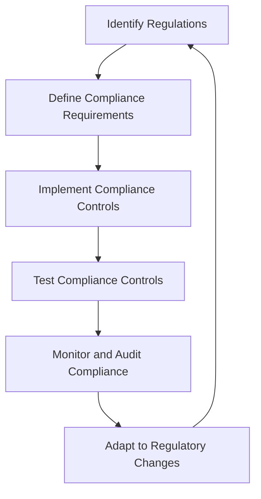

## 14.6.2 Testing for Regulatory Compliance

In the realm of data processing and real-time analytics, Apache Kafka stands out as a robust platform for handling large volumes of data. However, with great power comes great responsibility, particularly in ensuring that Kafka applications comply with various data protection and industry regulations. This section delves into the intricacies of testing Kafka applications for regulatory compliance, providing a roadmap for expert software engineers and enterprise architects to navigate the complex landscape of legal and ethical requirements.

### Key Regulations Affecting Kafka Applications

Before diving into testing strategies, it is crucial to understand the key regulations that impact Kafka applications. These regulations often dictate how data should be handled, stored, and protected.

#### General Data Protection Regulation (GDPR)

The GDPR is a comprehensive data protection regulation that applies to organizations operating within the European Union (EU) or handling data of EU citizens. Key requirements include:

- **Data Minimization**: Collect only the data necessary for specific purposes.
- **Data Subject Rights**: Ensure individuals can access, rectify, or erase their data.
- **Data Breach Notification**: Notify authorities and affected individuals of data breaches within 72 hours.

#### California Consumer Privacy Act (CCPA)

The CCPA grants California residents rights over their personal data, similar to GDPR, but with some differences:

- **Right to Know**: Consumers can request information about the data collected about them.
- **Right to Delete**: Consumers can request the deletion of their personal data.
- **Opt-Out Rights**: Consumers can opt-out of the sale of their personal data.

#### Health Insurance Portability and Accountability Act (HIPAA)

HIPAA is a U.S. regulation that mandates the protection of health information. Key aspects include:

- **Privacy Rule**: Protects individuals' medical records and other personal health information.
- **Security Rule**: Sets standards for securing electronic protected health information (ePHI).

#### Payment Card Industry Data Security Standard (PCI DSS)

PCI DSS is a set of security standards designed to protect card information during and after a financial transaction. Key requirements include:

- **Secure Network**: Maintain a secure network to protect cardholder data.
- **Access Control**: Implement strong access control measures.

### Testing for Compliance with Specific Requirements

Testing for regulatory compliance involves verifying that Kafka applications adhere to the specific requirements of applicable regulations. This section outlines strategies for testing compliance with data retention policies, access controls, and other critical aspects.

#### Data Retention Policies

Regulations often specify how long data can be retained and when it should be deleted. Testing for compliance with data retention policies involves:

- **Automated Data Deletion**: Implement automated processes to delete data after a specified period.
- **Retention Policy Audits**: Regularly audit data retention policies and practices to ensure compliance.

**Example Test Case**: Verify that data older than the retention period is automatically deleted from Kafka topics.

#### Access Controls

Access controls are critical for ensuring that only authorized individuals can access sensitive data. Testing access controls involves:

- **Role-Based Access Control (RBAC)**: Implement and test RBAC to ensure users have appropriate access levels.
- **Audit Logs**: Maintain and review audit logs to track access and changes to data.

**Example Test Case**: Test that only users with specific roles can access sensitive Kafka topics.

#### Data Encryption

Data encryption is often required to protect data both at rest and in transit. Testing for encryption compliance involves:

- **Encryption Verification**: Verify that data is encrypted using approved algorithms.
- **Key Management**: Ensure that encryption keys are managed securely.

**Example Test Case**: Test that data in Kafka topics is encrypted using AES-256 encryption.

### Maintaining Compliance Over Time

Compliance is not a one-time task but an ongoing process. Maintaining compliance over time requires continuous monitoring, regular audits, and adapting to regulatory changes.

#### Continuous Monitoring

Implement continuous monitoring to detect and respond to compliance issues in real-time. This includes:

- **Real-Time Alerts**: Set up alerts for unauthorized access or data breaches.
- **Compliance Dashboards**: Use dashboards to visualize compliance metrics and trends.

#### Regular Audits

Conduct regular audits to assess compliance with regulations and identify areas for improvement. This involves:

- **Internal Audits**: Perform internal audits to review compliance practices and policies.
- **External Audits**: Engage third-party auditors to provide an unbiased assessment of compliance.

#### Adapting to Regulatory Changes

Regulations are constantly evolving, and staying compliant requires adapting to these changes. This involves:

- **Regulatory Watch**: Stay informed about changes in regulations that affect your organization.
- **Policy Updates**: Update compliance policies and procedures to reflect regulatory changes.

### Practical Applications and Real-World Scenarios

To illustrate the practical application of compliance testing, consider the following real-world scenarios:

#### Scenario 1: GDPR Compliance for a European E-Commerce Platform

An e-commerce platform operating in the EU must ensure GDPR compliance. This involves:

- **Data Subject Access Requests**: Implement processes to handle data subject access requests efficiently.
- **Data Breach Response Plan**: Develop and test a data breach response plan to ensure timely notification.

#### Scenario 2: HIPAA Compliance for a Healthcare Provider

A healthcare provider must comply with HIPAA regulations. This involves:

- **ePHI Encryption**: Ensure that all ePHI is encrypted both at rest and in transit.
- **Access Control Policies**: Implement strict access control policies to protect patient data.

### Code Examples

To demonstrate compliance testing in practice, consider the following code examples in Java, Scala, Kotlin, and Clojure. These examples focus on implementing access controls and data encryption in Kafka applications.

#### Java Example: Implementing Access Controls

```java
import org.apache.kafka.clients.admin.AdminClient;
import org.apache.kafka.clients.admin.NewTopic;
import java.util.Collections;
import java.util.Properties;

public class KafkaAccessControl {
    public static void main(String[] args) {
        Properties props = new Properties();
        props.put("bootstrap.servers", "localhost:9092");
        props.put("sasl.mechanism", "PLAIN");
        props.put("security.protocol", "SASL_PLAINTEXT");

        AdminClient adminClient = AdminClient.create(props);

        // Create a new topic with access control
        NewTopic newTopic = new NewTopic("secure-topic", 1, (short) 1);
        adminClient.createTopics(Collections.singleton(newTopic));

        // Implement access control logic here
        // Example: Assign ACLs to the topic
        // Note: This is a simplified example for demonstration purposes
    }
}
```

#### Scala Example: Implementing Data Encryption

```scala
import org.apache.kafka.clients.producer.{KafkaProducer, ProducerRecord}
import java.util.Properties

object KafkaDataEncryption {
  def main(args: Array[String]): Unit = {
    val props = new Properties()
    props.put("bootstrap.servers", "localhost:9092")
    props.put("key.serializer", "org.apache.kafka.common.serialization.StringSerializer")
    props.put("value.serializer", "org.apache.kafka.common.serialization.StringSerializer")
    props.put("security.protocol", "SSL")
    props.put("ssl.truststore.location", "/path/to/truststore.jks")
    props.put("ssl.truststore.password", "password")

    val producer = new KafkaProducer[String, String](props)
    val record = new ProducerRecord[String, String]("encrypted-topic", "key", "encrypted-value")

    producer.send(record)
    producer.close()
  }
}
```

#### Kotlin Example: Implementing Role-Based Access Control

```kotlin
import org.apache.kafka.clients.admin.AdminClient
import org.apache.kafka.clients.admin.NewTopic
import java.util.*

fun main() {
    val props = Properties()
    props["bootstrap.servers"] = "localhost:9092"
    props["sasl.mechanism"] = "PLAIN"
    props["security.protocol"] = "SASL_PLAINTEXT"

    val adminClient = AdminClient.create(props)

    // Create a new topic with role-based access control
    val newTopic = NewTopic("rbac-topic", 1, 1.toShort())
    adminClient.createTopics(listOf(newTopic))

    // Implement role-based access control logic here
    // Example: Assign roles to users for the topic
    // Note: This is a simplified example for demonstration purposes
}
```

#### Clojure Example: Implementing Data Retention Policies

```clojure
(ns kafka.data-retention
  (:import (org.apache.kafka.clients.admin AdminClient NewTopic)
           (java.util Properties)))

(defn create-topic-with-retention []
  (let [props (doto (Properties.)
                (.put "bootstrap.servers" "localhost:9092")
                (.put "retention.ms" "604800000")) ; 7 days in milliseconds
        admin-client (AdminClient/create props)
        new-topic (NewTopic. "retention-topic" 1 1)]
    (.createTopics admin-client [new-topic])))

(create-topic-with-retention)
```

### Visualizing Compliance Testing

To enhance understanding, consider the following diagram illustrating the compliance testing process for Kafka applications:



**Caption**: This flowchart represents the iterative process of ensuring regulatory compliance in Kafka applications, from identifying regulations to adapting to changes.

### References and Links

- [Apache Kafka Documentation](https://kafka.apache.org/documentation/)
- [Confluent Documentation](https://docs.confluent.io/)
- [GDPR Overview](https://gdpr.eu/)
- [CCPA Overview](https://oag.ca.gov/privacy/ccpa)
- [HIPAA Compliance](https://www.hhs.gov/hipaa/index.html)
- [PCI DSS Standards](https://www.pcisecuritystandards.org/)

### Knowledge Check

To reinforce learning, consider the following questions and exercises:

1. **What are the key differences between GDPR and CCPA?**
2. **How can you test for compliance with data retention policies in Kafka?**
3. **Describe a scenario where HIPAA compliance would be critical in a Kafka application.**
4. **Implement a Kafka producer in your preferred language that encrypts data using SSL.**
5. **Discuss the importance of continuous monitoring in maintaining compliance.**

### Conclusion

Ensuring regulatory compliance in Kafka applications is a complex but essential task. By understanding key regulations, implementing robust testing strategies, and maintaining compliance over time, organizations can protect sensitive data and avoid legal pitfalls. As regulations evolve, staying informed and adaptable will be crucial for continued compliance.

## Test Your Knowledge: Regulatory Compliance in Kafka Applications



### Which regulation requires data breach notification within 72 hours?

- [x] GDPR
- [ ] CCPA
- [ ] HIPAA
- [ ] PCI DSS

> **Explanation:** GDPR mandates that data breaches be reported to authorities and affected individuals within 72 hours.

### What is a key requirement of the CCPA?

- [x] Right to Know
- [ ] Data Minimization
- [ ] Data Breach Notification
- [ ] Secure Network

> **Explanation:** The CCPA grants California residents the right to know what personal data is collected about them.

### How can you ensure data retention compliance in Kafka?

- [x] Implement automated data deletion processes
- [ ] Encrypt all data at rest
- [ ] Use role-based access control
- [ ] Monitor network traffic

> **Explanation:** Automated data deletion processes help ensure that data is retained only for the required period.

### What is a primary focus of HIPAA compliance?

- [x] Protecting health information
- [ ] Encrypting financial transactions
- [ ] Ensuring data minimization
- [ ] Providing opt-out rights

> **Explanation:** HIPAA focuses on protecting individuals' medical records and personal health information.

### Which of the following is a method for testing access controls?

- [x] Role-Based Access Control (RBAC)
- [ ] Data Encryption
- [ ] Data Retention Audits
- [ ] Continuous Monitoring

> **Explanation:** RBAC is a method for ensuring that users have appropriate access levels to sensitive data.

### Why is continuous monitoring important for compliance?

- [x] It detects compliance issues in real-time
- [ ] It encrypts data at rest
- [ ] It provides opt-out rights
- [ ] It ensures data minimization

> **Explanation:** Continuous monitoring helps detect and respond to compliance issues as they occur.

### What should be included in a data breach response plan?

- [x] Notification procedures
- [ ] Data encryption algorithms
- [x] Contact information for authorities
- [ ] Data retention policies

> **Explanation:** A data breach response plan should include procedures for notifying authorities and affected individuals.

### How can Kafka applications adapt to regulatory changes?

- [x] Update compliance policies
- [ ] Encrypt all data in transit
- [ ] Implement RBAC
- [ ] Conduct regular audits

> **Explanation:** Updating compliance policies ensures that Kafka applications remain compliant with evolving regulations.

### What is the role of audit logs in compliance testing?

- [x] Tracking access and changes to data
- [ ] Encrypting data at rest
- [ ] Providing opt-out rights
- [ ] Ensuring data minimization

> **Explanation:** Audit logs help track access and changes to data, which is crucial for compliance testing.

### True or False: PCI DSS requires encryption of data both at rest and in transit.

- [x] True
- [ ] False

> **Explanation:** PCI DSS mandates that cardholder data be encrypted both at rest and in transit to protect it during and after transactions.


