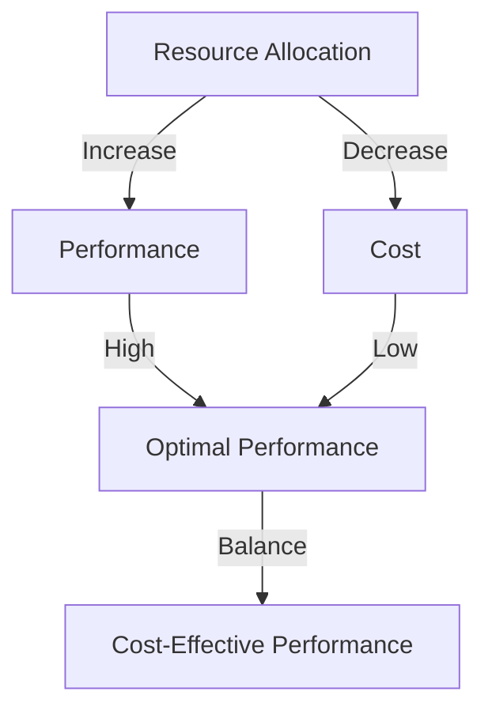

## 15.1.3 Trade-Offs Between Performance and Cost

In the realm of Apache Kafka deployments, achieving the right balance between performance and cost is a critical challenge for enterprise architects and software engineers. This section delves into the intricate relationship between performance requirements and cost implications, offering insights into optimizing resource allocation while maintaining desired performance levels.

### Understanding the Performance-Cost Relationship

Performance and cost are inherently linked in any system architecture. In Apache Kafka, performance is often measured in terms of throughput, latency, and fault tolerance. Achieving high performance typically requires significant resource investment, including computing power, storage, and network bandwidth. However, these resources come at a cost, which can escalate quickly, especially in cloud environments.

#### Key Performance Metrics

1. **Throughput**: The amount of data processed by Kafka per unit time. High throughput demands more broker resources and efficient data partitioning strategies.
2. **Latency**: The time taken for a message to travel from producer to consumer. Low latency requires optimized network configurations and fast storage solutions.
3. **Fault Tolerance**: The ability to withstand failures without data loss. This involves replication and redundancy, which increase resource usage.

### Scenarios for Cost Reduction Without Significant Performance Loss

1. **Optimizing Topic Partitioning**: By carefully designing topic partitions, you can ensure that data is evenly distributed across brokers, reducing the need for additional resources. For example, using key-based partitioning can help maintain data locality and reduce cross-broker communication.

2. **Adjusting Replication Factors**: While a higher replication factor increases fault tolerance, it also raises storage costs. Assessing the criticality of data and adjusting replication factors accordingly can lead to cost savings.

3. **Leveraging Compression**: Implementing data compression can reduce storage and network costs. However, it may introduce additional CPU overhead, so it's essential to evaluate the trade-offs based on workload characteristics.

4. **Utilizing Spot Instances in Cloud Environments**: For non-critical workloads, using spot instances can significantly reduce costs. However, this approach requires robust fault tolerance mechanisms to handle potential instance terminations.

### Implications of Over-Provisioning and Under-Provisioning

#### Over-Provisioning

Over-provisioning involves allocating more resources than necessary to handle peak loads. While this ensures high performance and reliability, it leads to increased costs and resource wastage. In cloud environments, this can result in substantial financial overhead due to unused capacity.

**Consequences**:
- Increased operational costs.
- Underutilized resources.
- Potential for complacency in performance tuning.

#### Under-Provisioning

Under-provisioning, on the other hand, involves allocating fewer resources than required, leading to performance bottlenecks and potential system failures. This can negatively impact user experience and lead to data loss in extreme cases.

**Consequences**:
- Increased latency and reduced throughput.
- Higher risk of data loss during peak loads.
- Potential for service-level agreement (SLA) violations.

### Recommendations for Finding the Optimal Balance

1. **Conduct Thorough Capacity Planning**: Utilize historical data and predictive analytics to forecast resource needs accurately. This involves understanding workload patterns and scaling requirements.

2. **Implement Auto-Scaling**: In cloud environments, leverage auto-scaling capabilities to dynamically adjust resources based on demand. This ensures optimal resource utilization and cost efficiency.

3. **Monitor and Optimize Continuously**: Regularly monitor Kafka performance metrics and adjust configurations as needed. Tools like Prometheus and Grafana can provide valuable insights into system performance and resource usage.

4. **Adopt a Hybrid Cloud Strategy**: For enterprises with fluctuating workloads, a hybrid cloud approach can offer the flexibility to scale resources up or down as needed, optimizing costs while maintaining performance.

5. **Evaluate Cost-Performance Trade-offs Regularly**: Periodically review the cost-performance balance to ensure alignment with business objectives. This involves assessing the impact of configuration changes on both performance and cost.

### Practical Applications and Real-World Scenarios

#### Case Study: E-Commerce Platform

An e-commerce platform experiences high traffic during sales events, requiring a scalable Kafka infrastructure to handle increased data volumes. By implementing auto-scaling and optimizing topic partitioning, the platform can maintain high performance while minimizing costs during off-peak periods.

#### Case Study: Financial Services

A financial services company uses Kafka for real-time fraud detection. Given the critical nature of the application, the company opts for a higher replication factor and low-latency configurations. However, by leveraging spot instances for non-critical data processing tasks, they achieve cost savings without compromising on performance.

### Code Examples

To illustrate the concepts discussed, let's explore some code examples in Java, Scala, Kotlin, and Clojure that demonstrate how to configure Kafka producers and consumers for optimal performance and cost efficiency.

#### Java Example

```java
import org.apache.kafka.clients.producer.KafkaProducer;
import org.apache.kafka.clients.producer.ProducerConfig;
import org.apache.kafka.clients.producer.ProducerRecord;
import org.apache.kafka.common.serialization.StringSerializer;

import java.util.Properties;

public class KafkaProducerExample {
    public static void main(String[] args) {
        Properties props = new Properties();
        props.put(ProducerConfig.BOOTSTRAP_SERVERS_CONFIG, "localhost:9092");
        props.put(ProducerConfig.KEY_SERIALIZER_CLASS_CONFIG, StringSerializer.class.getName());
        props.put(ProducerConfig.VALUE_SERIALIZER_CLASS_CONFIG, StringSerializer.class.getName());
        props.put(ProducerConfig.COMPRESSION_TYPE_CONFIG, "gzip"); // Enable compression to reduce costs
        props.put(ProducerConfig.BATCH_SIZE_CONFIG, 16384); // Adjust batch size for optimal throughput

        KafkaProducer<String, String> producer = new KafkaProducer<>(props);
        try {
            for (int i = 0; i < 100; i++) {
                producer.send(new ProducerRecord<>("my-topic", Integer.toString(i), "message-" + i));
            }
        } finally {
            producer.close();
        }
    }
}
```

#### Scala Example

```scala
import org.apache.kafka.clients.producer.{KafkaProducer, ProducerConfig, ProducerRecord}
import org.apache.kafka.common.serialization.StringSerializer

import java.util.Properties

object KafkaProducerExample extends App {
  val props = new Properties()
  props.put(ProducerConfig.BOOTSTRAP_SERVERS_CONFIG, "localhost:9092")
  props.put(ProducerConfig.KEY_SERIALIZER_CLASS_CONFIG, classOf[StringSerializer].getName)
  props.put(ProducerConfig.VALUE_SERIALIZER_CLASS_CONFIG, classOf[StringSerializer].getName)
  props.put(ProducerConfig.COMPRESSION_TYPE_CONFIG, "gzip") // Enable compression
  props.put(ProducerConfig.BATCH_SIZE_CONFIG, "16384") // Adjust batch size

  val producer = new KafkaProducer[String, String](props)

  try {
    for (i <- 0 until 100) {
      producer.send(new ProducerRecord[String, String]("my-topic", i.toString, s"message-$i"))
    }
  } finally {
    producer.close()
  }
}
```

#### Kotlin Example

```kotlin
import org.apache.kafka.clients.producer.KafkaProducer
import org.apache.kafka.clients.producer.ProducerConfig
import org.apache.kafka.clients.producer.ProducerRecord
import org.apache.kafka.common.serialization.StringSerializer
import java.util.Properties

fun main() {
    val props = Properties().apply {
        put(ProducerConfig.BOOTSTRAP_SERVERS_CONFIG, "localhost:9092")
        put(ProducerConfig.KEY_SERIALIZER_CLASS_CONFIG, StringSerializer::class.java.name)
        put(ProducerConfig.VALUE_SERIALIZER_CLASS_CONFIG, StringSerializer::class.java.name)
        put(ProducerConfig.COMPRESSION_TYPE_CONFIG, "gzip") // Enable compression
        put(ProducerConfig.BATCH_SIZE_CONFIG, 16384) // Adjust batch size
    }

    val producer = KafkaProducer<String, String>(props)

    try {
        for (i in 0 until 100) {
            producer.send(ProducerRecord("my-topic", i.toString(), "message-$i"))
        }
    } finally {
        producer.close()
    }
}
```

#### Clojure Example

```clojure
(ns kafka-producer-example
  (:import (org.apache.kafka.clients.producer KafkaProducer ProducerConfig ProducerRecord)
           (org.apache.kafka.common.serialization StringSerializer))
  (:require [clojure.java.io :as io]))

(defn create-producer []
  (let [props (doto (java.util.Properties.)
                (.put ProducerConfig/BOOTSTRAP_SERVERS_CONFIG "localhost:9092")
                (.put ProducerConfig/KEY_SERIALIZER_CLASS_CONFIG StringSerializer)
                (.put ProducerConfig/VALUE_SERIALIZER_CLASS_CONFIG StringSerializer)
                (.put ProducerConfig/COMPRESSION_TYPE_CONFIG "gzip") ; Enable compression
                (.put ProducerConfig/BATCH_SIZE_CONFIG 16384))] ; Adjust batch size
    (KafkaProducer. props)))

(defn -main []
  (let [producer (create-producer)]
    (try
      (doseq [i (range 100)]
        (.send producer (ProducerRecord. "my-topic" (str i) (str "message-" i))))
      (finally
        (.close producer)))))
```

### Visualizing the Trade-Offs

To better understand the trade-offs between performance and cost, consider the following diagram illustrating the relationship between resource allocation and system performance.



**Diagram Description**: This diagram illustrates how increasing resource allocation can enhance performance but also raise costs. The goal is to find a balance that achieves cost-effective performance.

### References and Links

- [Apache Kafka Documentation](https://kafka.apache.org/documentation/)
- [Confluent Documentation](https://docs.confluent.io/)
- [1.4.4 Big Data Integration]( "Big Data Integration")

### Knowledge Check

To reinforce your understanding of the trade-offs between performance and cost in Apache Kafka deployments, consider the following questions and challenges.

## Test Your Knowledge: Balancing Performance and Cost in Kafka



### Which metric is crucial for understanding Kafka's ability to handle large volumes of data?

- [x] Throughput
- [ ] Latency
- [ ] Fault Tolerance
- [ ] Compression

> **Explanation:** Throughput measures the amount of data processed per unit time, making it essential for evaluating Kafka's data handling capacity.

### What is a potential downside of over-provisioning resources in Kafka?

- [x] Increased operational costs
- [ ] Reduced latency
- [ ] Improved fault tolerance
- [ ] Enhanced throughput

> **Explanation:** Over-provisioning leads to higher costs due to unused resources, without necessarily improving performance metrics like latency or throughput.

### How can compression help in reducing costs in Kafka deployments?

- [x] By reducing storage and network usage
- [ ] By increasing CPU overhead
- [ ] By lowering throughput
- [ ] By decreasing latency

> **Explanation:** Compression reduces the amount of data stored and transmitted, leading to cost savings, though it may increase CPU usage.

### What is a key benefit of using auto-scaling in cloud-based Kafka deployments?

- [x] Dynamic resource adjustment based on demand
- [ ] Fixed resource allocation
- [ ] Increased latency
- [ ] Reduced fault tolerance

> **Explanation:** Auto-scaling allows for automatic resource adjustments, ensuring optimal utilization and cost efficiency as demand fluctuates.

### Which strategy can help in maintaining performance while reducing costs?

- [x] Optimizing topic partitioning
- [ ] Increasing replication factors
- [ ] Disabling compression
- [ ] Using only on-premises resources

> **Explanation:** Optimizing topic partitioning ensures even data distribution, reducing the need for additional resources and maintaining performance.

### What is a consequence of under-provisioning resources in Kafka?

- [x] Increased latency and reduced throughput
- [ ] Lower operational costs
- [ ] Improved fault tolerance
- [ ] Enhanced data security

> **Explanation:** Under-provisioning can lead to performance bottlenecks, increasing latency and reducing throughput, which can impact user experience.

### How can hybrid cloud strategies benefit Kafka deployments?

- [x] By offering flexibility in scaling resources
- [ ] By reducing data redundancy
- [ ] By eliminating the need for auto-scaling
- [ ] By increasing fixed costs

> **Explanation:** Hybrid cloud strategies provide the flexibility to scale resources as needed, optimizing costs while maintaining performance.

### What is the impact of adjusting replication factors on cost?

- [x] Higher replication factors increase storage costs
- [ ] Lower replication factors increase storage costs
- [ ] Replication factors have no impact on cost
- [ ] Replication factors only affect network costs

> **Explanation:** Higher replication factors require more storage, leading to increased costs, especially in cloud environments.

### Why is continuous monitoring important in Kafka deployments?

- [x] To adjust configurations for optimal performance
- [ ] To increase fixed resource allocation
- [ ] To eliminate the need for auto-scaling
- [ ] To reduce data redundancy

> **Explanation:** Continuous monitoring allows for real-time adjustments to configurations, ensuring optimal performance and cost efficiency.

### True or False: Spot instances are suitable for critical Kafka workloads.

- [ ] True
- [x] False

> **Explanation:** Spot instances are not ideal for critical workloads due to their potential for termination, but they can be cost-effective for non-critical tasks.



By understanding and applying these strategies, you can effectively manage the trade-offs between performance and cost in your Apache Kafka deployments, ensuring a scalable and cost-efficient architecture.
