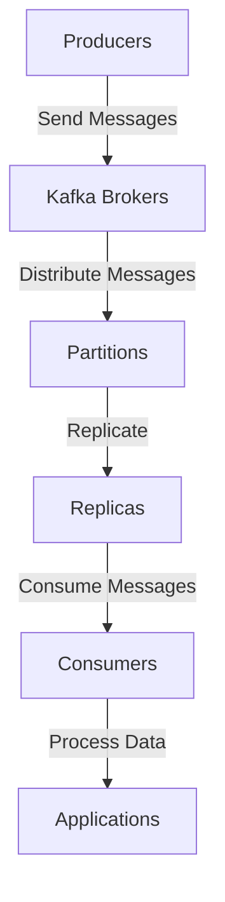

## 15.2.1 Predicting Resource Needs Based on Workloads

In the realm of real-time data processing, Apache Kafka stands as a cornerstone technology, enabling scalable and fault-tolerant systems. However, to harness its full potential, it is crucial to accurately predict resource needs based on workloads. This section delves into techniques for analyzing current workloads, estimating future resource requirements, and ensuring that Kafka clusters are adequately provisioned.

### Understanding Workload Metrics

To predict resource needs effectively, one must first understand the key workload metrics that influence Kafka's performance. These metrics include:

- **Throughput**: The volume of data processed per unit time, typically measured in messages per second or bytes per second.
- **Latency**: The time taken for a message to travel from producer to consumer.
- **Partition Count**: The number of partitions in a topic, which affects parallelism and load distribution.
- **Replication Factor**: The number of copies of each partition, impacting data durability and resource usage.
- **Consumer Lag**: The difference between the latest message offset and the offset of the last message processed by a consumer.

#### Collecting Workload Metrics

To collect these metrics, leverage Kafka's built-in monitoring tools and third-party solutions. Tools like Prometheus and Grafana can be used to visualize and analyze metrics over time. Additionally, Kafka's JMX (Java Management Extensions) interface provides a wealth of information about broker and topic performance.

```java
// Example: Collecting Kafka metrics using JMX in Java
import javax.management.*;
import java.lang.management.ManagementFactory;

public class KafkaMetricsCollector {
    public static void main(String[] args) throws Exception {
        MBeanServer mbs = ManagementFactory.getPlatformMBeanServer();
        ObjectName name = new ObjectName("kafka.server:type=BrokerTopicMetrics,name=MessagesInPerSec");
        Double messagesInPerSec = (Double) mbs.getAttribute(name, "OneMinuteRate");
        System.out.println("Messages In Per Second: " + messagesInPerSec);
    }
}
```

### Interpreting Workload Metrics

Once collected, interpret these metrics to understand current system performance and identify trends. For instance, a consistently high consumer lag may indicate that consumers are unable to keep up with the incoming message rate, necessitating additional consumer instances or optimized processing logic.

### Modeling Techniques for Workload Forecasting

Forecasting future workloads involves modeling techniques that account for historical data and anticipated changes. Common approaches include:

- **Time Series Analysis**: Use historical data to identify patterns and predict future trends. Techniques such as ARIMA (AutoRegressive Integrated Moving Average) can be employed for this purpose.
- **Regression Analysis**: Establish relationships between workload metrics and external factors, such as user activity or business events, to predict future resource needs.
- **Machine Learning Models**: Implement machine learning algorithms to predict workloads based on complex patterns in historical data.

#### Example: Time Series Forecasting with ARIMA in Python

```python
import pandas as pd
from statsmodels.tsa.arima.model import ARIMA
import matplotlib.pyplot as plt

# Load historical throughput data
data = pd.read_csv('throughput_data.csv', index_col='date', parse_dates=True)

# Fit ARIMA model
model = ARIMA(data, order=(5,1,0))
model_fit = model.fit()

# Forecast future throughput
forecast = model_fit.forecast(steps=30)
plt.plot(data, label='Historical')
plt.plot(forecast, label='Forecast', color='red')
plt.legend()
plt.show()
```

### Calculating Required Resources

Based on forecasted workloads, calculate the required CPU, memory, storage, and network resources. Consider the following:

- **CPU**: Estimate CPU needs based on message processing rates and the complexity of processing logic. High throughput and complex transformations will require more CPU resources.
- **Memory**: Allocate sufficient memory for buffering messages and maintaining state, especially in stream processing applications.
- **Storage**: Determine storage needs based on data retention policies and replication factors. Ensure that storage can accommodate peak loads and historical data retention.
- **Network**: Assess network bandwidth requirements to handle data ingress and egress, considering peak loads and replication traffic.

#### Example: Calculating CPU and Memory Requirements

```scala
// Scala code to estimate CPU and memory requirements
val messageRate = 10000 // messages per second
val processingTimePerMessage = 0.001 // seconds
val cpuCoresNeeded = messageRate * processingTimePerMessage

val memoryPerMessage = 0.5 // MB
val bufferSize = 1000 // messages
val memoryNeeded = bufferSize * memoryPerMessage

println(s"CPU Cores Needed: $cpuCoresNeeded")
println(s"Memory Needed: $memoryNeeded MB")
```

### Considerations for Peak Loads and Contingency Planning

When planning for resource needs, account for peak loads and unexpected surges in traffic. Implement contingency plans to handle these scenarios:

- **Auto-Scaling**: Configure auto-scaling policies to dynamically adjust resources based on workload changes.
- **Load Balancing**: Distribute traffic evenly across brokers and consumers to prevent bottlenecks.
- **Redundancy**: Ensure redundancy in critical components to maintain availability during peak loads.

### Practical Applications and Real-World Scenarios

In practice, predicting resource needs based on workloads is crucial for maintaining Kafka's performance and cost efficiency. Consider the following scenarios:

- **E-commerce Platforms**: During sales events, traffic spikes can overwhelm Kafka clusters. Accurate forecasting ensures that resources are scaled appropriately to handle increased load.
- **Financial Services**: Real-time fraud detection systems require consistent low-latency processing. Predicting resource needs ensures that systems remain responsive under varying workloads.
- **IoT Applications**: Sensor data ingestion can vary significantly based on environmental conditions. Forecasting helps maintain system stability and performance.

### Visualizing Kafka's Architecture and Data Flow

To better understand how workload metrics impact resource needs, consider the following diagram illustrating Kafka's architecture and data flow:



**Caption**: This diagram represents the flow of data through Kafka, from producers to consumers, highlighting the role of brokers, partitions, and replicas.

### Conclusion

Predicting resource needs based on workloads is a critical aspect of managing Apache Kafka clusters. By collecting and interpreting workload metrics, employing forecasting models, and planning for peak loads, organizations can ensure that their Kafka deployments are both performant and cost-effective. 

### Knowledge Check

To reinforce your understanding, consider the following questions and challenges:

1. What are the key workload metrics to monitor in a Kafka deployment?
2. How can time series analysis be used to forecast future workloads?
3. What factors should be considered when calculating CPU and memory requirements for Kafka?
4. How can auto-scaling be implemented to handle peak loads?
5. Describe a real-world scenario where accurate workload forecasting is essential.

### Further Reading

For more information on Kafka capacity planning and resource management, consider the following resources:

- [Apache Kafka Documentation](https://kafka.apache.org/documentation/)
- [Confluent Documentation](https://docs.confluent.io/)
- [Prometheus and Grafana for Monitoring Kafka](https://prometheus.io/docs/introduction/overview/)

## Test Your Knowledge: Predicting Resource Needs for Apache Kafka



### What is the primary metric for measuring Kafka throughput?

- [x] Messages per second
- [ ] Consumer lag
- [ ] Partition count
- [ ] Replication factor

> **Explanation:** Throughput is typically measured in messages per second, indicating the volume of data processed.

### Which tool can be used to visualize Kafka metrics?

- [x] Grafana
- [ ] Jenkins
- [ ] Ansible
- [ ] Terraform

> **Explanation:** Grafana is a popular tool for visualizing metrics collected by Prometheus.

### What is the purpose of time series analysis in workload forecasting?

- [x] To identify patterns and predict future trends
- [ ] To establish relationships between metrics
- [ ] To visualize data
- [ ] To automate scaling

> **Explanation:** Time series analysis uses historical data to identify patterns and predict future trends.

### How is CPU requirement calculated for Kafka workloads?

- [x] Based on message processing rates and complexity
- [ ] Based on storage needs
- [ ] Based on network bandwidth
- [ ] Based on consumer lag

> **Explanation:** CPU requirements are estimated based on the rate of message processing and the complexity of processing logic.

### What is a key consideration for peak load planning?

- [x] Auto-scaling policies
- [ ] Data retention policies
- [ ] Consumer lag
- [ ] Partition count

> **Explanation:** Auto-scaling policies help dynamically adjust resources to handle peak loads.

### Which of the following is a real-world scenario for workload forecasting?

- [x] E-commerce sales events
- [ ] Static website hosting
- [ ] Batch processing
- [ ] Manual data entry

> **Explanation:** E-commerce platforms experience traffic spikes during sales events, requiring accurate workload forecasting.

### What is the role of redundancy in Kafka resource planning?

- [x] To maintain availability during peak loads
- [ ] To reduce storage costs
- [ ] To increase consumer lag
- [ ] To simplify configuration

> **Explanation:** Redundancy ensures that critical components remain available during peak loads.

### Which language is used in the provided example for time series forecasting?

- [x] Python
- [ ] Java
- [ ] Scala
- [ ] Clojure

> **Explanation:** The example uses Python for time series forecasting with ARIMA.

### What is the impact of replication factor on resource needs?

- [x] It affects data durability and resource usage
- [ ] It determines consumer lag
- [ ] It influences partition count
- [ ] It controls message throughput

> **Explanation:** The replication factor impacts data durability and the amount of storage and network resources required.

### True or False: Consumer lag is the difference between the latest message offset and the offset of the last message processed by a consumer.

- [x] True
- [ ] False

> **Explanation:** Consumer lag measures the delay in processing messages, calculated as the difference between the latest message offset and the last processed offset.



---
