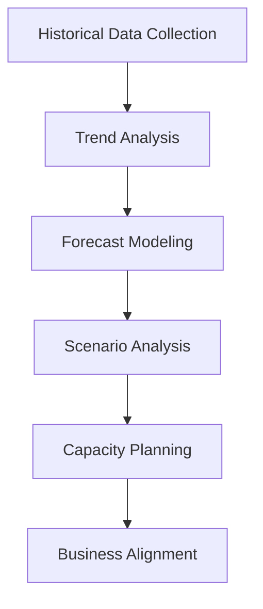

## 15.2.4 Forecasting Growth and Scaling Needs

Forecasting growth and scaling needs in Apache Kafka is a critical aspect of capacity planning that ensures your Kafka clusters can handle future data loads without service disruptions. This section delves into advanced techniques for projecting data growth, identifying trends, and aligning capacity planning with business objectives.

### Importance of Forecasting in Kafka

Forecasting is essential for maintaining the performance and reliability of Kafka clusters. By anticipating future data volumes and message rates, organizations can proactively scale their infrastructure, avoiding the pitfalls of reactive scaling, which can lead to service outages and degraded performance.

### Techniques for Projecting Data Growth and Message Rates

#### 1. Historical Data Analysis

Analyze historical data to identify trends in data growth and message rates. Use this data to create models that predict future growth. Consider the following steps:

- **Data Collection**: Gather historical metrics from Kafka, such as message throughput, topic sizes, and consumer lag.
- **Trend Analysis**: Use statistical methods to identify patterns and trends in the data.
- **Modeling**: Apply time series analysis techniques, such as ARIMA (AutoRegressive Integrated Moving Average), to forecast future data growth.

#### 2. Machine Learning Models

Leverage machine learning models to predict data growth. These models can capture complex patterns that traditional statistical methods might miss.

- **Feature Engineering**: Identify relevant features, such as time of day, day of the week, and business events, that influence data growth.
- **Model Selection**: Use models like Random Forest, Gradient Boosting, or Neural Networks for forecasting.
- **Training and Validation**: Train models on historical data and validate their accuracy using a test dataset.

#### 3. Scenario Analysis

Conduct scenario analysis to understand how different business events might impact data growth.

- **Event Identification**: Identify potential business events, such as product launches or marketing campaigns, that could affect data volumes.
- **Impact Assessment**: Estimate the impact of these events on data growth using historical data or expert judgment.
- **Scenario Modeling**: Create multiple scenarios to explore different growth trajectories.

### Identifying Trends and Patterns

#### 1. Seasonal Patterns

Identify seasonal patterns in data growth, such as increased traffic during holidays or specific times of the year.

- **Seasonal Decomposition**: Use techniques like STL (Seasonal-Trend Decomposition using Loess) to separate seasonal patterns from the overall trend.
- **Pattern Recognition**: Recognize recurring patterns and incorporate them into your forecasts.

#### 2. Anomalies and Outliers

Detect anomalies and outliers that could skew your forecasts.

- **Anomaly Detection**: Use statistical tests or machine learning models to identify anomalies in historical data.
- **Outlier Treatment**: Decide whether to exclude outliers from your analysis or adjust your models to account for them.

### Considerations for Business Events

Business events can significantly impact data growth and should be factored into your forecasts.

#### 1. Product Launches

- **Traffic Spikes**: Anticipate increased traffic and data volumes during product launches.
- **Capacity Planning**: Ensure your Kafka clusters can handle the expected increase in load.

#### 2. Marketing Campaigns

- **Promotional Events**: Plan for data spikes during promotional events and campaigns.
- **Load Testing**: Conduct load testing to validate your infrastructure's ability to handle increased traffic.

### Aligning Capacity Planning with Business Planning Cycles

Integrate capacity planning with your organization's business planning cycles to ensure alignment between technical and business objectives.

#### 1. Cross-Functional Collaboration

- **Stakeholder Engagement**: Collaborate with business stakeholders to understand upcoming events and initiatives.
- **Regular Reviews**: Schedule regular reviews to update forecasts based on the latest business plans.

#### 2. Agile Planning

- **Iterative Approach**: Use an iterative approach to capacity planning, allowing for adjustments as new information becomes available.
- **Feedback Loops**: Establish feedback loops to refine forecasts based on actual data and outcomes.

### Practical Applications and Real-World Scenarios

#### Case Study: E-Commerce Platform

An e-commerce platform experiences seasonal spikes in traffic during major sales events. By analyzing historical data and collaborating with marketing teams, the platform forecasts data growth and scales its Kafka clusters accordingly, ensuring seamless service during peak periods.

#### Case Study: Financial Services

A financial services company uses machine learning models to predict data growth based on market trends and economic indicators. This proactive approach allows the company to scale its Kafka infrastructure in advance, maintaining high performance and reliability.

### Code Examples

To illustrate these concepts, let's explore code examples in Java, Scala, Kotlin, and Clojure for implementing a simple forecasting model using historical Kafka metrics.

#### Java Example

```java
import java.util.List;
import java.util.stream.Collectors;

public class KafkaForecasting {
    public static void main(String[] args) {
        List<Double> historicalData = List.of(100.0, 150.0, 200.0, 250.0, 300.0);
        double forecast = forecastGrowth(historicalData);
        System.out.println("Forecasted Growth: " + forecast);
    }

    public static double forecastGrowth(List<Double> data) {
        return data.stream().collect(Collectors.averagingDouble(Double::doubleValue));
    }
}
```

#### Scala Example

```scala
object KafkaForecasting extends App {
  val historicalData = List(100.0, 150.0, 200.0, 250.0, 300.0)
  val forecast = forecastGrowth(historicalData)
  println(s"Forecasted Growth: $forecast")

  def forecastGrowth(data: List[Double]): Double = {
    data.sum / data.size
  }
}
```

#### Kotlin Example

```kotlin
fun main() {
    val historicalData = listOf(100.0, 150.0, 200.0, 250.0, 300.0)
    val forecast = forecastGrowth(historicalData)
    println("Forecasted Growth: $forecast")
}

fun forecastGrowth(data: List<Double>): Double {
    return data.average()
}
```

#### Clojure Example

```clojure
(defn forecast-growth [data]
  (/ (reduce + data) (count data)))

(let [historical-data [100.0 150.0 200.0 250.0 300.0]
      forecast (forecast-growth historical-data)]
  (println "Forecasted Growth:" forecast))
```

### Visualizing Forecasting Techniques

#### Data Flow Diagram



*Caption*: This diagram illustrates the data flow for forecasting growth and scaling needs in Apache Kafka.

### References and Links

- [Apache Kafka Documentation](https://kafka.apache.org/documentation/)
- [Confluent Documentation](https://docs.confluent.io/)
- [Time Series Analysis with ARIMA](https://otexts.com/fpp2/arima.html)
- [Machine Learning for Forecasting](https://scikit-learn.org/stable/supervised_learning.html)

### Knowledge Check

To reinforce your understanding of forecasting growth and scaling needs in Apache Kafka, consider the following questions and exercises.

## Test Your Knowledge: Forecasting Growth and Scaling Needs Quiz



### Which technique is commonly used for analyzing historical data to identify trends?

- [x] Time Series Analysis
- [ ] Regression Analysis
- [ ] Clustering
- [ ] Classification

> **Explanation:** Time series analysis is a statistical technique used to analyze time-ordered data to identify trends and patterns.

### What is the primary benefit of using machine learning models for forecasting?

- [x] They can capture complex patterns in data.
- [ ] They are easier to implement than statistical methods.
- [ ] They require less data for training.
- [ ] They provide exact predictions.

> **Explanation:** Machine learning models can capture complex patterns in data that traditional statistical methods might miss, making them useful for forecasting.

### Why is scenario analysis important in forecasting?

- [x] It helps understand the impact of different business events on data growth.
- [ ] It simplifies the forecasting process.
- [ ] It eliminates the need for historical data.
- [ ] It guarantees accurate predictions.

> **Explanation:** Scenario analysis helps organizations understand how different business events, such as product launches or marketing campaigns, might impact data growth.

### What is the role of seasonal decomposition in forecasting?

- [x] To separate seasonal patterns from the overall trend.
- [ ] To identify anomalies in data.
- [ ] To improve model accuracy.
- [ ] To reduce data noise.

> **Explanation:** Seasonal decomposition is used to separate seasonal patterns from the overall trend in data, helping improve the accuracy of forecasts.

### How can cross-functional collaboration benefit capacity planning?

- [x] By ensuring alignment between technical and business objectives.
- [ ] By reducing the need for technical expertise.
- [x] By providing insights into upcoming business events.
- [ ] By simplifying the planning process.

> **Explanation:** Cross-functional collaboration ensures alignment between technical and business objectives and provides insights into upcoming business events that might impact capacity planning.

### What is the advantage of using an iterative approach to capacity planning?

- [x] It allows for adjustments as new information becomes available.
- [ ] It eliminates the need for historical data.
- [ ] It simplifies the forecasting process.
- [ ] It guarantees accurate predictions.

> **Explanation:** An iterative approach to capacity planning allows organizations to make adjustments as new information becomes available, improving the accuracy of forecasts.

### Which of the following is a common feature used in machine learning models for forecasting?

- [x] Time of day
- [ ] Data type
- [x] Business events
- [ ] Data format

> **Explanation:** Features like time of day and business events are commonly used in machine learning models for forecasting to capture patterns that influence data growth.

### What is the purpose of load testing in capacity planning?

- [x] To validate the infrastructure's ability to handle increased traffic.
- [ ] To reduce the need for forecasting.
- [ ] To simplify the planning process.
- [ ] To guarantee accurate predictions.

> **Explanation:** Load testing is used to validate the infrastructure's ability to handle increased traffic, ensuring that it can support future data growth.

### How can anomaly detection improve forecasting accuracy?

- [x] By identifying and addressing anomalies in historical data.
- [ ] By simplifying the forecasting process.
- [ ] By eliminating the need for historical data.
- [ ] By guaranteeing accurate predictions.

> **Explanation:** Anomaly detection helps identify and address anomalies in historical data, improving the accuracy of forecasts.

### True or False: Forecasting growth and scaling needs in Kafka is only necessary for large organizations.

- [x] False
- [ ] True

> **Explanation:** Forecasting growth and scaling needs is important for organizations of all sizes to ensure their Kafka clusters can handle future data loads without service disruptions.



By mastering forecasting techniques, you can ensure your Kafka infrastructure is prepared for future growth, maintaining high performance and reliability.
