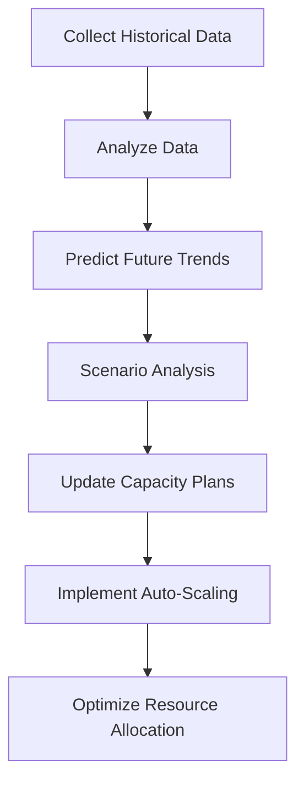

## 15.2 Capacity Planning

Capacity planning is a critical aspect of managing Apache Kafka clusters, ensuring that systems are neither under-resourced, leading to performance bottlenecks, nor over-provisioned, resulting in unnecessary costs. This section delves into the methodologies and tools necessary for effective capacity planning, focusing on predicting resource needs based on workload analysis and ensuring that clusters can handle future growth efficiently.

### Importance of Capacity Planning

Capacity planning is essential for maintaining the balance between resource availability and cost efficiency. Proper planning helps prevent resource shortages that can lead to system downtime or degraded performance, and it avoids wastage by ensuring that resources are not over-allocated. In the context of Kafka, capacity planning involves understanding the factors that influence resource requirements, such as message rates, data retention policies, and the number of consumers and producers.

### Factors Influencing Capacity Requirements

#### Message Rates

The rate at which messages are produced and consumed is a primary factor in determining Kafka's capacity needs. High message rates require more processing power and storage capacity. To accurately plan for capacity, it's crucial to measure and predict the peak message rates your system will encounter.

#### Data Retention

Kafka's data retention policies dictate how long messages are stored in the system. Longer retention periods require more storage space, impacting the overall capacity requirements. It's important to balance retention needs with storage costs, considering both regulatory requirements and business needs.

#### Number of Partitions

The number of partitions in a Kafka topic affects both performance and capacity. More partitions can improve parallelism and throughput but also increase the load on brokers and require more resources for replication and storage.

#### Consumer and Producer Load

The number of consumers and producers, along with their respective configurations, can significantly impact Kafka's resource needs. Understanding the load generated by these clients helps in planning the necessary capacity to maintain performance.

### Modeling and Forecasting Workloads

Accurate workload modeling and forecasting are crucial for effective capacity planning. This involves analyzing historical data, understanding usage patterns, and predicting future trends. Here are some steps to guide the process:

#### Analyzing Historical Data

Start by collecting and analyzing historical data on message rates, consumer and producer activity, and storage usage. This data provides a baseline for understanding current capacity needs and identifying trends.

#### Predicting Future Trends

Use statistical models and machine learning techniques to predict future workload trends. Consider factors such as business growth, seasonal variations, and changes in application usage that could impact Kafka's capacity needs.

#### Scenario Analysis

Conduct scenario analysis to evaluate how different factors, such as increased message rates or changes in data retention policies, could affect capacity requirements. This helps in preparing for potential changes and ensuring that the system can handle unexpected spikes in demand.

### Best Practices for Capacity Planning

#### Regularly Update Capacity Plans

Capacity planning is not a one-time activity. Regularly review and update capacity plans to reflect changes in workload patterns, business needs, and technological advancements. This ensures that the system remains optimized for current and future demands.

#### Use Monitoring Tools

Leverage monitoring tools to track Kafka's performance and resource usage in real-time. Tools like Prometheus and Grafana can provide valuable insights into system health and help identify potential capacity issues before they become critical.

#### Implement Auto-Scaling

Consider implementing auto-scaling mechanisms to dynamically adjust resources based on current demand. This can help maintain performance during peak periods while minimizing costs during low-demand times.

#### Optimize Resource Allocation

Regularly review and optimize resource allocation to ensure that Kafka clusters are using resources efficiently. This may involve tuning configurations, adjusting partition counts, or rebalancing workloads across brokers.

### Code Examples

To illustrate the concepts discussed, let's explore some code examples in Java, Scala, Kotlin, and Clojure that demonstrate how to monitor Kafka's capacity and make adjustments based on workload analysis.

#### Java Example

```java
import org.apache.kafka.clients.admin.AdminClient;
import org.apache.kafka.clients.admin.DescribeClusterResult;
import org.apache.kafka.clients.admin.KafkaAdminClient;
import java.util.Properties;

public class KafkaCapacityMonitor {
    public static void main(String[] args) {
        Properties props = new Properties();
        props.put("bootstrap.servers", "localhost:9092");
        try (AdminClient adminClient = KafkaAdminClient.create(props)) {
            DescribeClusterResult clusterInfo = adminClient.describeCluster();
            System.out.println("Cluster ID: " + clusterInfo.clusterId().get());
            System.out.println("Nodes: " + clusterInfo.nodes().get());
        } catch (Exception e) {
            e.printStackTrace();
        }
    }
}
```

#### Scala Example

```scala
import org.apache.kafka.clients.admin.{AdminClient, AdminClientConfig}

object KafkaCapacityMonitor extends App {
  val props = new java.util.Properties()
  props.put(AdminClientConfig.BOOTSTRAP_SERVERS_CONFIG, "localhost:9092")
  val adminClient = AdminClient.create(props)

  val clusterInfo = adminClient.describeCluster()
  println(s"Cluster ID: ${clusterInfo.clusterId().get()}")
  println(s"Nodes: ${clusterInfo.nodes().get()}")
  adminClient.close()
}
```

#### Kotlin Example

```kotlin
import org.apache.kafka.clients.admin.AdminClient
import org.apache.kafka.clients.admin.AdminClientConfig

fun main() {
    val props = Properties()
    props[AdminClientConfig.BOOTSTRAP_SERVERS_CONFIG] = "localhost:9092"
    AdminClient.create(props).use { adminClient ->
        val clusterInfo = adminClient.describeCluster()
        println("Cluster ID: ${clusterInfo.clusterId().get()}")
        println("Nodes: ${clusterInfo.nodes().get()}")
    }
}
```

#### Clojure Example

```clojure
(require '[clojure.java.io :as io])
(import '[org.apache.kafka.clients.admin AdminClient AdminClientConfig])

(defn monitor-kafka-capacity []
  (let [props (doto (java.util.Properties.)
                (.put AdminClientConfig/BOOTSTRAP_SERVERS_CONFIG "localhost:9092"))
        admin-client (AdminClient/create props)]
    (try
      (let [cluster-info (.describeCluster admin-client)]
        (println "Cluster ID:" (.get (.clusterId cluster-info)))
        (println "Nodes:" (.get (.nodes cluster-info))))
      (finally
        (.close admin-client)))))

(monitor-kafka-capacity)
```

### Visualizing Capacity Planning

To further enhance understanding, let's include a diagram that illustrates the capacity planning process for Kafka clusters.



**Diagram Description**: This flowchart represents the capacity planning process, starting from data collection and analysis, moving through prediction and scenario analysis, and culminating in the implementation of auto-scaling and resource optimization strategies.

### References and Links

- [Apache Kafka Documentation](https://kafka.apache.org/documentation/)
- [Confluent Documentation](https://docs.confluent.io/)
- [Prometheus Monitoring](https://prometheus.io/)
- [Grafana Visualization](https://grafana.com/)

### Knowledge Check

To reinforce learning, let's pose some questions and challenges related to capacity planning.

## Test Your Knowledge: Kafka Capacity Planning Quiz



### What is the primary goal of capacity planning in Kafka?

- [x] To balance resource availability and cost efficiency.
- [ ] To maximize message throughput at any cost.
- [ ] To minimize the number of Kafka brokers.
- [ ] To eliminate data retention policies.

> **Explanation:** Capacity planning aims to ensure that resources are available to meet demand without overspending, balancing performance and cost.

### Which factor does NOT directly influence Kafka's capacity requirements?

- [ ] Message rates
- [ ] Data retention
- [x] Programming language used
- [ ] Number of partitions

> **Explanation:** The programming language used does not directly affect Kafka's capacity needs; factors like message rates and data retention do.

### How can historical data help in capacity planning?

- [x] By providing a baseline for understanding current capacity needs.
- [ ] By predicting future hardware failures.
- [ ] By reducing the number of Kafka brokers needed.
- [ ] By eliminating the need for monitoring tools.

> **Explanation:** Historical data provides insights into current usage patterns, helping to predict future capacity needs.

### What is a key benefit of implementing auto-scaling in Kafka?

- [x] It dynamically adjusts resources based on demand.
- [ ] It eliminates the need for capacity planning.
- [ ] It reduces message latency to zero.
- [ ] It increases the number of partitions automatically.

> **Explanation:** Auto-scaling helps maintain performance by adjusting resources according to demand, optimizing cost and efficiency.

### Which tool is commonly used for monitoring Kafka performance?

- [x] Prometheus
- [ ] Hadoop
- [ ] TensorFlow
- [ ] Docker

> **Explanation:** Prometheus is a popular tool for monitoring Kafka performance, providing insights into system health and resource usage.

### What should be regularly updated to ensure effective capacity planning?

- [x] Capacity plans
- [ ] Kafka version
- [ ] Consumer group IDs
- [ ] Topic names

> **Explanation:** Regularly updating capacity plans ensures they reflect current and future demands, maintaining system optimization.

### What is the impact of increasing the number of partitions in Kafka?

- [x] It can improve parallelism and throughput.
- [ ] It reduces the need for data retention.
- [ ] It decreases the number of brokers needed.
- [ ] It eliminates the need for producers.

> **Explanation:** More partitions can enhance parallelism and throughput but require careful management of resources.

### What is the role of scenario analysis in capacity planning?

- [x] To evaluate how different factors affect capacity requirements.
- [ ] To eliminate the need for data retention.
- [ ] To predict hardware failures.
- [ ] To reduce the number of Kafka brokers.

> **Explanation:** Scenario analysis helps prepare for potential changes by evaluating how different factors impact capacity needs.

### True or False: Capacity planning is a one-time activity.

- [ ] True
- [x] False

> **Explanation:** Capacity planning is an ongoing process that requires regular updates to adapt to changing demands and conditions.

### Which of the following is NOT a best practice for capacity planning?

- [ ] Regularly update capacity plans
- [ ] Use monitoring tools
- [ ] Implement auto-scaling
- [x] Ignore historical data

> **Explanation:** Ignoring historical data is not a best practice; it is crucial for understanding current usage and predicting future needs.



By following these guidelines and leveraging the tools and techniques discussed, you can effectively plan and manage the capacity of your Kafka clusters, ensuring optimal performance and cost efficiency.
