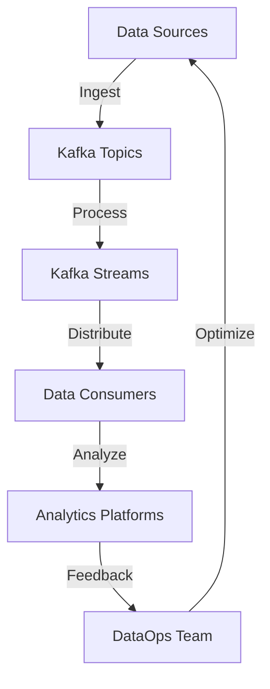

## 16.1 Integrating Kafka into DataOps Practices

**Description**: This section explores how Kafka can be integrated into DataOps methodologies to streamline data pipeline deployments, enhance collaboration, and improve the agility of data processing operations. It emphasizes the importance of automation, version control, and continuous integration/continuous deployment (CI/CD) in managing data workflows effectively.

### Introduction to DataOps

DataOps, short for Data Operations, is an emerging discipline that focuses on improving the speed, quality, and reliability of data analytics through the application of agile methodologies, DevOps practices, and automation. It aims to streamline the entire data lifecycle, from data ingestion and processing to analysis and visualization, by fostering collaboration between data engineers, data scientists, and operations teams.

#### Core Principles of DataOps

1. **Collaboration and Communication**: Encourage seamless interaction between data teams and stakeholders to ensure alignment and understanding of data requirements and objectives.
2. **Automation**: Implement automated processes to reduce manual intervention, minimize errors, and accelerate data pipeline deployments.
3. **Continuous Integration/Continuous Deployment (CI/CD)**: Apply CI/CD practices to data pipelines to ensure rapid and reliable updates and deployments.
4. **Version Control**: Use version control systems to manage changes in data pipelines, configurations, and code, ensuring traceability and reproducibility.
5. **Monitoring and Feedback**: Establish robust monitoring and feedback loops to detect issues early and continuously improve data processes.

### The Role of Kafka in DataOps

Apache Kafka, a distributed event streaming platform, plays a pivotal role in DataOps by providing a robust and scalable infrastructure for real-time data processing and integration. Kafka's ability to handle high-throughput data streams and its rich ecosystem of tools make it an ideal choice for implementing DataOps practices.

#### Kafka's Contributions to DataOps

- **Real-Time Data Processing**: Kafka enables the ingestion and processing of data in real-time, allowing for timely insights and decision-making.
- **Scalability and Fault Tolerance**: Kafka's distributed architecture ensures high availability and resilience, supporting the demands of modern data-driven applications.
- **Integration Capabilities**: With connectors and APIs, Kafka facilitates seamless integration with various data sources and sinks, enhancing data pipeline flexibility.
- **Stream Processing**: Kafka Streams and other stream processing frameworks enable complex data transformations and analytics directly within the data pipeline.

### Integrating Kafka into DataOps Workflows

Integrating Kafka into DataOps workflows involves leveraging its capabilities to enhance data pipeline efficiency, collaboration, and agility. This integration can be achieved through various strategies and tools that align with DataOps principles.

#### Enhancing Data Pipeline Efficiency

1. **Automated Data Ingestion**: Use Kafka Connect to automate the ingestion of data from diverse sources, such as databases, message queues, and file systems, into Kafka topics.
2. **Streamlined Data Processing**: Implement Kafka Streams or other stream processing frameworks to perform real-time data transformations and analytics, reducing the need for batch processing.
3. **Efficient Data Distribution**: Utilize Kafka's publish-subscribe model to distribute processed data to multiple consumers, ensuring that data is available to all relevant stakeholders.

#### Tooling and Automation Strategies

- **CI/CD for Data Pipelines**: Integrate Kafka with CI/CD tools like Jenkins, GitLab CI/CD, or CircleCI to automate the deployment and testing of data pipelines. This ensures that changes are rapidly propagated and validated across environments.
- **Infrastructure as Code (IaC)**: Use tools like Terraform, Ansible, or Puppet to manage Kafka infrastructure as code, enabling consistent and repeatable deployments.
- **Monitoring and Alerting**: Implement monitoring solutions such as Prometheus and Grafana to track Kafka metrics and set up alerts for anomalies or performance issues.

#### Best Practices for Kafka and DataOps

1. **Version Control for Data Pipelines**: Use Git or similar version control systems to track changes in data pipeline configurations, code, and schemas. This facilitates collaboration and rollback capabilities.
2. **Schema Management**: Leverage the [1.3.3 Schema Registry]( "Schema Registry") to manage data schemas and ensure compatibility across different versions of data producers and consumers.
3. **Data Quality and Validation**: Implement data validation checks within Kafka Streams or through custom connectors to ensure data quality and integrity.
4. **Security and Compliance**: Apply security best practices, such as encryption and access control, to protect sensitive data and comply with regulatory requirements.

### Practical Applications and Real-World Scenarios

Integrating Kafka into DataOps practices can significantly enhance the agility and efficiency of data-driven organizations. Here are some real-world scenarios where Kafka and DataOps integration can be beneficial:

- **Financial Services**: Real-time fraud detection and risk management systems can leverage Kafka's real-time processing capabilities to analyze transaction data and identify anomalies.
- **E-commerce**: Personalization and recommendation engines can use Kafka to process user behavior data in real-time, delivering tailored experiences to customers.
- **Healthcare**: Kafka can facilitate the integration of diverse healthcare data sources, enabling real-time analytics for patient monitoring and treatment optimization.

### Code Examples

To illustrate the integration of Kafka into DataOps practices, let's explore some code examples in Java, Scala, Kotlin, and Clojure.

#### Java Example: Kafka Streams for Real-Time Data Processing

```java
import org.apache.kafka.streams.KafkaStreams;
import org.apache.kafka.streams.StreamsBuilder;
import org.apache.kafka.streams.StreamsConfig;
import org.apache.kafka.streams.kstream.KStream;

import java.util.Properties;

public class RealTimeProcessing {
    public static void main(String[] args) {
        Properties props = new Properties();
        props.put(StreamsConfig.APPLICATION_ID_CONFIG, "real-time-processing");
        props.put(StreamsConfig.BOOTSTRAP_SERVERS_CONFIG, "localhost:9092");

        StreamsBuilder builder = new StreamsBuilder();
        KStream<String, String> sourceStream = builder.stream("input-topic");
        sourceStream.mapValues(value -> value.toUpperCase())
                    .to("output-topic");

        KafkaStreams streams = new KafkaStreams(builder.build(), props);
        streams.start();
    }
}
```

#### Scala Example: Using Kafka Connect for Data Ingestion

```scala
import org.apache.kafka.connect.runtime.StandaloneConfig
import org.apache.kafka.connect.runtime.standalone.StandaloneHerder
import org.apache.kafka.connect.storage.FileOffsetBackingStore

object KafkaConnectIngestion extends App {
  val props = new java.util.Properties()
  props.put("bootstrap.servers", "localhost:9092")
  props.put("key.converter", "org.apache.kafka.connect.json.JsonConverter")
  props.put("value.converter", "org.apache.kafka.connect.json.JsonConverter")

  val config = new StandaloneConfig(props)
  val herder = new StandaloneHerder(config, new FileOffsetBackingStore())
  herder.start()
}
```

#### Kotlin Example: Automating Data Pipeline Deployment with CI/CD

```kotlin
import org.gradle.api.tasks.Exec

tasks.register<Exec>("deployPipeline") {
    commandLine("sh", "-c", "./deploy.sh")
    doLast {
        println("Data pipeline deployed successfully.")
    }
}
```

#### Clojure Example: Monitoring Kafka Metrics with Prometheus

```clojure
(ns kafka-monitoring
  (:require [prometheus.core :as prometheus]))

(defn start-monitoring []
  (prometheus/start-server 9091)
  (prometheus/register-metric "kafka_messages" "Number of messages processed by Kafka"))

(start-monitoring)
```

### Visualizing Kafka Integration in DataOps

To better understand how Kafka integrates into DataOps practices, consider the following diagram illustrating a typical DataOps workflow with Kafka:



**Diagram Description**: This diagram represents a DataOps workflow where data from various sources is ingested into Kafka topics, processed in real-time using Kafka Streams, and distributed to data consumers for analysis. The feedback loop ensures continuous optimization and improvement of data processes.

### Conclusion

Integrating Kafka into DataOps practices offers numerous benefits, including enhanced data pipeline efficiency, improved collaboration, and increased agility in data processing operations. By leveraging Kafka's capabilities and aligning with DataOps principles, organizations can achieve faster and more reliable data-driven insights.

## Test Your Knowledge: Integrating Kafka into DataOps Practices Quiz



### What is a core principle of DataOps?

- [x] Automation
- [ ] Manual intervention
- [ ] Data silos
- [ ] Static data pipelines

> **Explanation:** Automation is a core principle of DataOps, aiming to reduce manual intervention and accelerate data pipeline deployments.

### How does Kafka contribute to DataOps?

- [x] By enabling real-time data processing
- [ ] By storing data in a centralized database
- [ ] By requiring manual data integration
- [ ] By limiting data scalability

> **Explanation:** Kafka contributes to DataOps by enabling real-time data processing, which is crucial for timely insights and decision-making.

### Which tool can be used for CI/CD in Kafka data pipelines?

- [x] Jenkins
- [ ] Microsoft Word
- [ ] Excel
- [ ] PowerPoint

> **Explanation:** Jenkins is a popular CI/CD tool that can be used to automate the deployment and testing of Kafka data pipelines.

### What is the role of version control in DataOps?

- [x] To manage changes in data pipelines
- [ ] To store data permanently
- [ ] To encrypt data
- [ ] To visualize data

> **Explanation:** Version control is used in DataOps to manage changes in data pipelines, configurations, and code, ensuring traceability and reproducibility.

### Which of the following is a benefit of integrating Kafka into DataOps?

- [x] Enhanced data pipeline efficiency
- [ ] Increased manual intervention
- [ ] Reduced data quality
- [ ] Slower data processing

> **Explanation:** Integrating Kafka into DataOps enhances data pipeline efficiency by enabling real-time processing and automation.

### What is the purpose of Kafka Connect?

- [x] To automate data ingestion
- [ ] To encrypt data
- [ ] To visualize data
- [ ] To store data permanently

> **Explanation:** Kafka Connect is used to automate the ingestion of data from diverse sources into Kafka topics.

### Which language is used in the provided Kafka Streams example?

- [x] Java
- [ ] Python
- [ ] Ruby
- [ ] PHP

> **Explanation:** The provided Kafka Streams example is written in Java.

### What is the function of the Schema Registry in Kafka?

- [x] To manage data schemas
- [ ] To encrypt data
- [ ] To store data permanently
- [ ] To visualize data

> **Explanation:** The Schema Registry is used to manage data schemas and ensure compatibility across different versions of data producers and consumers.

### What is a key benefit of using Infrastructure as Code (IaC) with Kafka?

- [x] Consistent and repeatable deployments
- [ ] Increased manual intervention
- [ ] Reduced data quality
- [ ] Slower data processing

> **Explanation:** Using Infrastructure as Code (IaC) with Kafka enables consistent and repeatable deployments, aligning with DataOps principles.

### True or False: Kafka can only be used for batch processing.

- [ ] True
- [x] False

> **Explanation:** False. Kafka is primarily used for real-time data processing, although it can also support batch processing scenarios.


