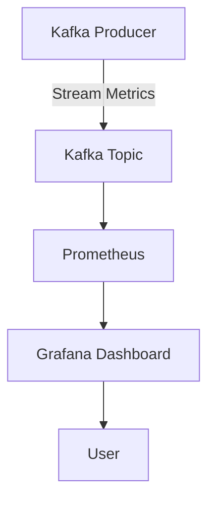

## 16.2.2 Real-Time Feedback Loops for Model Performance

In the rapidly evolving landscape of machine learning (ML), maintaining the performance of deployed models is crucial. Real-time feedback loops are essential for monitoring, assessing, and improving model performance continuously. Apache Kafka, with its robust stream processing capabilities, plays a pivotal role in enabling these feedback loops. This section delves into how Kafka facilitates real-time monitoring and feedback for ML models, helping teams to detect issues, address concept and data drift, and implement improvements swiftly.

### Understanding Closed-Loop Feedback in Machine Learning

Closed-loop feedback in machine learning refers to the continuous cycle of monitoring model predictions, comparing them with actual outcomes, and using this information to refine and improve the model. This process is vital for ensuring that models remain accurate and relevant over time, especially in dynamic environments where data characteristics can change.

#### Key Components of Closed-Loop Feedback

1. **Data Collection**: Gather predictions and actual outcomes in real-time.
2. **Comparison and Analysis**: Compare predictions with actual outcomes to assess model accuracy.
3. **Feedback Generation**: Identify discrepancies and generate feedback for model improvement.
4. **Model Update**: Use feedback to retrain or adjust the model, ensuring it adapts to new data patterns.

### Leveraging Kafka for Streaming Predictions and Outcomes

Apache Kafka's distributed architecture and real-time processing capabilities make it an ideal platform for streaming both predictions and actual outcomes. By integrating Kafka into the ML pipeline, teams can efficiently manage and process large volumes of data, enabling real-time feedback loops.

#### Streaming Predictions and Outcomes

- **Producers**: ML models act as producers, streaming predictions to Kafka topics.
- **Consumers**: Downstream systems or analytics tools consume these predictions for comparison with actual outcomes.
- **Topics**: Separate Kafka topics can be used for predictions and actual outcomes, facilitating organized data flow and processing.

#### Example: Streaming Predictions in Java

```java
import org.apache.kafka.clients.producer.KafkaProducer;
import org.apache.kafka.clients.producer.ProducerRecord;
import java.util.Properties;

public class PredictionProducer {
    public static void main(String[] args) {
        Properties props = new Properties();
        props.put("bootstrap.servers", "localhost:9092");
        props.put("key.serializer", "org.apache.kafka.common.serialization.StringSerializer");
        props.put("value.serializer", "org.apache.kafka.common.serialization.StringSerializer");

        KafkaProducer<String, String> producer = new KafkaProducer<>(props);
        String topic = "model-predictions";

        // Simulate streaming predictions
        for (int i = 0; i < 100; i++) {
            String key = "prediction-" + i;
            String value = "predicted_value_" + i;
            producer.send(new ProducerRecord<>(topic, key, value));
        }

        producer.close();
    }
}
```

### Monitoring Model Metrics with Kafka and Analytics Tools

Monitoring model performance involves tracking various metrics such as accuracy, precision, recall, and F1 score. Kafka can stream these metrics to analytics tools for real-time visualization and analysis.

#### Integrating Kafka with Analytics Tools

- **Grafana and Prometheus**: Use these tools to visualize Kafka metrics and model performance indicators.
- **Custom Dashboards**: Create dashboards to monitor key performance metrics and detect anomalies.

#### Example: Visualizing Metrics with Grafana



*Caption: A diagram illustrating the flow of model metrics from Kafka to Grafana for visualization.*

### Handling Concept Drift and Data Drift

Concept drift and data drift are common challenges in maintaining model performance. Concept drift occurs when the relationship between input data and target variable changes over time, while data drift refers to changes in the input data distribution.

#### Approaches to Handle Drift

1. **Drift Detection**: Implement algorithms to detect drift in real-time.
2. **Adaptive Models**: Use models that can adapt to changing data patterns.
3. **Retraining**: Regularly retrain models with new data to maintain accuracy.

#### Example: Detecting Drift in Scala

```scala
import org.apache.spark.ml.feature.StandardScaler
import org.apache.spark.sql.SparkSession

object DriftDetection {
  def main(args: Array[String]): Unit = {
    val spark = SparkSession.builder.appName("DriftDetection").getOrCreate()
    import spark.implicits._

    // Simulate incoming data stream
    val dataStream = spark.readStream.format("kafka")
      .option("kafka.bootstrap.servers", "localhost:9092")
      .option("subscribe", "data-topic")
      .load()

    // Apply drift detection logic
    val scaler = new StandardScaler()
      .setInputCol("features")
      .setOutputCol("scaledFeatures")
      .fit(dataStream)

    val scaledData = scaler.transform(dataStream)
    scaledData.writeStream.format("console").start().awaitTermination()
  }
}
```

### Role of Alerting and Automated Responses

Alerting and automated responses are critical for maintaining model performance. By setting up alerts for specific thresholds or anomalies, teams can respond promptly to potential issues.

#### Implementing Alerting Mechanisms

- **Threshold Alerts**: Set thresholds for key metrics and trigger alerts when exceeded.
- **Anomaly Detection**: Use machine learning algorithms to detect anomalies in real-time.
- **Automated Responses**: Implement automated actions such as model retraining or scaling based on alerts.

#### Example: Setting Up Alerts in Kotlin

```kotlin
import org.apache.kafka.clients.consumer.KafkaConsumer
import java.util.Properties

fun main() {
    val props = Properties()
    props["bootstrap.servers"] = "localhost:9092"
    props["group.id"] = "alert-group"
    props["key.deserializer"] = "org.apache.kafka.common.serialization.StringDeserializer"
    props["value.deserializer"] = "org.apache.kafka.common.serialization.StringDeserializer"

    val consumer = KafkaConsumer<String, String>(props)
    consumer.subscribe(listOf("model-metrics"))

    while (true) {
        val records = consumer.poll(100)
        for (record in records) {
            val metricValue = record.value().toDouble()
            if (metricValue > 0.9) {
                println("Alert: Metric value exceeded threshold: $metricValue")
                // Trigger automated response
            }
        }
    }
}
```

### Conclusion

Real-time feedback loops are indispensable for maintaining and improving machine learning model performance. By leveraging Apache Kafka, teams can efficiently stream predictions and outcomes, monitor model metrics, handle drift, and implement alerting mechanisms. This approach ensures that models remain accurate and effective in dynamic environments, ultimately leading to better decision-making and outcomes.

### Knowledge Check

To reinforce your understanding of real-time feedback loops for model performance, consider the following questions and challenges:

1. How can Kafka be used to stream predictions and actual outcomes for real-time comparison?
2. What are the key components of a closed-loop feedback system in machine learning?
3. How can concept drift and data drift be detected and addressed using Kafka?
4. What role do alerting and automated responses play in maintaining model performance?
5. Experiment with the provided code examples by modifying the Kafka topics or thresholds to see how the system responds.

By exploring these questions and experimenting with the code, you can deepen your understanding of real-time feedback loops and their application in machine learning.

## Test Your Knowledge: Real-Time Feedback Loops in MLOps Quiz



### What is the primary purpose of a closed-loop feedback system in machine learning?

- [x] To continuously monitor and improve model performance.
- [ ] To increase the speed of data processing.
- [ ] To reduce the cost of model training.
- [ ] To simplify the deployment process.

> **Explanation:** A closed-loop feedback system is designed to continuously monitor model predictions and outcomes, using this information to improve model performance over time.

### How does Kafka facilitate real-time feedback loops for ML models?

- [x] By streaming predictions and actual outcomes for comparison.
- [ ] By storing large volumes of data for batch processing.
- [ ] By providing a user interface for model training.
- [ ] By automatically retraining models without human intervention.

> **Explanation:** Kafka streams predictions and actual outcomes, allowing for real-time comparison and feedback generation, which is essential for maintaining model performance.

### What is concept drift in the context of machine learning?

- [x] A change in the relationship between input data and the target variable.
- [ ] A change in the distribution of input data.
- [ ] A decrease in model accuracy over time.
- [ ] An increase in the complexity of the model.

> **Explanation:** Concept drift refers to changes in the underlying relationship between input data and the target variable, which can affect model performance.

### Which tools can be used to visualize model performance metrics streamed from Kafka?

- [x] Grafana and Prometheus
- [ ] Apache Hadoop
- [ ] TensorFlow
- [ ] Apache Spark

> **Explanation:** Grafana and Prometheus are commonly used to visualize metrics and monitor model performance in real-time.

### What is the role of alerting in maintaining model performance?

- [x] To notify teams of potential issues and trigger automated responses.
- [ ] To increase the speed of data processing.
- [ ] To simplify the deployment process.
- [ ] To reduce the cost of model training.

> **Explanation:** Alerting helps teams respond promptly to potential issues by notifying them and triggering automated responses when necessary.

### How can data drift be addressed in a real-time feedback loop?

- [x] By regularly retraining models with new data.
- [ ] By increasing the size of the training dataset.
- [ ] By reducing the complexity of the model.
- [ ] By using a different machine learning algorithm.

> **Explanation:** Regularly retraining models with new data helps address data drift and maintain model accuracy.

### What is the significance of automated responses in a feedback loop?

- [x] To implement corrective actions without human intervention.
- [ ] To increase the speed of data processing.
- [ ] To simplify the deployment process.
- [ ] To reduce the cost of model training.

> **Explanation:** Automated responses allow for quick corrective actions, such as model retraining or scaling, without the need for human intervention.

### Which programming language is used in the provided example for setting up alerts?

- [x] Kotlin
- [ ] Java
- [ ] Scala
- [ ] Clojure

> **Explanation:** The provided example for setting up alerts uses Kotlin to demonstrate how to implement alerting mechanisms.

### What is the benefit of using Kafka for streaming model predictions?

- [x] It enables real-time comparison and feedback generation.
- [ ] It reduces the cost of data storage.
- [ ] It simplifies the deployment process.
- [ ] It increases the speed of model training.

> **Explanation:** Kafka's ability to stream model predictions in real-time allows for immediate comparison with actual outcomes, facilitating feedback generation and model improvement.

### True or False: Real-time feedback loops can help detect both concept drift and data drift.

- [x] True
- [ ] False

> **Explanation:** Real-time feedback loops are effective in detecting both concept drift and data drift, allowing for timely corrective actions to maintain model performance.


