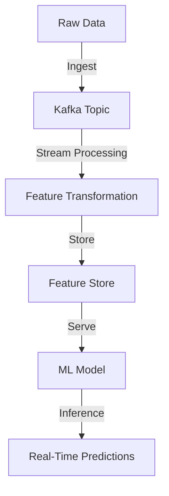

## 16.2.3 Feature Stores and Streaming Features

### Introduction

In the realm of machine learning (ML), the concept of feature stores has emerged as a pivotal component in managing and serving features for both training and inference phases. A feature store acts as a centralized repository for storing, managing, and serving features consistently across different stages of an ML pipeline. This section delves into the integration of Apache Kafka with feature stores, illustrating how Kafka's robust streaming capabilities can enhance the efficiency and consistency of feature management in ML workflows.

### Understanding Feature Stores

#### Definition and Importance

A feature store is a system that manages and serves features to machine learning models. It plays a crucial role in ensuring that the same features used during model training are available during inference, thus maintaining consistency and improving model accuracy. Feature stores typically support both batch and real-time data processing, enabling the seamless integration of historical and live data.

**Key Functions of Feature Stores:**

- **Feature Consistency**: Ensures that features used during training are identical to those used during inference.
- **Feature Reusability**: Allows features to be reused across different models and projects, reducing redundancy.
- **Feature Versioning**: Manages different versions of features, facilitating model retraining and experimentation.
- **Real-Time Feature Serving**: Provides low-latency access to features for real-time inference.

### Kafka's Role in Streaming Features

Apache Kafka, with its distributed streaming platform, is ideally suited for handling real-time data flows, making it an excellent choice for streaming features to and from feature stores. Kafka's ability to handle high-throughput, fault-tolerant data streams ensures that feature data is delivered reliably and efficiently.

#### Streaming Features with Kafka

Kafka can be used to stream features in real-time, allowing for the immediate availability of the latest data for model inference. This is particularly important in scenarios where timely data is critical, such as fraud detection or recommendation systems.

**Example Use Case:**

Consider a real-time recommendation system where user interactions are streamed to Kafka. These interactions are processed to generate features such as user activity scores, which are then stored in a feature store. The model can access these features in real-time to provide personalized recommendations.

#### Integrating Kafka with Feature Store Platforms

Platforms like Feast (Feature Store) can be integrated with Kafka to manage and serve features efficiently. Feast provides a unified interface for managing feature data, supporting both batch and streaming data sources.

**Integration Steps:**

1. **Data Ingestion**: Use Kafka producers to stream raw data into Kafka topics.
2. **Feature Transformation**: Process the raw data using Kafka Streams or other stream processing frameworks to generate features.
3. **Feature Storage**: Store the processed features in Feast, using Kafka Connect to facilitate the data flow.
4. **Feature Serving**: Serve features to models in real-time using Feast's online store capabilities.

#### Synchronizing Offline and Online Feature Data

One of the challenges in feature management is ensuring that offline (batch) and online (real-time) feature data are synchronized. This synchronization is crucial for maintaining consistency between training and inference phases.

**Methods for Synchronization:**

- **Unified Data Pipelines**: Use a single data pipeline to process and store both batch and streaming data, ensuring that features are consistent across environments.
- **Versioned Feature Storage**: Implement versioning in the feature store to track changes and updates to features, allowing for consistent retraining of models.
- **Real-Time Updates**: Use Kafka to stream updates to features in real-time, ensuring that the latest data is always available for inference.

### Challenges in Feature Management

Managing features in a distributed, real-time environment presents several challenges. These include ensuring data consistency, handling large volumes of data, and maintaining low-latency access to features.

#### Addressing Challenges

- **Data Consistency**: Implement strict data validation and monitoring to ensure that feature data is consistent across different stages of the pipeline.
- **Scalability**: Leverage Kafka's distributed architecture to handle large volumes of data efficiently, scaling horizontally as needed.
- **Latency**: Optimize Kafka configurations and use caching mechanisms to reduce latency in feature serving.

### Practical Applications and Real-World Scenarios

Feature stores integrated with Kafka are used in various industries to enhance ML workflows. Some practical applications include:

- **Fraud Detection**: Streaming transaction data to generate real-time features for fraud detection models.
- **Predictive Maintenance**: Using sensor data to create features for predicting equipment failures.
- **Personalized Marketing**: Streaming user interaction data to generate features for personalized marketing campaigns.

### Code Examples

Below are examples of how to integrate Kafka with a feature store using different programming languages.

#### Java Example

```java
import org.apache.kafka.clients.producer.KafkaProducer;
import org.apache.kafka.clients.producer.ProducerRecord;
import java.util.Properties;

public class FeatureProducer {
    public static void main(String[] args) {
        Properties props = new Properties();
        props.put("bootstrap.servers", "localhost:9092");
        props.put("key.serializer", "org.apache.kafka.common.serialization.StringSerializer");
        props.put("value.serializer", "org.apache.kafka.common.serialization.StringSerializer");

        KafkaProducer<String, String> producer = new KafkaProducer<>(props);
        String topic = "feature-topic";

        // Simulate feature data
        String key = "user123";
        String value = "feature1:value1,feature2:value2";

        ProducerRecord<String, String> record = new ProducerRecord<>(topic, key, value);
        producer.send(record);

        producer.close();
    }
}
```

#### Scala Example

```scala
import org.apache.kafka.clients.producer.{KafkaProducer, ProducerRecord}
import java.util.Properties

object FeatureProducer {
  def main(args: Array[String]): Unit = {
    val props = new Properties()
    props.put("bootstrap.servers", "localhost:9092")
    props.put("key.serializer", "org.apache.kafka.common.serialization.StringSerializer")
    props.put("value.serializer", "org.apache.kafka.common.serialization.StringSerializer")

    val producer = new KafkaProducer[String, String](props)
    val topic = "feature-topic"

    // Simulate feature data
    val key = "user123"
    val value = "feature1:value1,feature2:value2"

    val record = new ProducerRecord[String, String](topic, key, value)
    producer.send(record)

    producer.close()
  }
}
```

#### Kotlin Example

```kotlin
import org.apache.kafka.clients.producer.KafkaProducer
import org.apache.kafka.clients.producer.ProducerRecord
import java.util.Properties

fun main() {
    val props = Properties()
    props["bootstrap.servers"] = "localhost:9092"
    props["key.serializer"] = "org.apache.kafka.common.serialization.StringSerializer"
    props["value.serializer"] = "org.apache.kafka.common.serialization.StringSerializer"

    val producer = KafkaProducer<String, String>(props)
    val topic = "feature-topic"

    // Simulate feature data
    val key = "user123"
    val value = "feature1:value1,feature2:value2"

    val record = ProducerRecord(topic, key, value)
    producer.send(record)

    producer.close()
}
```

#### Clojure Example

```clojure
(require '[clojure.java.io :as io])
(import '[org.apache.kafka.clients.producer KafkaProducer ProducerRecord])

(defn create-producer []
  (let [props (doto (java.util.Properties.)
                (.put "bootstrap.servers" "localhost:9092")
                (.put "key.serializer" "org.apache.kafka.common.serialization.StringSerializer")
                (.put "value.serializer" "org.apache.kafka.common.serialization.StringSerializer"))]
    (KafkaProducer. props)))

(defn send-feature [producer topic key value]
  (let [record (ProducerRecord. topic key value)]
    (.send producer record)))

(defn -main []
  (let [producer (create-producer)
        topic "feature-topic"
        key "user123"
        value "feature1:value1,feature2:value2"]
    (send-feature producer topic key value)
    (.close producer)))
```

### Visualizing Feature Store Integration



**Diagram Explanation**: This flowchart illustrates the integration of Kafka with a feature store. Raw data is ingested into Kafka topics, processed to transform into features, stored in a feature store, and served to ML models for real-time predictions.

### Conclusion

Integrating Apache Kafka with feature stores provides a powerful solution for managing and serving features in machine learning pipelines. By leveraging Kafka's streaming capabilities, organizations can ensure that feature data is consistent, scalable, and available in real-time, enhancing the performance and reliability of ML models.

## Test Your Knowledge: Feature Stores and Streaming Features Quiz



### What is a primary function of a feature store in ML pipelines?

- [x] Ensuring feature consistency between training and inference
- [ ] Storing raw data for model training
- [ ] Managing model hyperparameters
- [ ] Serving model predictions

> **Explanation:** Feature stores ensure that the same features used during training are available during inference, maintaining consistency and improving model accuracy.

### How does Kafka enhance feature store integration?

- [x] By streaming features in real-time
- [ ] By storing model weights
- [ ] By managing feature versioning
- [ ] By providing a user interface for feature management

> **Explanation:** Kafka's streaming capabilities allow for real-time feature updates, ensuring the latest data is available for model inference.

### Which platform is mentioned for integrating with Kafka for feature management?

- [x] Feast
- [ ] TensorFlow
- [ ] PyTorch
- [ ] Scikit-learn

> **Explanation:** Feast is a feature store platform that can be integrated with Kafka to manage and serve features efficiently.

### What is a challenge in feature management?

- [x] Ensuring data consistency across environments
- [ ] Managing model hyperparameters
- [ ] Storing raw data
- [ ] Serving model predictions

> **Explanation:** Ensuring data consistency across different stages of the pipeline is a key challenge in feature management.

### What is a method for synchronizing offline and online feature data?

- [x] Unified data pipelines
- [ ] Manual data entry
- [ ] Using spreadsheets
- [ ] Storing data in local files

> **Explanation:** Unified data pipelines ensure that features are consistent across batch and streaming environments.

### What is a benefit of using Kafka for feature streaming?

- [x] Low-latency access to features
- [ ] High storage capacity
- [ ] Built-in model training
- [ ] Automatic feature selection

> **Explanation:** Kafka provides low-latency access to features, which is crucial for real-time inference.

### How can Kafka handle large volumes of data in feature management?

- [x] By leveraging its distributed architecture
- [ ] By storing data in memory
- [ ] By compressing data
- [ ] By using a single server

> **Explanation:** Kafka's distributed architecture allows it to handle large volumes of data efficiently, scaling horizontally as needed.

### What is a real-world application of feature stores with Kafka?

- [x] Real-time fraud detection
- [ ] Image classification
- [ ] Text summarization
- [ ] Speech recognition

> **Explanation:** Real-time fraud detection is a practical application where streaming features with Kafka can enhance model performance.

### Which of the following is NOT a function of a feature store?

- [x] Managing model hyperparameters
- [ ] Feature consistency
- [ ] Feature reusability
- [ ] Real-time feature serving

> **Explanation:** Managing model hyperparameters is not a function of a feature store; it focuses on managing and serving features.

### True or False: Kafka can only be used for batch processing in feature stores.

- [ ] True
- [x] False

> **Explanation:** Kafka is used for both batch and real-time processing, making it suitable for streaming features in feature stores.


