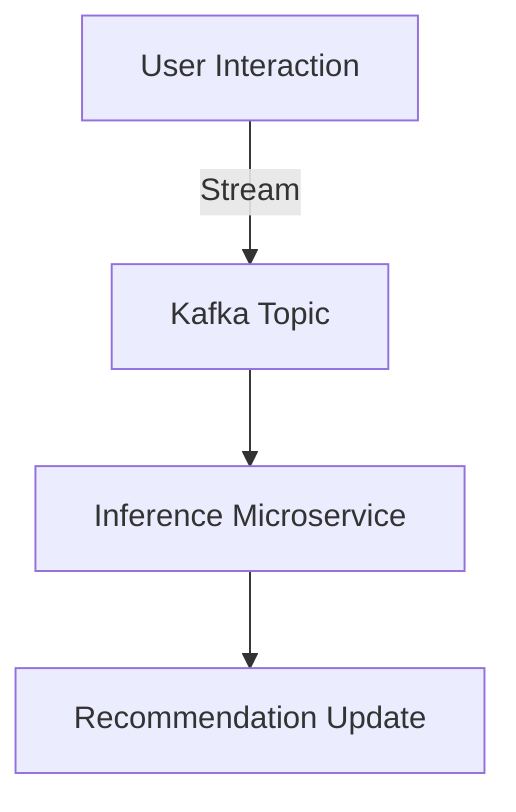

## 16.2.4 Online Model Serving and Inference

### Introduction

In the era of real-time data processing, the ability to serve machine learning models and perform inference in an online, low-latency manner is crucial for many applications. Apache Kafka, with its robust streaming capabilities, plays a pivotal role in connecting data streams to model serving infrastructure, enabling seamless integration and efficient processing. This section delves into the intricacies of online model serving and inference using Kafka, exploring integration with platforms like TensorFlow Serving and Seldon, and providing insights into deploying models within microservices architectures.

### Requirements for Low-Latency Model Serving

Low-latency model serving is essential for applications where timely predictions are critical, such as fraud detection, recommendation systems, and autonomous vehicles. The key requirements for achieving low-latency model serving include:

- **Efficient Data Ingestion**: Utilize Kafka's high-throughput, low-latency data ingestion capabilities to ensure that data is promptly available for inference.
- **Scalable Infrastructure**: Deploy models on scalable infrastructure that can handle varying loads without performance degradation.
- **Optimized Model Execution**: Use optimized model execution environments that minimize computational overhead and maximize throughput.
- **Real-Time Monitoring**: Implement real-time monitoring to detect and address performance bottlenecks swiftly.
- **Network Optimization**: Ensure that network latency is minimized through strategic placement of model serving instances and efficient data routing.

### Integrating Kafka with Model Serving Platforms

Apache Kafka can be seamlessly integrated with model serving platforms such as TensorFlow Serving and Seldon to facilitate real-time inference. These integrations enable the deployment of machine learning models as services, which can consume data from Kafka topics and produce predictions.

#### TensorFlow Serving

TensorFlow Serving is a flexible, high-performance serving system for machine learning models, designed for production environments. It supports model versioning and can serve multiple models simultaneously.

- **Integration with Kafka**: Use Kafka producers to stream data to a Kafka topic, which TensorFlow Serving can consume through a Kafka consumer. This setup allows for real-time data processing and inference.

```java
// Java example of a Kafka consumer for TensorFlow Serving
Properties props = new Properties();
props.put("bootstrap.servers", "localhost:9092");
props.put("group.id", "tensorflow-serving");
props.put("key.deserializer", "org.apache.kafka.common.serialization.StringDeserializer");
props.put("value.deserializer", "org.apache.kafka.common.serialization.ByteArrayDeserializer");

KafkaConsumer<String, byte[]> consumer = new KafkaConsumer<>(props);
consumer.subscribe(Collections.singletonList("model-inputs"));

while (true) {
    ConsumerRecords<String, byte[]> records = consumer.poll(Duration.ofMillis(100));
    for (ConsumerRecord<String, byte[]> record : records) {
        // Send data to TensorFlow Serving for inference
        byte[] modelInput = record.value();
        // Process modelInput with TensorFlow Serving
    }
}
```

#### Seldon

Seldon is an open-source platform that simplifies the deployment of machine learning models on Kubernetes. It supports a wide range of model formats and provides advanced features like canary deployments and A/B testing.

- **Integration with Kafka**: Seldon can be configured to consume data from Kafka topics, enabling real-time inference. This integration is facilitated by deploying Seldon as a microservice within a Kubernetes cluster, with Kafka acting as the data source.

```yaml
# Seldon deployment configuration with Kafka
apiVersion: machinelearning.seldon.io/v1
kind: SeldonDeployment
metadata:
  name: seldon-kafka
spec:
  predictors:
  - graph:
      name: model
      implementation: SKLEARN_SERVER
      modelUri: s3://my-models/model
      kafka:
        brokers: "localhost:9092"
        topic: "model-inputs"
    name: default
    replicas: 1
```

### Deploying Models in Microservices Architectures

Microservices architectures are well-suited for deploying machine learning models, as they allow for modular, scalable, and independently deployable components. Kafka can serve as the backbone for communication between microservices, facilitating data flow and coordination.

#### Example Architecture

Consider a recommendation system where user interactions are streamed to Kafka. A microservice consumes these interactions, performs inference using a deployed model, and updates recommendations in real-time.



- **User Interaction**: Captures user actions and streams them to a Kafka topic.
- **Kafka Topic**: Acts as the data pipeline, ensuring reliable and scalable data flow.
- **Inference Microservice**: Consumes data from Kafka, performs inference, and updates recommendations.
- **Recommendation Update**: Stores and serves updated recommendations to users.

### Considerations for Scaling Inference Workloads

Scaling inference workloads involves addressing several challenges to maintain performance and efficiency:

- **Load Balancing**: Distribute inference requests across multiple instances to prevent bottlenecks.
- **Horizontal Scaling**: Increase the number of model serving instances to handle higher loads.
- **Resource Allocation**: Optimize resource allocation to ensure that each instance has sufficient CPU and memory.
- **Batch Processing**: Group multiple inference requests into batches to improve throughput and reduce latency.
- **Caching**: Implement caching strategies to store frequently requested predictions and reduce computational load.

### Best Practices for Monitoring and Optimizing Model Serving Performance

To ensure optimal performance of model serving systems, implement the following best practices:

- **Real-Time Monitoring**: Use monitoring tools to track key performance metrics such as latency, throughput, and error rates.
- **Alerting**: Set up alerts to notify operators of performance degradation or failures.
- **Performance Tuning**: Regularly tune model serving configurations to optimize resource usage and response times.
- **Load Testing**: Conduct load testing to identify and address potential bottlenecks before they impact production systems.
- **Continuous Improvement**: Continuously refine models and serving infrastructure based on performance data and feedback.

### Conclusion

Apache Kafka's ability to handle high-throughput, low-latency data streams makes it an ideal choice for online model serving and inference. By integrating Kafka with platforms like TensorFlow Serving and Seldon, organizations can deploy scalable, efficient, and responsive machine learning systems. Adopting best practices for monitoring and optimization ensures that these systems remain performant and reliable, meeting the demands of real-time applications.

---

## Test Your Knowledge: Online Model Serving and Inference with Kafka



### What is a key requirement for low-latency model serving?

- [x] Efficient data ingestion
- [ ] High memory usage
- [ ] Complex model architectures
- [ ] Manual monitoring

> **Explanation:** Efficient data ingestion ensures that data is promptly available for inference, which is crucial for low-latency model serving.

### How can Kafka be integrated with TensorFlow Serving?

- [x] By using Kafka consumers to stream data to TensorFlow Serving
- [ ] By deploying TensorFlow Serving within Kafka brokers
- [ ] By using Kafka as a database
- [ ] By converting Kafka topics into TensorFlow models

> **Explanation:** Kafka consumers can stream data to TensorFlow Serving, allowing for real-time data processing and inference.

### What is a benefit of deploying models in microservices architectures?

- [x] Modular and scalable components
- [ ] Increased complexity
- [ ] Reduced data flow
- [ ] Centralized control

> **Explanation:** Microservices architectures allow for modular, scalable, and independently deployable components, which is beneficial for deploying machine learning models.

### What is a consideration for scaling inference workloads?

- [x] Load balancing
- [ ] Reducing network bandwidth
- [ ] Increasing model complexity
- [ ] Manual scaling

> **Explanation:** Load balancing helps distribute inference requests across multiple instances, preventing bottlenecks and maintaining performance.

### Which tool can be used for real-time monitoring of model serving performance?

- [x] Prometheus
- [ ] TensorFlow
- [ ] Kafka Connect
- [ ] Apache Spark

> **Explanation:** Prometheus is a monitoring tool that can track key performance metrics such as latency, throughput, and error rates in real-time.

### What is a best practice for optimizing model serving performance?

- [x] Performance tuning
- [ ] Ignoring error rates
- [ ] Reducing server instances
- [ ] Increasing response times

> **Explanation:** Performance tuning involves regularly adjusting model serving configurations to optimize resource usage and response times.

### How can batch processing improve inference workloads?

- [x] By grouping multiple requests to improve throughput
- [ ] By increasing latency
- [ ] By reducing data accuracy
- [ ] By complicating data flow

> **Explanation:** Batch processing groups multiple inference requests into batches, improving throughput and reducing latency.

### What is the role of caching in model serving?

- [x] To store frequently requested predictions
- [ ] To increase computational load
- [ ] To reduce data accuracy
- [ ] To complicate data flow

> **Explanation:** Caching stores frequently requested predictions, reducing computational load and improving performance.

### What is a feature of Seldon that supports model serving?

- [x] Canary deployments
- [ ] Data storage
- [ ] Model training
- [ ] Data visualization

> **Explanation:** Seldon supports advanced features like canary deployments, which are useful for model serving.

### True or False: Kafka can be used as a database for storing model predictions.

- [ ] True
- [x] False

> **Explanation:** Kafka is not a database; it is a distributed streaming platform designed for high-throughput, low-latency data processing.


