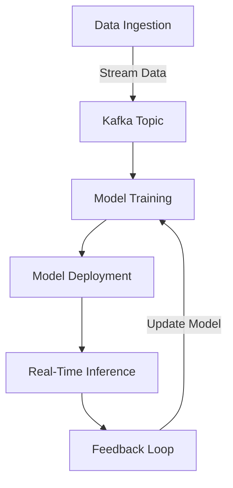
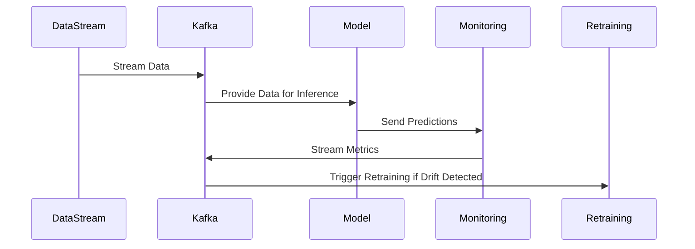

## 16.2 Role of Kafka in MLOps

### Introduction to MLOps

MLOps, short for Machine Learning Operations, is a set of practices that aims to deploy and maintain machine learning models in production reliably and efficiently. It is an extension of the DevOps methodology, tailored specifically for the unique challenges of machine learning (ML) systems. MLOps encompasses the entire ML lifecycle, including data collection, model training, deployment, monitoring, and retraining. The significance of MLOps lies in its ability to streamline the ML workflow, ensuring that models are not only deployed but also continuously improved and adapted to changing data patterns.

### Kafka's Role in MLOps Workflows

Apache Kafka plays a pivotal role in MLOps by providing a robust platform for real-time data streaming, which is essential for modern ML applications. Kafka's distributed architecture and fault-tolerant design make it an ideal choice for handling the high-throughput, low-latency data streams required in MLOps. Let's explore how Kafka supports various stages of the MLOps workflow:

#### Real-Time Data Ingestion

Kafka excels at ingesting large volumes of data in real-time, which is crucial for training and updating ML models with the latest information. By integrating Kafka with data sources such as IoT devices, web applications, and databases, organizations can ensure that their ML models are always working with the most current data.

```java
// Java example for Kafka Producer to ingest data
Properties props = new Properties();
props.put("bootstrap.servers", "localhost:9092");
props.put("key.serializer", "org.apache.kafka.common.serialization.StringSerializer");
props.put("value.serializer", "org.apache.kafka.common.serialization.StringSerializer");

Producer<String, String> producer = new KafkaProducer<>(props);
producer.send(new ProducerRecord<>("ml-data-topic", "key", "value"));
producer.close();
```

```scala
// Scala example for Kafka Producer to ingest data
import org.apache.kafka.clients.producer.{KafkaProducer, ProducerRecord}
import java.util.Properties

val props = new Properties()
props.put("bootstrap.servers", "localhost:9092")
props.put("key.serializer", "org.apache.kafka.common.serialization.StringSerializer")
props.put("value.serializer", "org.apache.kafka.common.serialization.StringSerializer")

val producer = new KafkaProducer[String, String](props)
producer.send(new ProducerRecord[String, String]("ml-data-topic", "key", "value"))
producer.close()
```

```kotlin
// Kotlin example for Kafka Producer to ingest data
val props = Properties().apply {
    put("bootstrap.servers", "localhost:9092")
    put("key.serializer", "org.apache.kafka.common.serialization.StringSerializer")
    put("value.serializer", "org.apache.kafka.common.serialization.StringSerializer")
}

val producer = KafkaProducer<String, String>(props)
producer.send(ProducerRecord("ml-data-topic", "key", "value"))
producer.close()
```

```clojure
;; Clojure example for Kafka Producer to ingest data
(require '[clojure.java.io :as io])
(import '[org.apache.kafka.clients.producer KafkaProducer ProducerRecord]
        '[java.util Properties])

(def props (doto (Properties.)
             (.put "bootstrap.servers" "localhost:9092")
             (.put "key.serializer" "org.apache.kafka.common.serialization.StringSerializer")
             (.put "value.serializer" "org.apache.kafka.common.serialization.StringSerializer")))

(def producer (KafkaProducer. props))
(.send producer (ProducerRecord. "ml-data-topic" "key" "value"))
(.close producer)
```

#### Model Deployment and Inference

Kafka facilitates seamless model deployment and inference by integrating with various ML frameworks and tools. For instance, Kafka can be used alongside TensorFlow Extended (TFX) or MLflow to automate the deployment of models as microservices, enabling real-time predictions.



*Diagram: Kafka's role in the MLOps workflow, from data ingestion to model deployment and feedback loops.*

#### Continuous Monitoring and Feedback Loops

Kafka's ability to handle real-time data streams makes it an excellent choice for monitoring model performance and facilitating feedback loops. By streaming prediction results and model metrics to Kafka topics, organizations can continuously monitor model accuracy and detect data drift, triggering retraining processes when necessary.

#### Integration with ML Tools

Kafka's integration capabilities extend to popular ML tools like TensorFlow Extended (TFX) and MLflow, which are essential for managing the ML lifecycle. TFX provides a scalable and reliable way to deploy ML pipelines, while MLflow offers tools for tracking experiments, packaging code, and managing model versions.

- **TensorFlow Extended (TFX)**: TFX is an end-to-end platform for deploying production ML pipelines. Kafka can be used to stream data into TFX pipelines, enabling real-time model training and evaluation.
- **MLflow**: MLflow is an open-source platform for managing the ML lifecycle. Kafka can be integrated with MLflow to automate the deployment of models and track their performance in real-time.

### Benefits of Using Kafka in MLOps

The integration of Kafka into MLOps workflows offers several benefits:

- **Scalability**: Kafka's distributed architecture allows it to handle large volumes of data, making it suitable for scaling ML operations.
- **Reliability**: Kafka's fault-tolerant design ensures that data is not lost, even in the event of hardware failures.
- **Real-Time Processing**: Kafka's low-latency data streaming capabilities enable real-time model training and inference.
- **Flexibility**: Kafka's integration with various ML tools and frameworks provides flexibility in designing and deploying ML pipelines.

### Considerations for Data Drift Detection and Model Retraining

Data drift, a phenomenon where the statistical properties of input data change over time, can significantly impact the performance of ML models. Kafka can be used to detect data drift by continuously monitoring data streams and comparing them to historical data patterns. When data drift is detected, Kafka can trigger model retraining processes to ensure that models remain accurate and relevant.



*Diagram: Sequence of operations for data drift detection and model retraining using Kafka.*

### Conclusion

Apache Kafka is a powerful tool for enhancing MLOps workflows by enabling real-time data ingestion, seamless model deployment, and continuous monitoring. Its integration with popular ML tools and frameworks makes it an invaluable asset for organizations looking to streamline their ML operations and ensure that their models remain accurate and effective over time.

## Test Your Knowledge: Kafka's Role in MLOps Quiz



### What is MLOps primarily concerned with?

- [x] Deploying and maintaining machine learning models in production
- [ ] Developing new machine learning algorithms
- [ ] Designing user interfaces for ML applications
- [ ] Managing cloud infrastructure

> **Explanation:** MLOps focuses on deploying and maintaining machine learning models in production environments, ensuring they operate efficiently and reliably.

### How does Kafka support real-time data ingestion in MLOps?

- [x] By providing a distributed platform for high-throughput data streaming
- [ ] By storing data in a relational database
- [ ] By offering a graphical user interface for data visualization
- [ ] By providing built-in machine learning algorithms

> **Explanation:** Kafka supports real-time data ingestion by offering a distributed platform capable of handling high-throughput data streams, essential for MLOps.

### Which ML tool is mentioned as being integrated with Kafka for managing ML pipelines?

- [x] TensorFlow Extended (TFX)
- [ ] PyTorch
- [ ] Scikit-learn
- [ ] Keras

> **Explanation:** TensorFlow Extended (TFX) is mentioned as a tool that can be integrated with Kafka for managing ML pipelines.

### What is a key benefit of using Kafka in MLOps?

- [x] Scalability and reliability in handling large data volumes
- [ ] Simplifying user interface design
- [ ] Reducing the need for data preprocessing
- [ ] Eliminating the need for model retraining

> **Explanation:** Kafka provides scalability and reliability, making it ideal for handling large data volumes in MLOps workflows.

### How can Kafka help in detecting data drift?

- [x] By continuously monitoring data streams and comparing them to historical patterns
- [ ] By storing all data in a centralized database
- [ ] By providing pre-trained models for drift detection
- [ ] By visualizing data in real-time dashboards

> **Explanation:** Kafka can help detect data drift by continuously monitoring data streams and comparing them to historical patterns, triggering retraining when necessary.

### What is the role of Kafka in real-time model inference?

- [x] Streaming data to deployed models for real-time predictions
- [ ] Training models from scratch
- [ ] Visualizing model predictions
- [ ] Storing model artifacts

> **Explanation:** Kafka streams data to deployed models, enabling real-time predictions as part of the inference process.

### Which of the following is a benefit of Kafka's integration with ML tools?

- [x] Flexibility in designing and deploying ML pipelines
- [ ] Reducing the need for data cleaning
- [ ] Simplifying model hyperparameter tuning
- [ ] Eliminating the need for data validation

> **Explanation:** Kafka's integration with ML tools provides flexibility in designing and deploying ML pipelines, enhancing the overall MLOps process.

### What is a common use case for Kafka in MLOps?

- [x] Real-time data ingestion and model deployment
- [ ] Designing user interfaces for ML applications
- [ ] Developing new machine learning algorithms
- [ ] Managing cloud infrastructure

> **Explanation:** A common use case for Kafka in MLOps is real-time data ingestion and model deployment, ensuring models are updated with the latest data.

### How does Kafka ensure data reliability?

- [x] Through its fault-tolerant design
- [ ] By storing data in a centralized database
- [ ] By providing built-in data validation tools
- [ ] By offering a graphical user interface

> **Explanation:** Kafka's fault-tolerant design ensures data reliability, even in the event of hardware failures.

### True or False: Kafka can only be used for batch processing in MLOps.

- [ ] True
- [x] False

> **Explanation:** False. Kafka is primarily used for real-time data streaming, which is essential for MLOps workflows.


