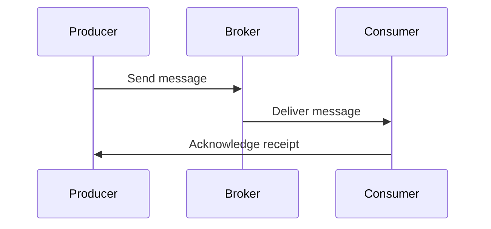

## 16.3.1 Observability in Data Pipelines

In the realm of modern data architectures, achieving observability in data pipelines is crucial for ensuring reliability, performance, and compliance. This section delves into the components of observability—metrics, logs, and traces—and explores how these can be implemented in Kafka-based data pipelines. We will also discuss distributed tracing using tools like OpenTelemetry, correlating events across different pipeline stages, and considerations for data lineage and auditability.

### Understanding Observability

Observability in data pipelines refers to the ability to infer the internal state of a system based on the data it produces. It encompasses three main components:

1. **Metrics**: Quantitative measures that provide insights into the performance and health of the system.
2. **Logs**: Records of events that have occurred within the system, providing context and details about operations.
3. **Traces**: A series of causally related events that track the flow of requests through the system, enabling end-to-end visibility.

#### Metrics

Metrics are essential for monitoring the performance and health of Kafka-based data pipelines. They provide quantitative data that can be used to track system behavior over time. Key metrics to monitor in Kafka pipelines include:

- **Throughput**: The rate at which data is processed by the pipeline.
- **Latency**: The time taken for data to travel from source to destination.
- **Error Rates**: The frequency of errors occurring within the pipeline.
- **Resource Utilization**: CPU, memory, and disk usage by Kafka brokers and clients.

##### Implementing Metrics Collection

To implement metrics collection in Kafka pipelines, you can use tools like Prometheus and Grafana. Prometheus can scrape metrics from Kafka brokers, producers, and consumers, while Grafana can visualize these metrics in real-time dashboards.

```yaml
# Example Prometheus configuration for scraping Kafka metrics
scrape_configs:
  - job_name: 'kafka'
    static_configs:
      - targets: ['localhost:9092']
```

#### Logs

Logs provide detailed records of events that occur within the pipeline. They are crucial for diagnosing issues and understanding the context of operations. In Kafka pipelines, logs can be generated by:

- **Kafka Brokers**: Logs related to broker operations, such as topic creation and partition assignments.
- **Producers and Consumers**: Logs capturing data production and consumption events.
- **Connectors and Streams**: Logs from Kafka Connect and Kafka Streams applications.

##### Best Practices for Log Management

- **Centralized Logging**: Use tools like Elasticsearch, Logstash, and Kibana (ELK Stack) to centralize and analyze logs.
- **Structured Logging**: Implement structured logging to ensure logs are machine-readable and easily searchable.
- **Log Rotation and Retention**: Configure log rotation and retention policies to manage log storage efficiently.

```json
// Example of a structured log entry
{
  "timestamp": "2024-11-25T12:34:56Z",
  "level": "INFO",
  "message": "Kafka producer sent message",
  "topic": "orders",
  "partition": 3,
  "offset": 12345
}
```

#### Traces

Traces provide a detailed view of the flow of requests through the system, allowing you to pinpoint bottlenecks and understand dependencies. Distributed tracing is particularly important in Kafka pipelines, where data flows through multiple stages and components.

##### Implementing Distributed Tracing with OpenTelemetry

OpenTelemetry is a popular framework for implementing distributed tracing. It provides libraries and agents for instrumenting applications and collecting trace data.

```java
// Java example of instrumenting a Kafka producer with OpenTelemetry
import io.opentelemetry.api.GlobalOpenTelemetry;
import io.opentelemetry.api.trace.Span;
import io.opentelemetry.api.trace.Tracer;

public class KafkaProducerExample {
    private static final Tracer tracer = GlobalOpenTelemetry.getTracer("kafka-producer");

    public void sendMessage(String topic, String message) {
        Span span = tracer.spanBuilder("send-message").startSpan();
        try {
            // Send message to Kafka
            // ...
        } finally {
            span.end();
        }
    }
}
```

### Correlating Events Across Pipeline Stages

In complex data pipelines, correlating events across different stages is essential for understanding the end-to-end flow of data. This involves:

- **Propagating Context**: Ensure that trace context is propagated across all components of the pipeline, including producers, brokers, and consumers.
- **Using Unique Identifiers**: Assign unique identifiers to messages or events to track them across the pipeline.
- **Visualizing Traces**: Use tools like Jaeger or Zipkin to visualize traces and identify bottlenecks.



### Data Lineage and Auditability

Data lineage refers to the ability to track the origin, movement, and transformation of data within the pipeline. It is crucial for compliance, auditability, and debugging.

#### Implementing Data Lineage

- **Metadata Tracking**: Use Kafka headers or metadata to track the lineage of messages.
- **Audit Logs**: Maintain audit logs that record data transformations and access events.
- **Integration with Data Governance Tools**: Integrate Kafka with data governance tools to manage data lineage and compliance.

```scala
// Scala example of adding metadata to Kafka messages
import org.apache.kafka.clients.producer.{KafkaProducer, ProducerRecord}

val producer = new KafkaProducer[String, String](props)
val record = new ProducerRecord[String, String]("orders", "key", "value")
record.headers().add("source", "order-service".getBytes)
producer.send(record)
```

### Real-World Scenarios and Best Practices

In real-world scenarios, achieving observability in Kafka-based data pipelines involves:

- **Designing for Observability**: Incorporate observability requirements into the design of your pipeline from the outset.
- **Automating Observability**: Use automation tools to deploy and manage observability components.
- **Continuous Improvement**: Regularly review and improve your observability practices based on feedback and evolving requirements.

### Conclusion

Achieving observability in Kafka-based data pipelines is a multifaceted challenge that requires a combination of metrics, logs, and traces. By implementing distributed tracing, correlating events, and ensuring data lineage, you can gain deep insights into your pipeline's performance and reliability. This not only aids in troubleshooting and optimization but also ensures compliance and auditability.

### Key Takeaways

- **Metrics, logs, and traces** are the pillars of observability in data pipelines.
- **Distributed tracing** with tools like OpenTelemetry provides end-to-end visibility.
- **Data lineage** is crucial for compliance and auditability.
- **Real-world observability** requires a combination of design, automation, and continuous improvement.

### References and Further Reading

- [Apache Kafka Documentation](https://kafka.apache.org/documentation/)
- [OpenTelemetry Documentation](https://opentelemetry.io/docs/)
- [Prometheus Documentation](https://prometheus.io/docs/)
- [Grafana Documentation](https://grafana.com/docs/)
- [Jaeger Documentation](https://www.jaegertracing.io/docs/)

---

## Test Your Knowledge: Observability in Kafka Data Pipelines Quiz



### What are the three main components of observability in data pipelines?

- [x] Metrics, logs, and traces
- [ ] Metrics, logs, and alerts
- [ ] Logs, traces, and dashboards
- [ ] Metrics, alerts, and dashboards

> **Explanation:** Observability in data pipelines is achieved through metrics, logs, and traces, which provide insights into system performance, events, and request flows.

### Which tool is commonly used for distributed tracing in Kafka pipelines?

- [x] OpenTelemetry
- [ ] Prometheus
- [ ] Grafana
- [ ] Elasticsearch

> **Explanation:** OpenTelemetry is a popular framework for implementing distributed tracing in Kafka pipelines, providing libraries and agents for collecting trace data.

### What is the purpose of data lineage in data pipelines?

- [x] To track the origin, movement, and transformation of data
- [ ] To monitor system performance
- [ ] To visualize data flows
- [ ] To generate alerts for errors

> **Explanation:** Data lineage allows you to track the origin, movement, and transformation of data within the pipeline, which is crucial for compliance and auditability.

### How can you correlate events across different stages of a Kafka pipeline?

- [x] By propagating context and using unique identifiers
- [ ] By using centralized logging
- [ ] By implementing structured logging
- [ ] By configuring log rotation

> **Explanation:** Correlating events across different stages of a Kafka pipeline involves propagating context and using unique identifiers to track events end-to-end.

### What is a best practice for managing logs in Kafka pipelines?

- [x] Implementing centralized logging with tools like ELK Stack
- [ ] Using distributed tracing tools
- [ ] Monitoring metrics with Prometheus
- [ ] Visualizing data with Grafana

> **Explanation:** Centralized logging with tools like the ELK Stack is a best practice for managing logs in Kafka pipelines, allowing for efficient analysis and searchability.

### Which metric is crucial for understanding the performance of a Kafka pipeline?

- [x] Throughput
- [ ] Error rates
- [ ] Log volume
- [ ] Trace length

> **Explanation:** Throughput is a crucial metric for understanding the performance of a Kafka pipeline, as it measures the rate at which data is processed.

### What is the role of OpenTelemetry in Kafka pipelines?

- [x] To implement distributed tracing
- [ ] To collect metrics
- [ ] To manage logs
- [ ] To visualize data

> **Explanation:** OpenTelemetry is used to implement distributed tracing in Kafka pipelines, providing end-to-end visibility into request flows.

### Why is structured logging important in Kafka pipelines?

- [x] It ensures logs are machine-readable and easily searchable
- [ ] It reduces log volume
- [ ] It improves traceability
- [ ] It enhances data lineage

> **Explanation:** Structured logging ensures logs are machine-readable and easily searchable, which is important for efficient log management and analysis.

### What is a key benefit of using unique identifiers in Kafka pipelines?

- [x] They help track messages across the pipeline
- [ ] They improve system performance
- [ ] They reduce error rates
- [ ] They enhance data visualization

> **Explanation:** Unique identifiers help track messages across the pipeline, facilitating event correlation and traceability.

### True or False: Data lineage is only important for compliance purposes.

- [ ] True
- [x] False

> **Explanation:** While data lineage is crucial for compliance, it is also important for auditability, debugging, and understanding data transformations within the pipeline.


