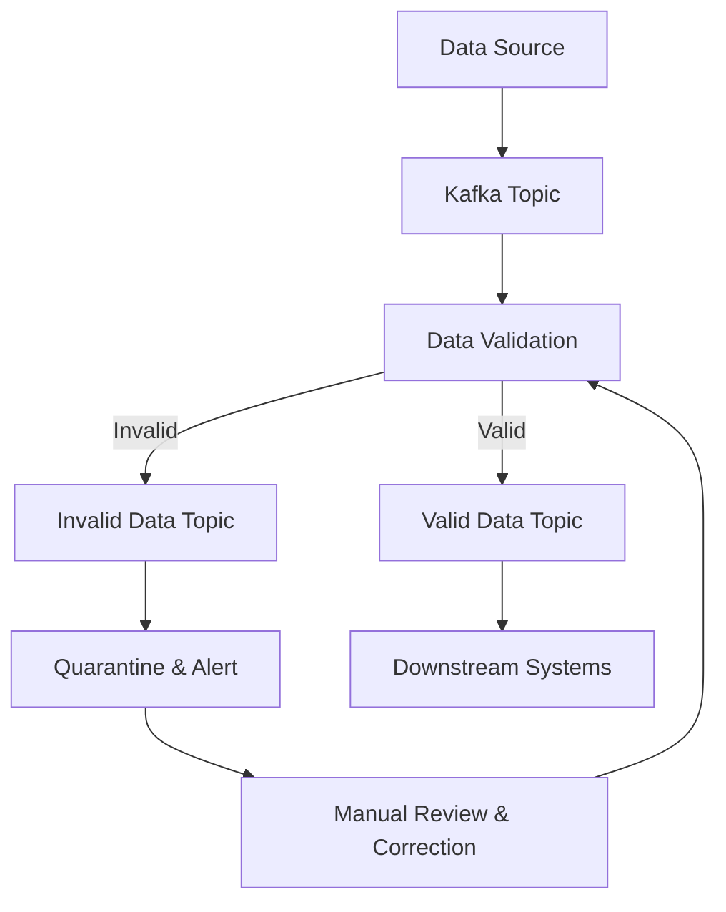

## 16.3.2 Data Quality Management

In the realm of real-time data processing, ensuring data quality is paramount. Apache Kafka, a distributed event streaming platform, plays a crucial role in modern data architectures by enabling the seamless flow of data across systems. However, the dynamic nature of streaming data introduces unique challenges in maintaining data quality. This section delves into the intricacies of data quality management within Kafka pipelines, offering strategies and techniques to ensure that data remains accurate, consistent, and reliable.

### Common Data Quality Issues in Streaming Environments

Data quality issues in streaming environments can arise from various sources, including data entry errors, integration mismatches, and system failures. Some common issues include:

- **Incomplete Data**: Missing fields or records can lead to inaccurate analytics and decision-making.
- **Inconsistent Data**: Variations in data formats or units can cause discrepancies in data interpretation.
- **Duplicate Data**: Redundant records can inflate data volumes and skew analytical results.
- **Outdated Data**: Stale data can lead to incorrect insights and decisions.
- **Erroneous Data**: Incorrect data values can result from manual entry errors or faulty sensors.

Addressing these issues requires a robust data quality management framework that can operate in real-time, ensuring that data entering the system meets predefined quality standards.

### Continuous Data Validation and Cleansing

Continuous data validation and cleansing are essential to maintaining data quality in streaming environments. These processes involve verifying data against predefined rules and correcting any discrepancies. Key methods include:

- **Schema Validation**: Ensuring that incoming data conforms to a predefined schema helps catch format and type errors early. Tools like [Confluent Schema Registry]( "Schema Registry") can enforce schema compliance in Kafka pipelines.
- **Data Profiling**: Analyzing data to understand its structure, content, and relationships helps identify anomalies and patterns that may indicate quality issues.
- **Rule-Based Validation**: Implementing rules to check for specific conditions, such as range checks or mandatory fields, helps catch errors in real-time.
- **Data Cleansing**: Techniques such as deduplication, normalization, and transformation are applied to correct or remove erroneous data.

#### Example: Implementing Data Quality Checks Using Streaming Analytics

Let's explore how to implement data quality checks in a Kafka pipeline using streaming analytics. We'll use Kafka Streams to validate and cleanse data in real-time.

**Java Example**:

```java
import org.apache.kafka.streams.KafkaStreams;
import org.apache.kafka.streams.StreamsBuilder;
import org.apache.kafka.streams.kstream.KStream;
import org.apache.kafka.streams.kstream.Predicate;

public class DataQualityCheck {
    public static void main(String[] args) {
        StreamsBuilder builder = new StreamsBuilder();
        KStream<String, String> sourceStream = builder.stream("input-topic");

        Predicate<String, String> isValidRecord = (key, value) -> {
            // Implement validation logic
            return value != null && !value.isEmpty();
        };

        KStream<String, String>[] branches = sourceStream.branch(isValidRecord, (key, value) -> true);

        branches[0].to("valid-topic");
        branches[1].to("invalid-topic");

        KafkaStreams streams = new KafkaStreams(builder.build(), new Properties());
        streams.start();
    }
}
```

**Scala Example**:

```scala
import org.apache.kafka.streams.scala._
import org.apache.kafka.streams.scala.kstream._

object DataQualityCheck extends App {
  val builder = new StreamsBuilder()
  val sourceStream: KStream[String, String] = builder.stream[String, String]("input-topic")

  val isValidRecord: (String, String) => Boolean = (key, value) => value != null && value.nonEmpty

  val branches = sourceStream.branch(isValidRecord, (_, _) => true)

  branches(0).to("valid-topic")
  branches(1).to("invalid-topic")

  val streams = new KafkaStreams(builder.build(), new Properties())
  streams.start()
}
```

**Kotlin Example**:

```kotlin
import org.apache.kafka.streams.KafkaStreams
import org.apache.kafka.streams.StreamsBuilder
import org.apache.kafka.streams.kstream.KStream

fun main() {
    val builder = StreamsBuilder()
    val sourceStream: KStream<String, String> = builder.stream("input-topic")

    val isValidRecord: (String, String) -> Boolean = { _, value -> value != null && value.isNotEmpty() }

    val branches = sourceStream.branch(isValidRecord, { _, _ -> true })

    branches[0].to("valid-topic")
    branches[1].to("invalid-topic")

    val streams = KafkaStreams(builder.build(), Properties())
    streams.start()
}
```

**Clojure Example**:

```clojure
(ns data-quality-check
  (:require [clojure.java.io :as io])
  (:import [org.apache.kafka.streams KafkaStreams StreamsBuilder]
           [org.apache.kafka.streams.kstream KStream]))

(defn -main []
  (let [builder (StreamsBuilder.)
        source-stream (.stream builder "input-topic")
        is-valid-record (fn [key value] (and value (not (empty? value))))
        branches (.branch source-stream is-valid-record (constantly true))]

    (.to (first branches) "valid-topic")
    (.to (second branches) "invalid-topic")

    (let [streams (KafkaStreams. (.build builder) (Properties.))]
      (.start streams))))
```

In these examples, data is branched into valid and invalid streams based on a simple validation rule. Valid data is forwarded to a `valid-topic`, while invalid data is sent to an `invalid-topic` for further inspection or correction.

### Handling Bad Data: Quarantining and Alerting

When bad data is detected, it is crucial to have mechanisms in place to handle it effectively. Common approaches include:

- **Quarantining**: Isolating bad data in a separate topic or storage system allows for further analysis and correction without affecting downstream processes.
- **Alerting**: Setting up alerts to notify data engineers or system administrators when data quality issues arise ensures timely intervention and resolution.
- **Automated Correction**: Implementing automated scripts or processes to correct common data errors can reduce manual intervention and improve efficiency.

#### Example: Quarantining Bad Data

In the previous examples, invalid data is sent to an `invalid-topic`. This topic can be monitored, and alerts can be set up to notify relevant stakeholders. Additionally, automated processes can be implemented to attempt corrections or request manual review.

### Importance of Feedback Loops in Maintaining Data Quality

Feedback loops play a critical role in maintaining data quality over time. By continuously monitoring data quality metrics and incorporating feedback from downstream systems, organizations can adapt and improve their data quality management processes. Key components of effective feedback loops include:

- **Monitoring**: Continuously track data quality metrics, such as error rates, completeness, and consistency.
- **Analysis**: Regularly analyze data quality metrics to identify trends and areas for improvement.
- **Adaptation**: Update validation rules, cleansing processes, and system configurations based on insights gained from monitoring and analysis.
- **Collaboration**: Foster collaboration between data engineers, analysts, and business stakeholders to ensure that data quality standards align with organizational goals.

### Visualizing Data Quality Management

To better understand the flow of data quality management in a Kafka pipeline, consider the following diagram:



**Diagram Description**: This diagram illustrates the flow of data through a Kafka pipeline with data quality management. Data from the source is validated, with valid data proceeding to downstream systems and invalid data being quarantined for review and correction.

### Real-World Scenarios and Best Practices

In practice, data quality management in Kafka pipelines involves a combination of automated processes and human intervention. Here are some best practices to consider:

- **Define Clear Data Quality Standards**: Establish clear and measurable data quality standards that align with business objectives.
- **Automate Where Possible**: Use automated tools and processes to handle routine data quality checks and corrections.
- **Incorporate Machine Learning**: Leverage machine learning models to detect anomalies and predict potential data quality issues.
- **Regularly Review and Update Processes**: Continuously review and update data quality management processes to adapt to changing data landscapes and business needs.

### Conclusion

Effective data quality management is essential for ensuring the reliability and accuracy of data in Kafka pipelines. By implementing continuous validation and cleansing processes, handling bad data appropriately, and maintaining robust feedback loops, organizations can uphold high data quality standards and support accurate analytics and decision-making.

## Test Your Knowledge: Advanced Data Quality Management in Kafka Quiz



### What is a common data quality issue in streaming environments?

- [x] Incomplete Data
- [ ] High Latency
- [ ] Low Throughput
- [ ] Excessive Logging

> **Explanation:** Incomplete data, such as missing fields or records, is a common data quality issue that can lead to inaccurate analytics and decision-making.


### Which tool can enforce schema compliance in Kafka pipelines?

- [x] Confluent Schema Registry
- [ ] Apache Zookeeper
- [ ] Kafka Connect
- [ ] Apache Flink

> **Explanation:** Confluent Schema Registry is used to enforce schema compliance in Kafka pipelines, ensuring that incoming data adheres to predefined schemas.


### What is the purpose of data profiling in data quality management?

- [x] To analyze data structure and identify anomalies
- [ ] To increase data throughput
- [ ] To reduce data latency
- [ ] To enhance data encryption

> **Explanation:** Data profiling involves analyzing data to understand its structure, content, and relationships, helping identify anomalies and patterns that may indicate quality issues.


### How can bad data be handled in Kafka pipelines?

- [x] Quarantining
- [x] Alerting
- [ ] Ignoring
- [ ] Deleting

> **Explanation:** Bad data can be handled by quarantining it for further analysis and setting up alerts to notify stakeholders of data quality issues.


### Why are feedback loops important in data quality management?

- [x] They help adapt and improve data quality processes
- [ ] They increase data latency
- [ ] They reduce data volume
- [ ] They enhance data encryption

> **Explanation:** Feedback loops are important because they help organizations adapt and improve their data quality management processes based on continuous monitoring and analysis.


### What is a key component of effective feedback loops?

- [x] Monitoring
- [ ] Encryption
- [ ] Compression
- [ ] Caching

> **Explanation:** Monitoring is a key component of effective feedback loops, as it involves continuously tracking data quality metrics to identify trends and areas for improvement.


### Which of the following is a method for continuous data validation?

- [x] Rule-Based Validation
- [ ] Data Encryption
- [ ] Data Compression
- [ ] Data Caching

> **Explanation:** Rule-based validation is a method for continuous data validation, involving the implementation of rules to check for specific conditions in real-time.


### What is the role of machine learning in data quality management?

- [x] To detect anomalies and predict potential issues
- [ ] To increase data latency
- [ ] To reduce data volume
- [ ] To enhance data encryption

> **Explanation:** Machine learning can be leveraged to detect anomalies and predict potential data quality issues, enhancing the effectiveness of data quality management processes.


### What is the benefit of automating data quality checks?

- [x] It reduces manual intervention and improves efficiency
- [ ] It increases data latency
- [ ] It reduces data volume
- [ ] It enhances data encryption

> **Explanation:** Automating data quality checks reduces manual intervention and improves efficiency by handling routine data quality tasks automatically.


### True or False: Data quality management in Kafka pipelines only involves automated processes.

- [ ] True
- [x] False

> **Explanation:** Data quality management in Kafka pipelines involves a combination of automated processes and human intervention to ensure comprehensive data quality management.


