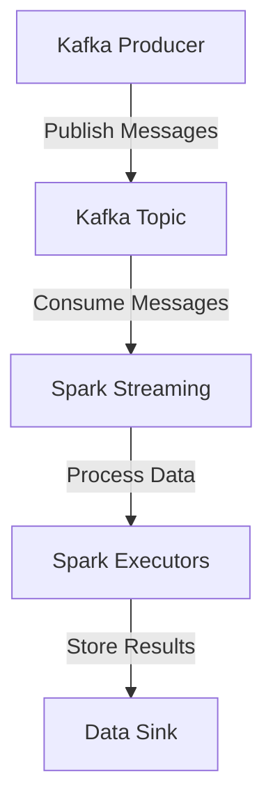

## 17.1.1.3 Performance Tuning for Spark and Kafka

In the realm of big data processing, the integration of Apache Kafka and Apache Spark stands out as a powerful combination for real-time analytics and data streaming. However, to harness their full potential, it is crucial to fine-tune their configurations and address common performance bottlenecks. This section delves into advanced strategies for optimizing the performance of Kafka and Spark integrations, providing expert insights and practical recommendations.

### Identifying Typical Performance Issues in Spark-Kafka Applications

When integrating Kafka with Spark, several performance issues can arise, often due to suboptimal configurations or resource constraints. Common challenges include:

- **High Latency**: Delays in data processing can occur due to inefficient data transfer between Kafka and Spark.
- **Resource Contention**: Inadequate resource allocation can lead to bottlenecks, especially in CPU and memory usage.
- **Data Skew**: Uneven data distribution across partitions can cause some tasks to take significantly longer than others.
- **Serialization Overhead**: Inefficient serialization formats can slow down data processing.
- **Network Bottlenecks**: High network traffic can impede data transfer rates between Kafka brokers and Spark executors.

### Configuration Recommendations for Kafka Consumer Properties

To optimize Kafka consumer performance in a Spark application, consider the following configuration tweaks:

- **`fetch.min.bytes`**: Increase this value to reduce the number of fetch requests by waiting for more data to accumulate before fetching.
- **`fetch.max.wait.ms`**: Adjust this setting to control the maximum wait time for data to accumulate before a fetch request is sent.
- **`max.partition.fetch.bytes`**: Set this to a higher value to allow larger batches of data to be fetched in a single request, reducing the number of fetch cycles.
- **`session.timeout.ms`**: Ensure this is configured appropriately to prevent unnecessary consumer group rebalances.
- **`auto.offset.reset`**: Use `earliest` or `latest` based on your application's requirements for handling offsets.

### Spark Resource Allocation and Parallelism Settings

Efficient resource allocation and parallelism are critical for optimizing Spark's performance when processing Kafka streams:

- **Executor Memory**: Allocate sufficient memory to Spark executors to handle large data volumes and avoid out-of-memory errors.
- **Executor Cores**: Increase the number of cores per executor to enhance parallel processing capabilities.
- **Dynamic Allocation**: Enable dynamic allocation to automatically adjust the number of executors based on workload demands.
- **Parallelism**: Set the `spark.default.parallelism` and `spark.streaming.kafka.maxRatePerPartition` to appropriate values to control the level of parallelism and data ingestion rates.

### Tips on Batch Sizes, Compression, and Serialization Formats

The choice of batch sizes, compression, and serialization formats can significantly impact the performance of Spark-Kafka applications:

- **Batch Sizes**: Optimize the batch size for Spark streaming jobs to balance between latency and throughput. Larger batch sizes can improve throughput but may increase latency.
- **Compression**: Use compression algorithms like Snappy or LZ4 to reduce data size and improve network efficiency. Ensure that both Kafka producers and consumers are configured to use the same compression codec.
- **Serialization Formats**: Choose efficient serialization formats like Avro or Protobuf to minimize serialization overhead and improve data processing speed.

### Importance of Monitoring and Profiling Tools

Monitoring and profiling are essential for identifying performance bottlenecks and ensuring optimal operation of Spark-Kafka integrations:

- **Prometheus and Grafana**: Use these tools to collect and visualize metrics from both Kafka and Spark, providing insights into system performance and resource utilization.
- **Spark UI**: Leverage the Spark UI to monitor job execution, identify slow stages, and analyze task distribution.
- **Kafka Monitoring Tools**: Utilize tools like Kafka Manager or Confluent Control Center to monitor Kafka cluster health and performance metrics.

### Practical Applications and Real-World Scenarios

In real-world scenarios, optimizing Spark-Kafka integrations can lead to significant improvements in data processing efficiency and system scalability. For example, a financial services company might use a tuned Spark-Kafka pipeline to process real-time transaction data for fraud detection, ensuring rapid response times and high throughput.

### Code Examples

To illustrate these concepts, let's explore code examples in Java, Scala, Kotlin, and Clojure for configuring a Spark-Kafka integration.

#### Java Example

```java
import org.apache.spark.SparkConf;
import org.apache.spark.streaming.Durations;
import org.apache.spark.streaming.api.java.JavaStreamingContext;
import org.apache.spark.streaming.kafka010.*;

import java.util.HashMap;
import java.util.Map;

public class SparkKafkaExample {
    public static void main(String[] args) {
        SparkConf conf = new SparkConf().setAppName("SparkKafkaExample").setMaster("local[*]");
        JavaStreamingContext streamingContext = new JavaStreamingContext(conf, Durations.seconds(10));

        Map<String, Object> kafkaParams = new HashMap<>();
        kafkaParams.put("bootstrap.servers", "localhost:9092");
        kafkaParams.put("key.deserializer", "org.apache.kafka.common.serialization.StringDeserializer");
        kafkaParams.put("value.deserializer", "org.apache.kafka.common.serialization.StringDeserializer");
        kafkaParams.put("group.id", "spark-kafka-group");
        kafkaParams.put("auto.offset.reset", "latest");
        kafkaParams.put("enable.auto.commit", false);

        // Define Kafka topics
        Collection<String> topics = Arrays.asList("topicA");

        // Create Kafka Direct Stream
        JavaInputDStream<ConsumerRecord<String, String>> stream =
                KafkaUtils.createDirectStream(
                        streamingContext,
                        LocationStrategies.PreferConsistent(),
                        ConsumerStrategies.<String, String>Subscribe(topics, kafkaParams)
                );

        // Process the stream
        stream.foreachRDD(rdd -> {
            rdd.foreach(record -> {
                System.out.println("Received message: " + record.value());
            });
        });

        streamingContext.start();
        streamingContext.awaitTermination();
    }
}
```

#### Scala Example

```scala
import org.apache.spark.SparkConf
import org.apache.spark.streaming.{Seconds, StreamingContext}
import org.apache.spark.streaming.kafka010._

object SparkKafkaExample {
  def main(args: Array[String]): Unit = {
    val conf = new SparkConf().setAppName("SparkKafkaExample").setMaster("local[*]")
    val ssc = new StreamingContext(conf, Seconds(10))

    val kafkaParams = Map[String, Object](
      "bootstrap.servers" -> "localhost:9092",
      "key.deserializer" -> classOf[StringDeserializer],
      "value.deserializer" -> classOf[StringDeserializer],
      "group.id" -> "spark-kafka-group",
      "auto.offset.reset" -> "latest",
      "enable.auto.commit" -> (false: java.lang.Boolean)
    )

    val topics = Array("topicA")
    val stream = KafkaUtils.createDirectStream[String, String](
      ssc,
      LocationStrategies.PreferConsistent,
      ConsumerStrategies.Subscribe[String, String](topics, kafkaParams)
    )

    stream.foreachRDD { rdd =>
      rdd.foreach { record =>
        println(s"Received message: ${record.value}")
      }
    }

    ssc.start()
    ssc.awaitTermination()
  }
}
```

#### Kotlin Example

```kotlin
import org.apache.kafka.common.serialization.StringDeserializer
import org.apache.spark.SparkConf
import org.apache.spark.streaming.Durations
import org.apache.spark.streaming.api.java.JavaStreamingContext
import org.apache.spark.streaming.kafka010.ConsumerStrategies
import org.apache.spark.streaming.kafka010.KafkaUtils
import org.apache.spark.streaming.kafka010.LocationStrategies

fun main() {
    val conf = SparkConf().setAppName("SparkKafkaExample").setMaster("local[*]")
    val streamingContext = JavaStreamingContext(conf, Durations.seconds(10))

    val kafkaParams = mapOf(
        "bootstrap.servers" to "localhost:9092",
        "key.deserializer" to StringDeserializer::class.java.name,
        "value.deserializer" to StringDeserializer::class.java.name,
        "group.id" to "spark-kafka-group",
        "auto.offset.reset" to "latest",
        "enable.auto.commit" to false
    )

    val topics = listOf("topicA")
    val stream = KafkaUtils.createDirectStream(
        streamingContext,
        LocationStrategies.PreferConsistent(),
        ConsumerStrategies.Subscribe<String, String>(topics, kafkaParams)
    )

    stream.foreachRDD { rdd ->
        rdd.foreach { record ->
            println("Received message: ${record.value()}")
        }
    }

    streamingContext.start()
    streamingContext.awaitTermination()
}
```

#### Clojure Example

```clojure
(ns spark-kafka-example
  (:require [org.apache.spark :as spark]
            [org.apache.spark.streaming :as streaming]
            [org.apache.spark.streaming.kafka010 :as kafka]))

(defn -main [& args]
  (let [conf (spark/SparkConf. "SparkKafkaExample" "local[*]")
        ssc (streaming/StreamingContext. conf (streaming/Seconds. 10))
        kafka-params {"bootstrap.servers" "localhost:9092"
                      "key.deserializer" "org.apache.kafka.common.serialization.StringDeserializer"
                      "value.deserializer" "org.apache.kafka.common.serialization.StringDeserializer"
                      "group.id" "spark-kafka-group"
                      "auto.offset.reset" "latest"
                      "enable.auto.commit" false}
        topics ["topicA"]
        stream (kafka/createDirectStream ssc
                                         (kafka/LocationStrategies/PreferConsistent)
                                         (kafka/ConsumerStrategies/Subscribe topics kafka-params))]

    (stream/foreachRDD stream
                       (fn [rdd]
                         (rdd/foreach (fn [record]
                                        (println "Received message:" (.value record))))))

    (streaming/start ssc)
    (streaming/awaitTermination ssc)))
```

### Visualizing Kafka and Spark Integration

To better understand the integration between Kafka and Spark, consider the following diagram illustrating the data flow and processing stages:



**Caption**: This diagram depicts the flow of data from Kafka producers to Spark streaming, where data is processed and stored in a data sink.

### References and Links

- [Apache Kafka Documentation](https://kafka.apache.org/documentation/)
- [Apache Spark Documentation](https://spark.apache.org/docs/latest/)
- [Confluent Documentation](https://docs.confluent.io/)
- [1.4.4 Big Data Integration]( "Big Data Integration")

### Knowledge Check

To reinforce your understanding of performance tuning for Spark and Kafka, consider the following questions and exercises.

## Test Your Knowledge: Performance Tuning for Spark and Kafka Quiz



### What is a common cause of high latency in Spark-Kafka applications?

- [x] Inefficient data transfer between Kafka and Spark
- [ ] Over-provisioning of resources
- [ ] Using the latest serialization formats
- [ ] Low network traffic

> **Explanation:** High latency often results from inefficient data transfer between Kafka and Spark, which can be mitigated by optimizing configurations.

### Which Kafka consumer property helps reduce the number of fetch requests?

- [x] `fetch.min.bytes`
- [ ] `session.timeout.ms`
- [ ] `auto.offset.reset`
- [ ] `enable.auto.commit`

> **Explanation:** Increasing `fetch.min.bytes` allows more data to accumulate before a fetch request is sent, reducing the number of requests.

### What is the benefit of enabling dynamic allocation in Spark?

- [x] Automatically adjusts the number of executors based on workload demands
- [ ] Increases the number of cores per executor
- [ ] Reduces memory allocation for executors
- [ ] Disables parallel processing

> **Explanation:** Dynamic allocation allows Spark to automatically adjust the number of executors, optimizing resource usage based on workload demands.

### Which compression algorithm is recommended for reducing data size in Kafka?

- [x] Snappy
- [ ] Gzip
- [ ] Bzip2
- [ ] Deflate

> **Explanation:** Snappy is a fast compression algorithm that reduces data size, improving network efficiency without significant CPU overhead.

### What tool can be used to visualize metrics from both Kafka and Spark?

- [x] Prometheus and Grafana
- [ ] Apache JMeter
- [ ] Jenkins
- [ ] Apache NiFi

> **Explanation:** Prometheus and Grafana are commonly used to collect and visualize metrics, providing insights into system performance and resource utilization.

### Which Spark UI feature helps identify slow stages in job execution?

- [x] Job Execution Monitoring
- [ ] Task Distribution Analysis
- [ ] Resource Allocation Graph
- [ ] Data Skew Detection

> **Explanation:** The Spark UI provides job execution monitoring, allowing users to identify slow stages and optimize performance.

### What is a potential drawback of using large batch sizes in Spark streaming jobs?

- [x] Increased latency
- [ ] Reduced throughput
- [ ] Higher memory usage
- [ ] Lower CPU utilization

> **Explanation:** While larger batch sizes can improve throughput, they may also increase latency, as data is processed in larger chunks.

### How can data skew be mitigated in Spark-Kafka applications?

- [x] By ensuring even data distribution across partitions
- [ ] By increasing the number of Kafka brokers
- [ ] By reducing the number of Spark executors
- [ ] By using the latest serialization formats

> **Explanation:** Data skew can be mitigated by ensuring even data distribution across partitions, preventing some tasks from taking significantly longer than others.

### What is the role of `spark.default.parallelism` in Spark?

- [x] Controls the level of parallelism in Spark jobs
- [ ] Sets the default memory allocation for executors
- [ ] Determines the number of Kafka partitions
- [ ] Configures the network bandwidth for Spark

> **Explanation:** `spark.default.parallelism` controls the level of parallelism in Spark jobs, affecting how tasks are distributed across executors.

### True or False: Using Avro or Protobuf serialization formats can improve data processing speed in Spark-Kafka applications.

- [x] True
- [ ] False

> **Explanation:** Avro and Protobuf are efficient serialization formats that minimize serialization overhead, improving data processing speed.



By implementing these performance tuning strategies, you can optimize the integration of Kafka and Spark, enhancing the efficiency and scalability of your big data workflows.
