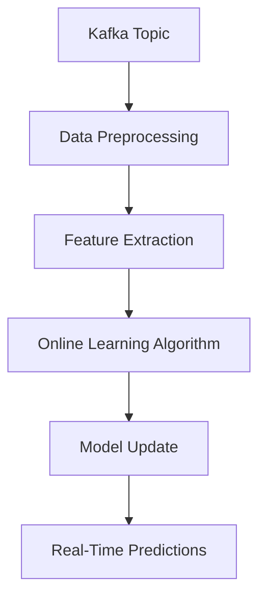

## 17.1.4.1 Model Training with Streaming Data

In the era of big data and real-time analytics, the ability to train machine learning models on streaming data has become a critical capability for enterprises seeking to maintain a competitive edge. Apache Kafka, with its robust streaming capabilities, plays a pivotal role in enabling continuous learning and adaptation of machine learning models. This section delves into the challenges and opportunities of training models on streaming data, discusses frameworks that support streaming model training, and provides practical examples and best practices for implementing online learning algorithms.

### Challenges and Opportunities of Training Models on Streaming Data

Training machine learning models on streaming data presents unique challenges and opportunities:

- **Data Velocity and Volume**: Streaming data arrives at high velocity and in large volumes, requiring efficient processing and storage solutions.
- **Continuous Learning**: Models can be continuously updated with new data, allowing them to adapt to changing patterns and trends.
- **Real-Time Insights**: Streaming data enables real-time insights and decision-making, which is crucial for applications like fraud detection and recommendation systems.
- **Data Consistency and Quality**: Ensuring data consistency and quality is critical, as noisy or incomplete data can degrade model performance.
- **Resource Management**: Efficient resource management is essential to handle the computational demands of streaming data processing.

### Frameworks Supporting Streaming Model Training

Several frameworks support model training on streaming data, each with its strengths and use cases:

#### Apache Spark MLlib

Apache Spark's MLlib provides scalable machine learning algorithms that can be integrated with Spark Streaming to process and train models on streaming data. Spark's distributed computing capabilities make it suitable for handling large-scale data processing tasks.

#### Apache Flink ML

Apache Flink offers a robust framework for stream processing and includes a machine learning library, Flink ML, which supports online learning algorithms. Flink's event-driven architecture and low-latency processing make it ideal for real-time applications.

#### TensorFlow Extended (TFX)

TFX is an end-to-end platform for deploying production ML pipelines, including support for streaming data ingestion and processing. It integrates well with Apache Kafka for real-time data ingestion.

### Implementing Online Learning Algorithms

Online learning algorithms are designed to update models incrementally as new data arrives, making them well-suited for streaming data scenarios. Here, we provide examples of implementing online learning algorithms using Apache Kafka and various programming languages.

#### Java Example: Online Logistic Regression with Apache Spark

```java
import org.apache.spark.SparkConf;
import org.apache.spark.api.java.JavaSparkContext;
import org.apache.spark.streaming.Durations;
import org.apache.spark.streaming.api.java.JavaDStream;
import org.apache.spark.streaming.api.java.JavaStreamingContext;
import org.apache.spark.streaming.kafka.KafkaUtils;
import org.apache.spark.mllib.classification.LogisticRegressionModel;
import org.apache.spark.mllib.classification.LogisticRegressionWithSGD;
import org.apache.spark.mllib.regression.LabeledPoint;
import org.apache.spark.mllib.linalg.Vectors;
import kafka.serializer.StringDecoder;

import java.util.HashMap;
import java.util.HashSet;
import java.util.Set;

public class StreamingLogisticRegression {
    public static void main(String[] args) {
        SparkConf conf = new SparkConf().setAppName("StreamingLogisticRegression");
        JavaSparkContext sc = new JavaSparkContext(conf);
        JavaStreamingContext ssc = new JavaStreamingContext(sc, Durations.seconds(1));

        Set<String> topics = new HashSet<>();
        topics.add("streaming-data");

        HashMap<String, String> kafkaParams = new HashMap<>();
        kafkaParams.put("metadata.broker.list", "localhost:9092");

        JavaDStream<String> messages = KafkaUtils.createDirectStream(
                ssc,
                String.class,
                String.class,
                StringDecoder.class,
                StringDecoder.class,
                kafkaParams,
                topics
        ).map(tuple2 -> tuple2._2());

        JavaDStream<LabeledPoint> trainingData = messages.map(message -> {
            String[] parts = message.split(",");
            double label = Double.parseDouble(parts[0]);
            double[] features = new double[parts.length - 1];
            for (int i = 1; i < parts.length; i++) {
                features[i - 1] = Double.parseDouble(parts[i]);
            }
            return new LabeledPoint(label, Vectors.dense(features));
        });

        trainingData.foreachRDD(rdd -> {
            if (!rdd.isEmpty()) {
                LogisticRegressionModel model = LogisticRegressionWithSGD.train(rdd.rdd(), 100);
                // Use the model for predictions or further processing
            }
        });

        ssc.start();
        ssc.awaitTermination();
    }
}
```

#### Scala Example: Online K-Means Clustering with Apache Flink

```scala
import org.apache.flink.api.scala._
import org.apache.flink.streaming.api.scala.StreamExecutionEnvironment
import org.apache.flink.ml.clustering.KMeans
import org.apache.flink.ml.common.LabeledVector
import org.apache.flink.ml.math.DenseVector

object StreamingKMeans {
  def main(args: Array[String]): Unit = {
    val env = StreamExecutionEnvironment.getExecutionEnvironment

    val stream = env.socketTextStream("localhost", 9999)

    val data = stream.map { line =>
      val parts = line.split(",")
      val label = parts(0).toDouble
      val features = parts.tail.map(_.toDouble)
      LabeledVector(label, DenseVector(features))
    }

    val kMeans = KMeans()
      .setK(3)
      .setMaxIterations(10)

    kMeans.fit(data)

    env.execute("Streaming K-Means Clustering")
  }
}
```

#### Kotlin Example: Online Decision Trees with Apache Spark

```kotlin
import org.apache.spark.SparkConf
import org.apache.spark.api.java.JavaSparkContext
import org.apache.spark.streaming.Durations
import org.apache.spark.streaming.api.java.JavaDStream
import org.apache.spark.streaming.api.java.JavaStreamingContext
import org.apache.spark.streaming.kafka.KafkaUtils
import org.apache.spark.mllib.tree.DecisionTree
import org.apache.spark.mllib.tree.model.DecisionTreeModel
import org.apache.spark.mllib.regression.LabeledPoint
import org.apache.spark.mllib.linalg.Vectors
import kafka.serializer.StringDecoder

fun main() {
    val conf = SparkConf().setAppName("StreamingDecisionTree")
    val sc = JavaSparkContext(conf)
    val ssc = JavaStreamingContext(sc, Durations.seconds(1))

    val topics = setOf("streaming-data")
    val kafkaParams = mapOf("metadata.broker.list" to "localhost:9092")

    val messages: JavaDStream<String> = KafkaUtils.createDirectStream(
        ssc,
        String::class.java,
        String::class.java,
        StringDecoder::class.java,
        StringDecoder::class.java,
        kafkaParams,
        topics
    ).map { it._2() }

    val trainingData: JavaDStream<LabeledPoint> = messages.map { message ->
        val parts = message.split(",")
        val label = parts[0].toDouble()
        val features = parts.drop(1).map { it.toDouble() }.toDoubleArray()
        LabeledPoint(label, Vectors.dense(features))
    }

    trainingData.foreachRDD { rdd ->
        if (!rdd.isEmpty()) {
            val categoricalFeaturesInfo = mapOf<Int, Int>()
            val model: DecisionTreeModel = DecisionTree.trainClassifier(
                rdd, 2, categoricalFeaturesInfo, "gini", 5, 32
            )
            // Use the model for predictions or further processing
        }
    }

    ssc.start()
    ssc.awaitTermination()
}
```

#### Clojure Example: Online Linear Regression with Apache Flink

```clojure
(ns streaming-linear-regression
  (:require [org.apache.flink.api.common.functions :refer [MapFunction]]
            [org.apache.flink.streaming.api.environment :refer [StreamExecutionEnvironment]]
            [org.apache.flink.streaming.api.windowing.time :refer [Time]]
            [org.apache.flink.ml.regression.linear :refer [LinearRegression]]))

(defn -main [& args]
  (let [env (StreamExecutionEnvironment/getExecutionEnvironment)
        stream (.socketTextStream env "localhost" 9999)]

    (defn parse-line [line]
      (let [parts (clojure.string/split line #",")
            label (Double/parseDouble (first parts))
            features (mapv #(Double/parseDouble %) (rest parts))]
        {:label label :features features}))

    (def data (.map stream (reify MapFunction
                             (map [this line]
                               (parse-line line)))))

    (def lr (LinearRegression.))
    (.fit lr data)

    (.execute env "Streaming Linear Regression")))
```

### Considerations for Data Preprocessing, Feature Extraction, and Data Consistency

When training models on streaming data, several considerations must be addressed to ensure effective and efficient processing:

- **Data Preprocessing**: Streaming data often requires preprocessing to handle missing values, normalize features, and remove noise. This preprocessing must be done in real-time to keep up with the data flow.
- **Feature Extraction**: Extracting relevant features from streaming data is crucial for model performance. Techniques such as sliding windows and feature hashing can be employed to generate meaningful features.
- **Data Consistency**: Ensuring data consistency across distributed systems is challenging but essential for accurate model training. Techniques like watermarking and event-time processing can help maintain consistency.

### Best Practices for Managing Resource Utilization and Scalability

Efficient resource management and scalability are critical when dealing with streaming data:

- **Resource Allocation**: Allocate resources dynamically based on data volume and processing requirements. Use container orchestration tools like Kubernetes to manage resources efficiently.
- **Scalability**: Design systems to scale horizontally by adding more nodes to handle increased data loads. Use Kafka's partitioning and replication features to distribute data processing across multiple nodes.
- **Monitoring and Optimization**: Continuously monitor system performance and optimize configurations to ensure efficient resource utilization. Use tools like Prometheus and Grafana for monitoring and alerting.

### Visualizing the Streaming Model Training Pipeline

To better understand the streaming model training process, consider the following diagram illustrating the data flow and processing stages:



**Diagram Description**: This diagram represents the flow of data from a Kafka topic through various stages of preprocessing, feature extraction, and online learning, culminating in real-time model updates and predictions.

### References and Links

- [Apache Kafka Documentation](https://kafka.apache.org/documentation/)
- [Apache Spark MLlib](https://spark.apache.org/mllib/)
- [Apache Flink ML](https://ci.apache.org/projects/flink/flink-docs-release-1.13/dev/libs/ml/index.html)
- [TensorFlow Extended (TFX)](https://www.tensorflow.org/tfx)

### Knowledge Check

To reinforce your understanding of model training with streaming data, consider the following questions and exercises:

1. **What are the key challenges of training models on streaming data, and how can they be addressed?**
2. **Explain how Apache Kafka can be used to feed streaming data into machine learning pipelines.**
3. **Describe the differences between batch and online learning algorithms.**
4. **Implement a simple online learning algorithm using your preferred programming language and Kafka.**
5. **Discuss the importance of data consistency in streaming model training and how it can be achieved.**

### Embrace the Journey

Training machine learning models on streaming data is a complex but rewarding endeavor. By leveraging the capabilities of Apache Kafka and modern stream processing frameworks, you can build scalable, real-time machine learning systems that continuously adapt to new data. As you explore these techniques, remember to consider the unique challenges and opportunities presented by streaming data, and apply best practices to ensure efficient and effective model training.

## Test Your Knowledge: Streaming Data Model Training Quiz



### What is a primary challenge of training models on streaming data?

- [x] Ensuring data consistency and quality
- [ ] Handling small data volumes
- [ ] Reducing data velocity
- [ ] Minimizing data redundancy

> **Explanation:** Ensuring data consistency and quality is crucial when dealing with streaming data, as it directly impacts model performance.

### Which framework is known for its low-latency processing and event-driven architecture?

- [ ] Apache Spark
- [x] Apache Flink
- [ ] TensorFlow Extended
- [ ] Apache Hadoop

> **Explanation:** Apache Flink is known for its low-latency processing and event-driven architecture, making it ideal for real-time applications.

### What is the role of feature extraction in streaming model training?

- [x] To generate meaningful features for model performance
- [ ] To reduce data volume
- [ ] To increase data velocity
- [ ] To ensure data redundancy

> **Explanation:** Feature extraction is crucial for generating meaningful features that enhance model performance.

### How can resource allocation be managed efficiently in streaming data systems?

- [x] By using container orchestration tools like Kubernetes
- [ ] By reducing data velocity
- [ ] By minimizing data redundancy
- [ ] By increasing data volume

> **Explanation:** Container orchestration tools like Kubernetes help manage resources efficiently by dynamically allocating them based on data volume and processing requirements.

### What is a benefit of using online learning algorithms with streaming data?

- [x] Continuous model updates with new data
- [ ] Reduced data velocity
- [x] Real-time insights and decision-making
- [ ] Increased data redundancy

> **Explanation:** Online learning algorithms allow continuous model updates with new data, providing real-time insights and decision-making capabilities.

### Which tool can be used for monitoring and alerting in streaming data systems?

- [x] Prometheus
- [ ] TensorFlow
- [ ] Apache Hadoop
- [ ] Apache Hive

> **Explanation:** Prometheus is a tool used for monitoring and alerting in streaming data systems.

### What is the purpose of watermarking in streaming data processing?

- [x] To maintain data consistency
- [ ] To increase data velocity
- [x] To handle late-arriving events
- [ ] To reduce data volume

> **Explanation:** Watermarking helps maintain data consistency and handle late-arriving events in streaming data processing.

### Which programming language is used in the provided example for online logistic regression?

- [x] Java
- [ ] Scala
- [ ] Kotlin
- [ ] Clojure

> **Explanation:** The provided example for online logistic regression uses Java.

### What is a key consideration when preprocessing streaming data?

- [x] Handling missing values and normalizing features
- [ ] Increasing data velocity
- [ ] Reducing data volume
- [ ] Ensuring data redundancy

> **Explanation:** Preprocessing streaming data involves handling missing values and normalizing features to ensure data quality.

### True or False: Online learning algorithms are not suitable for real-time applications.

- [ ] True
- [x] False

> **Explanation:** Online learning algorithms are suitable for real-time applications as they allow continuous model updates with new data.


