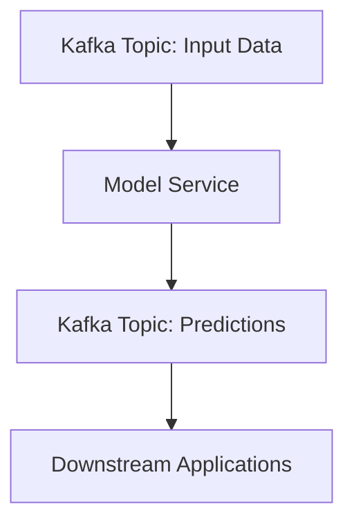

## 17.1.4.2 Model Serving and Inference Pipelines

In the realm of machine learning, the ability to serve models in real-time and perform inference on streaming data is crucial for applications that require immediate insights and decisions. Apache Kafka, with its robust streaming capabilities, plays a pivotal role in enabling such architectures. This section delves into the integration of Kafka with model serving frameworks, exploring various approaches to model serving, and providing practical examples of deploying models as services that interact with Kafka topics.

### Approaches to Model Serving

Model serving can be approached in several ways, each with its own set of advantages and trade-offs. The two primary methods are embedding models directly within applications and deploying models as microservices.

#### Embedded Models

Embedding models directly within applications allows for low-latency inference, as the model is co-located with the application logic. This approach is suitable for scenarios where the model is lightweight and the application can afford to include the model's dependencies.

- **Advantages**:
  - **Low Latency**: Direct access to the model reduces inference time.
  - **Simplified Deployment**: Fewer moving parts as the model is part of the application.

- **Disadvantages**:
  - **Limited Scalability**: Scaling the application also scales the model, which may not be efficient.
  - **Complex Updates**: Updating the model requires redeploying the application.

#### Microservices for Model Serving

Deploying models as microservices decouples the model from the application, allowing for independent scaling and management. This approach is ideal for complex models or when multiple applications need to access the same model.

- **Advantages**:
  - **Scalability**: Models can be scaled independently based on demand.
  - **Flexibility**: Easier to update models without affecting the application.

- **Disadvantages**:
  - **Increased Latency**: Network calls to the model service can introduce latency.
  - **Complexity**: Requires additional infrastructure and management.

### Integrating Kafka with Model Serving Frameworks

Integrating Kafka with model serving frameworks such as TensorFlow Serving and MLflow Model Serving enables seamless real-time inference pipelines. These frameworks provide robust APIs for serving models and can be configured to consume from and produce to Kafka topics.

#### TensorFlow Serving

TensorFlow Serving is a flexible, high-performance serving system for machine learning models, designed for production environments. It supports model versioning and can handle multiple models simultaneously.

- **Integration with Kafka**:
  - **Input Data**: Kafka topics can be used to stream input data to TensorFlow Serving.
  - **Output Predictions**: Predictions can be published back to Kafka topics for downstream processing.

- **Example**:
  ```java
  // Java code to consume data from Kafka and send it to TensorFlow Serving
  KafkaConsumer<String, byte[]> consumer = new KafkaConsumer<>(props);
  consumer.subscribe(Collections.singletonList("input-topic"));

  while (true) {
      ConsumerRecords<String, byte[]> records = consumer.poll(Duration.ofMillis(100));
      for (ConsumerRecord<String, byte[]> record : records) {
          // Send data to TensorFlow Serving
          byte[] prediction = sendToTensorFlowServing(record.value());
          // Publish prediction to Kafka
          producer.send(new ProducerRecord<>("output-topic", record.key(), prediction));
      }
  }
  ```

#### MLflow Model Serving

MLflow is an open-source platform for managing the end-to-end machine learning lifecycle. Its model serving component allows for easy deployment of models as REST APIs.

- **Integration with Kafka**:
  - **Data Ingestion**: Use Kafka to stream data to MLflow's REST API for inference.
  - **Result Streaming**: Stream inference results back to Kafka for further analysis.

- **Example**:
  ```scala
  // Scala code to interact with MLflow Model Serving
  val consumer = new KafkaConsumer[String, String](props)
  consumer.subscribe(List("input-topic").asJava)

  while (true) {
      val records = consumer.poll(Duration.ofMillis(100))
      records.asScala.foreach { record =>
          val prediction = callMlflowModelServing(record.value())
          producer.send(new ProducerRecord[String, String]("output-topic", record.key(), prediction))
      }
  }
  ```

### Deploying Models as Services

Deploying models as services involves setting up a dedicated infrastructure to host the model and expose it via an API. This setup allows multiple applications to access the model for inference.

#### Example: Deploying a Model with Docker

Using Docker to containerize model services ensures consistency across environments and simplifies deployment.

- **Dockerfile Example**:
  ```dockerfile
  FROM tensorflow/serving
  COPY my_model /models/my_model
  ENV MODEL_NAME=my_model
  ```

- **Running the Container**:
  ```bash
  docker run -p 8501:8501 --name=tf_serving --mount type=bind,source=$(pwd)/my_model,target=/models/my_model -e MODEL_NAME=my_model -t tensorflow/serving
  ```

### Considerations for Latency, Throughput, and Concurrency

When designing model serving pipelines, it is essential to consider the trade-offs between latency, throughput, and concurrency.

- **Latency**: Minimize latency by optimizing network calls and using efficient serialization formats.
- **Throughput**: Ensure the system can handle the expected volume of requests by scaling the model service and Kafka consumers.
- **Concurrency**: Use asynchronous processing and non-blocking I/O to handle multiple requests simultaneously.

### Strategies for Versioning and A/B Testing Models

Model versioning and A/B testing are critical for maintaining model performance and experimenting with new models.

- **Versioning**: Use model serving frameworks that support versioning to manage multiple versions of a model.
- **A/B Testing**: Implement A/B testing by routing a percentage of traffic to different model versions and comparing their performance.

### Visualizing Model Serving Pipelines

To better understand the flow of data in a model serving pipeline, consider the following diagram:



**Caption**: This diagram illustrates a typical model serving pipeline where input data is consumed from a Kafka topic, processed by a model service, and predictions are published back to another Kafka topic for downstream applications.

### Conclusion

Integrating Kafka with model serving frameworks enables powerful real-time inference capabilities within streaming applications. By choosing the appropriate model serving approach and considering factors such as latency, throughput, and concurrency, organizations can build efficient and scalable inference pipelines. Additionally, strategies for versioning and A/B testing ensure that models remain performant and adaptable to changing requirements.

### References and Further Reading

- [Apache Kafka Documentation](https://kafka.apache.org/documentation/)
- [TensorFlow Serving Documentation](https://www.tensorflow.org/tfx/guide/serving)
- [MLflow Documentation](https://mlflow.org/docs/latest/index.html)

## Test Your Knowledge: Real-Time Model Serving with Kafka Quiz



### What is a primary advantage of embedding models directly within applications?

- [x] Low latency inference
- [ ] Independent scaling of models
- [ ] Simplified model updates
- [ ] Reduced application complexity

> **Explanation:** Embedding models directly within applications allows for low-latency inference as the model is co-located with the application logic.

### Which framework is known for providing a high-performance serving system for machine learning models?

- [x] TensorFlow Serving
- [ ] MLflow
- [ ] Apache Flink
- [ ] Apache Beam

> **Explanation:** TensorFlow Serving is designed for high-performance serving of machine learning models in production environments.

### What is a disadvantage of deploying models as microservices?

- [ ] Increased scalability
- [x] Increased latency
- [ ] Simplified updates
- [ ] Independent scaling

> **Explanation:** Deploying models as microservices can introduce increased latency due to network calls to the model service.

### How can Kafka be used in model serving pipelines?

- [x] By streaming input data to model services and streaming predictions back to Kafka topics
- [ ] By storing models in Kafka topics
- [ ] By replacing model serving frameworks
- [ ] By directly executing models within Kafka brokers

> **Explanation:** Kafka can be used to stream input data to model services and stream predictions back to Kafka topics for further processing.

### What is a key consideration when designing model serving pipelines?

- [x] Balancing latency, throughput, and concurrency
- [ ] Ensuring models are embedded within applications
- [ ] Using only synchronous processing
- [ ] Avoiding model versioning

> **Explanation:** Balancing latency, throughput, and concurrency is crucial for designing efficient model serving pipelines.

### Which strategy is used to compare the performance of different model versions?

- [ ] Model embedding
- [x] A/B testing
- [ ] Model serialization
- [ ] Model scaling

> **Explanation:** A/B testing is used to route a percentage of traffic to different model versions and compare their performance.

### What is a benefit of using Docker for model serving?

- [x] Consistency across environments
- [ ] Increased latency
- [ ] Reduced scalability
- [ ] Simplified model updates

> **Explanation:** Docker ensures consistency across environments by containerizing model services, making deployment easier.

### Which of the following is a disadvantage of embedding models within applications?

- [ ] Low latency
- [x] Limited scalability
- [ ] Simplified deployment
- [ ] Reduced complexity

> **Explanation:** Embedding models within applications can lead to limited scalability as scaling the application also scales the model.

### What is a common use case for Kafka in model serving pipelines?

- [x] Streaming real-time data for inference
- [ ] Storing large datasets
- [ ] Replacing traditional databases
- [ ] Executing batch processing jobs

> **Explanation:** Kafka is commonly used to stream real-time data for inference in model serving pipelines.

### True or False: Model serving frameworks like TensorFlow Serving and MLflow can be integrated with Kafka for real-time inference.

- [x] True
- [ ] False

> **Explanation:** Model serving frameworks like TensorFlow Serving and MLflow can be integrated with Kafka to enable real-time inference capabilities.


