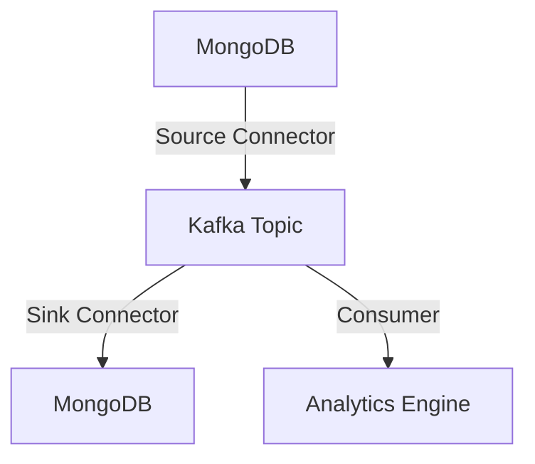

## 17.1.5.2 MongoDB Connectors

Integrating Apache Kafka with MongoDB using connectors is a powerful approach to enable flexible, document-based data storage and real-time data flows. This section explores the MongoDB Kafka Connector, providing configuration examples for source and sink connectors, discussing considerations for handling schema-less data and JSON formats, and showcasing use cases such as real-time analytics and operational data synchronization.

### Introduction to MongoDB Kafka Connector

The MongoDB Kafka Connector is a tool that enables seamless integration between Apache Kafka and MongoDB, allowing data to flow in real-time between these two systems. It leverages Kafka Connect, a framework for connecting Kafka with external systems, to provide both source and sink connectors. This integration is particularly beneficial for applications that require real-time data processing and storage in a flexible, document-oriented database like MongoDB.

#### Key Features of MongoDB Kafka Connector

- **Real-Time Data Integration**: Facilitates real-time data streaming between Kafka and MongoDB.
- **Schema-Less Data Handling**: Supports JSON and BSON formats, making it ideal for schema-less data.
- **Scalability**: Designed to handle large volumes of data efficiently.
- **Flexibility**: Supports a wide range of configurations and transformations.

For more detailed documentation, visit the [MongoDB Kafka Connector](https://docs.mongodb.com/kafka-connector/).

### Configuring MongoDB Kafka Connectors

The MongoDB Kafka Connector provides two main types of connectors: source and sink. Each serves a distinct purpose in the data integration process.

#### Source Connector Configuration

The source connector is used to stream data from MongoDB to Kafka. It captures changes in MongoDB collections and publishes them to Kafka topics.

**Example Configuration:**

```json
{
  "name": "mongodb-source-connector",
  "config": {
    "connector.class": "com.mongodb.kafka.connect.MongoSourceConnector",
    "tasks.max": "1",
    "connection.uri": "mongodb://localhost:27017",
    "database": "myDatabase",
    "collection": "myCollection",
    "topic.prefix": "mongo.",
    "poll.max.batch.size": "1000",
    "poll.await.time.ms": "5000"
  }
}
```

- **`connector.class`**: Specifies the class for the MongoDB source connector.
- **`connection.uri`**: The URI for connecting to MongoDB.
- **`database`** and **`collection`**: Specify the MongoDB database and collection to monitor.
- **`topic.prefix`**: Prefix for Kafka topics to which data will be published.
- **`poll.max.batch.size`** and **`poll.await.time.ms`**: Control the polling behavior.

#### Sink Connector Configuration

The sink connector is used to stream data from Kafka to MongoDB. It consumes messages from Kafka topics and writes them to MongoDB collections.

**Example Configuration:**

```json
{
  "name": "mongodb-sink-connector",
  "config": {
    "connector.class": "com.mongodb.kafka.connect.MongoSinkConnector",
    "tasks.max": "1",
    "connection.uri": "mongodb://localhost:27017",
    "database": "myDatabase",
    "collection": "myCollection",
    "topics": "kafka.topic",
    "change.data.capture.handler": "com.mongodb.kafka.connect.sink.cdc.mongodb.ChangeStreamHandler"
  }
}
```

- **`connector.class`**: Specifies the class for the MongoDB sink connector.
- **`topics`**: The Kafka topics to consume from.
- **`change.data.capture.handler`**: Handles change data capture events.

### Handling Schema-Less Data and JSON Formats

MongoDB's document-oriented nature allows it to store data in a flexible, schema-less format, typically using JSON or BSON. When integrating with Kafka, it's important to handle these formats effectively.

#### Considerations for Schema-Less Data

1. **Dynamic Schemas**: MongoDB collections can have documents with varying structures. Ensure your Kafka consumers and producers can handle dynamic schemas.
2. **Data Transformation**: Use Kafka Connect's Single Message Transforms (SMTs) to modify data as it flows between Kafka and MongoDB.
3. **Schema Registry**: Consider using a schema registry to manage and enforce schemas, even in a schema-less environment.

#### JSON and BSON Handling

- **JSON**: Widely used for data interchange, JSON is easy to read and write. Ensure your Kafka setup can serialize and deserialize JSON effectively.
- **BSON**: A binary representation of JSON, BSON is more efficient for storage and retrieval in MongoDB. Use appropriate serializers and deserializers in Kafka.

### Use Cases for MongoDB Kafka Integration

Integrating Kafka with MongoDB opens up a range of possibilities for real-time data processing and analytics.

#### Real-Time Analytics

By streaming data from MongoDB to Kafka, you can perform real-time analytics on data as it changes. This is particularly useful for applications like fraud detection, where timely insights are critical.

#### Operational Data Synchronization

Use the MongoDB Kafka Connector to synchronize operational data between systems. For example, changes in a MongoDB database can be propagated to other systems via Kafka, ensuring data consistency across your architecture.

### Practical Examples

Let's explore some practical examples of using the MongoDB Kafka Connector in different programming languages.

#### Java Example

```java
import org.apache.kafka.clients.producer.KafkaProducer;
import org.apache.kafka.clients.producer.ProducerRecord;
import org.bson.Document;
import com.mongodb.client.MongoClients;
import com.mongodb.client.MongoCollection;
import com.mongodb.client.MongoDatabase;

public class MongoDBKafkaExample {
    public static void main(String[] args) {
        // Connect to MongoDB
        var mongoClient = MongoClients.create("mongodb://localhost:27017");
        MongoDatabase database = mongoClient.getDatabase("myDatabase");
        MongoCollection<Document> collection = database.getCollection("myCollection");

        // Kafka Producer configuration
        var props = new Properties();
        props.put("bootstrap.servers", "localhost:9092");
        props.put("key.serializer", "org.apache.kafka.common.serialization.StringSerializer");
        props.put("value.serializer", "org.apache.kafka.common.serialization.StringSerializer");

        KafkaProducer<String, String> producer = new KafkaProducer<>(props);

        // Stream data from MongoDB to Kafka
        collection.find().forEach(document -> {
            String json = document.toJson();
            producer.send(new ProducerRecord<>("mongo.topic", json));
        });

        producer.close();
        mongoClient.close();
    }
}
```

#### Scala Example

```scala
import org.apache.kafka.clients.producer.{KafkaProducer, ProducerRecord}
import org.bson.Document
import com.mongodb.client.{MongoClients, MongoCollection, MongoDatabase}

object MongoDBKafkaExample extends App {
  // Connect to MongoDB
  val mongoClient = MongoClients.create("mongodb://localhost:27017")
  val database: MongoDatabase = mongoClient.getDatabase("myDatabase")
  val collection: MongoCollection[Document] = database.getCollection("myCollection")

  // Kafka Producer configuration
  val props = new java.util.Properties()
  props.put("bootstrap.servers", "localhost:9092")
  props.put("key.serializer", "org.apache.kafka.common.serialization.StringSerializer")
  props.put("value.serializer", "org.apache.kafka.common.serialization.StringSerializer")

  val producer = new KafkaProducer[String, String](props)

  // Stream data from MongoDB to Kafka
  collection.find().forEach(document => {
    val json = document.toJson
    producer.send(new ProducerRecord[String, String]("mongo.topic", json))
  })

  producer.close()
  mongoClient.close()
}
```

#### Kotlin Example

```kotlin
import org.apache.kafka.clients.producer.KafkaProducer
import org.apache.kafka.clients.producer.ProducerRecord
import org.bson.Document
import com.mongodb.client.MongoClients

fun main() {
    // Connect to MongoDB
    val mongoClient = MongoClients.create("mongodb://localhost:27017")
    val database = mongoClient.getDatabase("myDatabase")
    val collection = database.getCollection("myCollection")

    // Kafka Producer configuration
    val props = Properties().apply {
        put("bootstrap.servers", "localhost:9092")
        put("key.serializer", "org.apache.kafka.common.serialization.StringSerializer")
        put("value.serializer", "org.apache.kafka.common.serialization.StringSerializer")
    }

    val producer = KafkaProducer<String, String>(props)

    // Stream data from MongoDB to Kafka
    collection.find().forEach { document ->
        val json = document.toJson()
        producer.send(ProducerRecord("mongo.topic", json))
    }

    producer.close()
    mongoClient.close()
}
```

#### Clojure Example

```clojure
(require '[clojure.java.io :as io])
(require '[clojure.data.json :as json])
(require '[monger.core :as mg])
(require '[monger.collection :as mc])
(require '[org.apache.kafka.clients.producer :as kp])

(defn stream-mongo-to-kafka []
  (let [mongo-client (mg/connect)
        db (mg/get-db mongo-client "myDatabase")
        collection (mc/get-collection db "myCollection")
        props (doto (java.util.Properties.)
                (.put "bootstrap.servers" "localhost:9092")
                (.put "key.serializer" "org.apache.kafka.common.serialization.StringSerializer")
                (.put "value.serializer" "org.apache.kafka.common.serialization.StringSerializer"))
        producer (kp/KafkaProducer. props)]
    (doseq [doc (mc/find-maps collection)]
      (let [json-doc (json/write-str doc)]
        (.send producer (kp/ProducerRecord. "mongo.topic" json-doc))))
    (.close producer)
    (mg/disconnect mongo-client)))

(stream-mongo-to-kafka)
```

### Visualizing the Integration

To better understand the integration between Kafka and MongoDB, consider the following diagram illustrating the data flow:



**Diagram Explanation**: This diagram shows MongoDB as both a source and sink for data flowing through Kafka. Data from MongoDB is published to a Kafka topic via the source connector. The sink connector then writes data from the Kafka topic back to MongoDB, while consumers can also process the data for analytics.

### Best Practices and Considerations

- **Data Consistency**: Ensure data consistency between MongoDB and Kafka by carefully managing offsets and acknowledgments.
- **Error Handling**: Implement robust error handling and retry mechanisms to deal with transient failures.
- **Performance Tuning**: Optimize connector configurations for performance, considering factors like batch size and poll intervals.
- **Security**: Secure your data flows by configuring SSL/TLS and authentication mechanisms for both Kafka and MongoDB.

### Conclusion

Integrating Apache Kafka with MongoDB using connectors provides a robust solution for real-time data processing and storage in a flexible, document-oriented database. By leveraging the MongoDB Kafka Connector, you can build scalable, fault-tolerant systems that handle schema-less data efficiently. Whether you're implementing real-time analytics or synchronizing operational data, this integration offers a powerful toolset for modern data architectures.

## Test Your Knowledge: MongoDB Kafka Connector Integration Quiz



### What is the primary purpose of the MongoDB Kafka Connector?

- [x] To enable real-time data streaming between MongoDB and Kafka.
- [ ] To store Kafka logs in MongoDB.
- [ ] To replace Kafka's internal storage with MongoDB.
- [ ] To convert BSON to JSON format.

> **Explanation:** The MongoDB Kafka Connector is designed to facilitate real-time data streaming between MongoDB and Kafka, allowing seamless data integration.

### Which configuration property specifies the MongoDB database to monitor in a source connector?

- [x] `database`
- [ ] `collection`
- [ ] `connection.uri`
- [ ] `topic.prefix`

> **Explanation:** The `database` property specifies the MongoDB database that the source connector will monitor for changes.

### How does the MongoDB Kafka Connector handle schema-less data?

- [x] By supporting JSON and BSON formats.
- [ ] By enforcing strict schemas.
- [ ] By converting all data to XML.
- [ ] By ignoring schema variations.

> **Explanation:** The MongoDB Kafka Connector supports JSON and BSON formats, allowing it to handle schema-less data effectively.

### What is a common use case for integrating Kafka with MongoDB?

- [x] Real-time analytics
- [ ] Batch processing
- [ ] Static data archiving
- [ ] Manual data entry

> **Explanation:** Real-time analytics is a common use case for integrating Kafka with MongoDB, as it allows for timely insights from changing data.

### Which property in the sink connector configuration specifies the Kafka topics to consume from?

- [x] `topics`
- [ ] `collection`
- [ ] `database`
- [ ] `connection.uri`

> **Explanation:** The `topics` property in the sink connector configuration specifies the Kafka topics from which data will be consumed.

### What is the role of Single Message Transforms (SMTs) in Kafka Connect?

- [x] To modify data as it flows between Kafka and MongoDB.
- [ ] To encrypt data in transit.
- [ ] To manage Kafka offsets.
- [ ] To convert data to XML format.

> **Explanation:** Single Message Transforms (SMTs) are used to modify data as it flows between Kafka and MongoDB, allowing for data transformation.

### Which format is more efficient for storage and retrieval in MongoDB?

- [x] BSON
- [ ] JSON
- [ ] XML
- [ ] CSV

> **Explanation:** BSON, a binary representation of JSON, is more efficient for storage and retrieval in MongoDB.

### What is a key consideration when handling schema-less data in Kafka?

- [x] Managing dynamic schemas
- [ ] Enforcing strict schemas
- [ ] Converting all data to XML
- [ ] Ignoring schema variations

> **Explanation:** Managing dynamic schemas is crucial when handling schema-less data in Kafka, as MongoDB collections can have documents with varying structures.

### How can you ensure data consistency between MongoDB and Kafka?

- [x] By managing offsets and acknowledgments carefully.
- [ ] By converting all data to XML.
- [ ] By ignoring schema variations.
- [ ] By using manual data entry.

> **Explanation:** Ensuring data consistency between MongoDB and Kafka involves carefully managing offsets and acknowledgments.

### True or False: The MongoDB Kafka Connector can only be used for batch processing.

- [ ] True
- [x] False

> **Explanation:** False. The MongoDB Kafka Connector is designed for real-time data streaming, not just batch processing.


