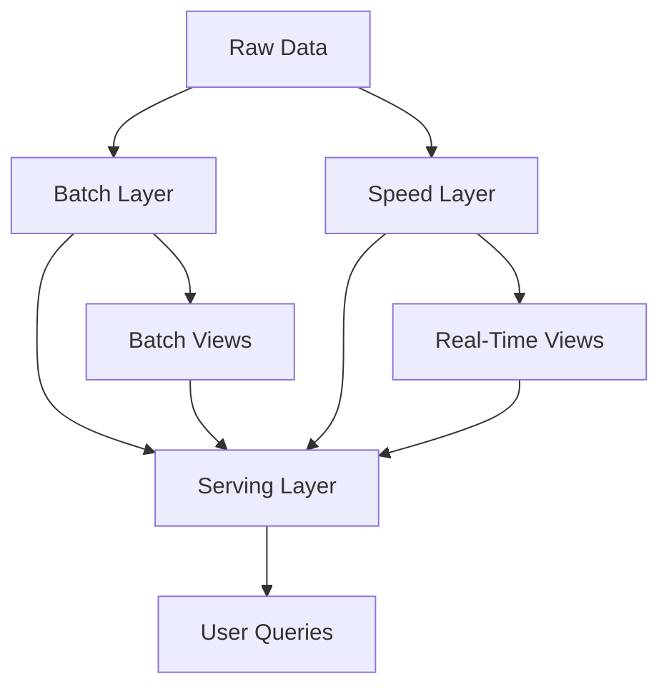

## 17.1.6.1 Implementing Lambda Architecture

The Lambda Architecture is a robust framework designed to handle massive quantities of data by leveraging both batch and real-time processing capabilities. This architecture is particularly beneficial for systems that require the processing of large-scale data with low latency. Apache Kafka plays a pivotal role in the Lambda Architecture, especially in the speed layer, facilitating real-time data processing. This section will delve into the components of the Lambda Architecture, demonstrate how Kafka integrates with other big data technologies like Hadoop and Spark, and discuss the challenges and considerations involved in maintaining such a system.

### Understanding the Lambda Architecture

The Lambda Architecture is composed of three main layers:

1. **Batch Layer**: Responsible for managing the master dataset and pre-computing batch views.
2. **Speed Layer**: Handles real-time data processing to provide low-latency updates.
3. **Serving Layer**: Merges results from the batch and speed layers to provide a comprehensive view of the data.

#### Batch Layer

The batch layer is the foundation of the Lambda Architecture. It stores the immutable, append-only raw data and computes batch views from this data. Technologies like Hadoop and Apache Spark are often used in this layer due to their ability to process large datasets efficiently.

- **Data Storage**: The batch layer stores the raw data in a distributed file system, such as HDFS (Hadoop Distributed File System).
- **Batch Processing**: Tools like Apache Spark or MapReduce are used to process the data and generate batch views that are then stored in a database for querying.

#### Speed Layer

The speed layer is designed to process data in real-time, providing low-latency updates. Apache Kafka is a critical component in this layer, acting as a real-time data pipeline.

- **Data Ingestion**: Kafka ingests data streams in real-time, allowing for immediate processing.
- **Real-Time Processing**: Stream processing frameworks like Apache Flink or Kafka Streams can be used to process data in real-time, updating views that reflect the most recent data.

#### Serving Layer

The serving layer is responsible for merging the results from the batch and speed layers, providing a unified view of the data.

- **Data Querying**: The serving layer uses databases like Apache HBase or Cassandra to store and query the merged data views.
- **Data Consistency**: Ensures that the data from both the batch and speed layers are synchronized and consistent.

### Implementing the Speed Layer with Kafka

Apache Kafka is integral to the speed layer of the Lambda Architecture. It provides a distributed, fault-tolerant, and scalable messaging system that can handle high-throughput data streams.

#### Kafka's Role in Real-Time Data Processing

- **Stream Ingestion**: Kafka acts as a buffer that ingests real-time data streams, ensuring that data is available for immediate processing.
- **Scalability**: Kafka's distributed architecture allows it to scale horizontally, handling large volumes of data with ease.
- **Fault Tolerance**: Kafka's replication mechanism ensures data durability and fault tolerance, making it a reliable choice for real-time processing.

#### Integrating Kafka with Stream Processing Frameworks

Kafka can be integrated with various stream processing frameworks to implement the speed layer:

- **Kafka Streams**: A lightweight library that allows for real-time processing of data streams directly within Kafka.
- **Apache Flink**: A powerful stream processing framework that can process data in real-time, offering features like event-time processing and stateful computations.

### Batch Processing with Hadoop and Spark

The batch layer of the Lambda Architecture typically involves processing large datasets using Hadoop or Spark.

#### Hadoop Integration

- **HDFS**: Stores the raw data in a distributed manner, allowing for efficient batch processing.
- **MapReduce**: Processes the data in parallel, generating batch views that can be queried by the serving layer.

#### Spark Integration

- **Spark Core**: Provides fast and general-purpose cluster computing for batch processing.
- **Spark SQL**: Allows for querying batch views using SQL-like syntax, integrating seamlessly with the serving layer.

### Data Synchronization and Consistency

One of the key challenges in implementing the Lambda Architecture is ensuring data synchronization and consistency between the batch and speed layers.

#### Strategies for Data Consistency

- **Data Deduplication**: Ensures that duplicate data is not processed, maintaining consistency across layers.
- **Idempotent Operations**: Guarantees that operations can be applied multiple times without changing the result, crucial for maintaining consistency in the speed layer.

#### Synchronizing Batch and Real-Time Views

- **Data Merging**: The serving layer merges batch and real-time views, ensuring that queries reflect the most up-to-date data.
- **Consistency Models**: Implementing consistency models like eventual consistency or strong consistency to manage data synchronization.

### Considerations for Complexity and Maintenance

Implementing the Lambda Architecture involves several complexities and maintenance challenges:

- **System Complexity**: Managing multiple layers and ensuring seamless integration can be complex and requires careful planning.
- **Maintenance Overhead**: Regular maintenance is required to ensure data consistency, fault tolerance, and system performance.
- **Scalability**: As data volumes grow, the system must be able to scale efficiently without compromising performance.

### Sample Code Snippets

Below are sample code snippets demonstrating how to implement components of the Lambda Architecture using Kafka and other big data technologies.

#### Java Example: Kafka Producer for Real-Time Data Ingestion

```java
import org.apache.kafka.clients.producer.KafkaProducer;
import org.apache.kafka.clients.producer.ProducerRecord;
import java.util.Properties;

public class RealTimeDataProducer {
    public static void main(String[] args) {
        Properties props = new Properties();
        props.put("bootstrap.servers", "localhost:9092");
        props.put("key.serializer", "org.apache.kafka.common.serialization.StringSerializer");
        props.put("value.serializer", "org.apache.kafka.common.serialization.StringSerializer");

        KafkaProducer<String, String> producer = new KafkaProducer<>(props);
        for (int i = 0; i < 100; i++) {
            producer.send(new ProducerRecord<>("real-time-topic", Integer.toString(i), "message-" + i));
        }
        producer.close();
    }
}
```

#### Scala Example: Spark Batch Processing

```scala
import org.apache.spark.sql.SparkSession

object BatchProcessing {
  def main(args: Array[String]): Unit = {
    val spark = SparkSession.builder
      .appName("Batch Processing")
      .master("local")
      .getOrCreate()

    val data = spark.read.textFile("hdfs://localhost:9000/data/raw-data.txt")
    val processedData = data.map(line => line.toUpperCase)
    processedData.write.text("hdfs://localhost:9000/data/batch-output")
  }
}
```

#### Kotlin Example: Kafka Streams for Real-Time Processing

```kotlin
import org.apache.kafka.streams.KafkaStreams
import org.apache.kafka.streams.StreamsBuilder
import org.apache.kafka.streams.kstream.KStream
import java.util.Properties

fun main() {
    val props = Properties()
    props["application.id"] = "real-time-processing"
    props["bootstrap.servers"] = "localhost:9092"

    val builder = StreamsBuilder()
    val source: KStream<String, String> = builder.stream("real-time-topic")
    source.mapValues { value -> value.toUpperCase() }
          .to("processed-topic")

    val streams = KafkaStreams(builder.build(), props)
    streams.start()
}
```

#### Clojure Example: Kafka Consumer for Real-Time Data

```clojure
(ns real-time-consumer
  (:require [clojure.java.io :as io])
  (:import [org.apache.kafka.clients.consumer KafkaConsumer]
           [java.util Properties]))

(defn -main []
  (let [props (doto (Properties.)
                (.put "bootstrap.servers" "localhost:9092")
                (.put "group.id" "real-time-group")
                (.put "key.deserializer" "org.apache.kafka.common.serialization.StringDeserializer")
                (.put "value.deserializer" "org.apache.kafka.common.serialization.StringDeserializer"))
        consumer (KafkaConsumer. props)]
    (.subscribe consumer ["real-time-topic"])
    (while true
      (let [records (.poll consumer 100)]
        (doseq [record records]
          (println "Received message:" (.value record)))))))
```

### Visualizing the Lambda Architecture

To better understand the Lambda Architecture, let's visualize its components and data flow.



**Diagram Explanation**: This diagram illustrates the flow of data through the Lambda Architecture. Raw data is ingested into both the batch and speed layers. The batch layer processes the data to create batch views, while the speed layer provides real-time views. Both views are merged in the serving layer to provide comprehensive data for user queries.

### Sample Use Cases

- **Fraud Detection**: Real-time processing in the speed layer can detect fraudulent transactions as they occur, while the batch layer analyzes historical data for patterns.
- **Recommendation Systems**: The speed layer provides immediate recommendations based on user interactions, while the batch layer refines the recommendation model using historical data.

### Related Patterns

- **Kappa Architecture**: An alternative to the Lambda Architecture that simplifies the system by using a single stream processing layer. For more details, refer to [17.1.6.2 Kappa Architecture Overview]( "Kappa Architecture Overview").
- **CQRS (Command Query Responsibility Segregation)**: Separates read and write operations, which can be integrated with the Lambda Architecture for efficient data handling. See [9.4 Command Query Responsibility Segregation (CQRS)]( "CQRS").

### Conclusion

Implementing the Lambda Architecture with Apache Kafka provides a powerful framework for handling both batch and real-time data processing. By leveraging Kafka's capabilities in the speed layer, along with batch processing tools like Hadoop and Spark, organizations can build scalable, fault-tolerant systems that deliver comprehensive data insights. However, the complexity and maintenance overhead of the Lambda Architecture should be carefully considered, and appropriate strategies should be implemented to ensure data consistency and system performance.

## Test Your Knowledge: Implementing Lambda Architecture with Kafka



### What are the three main layers of the Lambda Architecture?

- [x] Batch Layer, Speed Layer, Serving Layer
- [ ] Data Layer, Processing Layer, Query Layer
- [ ] Ingestion Layer, Processing Layer, Output Layer
- [ ] Storage Layer, Compute Layer, Presentation Layer

> **Explanation:** The Lambda Architecture consists of the Batch Layer, Speed Layer, and Serving Layer, each serving a distinct purpose in data processing.

### How does Kafka facilitate the speed layer in the Lambda Architecture?

- [x] By providing real-time data ingestion and processing
- [ ] By storing batch views for querying
- [ ] By merging batch and real-time views
- [ ] By handling data deduplication

> **Explanation:** Kafka is used in the speed layer for real-time data ingestion and processing, enabling low-latency updates.

### Which technology is commonly used for batch processing in the Lambda Architecture?

- [x] Apache Spark
- [ ] Kafka Streams
- [ ] Apache Flink
- [ ] Apache NiFi

> **Explanation:** Apache Spark is commonly used for batch processing due to its efficient handling of large datasets.

### What is a key challenge in implementing the Lambda Architecture?

- [x] Ensuring data synchronization and consistency between layers
- [ ] Handling small data volumes
- [ ] Implementing real-time processing
- [ ] Managing user queries

> **Explanation:** A key challenge is ensuring data synchronization and consistency between the batch and speed layers.

### Which of the following is a strategy for maintaining data consistency in the Lambda Architecture?

- [x] Idempotent Operations
- [ ] Real-Time Processing
- [x] Data Deduplication
- [ ] Batch Processing

> **Explanation:** Idempotent operations and data deduplication are strategies to maintain data consistency across layers.

### What role does the serving layer play in the Lambda Architecture?

- [x] Merging batch and real-time views for querying
- [ ] Processing real-time data streams
- [ ] Storing raw data
- [ ] Handling data ingestion

> **Explanation:** The serving layer merges batch and real-time views, providing a unified data view for querying.

### Which of the following is a benefit of using Kafka in the Lambda Architecture?

- [x] Scalability and fault tolerance
- [ ] Simplified batch processing
- [x] Real-time data ingestion
- [ ] Reduced system complexity

> **Explanation:** Kafka offers scalability, fault tolerance, and real-time data ingestion, making it ideal for the speed layer.

### What is the primary purpose of the batch layer in the Lambda Architecture?

- [x] Managing the master dataset and pre-computing batch views
- [ ] Processing real-time data streams
- [ ] Merging data views for querying
- [ ] Handling user queries

> **Explanation:** The batch layer manages the master dataset and pre-computes batch views for querying.

### How can the complexity of the Lambda Architecture be managed?

- [x] By implementing appropriate strategies for data consistency and system performance
- [ ] By reducing the number of layers
- [ ] By using only real-time processing
- [ ] By eliminating the serving layer

> **Explanation:** Managing complexity involves implementing strategies for data consistency and system performance.

### True or False: The Lambda Architecture is suitable for systems requiring low-latency data processing.

- [x] True
- [ ] False

> **Explanation:** The Lambda Architecture is designed to handle both batch and real-time data processing, providing low-latency updates.


