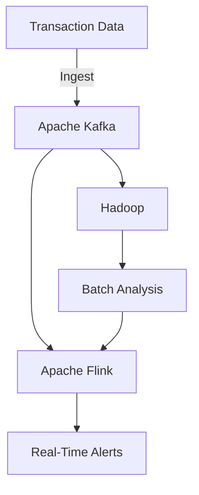
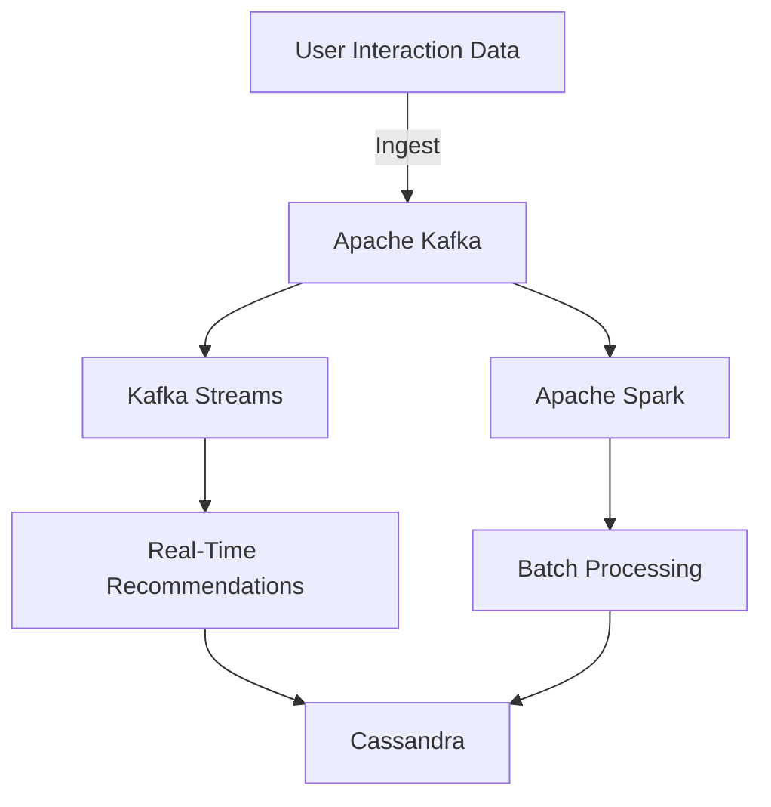
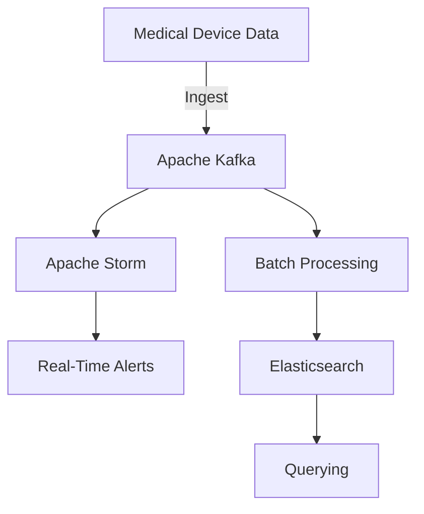

## 17.1.6.3 Case Studies and Examples

In this section, we delve into real-world implementations of Lambda and Kappa Architectures using Apache Kafka, focusing on industries such as finance and e-commerce. These case studies highlight the business problems addressed by these architectures, the technical stack and integration points, and the lessons learned and best practices derived from these implementations.

### Introduction to Lambda and Kappa Architectures

Before diving into the case studies, it's crucial to understand the core concepts of Lambda and Kappa Architectures. Both architectures aim to process large volumes of data efficiently, but they differ in their approach to handling batch and real-time data.

- **Lambda Architecture**: This architecture is designed to handle massive quantities of data by using both batch and stream processing methods. It consists of three layers: batch, speed, and serving. The batch layer processes data in large volumes, the speed layer handles real-time data, and the serving layer provides the processed data for querying.

- **Kappa Architecture**: Unlike Lambda, Kappa Architecture simplifies the data processing by using a single stream processing engine. It processes data in real-time and is often used when the batch layer is not necessary. This architecture is ideal for scenarios where data is continuously flowing and needs to be processed in real-time.

### Case Study 1: Financial Services - Real-Time Fraud Detection

#### Business Problem

In the financial services industry, detecting fraudulent transactions in real-time is critical to prevent financial losses and protect customers. Traditional batch processing methods were insufficient due to the latency involved in detecting fraud.

#### Technical Stack and Integration Points

- **Apache Kafka**: Used as the central data streaming platform to ingest and process transaction data in real-time.
- **Apache Flink**: Employed for real-time stream processing, enabling the detection of fraudulent patterns as transactions occur.
- **Hadoop**: Utilized for batch processing and historical data analysis.
- **Kafka Connect**: Integrated with various data sources, including databases and third-party APIs, to ensure seamless data flow into Kafka.

#### Implementation

The financial institution implemented a Lambda Architecture to leverage both batch and real-time processing capabilities. Kafka served as the backbone for data ingestion, with Flink handling the speed layer for real-time fraud detection. Hadoop was used for the batch layer to analyze historical data and refine fraud detection models.

*Diagram 1: Lambda Architecture for Real-Time Fraud Detection*

#### Lessons Learned and Best Practices

- **Scalability**: Kafka's ability to handle high throughput was crucial for processing large volumes of transaction data.
- **Latency Reduction**: By using Flink for stream processing, the institution achieved significant latency reduction, enabling near-instantaneous fraud detection.
- **Model Refinement**: Historical data analysis in Hadoop allowed for continuous improvement of fraud detection models.

### Case Study 2: E-commerce - Personalized Recommendations

#### Business Problem

An e-commerce company sought to enhance customer experience by providing personalized product recommendations in real-time. The challenge was to process user interaction data quickly and efficiently to deliver timely recommendations.

#### Technical Stack and Integration Points

- **Apache Kafka**: Centralized data streaming platform for collecting user interaction data.
- **Apache Spark**: Used for both batch and stream processing to generate recommendations.
- **Cassandra**: NoSQL database for storing user profiles and recommendation data.
- **Kafka Streams**: Employed for real-time processing of user interaction data.

#### Implementation

The company adopted a Kappa Architecture to streamline the processing of user interaction data. Kafka Streams was used to process data in real-time, while Spark handled both batch and stream processing tasks. Cassandra served as the storage layer for user profiles and recommendations.

*Diagram 2: Kappa Architecture for Personalized Recommendations*

#### Lessons Learned and Best Practices

- **Real-Time Processing**: Kafka Streams provided the necessary real-time processing capabilities to deliver timely recommendations.
- **Data Consistency**: Using a single processing engine (Spark) for both batch and stream processing ensured data consistency across the system.
- **Scalable Storage**: Cassandra's scalability allowed for efficient storage and retrieval of large volumes of recommendation data.

### Case Study 3: Healthcare - Real-Time Patient Monitoring

#### Business Problem

In the healthcare industry, monitoring patient vitals in real-time is essential for timely interventions. The challenge was to process data from various medical devices and sensors in real-time to alert healthcare providers of any anomalies.

#### Technical Stack and Integration Points

- **Apache Kafka**: Used for ingesting and streaming data from medical devices.
- **Apache Storm**: Employed for real-time stream processing of patient data.
- **Elasticsearch**: Utilized for indexing and querying patient data.
- **Kafka Connect**: Integrated with medical devices and IoT platforms for seamless data ingestion.

#### Implementation

The healthcare provider implemented a Lambda Architecture to process patient data in real-time. Kafka served as the data streaming platform, with Storm handling the speed layer for real-time processing. Elasticsearch was used for indexing and querying patient data.

*Diagram 3: Lambda Architecture for Real-Time Patient Monitoring*

#### Lessons Learned and Best Practices

- **Integration with IoT**: Kafka Connect facilitated seamless integration with various medical devices and IoT platforms.
- **Real-Time Alerts**: Storm's real-time processing capabilities enabled timely alerts for healthcare providers.
- **Scalable Querying**: Elasticsearch provided efficient indexing and querying of large volumes of patient data.

### Conclusion

These case studies demonstrate the versatility and effectiveness of Lambda and Kappa Architectures in addressing complex business problems across various industries. By leveraging Apache Kafka as the central data streaming platform, organizations can achieve real-time data processing and analytics, leading to improved decision-making and enhanced customer experiences.

### Key Takeaways

- **Choose the Right Architecture**: Select Lambda Architecture when both batch and real-time processing are required. Opt for Kappa Architecture when real-time processing is the primary focus.
- **Leverage Kafka's Scalability**: Use Kafka to handle high throughput and ensure seamless data ingestion and processing.
- **Integrate with the Right Tools**: Choose the appropriate stream processing and storage tools based on the specific requirements of your use case.
- **Continuously Improve Models**: Use historical data analysis to refine models and improve the accuracy of real-time processing.

### References and Further Reading

- [Apache Kafka Documentation](https://kafka.apache.org/documentation/)
- [Confluent Documentation](https://docs.confluent.io/)
- [Apache Flink Documentation](https://flink.apache.org/)
- [Apache Spark Documentation](https://spark.apache.org/)
- [Apache Storm Documentation](https://storm.apache.org/)
- [Elasticsearch Documentation](https://www.elastic.co/guide/en/elasticsearch/reference/current/index.html)

## Test Your Knowledge: Real-World Implementations of Lambda and Kappa Architectures with Kafka



### What is the primary difference between Lambda and Kappa Architectures?

- [x] Lambda Architecture uses both batch and stream processing, while Kappa Architecture uses only stream processing.
- [ ] Lambda Architecture is used for small data sets, while Kappa Architecture is for big data.
- [ ] Lambda Architecture is more suitable for real-time processing than Kappa Architecture.
- [ ] Kappa Architecture requires more hardware resources than Lambda Architecture.

> **Explanation:** Lambda Architecture combines batch and stream processing, while Kappa Architecture focuses solely on stream processing.

### Which industry is highlighted for using Lambda Architecture for real-time fraud detection?

- [x] Financial Services
- [ ] E-commerce
- [ ] Healthcare
- [ ] Manufacturing

> **Explanation:** The financial services industry uses Lambda Architecture for real-time fraud detection to process transaction data efficiently.

### In the e-commerce case study, which technology is used for real-time processing of user interaction data?

- [x] Kafka Streams
- [ ] Apache Flink
- [ ] Apache Storm
- [ ] Hadoop

> **Explanation:** Kafka Streams is used for real-time processing of user interaction data in the e-commerce case study.

### What is the role of Apache Kafka in the healthcare case study?

- [x] Ingesting and streaming data from medical devices
- [ ] Storing patient data
- [ ] Analyzing historical patient data
- [ ] Generating patient reports

> **Explanation:** Apache Kafka is used for ingesting and streaming data from medical devices in the healthcare case study.

### Which database is used for storing user profiles and recommendation data in the e-commerce case study?

- [x] Cassandra
- [ ] MySQL
- [ ] PostgreSQL
- [ ] MongoDB

> **Explanation:** Cassandra is used for storing user profiles and recommendation data in the e-commerce case study.

### What is a key benefit of using Elasticsearch in the healthcare case study?

- [x] Efficient indexing and querying of patient data
- [ ] Real-time processing of patient data
- [ ] Storing large volumes of patient data
- [ ] Generating patient alerts

> **Explanation:** Elasticsearch provides efficient indexing and querying of patient data in the healthcare case study.

### Which stream processing tool is used in the financial services case study for real-time fraud detection?

- [x] Apache Flink
- [ ] Apache Storm
- [ ] Kafka Streams
- [ ] Apache Spark

> **Explanation:** Apache Flink is used for real-time fraud detection in the financial services case study.

### What is a common challenge addressed by both Lambda and Kappa Architectures?

- [x] Real-time data processing
- [ ] Data storage
- [ ] Data visualization
- [ ] Data backup

> **Explanation:** Both Lambda and Kappa Architectures address the challenge of real-time data processing.

### In the e-commerce case study, what is the primary goal of using Kappa Architecture?

- [x] Delivering personalized product recommendations in real-time
- [ ] Storing large volumes of user data
- [ ] Analyzing historical sales data
- [ ] Generating sales reports

> **Explanation:** The primary goal of using Kappa Architecture in the e-commerce case study is to deliver personalized product recommendations in real-time.

### True or False: Kappa Architecture is more complex than Lambda Architecture because it requires both batch and stream processing.

- [ ] True
- [x] False

> **Explanation:** False. Kappa Architecture is simpler than Lambda Architecture because it uses only stream processing, eliminating the need for a separate batch layer.


