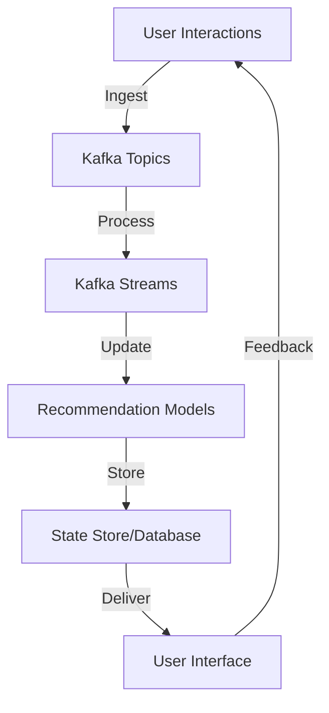

## 17.1.7.2 Real-Time Recommendation Engines

Real-time recommendation engines have become a cornerstone of modern digital experiences, providing personalized content and enhancing user engagement. By leveraging Apache Kafka and Kafka Streams, organizations can build scalable, efficient, and responsive recommendation systems that process user interactions in real-time. This section explores the architecture of real-time recommendation engines, the role of Kafka Streams in processing data, suitable algorithms for streaming recommendations, and considerations for scalability, freshness, and ethical data handling.

### Architecture of Real-Time Recommendation Engines

Real-time recommendation engines are designed to process continuous streams of user interactions and update recommendation models dynamically. The architecture typically involves several key components:

1. **Data Ingestion**: User interactions, such as clicks, views, and purchases, are captured and ingested into Kafka topics. This data serves as the foundation for generating recommendations.

2. **Stream Processing**: Kafka Streams processes the ingested data in real-time, applying algorithms to generate recommendations. This involves filtering, aggregating, and transforming data streams.

3. **Model Update and Storage**: The recommendation models are updated continuously based on the processed data. These models can be stored in a distributed database or a state store for quick access.

4. **Recommendation Delivery**: The generated recommendations are delivered to users through various channels, such as web applications, mobile apps, or email.

5. **Feedback Loop**: User feedback on recommendations is captured and fed back into the system to refine and improve the models.



*Diagram: Architecture of a Real-Time Recommendation Engine using Kafka Streams.*

### Kafka Streams for Real-Time Processing

Kafka Streams is a powerful library for building real-time applications and microservices. It allows developers to process data streams from Kafka topics with ease, providing capabilities such as stateful processing, windowing, and joins. In the context of recommendation engines, Kafka Streams can be used to:

- **Aggregate User Interactions**: Collect and aggregate user interactions over time to identify patterns and preferences.
- **Apply Filtering and Transformation**: Filter relevant data and transform it into a format suitable for recommendation algorithms.
- **Maintain State**: Use state stores to keep track of user profiles, item metadata, and other necessary information for generating recommendations.
- **Perform Real-Time Model Updates**: Continuously update recommendation models based on the latest data.

#### Example: Collaborative Filtering with Kafka Streams

Collaborative filtering is a popular algorithm for recommendation systems, leveraging the preferences of similar users to generate recommendations. Here's how you can implement a simple collaborative filtering system using Kafka Streams in Java:

```java
import org.apache.kafka.streams.KafkaStreams;
import org.apache.kafka.streams.StreamsBuilder;
import org.apache.kafka.streams.kstream.KStream;
import org.apache.kafka.streams.kstream.KTable;
import org.apache.kafka.streams.kstream.Materialized;
import org.apache.kafka.streams.kstream.Produced;
import org.apache.kafka.streams.state.KeyValueStore;

public class CollaborativeFiltering {

    public static void main(String[] args) {
        StreamsBuilder builder = new StreamsBuilder();

        // Stream of user interactions
        KStream<String, String> interactions = builder.stream("user-interactions");

        // Aggregate interactions by user
        KTable<String, Long> userPreferences = interactions
                .groupBy((key, value) -> value.split(",")[0]) // Assuming value format "userId,itemId"
                .count(Materialized.<String, Long, KeyValueStore<Bytes, byte[]>>as("user-preferences-store"));

        // Generate recommendations based on user preferences
        userPreferences.toStream().to("recommendations", Produced.with(Serdes.String(), Serdes.Long()));

        KafkaStreams streams = new KafkaStreams(builder.build(), new StreamsConfig(getProperties()));
        streams.start();
    }

    private static Properties getProperties() {
        Properties props = new Properties();
        props.put(StreamsConfig.APPLICATION_ID_CONFIG, "collaborative-filtering-app");
        props.put(StreamsConfig.BOOTSTRAP_SERVERS_CONFIG, "localhost:9092");
        props.put(StreamsConfig.DEFAULT_KEY_SERDE_CLASS_CONFIG, Serdes.String().getClass());
        props.put(StreamsConfig.DEFAULT_VALUE_SERDE_CLASS_CONFIG, Serdes.String().getClass());
        return props;
    }
}
```

*Java code example implementing a simple collaborative filtering system using Kafka Streams.*

#### Considerations for Scalability and Freshness

When building real-time recommendation engines, it is crucial to consider scalability and the freshness of recommendations:

- **Scalability**: Ensure that the system can handle a high volume of data and user interactions. Kafka's distributed architecture and Kafka Streams' parallel processing capabilities can help achieve this.

- **Freshness**: Recommendations should be updated frequently to reflect the latest user interactions. This requires efficient stream processing and model update mechanisms.

- **Response Times**: Minimize latency in delivering recommendations to enhance user experience. This involves optimizing Kafka Streams processing and ensuring low-latency data access.

### Algorithms for Streaming Recommendations

Several algorithms are suitable for real-time recommendation engines, each with its strengths and trade-offs:

1. **Collaborative Filtering**: Utilizes user-item interactions to recommend items based on similar users' preferences. It can be implemented using matrix factorization or nearest-neighbor techniques.

2. **Content-Based Filtering**: Recommends items similar to those a user has liked in the past, based on item attributes. This approach requires maintaining item metadata and user profiles.

3. **Hybrid Approaches**: Combine collaborative and content-based filtering to leverage the strengths of both methods.

4. **Graph-Based Algorithms**: Use graph processing techniques to model relationships between users and items, enabling complex recommendation scenarios.

#### Example: Graph-Based Recommendations with Kafka Streams

Graph-based algorithms can be implemented using Kafka Streams to model user-item interactions as a graph. Here's a simple example in Scala:

```scala
import org.apache.kafka.streams.scala._
import org.apache.kafka.streams.scala.kstream._
import org.apache.kafka.streams.scala.ImplicitConversions._
import org.apache.kafka.streams.scala.Serdes._

object GraphBasedRecommendations {

  def main(args: Array[String]): Unit = {
    val builder = new StreamsBuilder()

    // Stream of user interactions
    val interactions: KStream[String, String] = builder.stream[String, String]("user-interactions")

    // Create a graph of user-item interactions
    val userItemGraph: KTable[String, Set[String]] = interactions
      .groupBy((key, value) => value.split(",")(0)) // Assuming value format "userId,itemId"
      .aggregate(Set.empty[String])((_, newValue, aggValue) => aggValue + newValue.split(",")(1))

    // Generate recommendations based on the graph
    userItemGraph.toStream.to("recommendations")

    val streams = new KafkaStreams(builder.build(), getProperties)
    streams.start()
  }

  def getProperties: Properties = {
    val props = new Properties()
    props.put(StreamsConfig.APPLICATION_ID_CONFIG, "graph-based-recommendations")
    props.put(StreamsConfig.BOOTSTRAP_SERVERS_CONFIG, "localhost:9092")
    props
  }
}
```

*Scala code example implementing a graph-based recommendation system using Kafka Streams.*

### Data Privacy and Ethical Considerations

Real-time recommendation engines must adhere to data privacy regulations and ethical standards. Consider the following:

- **Data Anonymization**: Ensure that user data is anonymized and cannot be traced back to individual users.

- **User Consent**: Obtain explicit consent from users before collecting and processing their data.

- **Bias and Fairness**: Implement mechanisms to detect and mitigate bias in recommendations, ensuring fairness and inclusivity.

- **Transparency**: Provide users with insights into how recommendations are generated and allow them to control their data usage.

### Conclusion

Building real-time recommendation engines with Kafka Streams offers a powerful solution for delivering personalized content dynamically. By leveraging the capabilities of Kafka Streams, organizations can process user interactions in real-time, update recommendation models efficiently, and deliver fresh and relevant recommendations. However, it is essential to consider scalability, response times, and ethical data handling to ensure a successful implementation.

## Test Your Knowledge: Real-Time Recommendation Engines with Kafka Streams



### What is the primary role of Kafka Streams in a real-time recommendation engine?

- [x] Processing user interactions in real-time
- [ ] Storing user data
- [ ] Delivering recommendations to users
- [ ] Managing user profiles

> **Explanation:** Kafka Streams is used to process user interactions in real-time, applying algorithms to generate recommendations.

### Which algorithm is commonly used for collaborative filtering in recommendation systems?

- [x] Matrix factorization
- [ ] Decision trees
- [ ] K-means clustering
- [ ] Linear regression

> **Explanation:** Matrix factorization is a popular technique for collaborative filtering, leveraging user-item interactions to generate recommendations.

### What is a key consideration for ensuring the freshness of recommendations?

- [x] Frequent updates to recommendation models
- [ ] Storing recommendations in a database
- [ ] Using batch processing
- [ ] Increasing data retention periods

> **Explanation:** Frequent updates to recommendation models ensure that recommendations reflect the latest user interactions.

### How can data privacy be maintained in real-time recommendation engines?

- [x] Anonymizing user data
- [ ] Storing user data indefinitely
- [ ] Sharing user data with third parties
- [ ] Disabling user consent mechanisms

> **Explanation:** Anonymizing user data helps maintain privacy by preventing it from being traced back to individual users.

### What is a benefit of using graph-based algorithms for recommendations?

- [x] Modeling complex relationships between users and items
- [ ] Simplifying data storage
- [ ] Reducing computational complexity
- [ ] Eliminating the need for user data

> **Explanation:** Graph-based algorithms can model complex relationships between users and items, enabling more sophisticated recommendations.

### Which of the following is a hybrid approach in recommendation systems?

- [x] Combining collaborative and content-based filtering
- [ ] Using only collaborative filtering
- [ ] Using only content-based filtering
- [ ] Relying solely on user feedback

> **Explanation:** A hybrid approach combines collaborative and content-based filtering to leverage the strengths of both methods.

### What is the purpose of a feedback loop in a recommendation engine?

- [x] Refining and improving recommendation models
- [ ] Delivering recommendations to users
- [ ] Storing user interactions
- [ ] Managing user profiles

> **Explanation:** A feedback loop captures user feedback on recommendations to refine and improve the models.

### How can Kafka Streams help in maintaining state for recommendation engines?

- [x] Using state stores to track user profiles and item metadata
- [ ] Storing data in Kafka topics
- [ ] Delivering recommendations to users
- [ ] Managing user interactions

> **Explanation:** Kafka Streams can use state stores to maintain state, such as user profiles and item metadata, necessary for generating recommendations.

### What is a potential drawback of collaborative filtering?

- [x] Cold start problem for new users or items
- [ ] High computational complexity
- [ ] Lack of personalization
- [ ] Limited scalability

> **Explanation:** Collaborative filtering can suffer from the cold start problem, where new users or items lack sufficient interaction data for recommendations.

### True or False: Real-time recommendation engines should prioritize ethical data handling.

- [x] True
- [ ] False

> **Explanation:** Ethical data handling is crucial for maintaining user trust and complying with privacy regulations.


