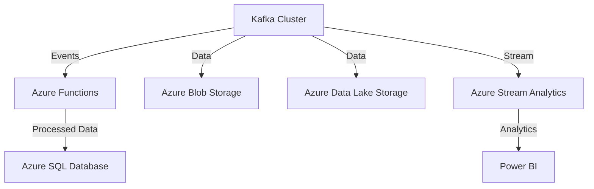

## 18.2.3 Integrating with Azure Services

### Introduction

Integrating Apache Kafka with Azure services unlocks a plethora of opportunities for building robust, scalable, and real-time data processing solutions. This section delves into the integration of Kafka with Azure Functions, Azure Storage, Azure Machine Learning, and Azure Stream Analytics. We will explore practical applications, provide code examples, and discuss architectural considerations for hybrid deployments.

### Real-Time Data Processing with Azure Functions

Azure Functions, a serverless compute service, allows you to execute code in response to events without managing infrastructure. When integrated with Kafka, Azure Functions can process real-time data streams efficiently.

#### Triggering Azure Functions with Kafka Events

To trigger Azure Functions with Kafka events, you can use the Kafka trigger binding. This binding enables Azure Functions to consume messages from Kafka topics.

**Java Example:**

```java
import com.microsoft.azure.functions.annotation.*;
import com.microsoft.azure.functions.*;

public class KafkaFunction {
    @FunctionName("KafkaTriggerFunction")
    public void run(
        @KafkaTrigger(
            name = "kafkaTrigger",
            topic = "my-topic",
            brokerList = "localhost:9092",
            consumerGroup = "my-consumer-group"
        ) String kafkaMessage,
        final ExecutionContext context
    ) {
        context.getLogger().info("Kafka message received: " + kafkaMessage);
        // Process the message
    }
}
```

**Scala Example:**

```scala
import com.microsoft.azure.functions.annotation._
import com.microsoft.azure.functions._

class KafkaFunction {
  @FunctionName("KafkaTriggerFunction")
  def run(
    @KafkaTrigger(
      name = "kafkaTrigger",
      topic = "my-topic",
      brokerList = "localhost:9092",
      consumerGroup = "my-consumer-group"
    ) kafkaMessage: String,
    context: ExecutionContext
  ): Unit = {
    context.getLogger.info("Kafka message received: " + kafkaMessage)
    // Process the message
  }
}
```

**Kotlin Example:**

```kotlin
import com.microsoft.azure.functions.annotation.*
import com.microsoft.azure.functions.*

class KafkaFunction {
    @FunctionName("KafkaTriggerFunction")
    fun run(
        @KafkaTrigger(
            name = "kafkaTrigger",
            topic = "my-topic",
            brokerList = "localhost:9092",
            consumerGroup = "my-consumer-group"
        ) kafkaMessage: String,
        context: ExecutionContext
    ) {
        context.logger.info("Kafka message received: $kafkaMessage")
        // Process the message
    }
}
```

**Clojure Example:**

```clojure
(ns kafka-function
  (:import [com.microsoft.azure.functions.annotation FunctionName KafkaTrigger]
           [com.microsoft.azure.functions ExecutionContext]))

(defn -run
  [^KafkaTrigger kafkaMessage ^ExecutionContext context]
  (.info (.getLogger context) (str "Kafka message received: " kafkaMessage))
  ;; Process the message
  )
```

### Storing Kafka Data in Azure Storage

Azure Blob Storage and Azure Data Lake Storage are ideal for storing large volumes of Kafka data. They provide scalable, secure, and cost-effective storage solutions.

#### Using Azure Blob Storage

Azure Blob Storage can be used to store Kafka data for archival, batch processing, or analytics.

**Java Example:**

```java
import com.azure.storage.blob.*;
import com.azure.storage.blob.models.*;

public class BlobStorageExample {
    public static void main(String[] args) {
        String connectStr = "your_connection_string";
        BlobServiceClient blobServiceClient = new BlobServiceClientBuilder().connectionString(connectStr).buildClient();
        BlobContainerClient containerClient = blobServiceClient.getBlobContainerClient("my-container");

        BlobClient blobClient = containerClient.getBlobClient("my-blob");
        blobClient.uploadFromFile("path/to/kafka/data");
    }
}
```

**Scala Example:**

```scala
import com.azure.storage.blob._
import com.azure.storage.blob.models._

object BlobStorageExample extends App {
  val connectStr = "your_connection_string"
  val blobServiceClient = new BlobServiceClientBuilder().connectionString(connectStr).buildClient()
  val containerClient = blobServiceClient.getBlobContainerClient("my-container")

  val blobClient = containerClient.getBlobClient("my-blob")
  blobClient.uploadFromFile("path/to/kafka/data")
}
```

**Kotlin Example:**

```kotlin
import com.azure.storage.blob.*
import com.azure.storage.blob.models.*

fun main() {
    val connectStr = "your_connection_string"
    val blobServiceClient = BlobServiceClientBuilder().connectionString(connectStr).buildClient()
    val containerClient = blobServiceClient.getBlobContainerClient("my-container")

    val blobClient = containerClient.getBlobClient("my-blob")
    blobClient.uploadFromFile("path/to/kafka/data")
}
```

**Clojure Example:**

```clojure
(ns blob-storage-example
  (:import [com.azure.storage.blob BlobServiceClientBuilder]))

(defn upload-to-blob []
  (let [connect-str "your_connection_string"
        blob-service-client (-> (BlobServiceClientBuilder.)
                                (.connectionString connect-str)
                                .buildClient)
        container-client (.getBlobContainerClient blob-service-client "my-container")
        blob-client (.getBlobClient container-client "my-blob")]
    (.uploadFromFile blob-client "path/to/kafka/data")))
```

#### Using Azure Data Lake Storage

Azure Data Lake Storage is optimized for big data analytics and can handle large-scale data processing.

**Java Example:**

```java
import com.azure.storage.file.datalake.*;
import com.azure.storage.file.datalake.models.*;

public class DataLakeStorageExample {
    public static void main(String[] args) {
        String connectStr = "your_connection_string";
        DataLakeServiceClient dataLakeServiceClient = new DataLakeServiceClientBuilder().connectionString(connectStr).buildClient();
        DataLakeFileSystemClient fileSystemClient = dataLakeServiceClient.getFileSystemClient("my-filesystem");

        DataLakeFileClient fileClient = fileSystemClient.getFileClient("my-file");
        fileClient.uploadFromFile("path/to/kafka/data");
    }
}
```

**Scala Example:**

```scala
import com.azure.storage.file.datalake._
import com.azure.storage.file.datalake.models._

object DataLakeStorageExample extends App {
  val connectStr = "your_connection_string"
  val dataLakeServiceClient = new DataLakeServiceClientBuilder().connectionString(connectStr).buildClient()
  val fileSystemClient = dataLakeServiceClient.getFileSystemClient("my-filesystem")

  val fileClient = fileSystemClient.getFileClient("my-file")
  fileClient.uploadFromFile("path/to/kafka/data")
}
```

**Kotlin Example:**

```kotlin
import com.azure.storage.file.datalake.*
import com.azure.storage.file.datalake.models.*

fun main() {
    val connectStr = "your_connection_string"
    val dataLakeServiceClient = DataLakeServiceClientBuilder().connectionString(connectStr).buildClient()
    val fileSystemClient = dataLakeServiceClient.getFileSystemClient("my-filesystem")

    val fileClient = fileSystemClient.getFileClient("my-file")
    fileClient.uploadFromFile("path/to/kafka/data")
}
```

**Clojure Example:**

```clojure
(ns data-lake-storage-example
  (:import [com.azure.storage.file.datalake DataLakeServiceClientBuilder]))

(defn upload-to-data-lake []
  (let [connect-str "your_connection_string"
        data-lake-service-client (-> (DataLakeServiceClientBuilder.)
                                     (.connectionString connect-str)
                                     .buildClient)
        file-system-client (.getFileSystemClient data-lake-service-client "my-filesystem")
        file-client (.getFileClient file-system-client "my-file")]
    (.uploadFromFile file-client "path/to/kafka/data")))
```

### Integration with Azure Stream Analytics

Azure Stream Analytics is a real-time analytics service that can process and analyze data streams from Kafka.

#### Setting Up Azure Stream Analytics

To integrate Kafka with Azure Stream Analytics, you need to set up an input source in Stream Analytics that connects to your Kafka topic.

**Steps:**

1. **Create a Stream Analytics Job**: In the Azure portal, create a new Stream Analytics job.

2. **Add an Input**: Configure the input to connect to your Kafka topic. Specify the broker list, topic name, and consumer group.

3. **Define a Query**: Use Stream Analytics Query Language to define how the data should be processed.

4. **Add an Output**: Configure the output to send processed data to a destination like Azure Blob Storage, SQL Database, or Power BI.

**Example Query:**

```sql
SELECT
    System.Timestamp AS EventTime,
    COUNT(*) AS MessageCount
FROM
    KafkaInput TIMESTAMP BY EventTime
GROUP BY
    TumblingWindow(minute, 1)
```

### Considerations for Hybrid Architectures

Integrating Kafka with Azure services often involves hybrid architectures, where on-premises resources interact with cloud services.

#### Key Considerations:

- **Network Connectivity**: Ensure secure and reliable network connectivity between on-premises Kafka clusters and Azure services. Use VPN or ExpressRoute for secure connections.

- **Data Latency**: Consider data latency when designing hybrid architectures. Use Azure Event Hubs or Azure IoT Hub for low-latency data ingestion.

- **Security**: Implement robust security measures, including encryption and authentication, to protect data in transit and at rest.

- **Scalability**: Design for scalability by leveraging Azure's auto-scaling capabilities and distributed architecture.

- **Compliance**: Ensure compliance with data sovereignty and regulatory requirements when transferring data across regions.

### Visualizing Kafka and Azure Integration

To better understand the integration of Kafka with Azure services, consider the following architecture diagram:



**Diagram Description**: This diagram illustrates a typical integration scenario where a Kafka cluster sends events to Azure Functions for processing, stores data in Azure Blob Storage and Data Lake Storage, and streams data to Azure Stream Analytics for real-time analytics. Processed data can be stored in Azure SQL Database and visualized using Power BI.

### Conclusion

Integrating Apache Kafka with Azure services provides a powerful platform for building real-time data processing solutions. By leveraging Azure Functions, Azure Storage, Azure Machine Learning, and Azure Stream Analytics, you can create scalable, efficient, and secure architectures that meet the demands of modern data-driven applications.

## Test Your Knowledge: Integrating Apache Kafka with Azure Services Quiz



### What is the primary benefit of using Azure Functions with Kafka?

- [x] Serverless execution of code in response to Kafka events
- [ ] Improved data storage capabilities
- [ ] Enhanced data visualization
- [ ] Increased data security

> **Explanation:** Azure Functions allow for serverless execution of code, enabling real-time processing of Kafka events without managing infrastructure.

### How can Kafka data be stored in Azure for archival purposes?

- [x] Azure Blob Storage
- [ ] Azure SQL Database
- [ ] Azure Virtual Machines
- [ ] Azure Kubernetes Service

> **Explanation:** Azure Blob Storage is ideal for storing large volumes of Kafka data for archival, batch processing, or analytics.

### Which Azure service is used for real-time analytics of Kafka data?

- [x] Azure Stream Analytics
- [ ] Azure Data Factory
- [ ] Azure Logic Apps
- [ ] Azure DevOps

> **Explanation:** Azure Stream Analytics is designed for real-time analytics of data streams, including those from Kafka.

### What is a key consideration when designing hybrid architectures with Kafka and Azure?

- [x] Network connectivity
- [ ] User interface design
- [ ] Application color scheme
- [ ] Marketing strategy

> **Explanation:** Ensuring secure and reliable network connectivity between on-premises Kafka clusters and Azure services is crucial for hybrid architectures.

### Which Azure service can be used for low-latency data ingestion in hybrid architectures?

- [x] Azure Event Hubs
- [ ] Azure Functions
- [ ] Azure Blob Storage
- [ ] Azure Machine Learning

> **Explanation:** Azure Event Hubs is optimized for low-latency data ingestion, making it suitable for hybrid architectures.

### What is the role of Azure Data Lake Storage in Kafka integration?

- [x] Optimized storage for big data analytics
- [ ] Real-time data processing
- [ ] Data visualization
- [ ] User authentication

> **Explanation:** Azure Data Lake Storage is optimized for big data analytics and can handle large-scale data processing.

### How can processed Kafka data be visualized in Azure?

- [x] Power BI
- [ ] Azure Functions
- [ ] Azure Blob Storage
- [ ] Azure Kubernetes Service

> **Explanation:** Power BI can be used to visualize processed Kafka data, providing insights and analytics.

### What is a benefit of using Azure Stream Analytics with Kafka?

- [x] Real-time data processing and analytics
- [ ] Enhanced data storage capabilities
- [ ] Improved user interface design
- [ ] Increased marketing reach

> **Explanation:** Azure Stream Analytics provides real-time data processing and analytics, making it a valuable tool for Kafka integration.

### True or False: Azure Functions require manual infrastructure management when integrated with Kafka.

- [ ] True
- [x] False

> **Explanation:** Azure Functions are serverless, meaning they do not require manual infrastructure management when integrated with Kafka.

### Which Azure service provides serverless compute capabilities for Kafka integration?

- [x] Azure Functions
- [ ] Azure Virtual Machines
- [ ] Azure Kubernetes Service
- [ ] Azure DevOps

> **Explanation:** Azure Functions provide serverless compute capabilities, allowing for efficient integration with Kafka.


