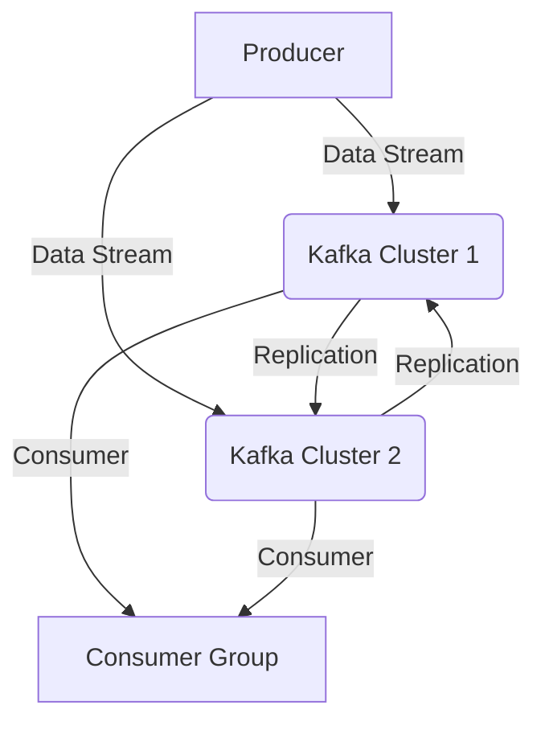
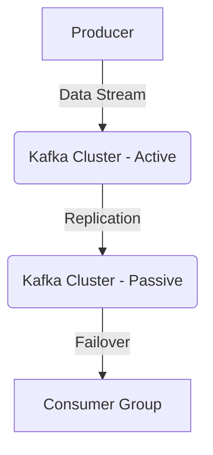

## 18.5 Hybrid and Multi-Cloud Kafka Architectures

In today's rapidly evolving technological landscape, enterprises are increasingly adopting hybrid and multi-cloud strategies to leverage the best of both worlds: on-premises infrastructure and cloud services. Apache Kafka, as a distributed streaming platform, plays a pivotal role in these architectures by enabling seamless data flow across diverse environments. This section delves into the motivations, architectural patterns, tools, and best practices for deploying Kafka in hybrid and multi-cloud settings.

### Motivations for Hybrid and Multi-Cloud Deployments

#### Flexibility and Agility

Hybrid and multi-cloud deployments offer unparalleled flexibility, allowing organizations to choose the most suitable cloud services for specific workloads while maintaining critical data and applications on-premises. This approach enables rapid scaling, cost optimization, and the ability to leverage specialized cloud services.

#### Risk Mitigation and Redundancy

By distributing workloads across multiple cloud providers, organizations can mitigate risks associated with vendor lock-in, service outages, and data loss. Redundancy across clouds ensures high availability and disaster recovery capabilities, crucial for mission-critical applications.

#### Regulatory Compliance and Data Sovereignty

Certain industries require data to be stored and processed within specific geographic regions to comply with regulations such as GDPR or CCPA. Hybrid and multi-cloud architectures allow organizations to meet these requirements by strategically placing data across different locations.

### Architectural Patterns for Hybrid and Multi-Cloud Kafka

#### Active-Active Architecture

In an active-active setup, Kafka clusters are deployed across multiple clouds or regions, each actively processing data. This architecture provides high availability and load balancing, as data can be ingested and processed in parallel across clusters.



*Diagram 1: Active-Active Kafka Architecture*

**Considerations**:
- **Data Consistency**: Ensure data consistency across clusters using tools like MirrorMaker 2.
- **Latency**: Minimize latency by strategically placing clusters close to data sources and consumers.
- **Conflict Resolution**: Implement conflict resolution strategies for data updates.

#### Active-Passive Architecture

In an active-passive setup, one Kafka cluster is designated as the primary (active) cluster, while others serve as backups (passive). The passive clusters are synchronized with the active cluster and can take over in case of failure.



*Diagram 2: Active-Passive Kafka Architecture*

**Considerations**:
- **Failover Mechanism**: Establish automated failover mechanisms to switch from active to passive clusters seamlessly.
- **Data Synchronization**: Use tools like MirrorMaker 2 for continuous data replication.
- **Cost Efficiency**: Optimize costs by scaling passive clusters based on demand.

### Tools for Cross-Cluster Replication

#### Apache Kafka MirrorMaker 2

MirrorMaker 2 is a powerful tool for replicating data across Kafka clusters, supporting both active-active and active-passive architectures. It offers features like offset translation, topic renaming, and automatic failover.

**Key Features**:
- **Offset Translation**: Ensures consumer offsets are accurately translated across clusters.
- **Topic Renaming**: Allows renaming of topics during replication to avoid conflicts.
- **Automatic Failover**: Supports automated failover in active-passive setups.

**Example Configuration**:

```yaml
# MirrorMaker 2 configuration for cross-cluster replication
connectors:
  - name: "mirror-source"
    connector.class: "org.apache.kafka.connect.mirror.MirrorSourceConnector"
    tasks.max: "1"
    topics: "source-topic"
    source.cluster.alias: "source-cluster"
    target.cluster.alias: "target-cluster"
    replication.policy.class: "org.apache.kafka.connect.mirror.DefaultReplicationPolicy"
```

### Network Considerations

#### Secure Connectivity

Establishing secure connectivity between Kafka clusters across clouds is paramount. Use VPNs, private links, or dedicated interconnects to ensure data is transmitted securely.

- **VPNs**: Virtual Private Networks provide secure tunnels for data transmission.
- **Private Links**: Cloud providers offer private connectivity options, reducing exposure to the public internet.
- **Dedicated Interconnects**: High-bandwidth, low-latency connections between data centers and cloud providers.

#### Latency Optimization

Minimize latency by optimizing network paths and strategically placing Kafka clusters. Consider the following strategies:

- **Edge Locations**: Deploy Kafka clusters closer to data sources and consumers.
- **Content Delivery Networks (CDNs)**: Use CDNs to cache data and reduce latency for global consumers.
- **Network Peering**: Establish direct peering between cloud providers for faster data transfer.

### Best Practices for Managing and Monitoring Distributed Clusters

#### Centralized Monitoring

Implement centralized monitoring solutions to gain visibility into Kafka clusters across clouds. Tools like Prometheus, Grafana, and Confluent Control Center provide comprehensive monitoring capabilities.

- **Prometheus**: Collects metrics from Kafka clusters and provides alerting capabilities.
- **Grafana**: Visualizes metrics and creates dashboards for real-time monitoring.
- **Confluent Control Center**: Offers a unified interface for managing and monitoring Kafka clusters.

#### Automated Scaling

Leverage cloud-native tools and services for automated scaling of Kafka clusters based on demand. Kubernetes and cloud provider-specific services like AWS Auto Scaling can dynamically adjust resources.

- **Kubernetes**: Use Kubernetes operators like Strimzi for automated Kafka cluster management.
- **AWS Auto Scaling**: Automatically adjusts resources based on predefined metrics and thresholds.

#### Configuration Management

Maintain consistent configurations across Kafka clusters using Infrastructure as Code (IaC) tools like Terraform and Ansible. This ensures reproducibility and reduces configuration drift.

- **Terraform**: Manages infrastructure resources across multiple clouds.
- **Ansible**: Automates configuration management and deployment tasks.

### Real-World Scenarios and Use Cases

#### Financial Services

Financial institutions often require low-latency data processing and high availability. Hybrid and multi-cloud Kafka architectures enable real-time fraud detection and transaction processing across regions.

#### E-commerce

E-commerce platforms benefit from hybrid and multi-cloud deployments by ensuring seamless customer experiences globally. Kafka facilitates real-time inventory updates and personalized recommendations.

#### Healthcare

Healthcare organizations leverage hybrid and multi-cloud architectures to comply with data sovereignty regulations while enabling real-time data analytics for patient care.

### Conclusion

Hybrid and multi-cloud Kafka architectures offer significant advantages in terms of flexibility, risk mitigation, and compliance. By adopting best practices and leveraging tools like MirrorMaker 2, organizations can effectively manage and monitor distributed Kafka clusters across diverse environments. As cloud technologies continue to evolve, these architectures will play a crucial role in enabling scalable, resilient, and efficient data processing solutions.

## Test Your Knowledge: Hybrid and Multi-Cloud Kafka Architectures Quiz



### What is a primary motivation for adopting hybrid and multi-cloud Kafka architectures?

- [x] Flexibility and agility in choosing cloud services
- [ ] Reducing the number of Kafka clusters
- [ ] Simplifying network configurations
- [ ] Eliminating the need for data replication

> **Explanation:** Hybrid and multi-cloud architectures provide flexibility and agility by allowing organizations to choose the most suitable cloud services for specific workloads.

### In an active-active Kafka architecture, what is a key consideration?

- [x] Data consistency across clusters
- [ ] Minimizing the number of clusters
- [ ] Reducing consumer offsets
- [ ] Eliminating network latency

> **Explanation:** Ensuring data consistency across clusters is crucial in active-active architectures to maintain data integrity.

### Which tool is commonly used for cross-cluster replication in Kafka?

- [x] Apache Kafka MirrorMaker 2
- [ ] Apache Zookeeper
- [ ] Apache Flink
- [ ] Apache Storm

> **Explanation:** Apache Kafka MirrorMaker 2 is used for replicating data across Kafka clusters, supporting both active-active and active-passive architectures.

### What is a benefit of using private links for Kafka cluster connectivity?

- [x] Reducing exposure to the public internet
- [ ] Increasing data replication speed
- [ ] Simplifying cluster management
- [ ] Eliminating the need for VPNs

> **Explanation:** Private links provide secure connectivity by reducing exposure to the public internet, enhancing data security.

### Which tool can be used for centralized monitoring of Kafka clusters?

- [x] Prometheus
- [ ] Apache Hadoop
- [ ] Apache Hive
- [ ] Apache Pig

> **Explanation:** Prometheus is a monitoring tool that collects metrics from Kafka clusters and provides alerting capabilities.

### What is a key advantage of using Kubernetes for Kafka cluster management?

- [x] Automated scaling based on demand
- [ ] Simplifying network configurations
- [ ] Reducing the number of Kafka clusters
- [ ] Eliminating the need for data replication

> **Explanation:** Kubernetes enables automated scaling of Kafka clusters based on demand, ensuring efficient resource utilization.

### Which of the following is a real-world use case for hybrid and multi-cloud Kafka architectures?

- [x] Real-time fraud detection in financial services
- [ ] Batch processing of historical data
- [ ] Static website hosting
- [ ] Offline data analysis

> **Explanation:** Hybrid and multi-cloud Kafka architectures are used in financial services for real-time fraud detection and transaction processing.

### What is a common challenge in hybrid and multi-cloud Kafka deployments?

- [x] Ensuring data consistency and latency optimization
- [ ] Reducing the number of Kafka clusters
- [ ] Simplifying network configurations
- [ ] Eliminating the need for data replication

> **Explanation:** Ensuring data consistency and optimizing latency are common challenges in hybrid and multi-cloud Kafka deployments.

### Which Infrastructure as Code tool can be used for managing Kafka configurations?

- [x] Terraform
- [ ] Apache Spark
- [ ] Apache Hive
- [ ] Apache Pig

> **Explanation:** Terraform is an Infrastructure as Code tool that manages infrastructure resources across multiple clouds, ensuring consistent configurations.

### True or False: Hybrid and multi-cloud Kafka architectures eliminate the need for data replication.

- [ ] True
- [x] False

> **Explanation:** Hybrid and multi-cloud Kafka architectures do not eliminate the need for data replication; they often require robust replication strategies to ensure data consistency across environments.


