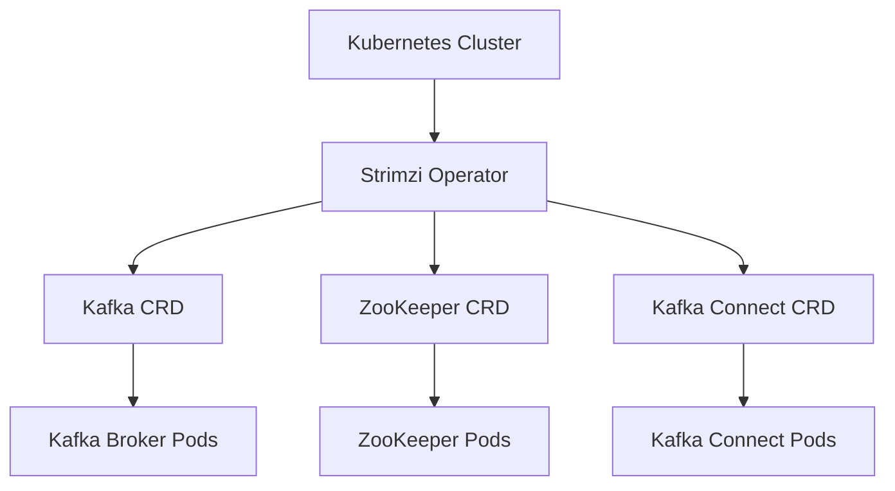

## 18.6.1 Strimzi Kafka Operator

The Strimzi Kafka Operator is an open-source project that simplifies the deployment, management, and operation of Apache Kafka clusters on Kubernetes. By leveraging Kubernetes' powerful orchestration capabilities, Strimzi provides a robust framework for managing Kafka clusters, making it an ideal choice for enterprises looking to integrate Kafka into their cloud-native environments.

### Understanding Strimzi's Architecture

Strimzi's architecture is designed to seamlessly integrate with Kubernetes, providing a set of custom resources and controllers that manage the lifecycle of Kafka clusters. The key components of Strimzi include:

- **Custom Resource Definitions (CRDs)**: Strimzi defines several CRDs, such as `Kafka`, `KafkaConnect`, `KafkaMirrorMaker`, and more, which represent Kafka clusters and related components within Kubernetes.
- **Operators**: Strimzi uses Kubernetes Operators to automate the deployment and management of Kafka clusters. These operators continuously monitor the state of the Kafka resources and ensure that the desired state is maintained.
- **ZooKeeper Management**: Although Kafka is moving towards the KRaft architecture, Strimzi currently manages ZooKeeper clusters as part of the Kafka deployment process.
- **Kafka Bridge**: Provides an HTTP-based interface to Kafka, allowing applications to interact with Kafka using RESTful APIs.

#### Strimzi Architecture Diagram



*Diagram: Strimzi's architecture within a Kubernetes cluster, showcasing the interaction between the operator, custom resources, and Kafka components.*

### Installing Strimzi and Deploying a Kafka Cluster

To get started with Strimzi, you need a running Kubernetes cluster. The following steps outline the installation process for Strimzi and the deployment of a Kafka cluster:

1. **Install the Strimzi Operator**:
   - Deploy the Strimzi Operator using the provided YAML files or Helm charts. This involves applying the necessary CRDs and deploying the operator pods.

   ```bash
   kubectl create namespace kafka
   kubectl apply -f 'https://strimzi.io/install/latest?namespace=kafka' -n kafka
   ```

2. **Deploy a Kafka Cluster**:
   - Create a Kafka custom resource to define your Kafka cluster. This YAML file specifies the number of Kafka and ZooKeeper replicas, storage configurations, and other settings.

   ```yaml
   apiVersion: kafka.strimzi.io/v1beta2
   kind: Kafka
   metadata:
     name: my-cluster
     namespace: kafka
   spec:
     kafka:
       replicas: 3
       listeners:
         plain: {}
         tls: {}
       storage:
         type: persistent-claim
         size: 100Gi
         class: standard
     zookeeper:
       replicas: 3
       storage:
         type: persistent-claim
         size: 100Gi
         class: standard
     entityOperator:
       topicOperator: {}
       userOperator: {}
   ```

   - Apply the Kafka custom resource to your Kubernetes cluster:

   ```bash
   kubectl apply -f kafka-cluster.yaml -n kafka
   ```

3. **Verify the Deployment**:
   - Check the status of the Kafka and ZooKeeper pods to ensure they are running correctly.

   ```bash
   kubectl get pods -n kafka
   ```

### Customization Options and Configuration Management

Strimzi offers extensive customization options, allowing you to tailor your Kafka deployment to meet specific requirements. Key customization areas include:

- **Listener Configuration**: Configure different types of listeners (e.g., PLAINTEXT, TLS) to secure communication between Kafka clients and brokers.
- **Storage Configuration**: Choose between ephemeral and persistent storage, and configure storage classes and sizes based on your needs.
- **Resource Requests and Limits**: Define CPU and memory requests and limits for Kafka and ZooKeeper pods to ensure optimal resource utilization.
- **Security Integration**: Integrate with Kubernetes secrets to manage TLS certificates and authentication credentials securely.

#### Example: Configuring TLS for Kafka Listeners

To enable TLS for Kafka listeners, update the `listeners` section in your Kafka custom resource:

```yaml
listeners:
  plain: {}
  tls:
    authentication:
      type: tls
```

### Advanced Features of Strimzi

Strimzi provides several advanced features that enhance the management and operation of Kafka clusters:

- **Rolling Updates**: Strimzi supports rolling updates for Kafka and ZooKeeper pods, ensuring zero downtime during upgrades or configuration changes.
- **Security Integration**: Leverage Kubernetes secrets to manage sensitive data, such as TLS certificates and authentication credentials.
- **Monitoring and Metrics**: Integrate with Prometheus and Grafana to monitor Kafka cluster performance and visualize metrics.
- **Backup and Restore**: Use Strimzi's backup and restore capabilities to safeguard your Kafka data.

#### Rolling Updates Example

To perform a rolling update, modify the Kafka custom resource and apply the changes. Strimzi will automatically handle the update process, ensuring minimal disruption.

### Scaling and Resource Management

Scaling Kafka clusters with Strimzi involves adjusting the number of replicas for Kafka and ZooKeeper. Strimzi's operator will handle the scaling process, ensuring that new pods are provisioned and integrated seamlessly.

#### Considerations for Scaling

- **Horizontal Scaling**: Increase the number of Kafka broker replicas to handle higher loads.
- **Vertical Scaling**: Adjust resource requests and limits to allocate more CPU and memory to existing pods.
- **Resource Quotas**: Implement Kubernetes resource quotas to manage resource allocation across multiple Kafka clusters.

### Conclusion

The Strimzi Kafka Operator is a powerful tool for managing Kafka deployments on Kubernetes. By automating the deployment and management processes, Strimzi enables organizations to focus on building scalable, resilient, and secure Kafka-based applications. With its rich feature set and seamless integration with Kubernetes, Strimzi is an essential component for any cloud-native Kafka deployment.

### Further Reading

- [Strimzi Documentation](https://strimzi.io/docs/)
- [Apache Kafka Documentation](https://kafka.apache.org/documentation/)
- [Kubernetes Documentation](https://kubernetes.io/docs/)

## Test Your Knowledge: Strimzi Kafka Operator Quiz



### What is the primary role of the Strimzi Kafka Operator?

- [x] To automate the deployment and management of Kafka clusters on Kubernetes.
- [ ] To provide a GUI for managing Kafka topics.
- [ ] To replace ZooKeeper in Kafka deployments.
- [ ] To offer a REST API for Kafka.

> **Explanation:** The Strimzi Kafka Operator automates the deployment and management of Kafka clusters on Kubernetes, leveraging Kubernetes' orchestration capabilities.

### Which component of Strimzi defines Kafka clusters within Kubernetes?

- [x] Custom Resource Definitions (CRDs)
- [ ] Kafka Connect
- [ ] Kafka Bridge
- [ ] ZooKeeper

> **Explanation:** Strimzi uses Custom Resource Definitions (CRDs) to define Kafka clusters and related components within Kubernetes.

### How does Strimzi handle rolling updates for Kafka clusters?

- [x] By automatically updating pods with minimal disruption.
- [ ] By shutting down the entire cluster and restarting it.
- [ ] By manually updating each pod.
- [ ] By using a separate update service.

> **Explanation:** Strimzi supports rolling updates, allowing Kafka and ZooKeeper pods to be updated automatically with minimal disruption.

### What is a key feature of Strimzi for securing Kafka communications?

- [x] TLS integration using Kubernetes secrets.
- [ ] Using plain text authentication.
- [ ] Disabling authentication.
- [ ] Using a third-party security tool.

> **Explanation:** Strimzi integrates with Kubernetes secrets to manage TLS certificates and authentication credentials securely.

### Which monitoring tools can be integrated with Strimzi for Kafka cluster performance?

- [x] Prometheus and Grafana
- [ ] Nagios and Zabbix
- [ ] Splunk and Datadog
- [ ] New Relic and AppDynamics

> **Explanation:** Strimzi can be integrated with Prometheus and Grafana to monitor Kafka cluster performance and visualize metrics.

### What is the purpose of the Kafka Bridge in Strimzi?

- [x] To provide an HTTP-based interface to Kafka.
- [ ] To manage Kafka topics.
- [ ] To replace ZooKeeper.
- [ ] To handle Kafka security.

> **Explanation:** The Kafka Bridge provides an HTTP-based interface to Kafka, allowing applications to interact with Kafka using RESTful APIs.

### What is a consideration when scaling Kafka clusters with Strimzi?

- [x] Adjusting the number of Kafka broker replicas.
- [ ] Increasing the number of ZooKeeper nodes only.
- [ ] Decreasing resource requests.
- [ ] Disabling resource quotas.

> **Explanation:** Scaling Kafka clusters with Strimzi involves adjusting the number of Kafka broker replicas to handle higher loads.

### Which storage configuration is supported by Strimzi for Kafka clusters?

- [x] Persistent and ephemeral storage
- [ ] Only persistent storage
- [ ] Only ephemeral storage
- [ ] Network-attached storage only

> **Explanation:** Strimzi supports both persistent and ephemeral storage configurations for Kafka clusters.

### What is the role of the Strimzi Operator in a Kubernetes cluster?

- [x] To monitor and manage the state of Kafka resources.
- [ ] To provide a user interface for Kafka management.
- [ ] To replace Kafka brokers.
- [ ] To handle Kafka topic creation.

> **Explanation:** The Strimzi Operator monitors and manages the state of Kafka resources within a Kubernetes cluster.

### True or False: Strimzi can be used to deploy Kafka clusters without ZooKeeper.

- [ ] True
- [x] False

> **Explanation:** As of now, Strimzi manages ZooKeeper clusters as part of the Kafka deployment process, although Kafka is moving towards the KRaft architecture.


